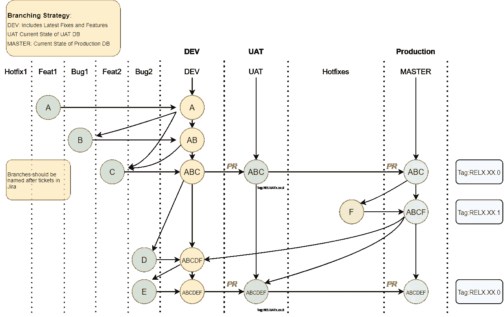
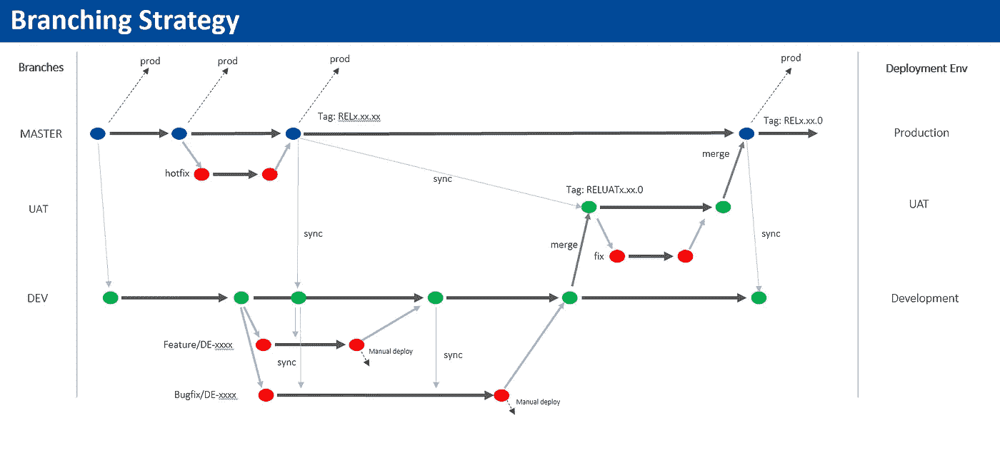

# 数据工程师如何构建 Git 分支策略

> 原文：<https://towardsdatascience.com/how-to-structure-your-git-branching-strategy-by-a-data-engineer-45ff96857bb?source=collection_archive---------0----------------------->

## [实践教程](https://towardsdatascience.com/tagged/hands-on-tutorials)

## 数据管道也需要版本控制！

作者图片

如果你曾经合作处理过代码，你会理解版本控制和分支策略的重要性。这些是允许多个开发人员并行处理一个项目的关键工具。没有它们，你的产品很可能会坏掉。

对于那些不理解什么是版本控制和分支的人来说——概括地说，版本控制是**管理对你的源代码**的变更的实践。它允许开发人员克隆、工作和部署代码，而不会干扰其他开发人员的工作。

分支仅仅是你的源代码的**版本。它有助于将当前正在开发的代码与生产环境中实际工作的稳定代码分开。**

你可能听说过软件工程师和开发人员的 DEV、UAT 和 MASTER 分支。但是你遇到过数据工程师/数据科学家的分支策略吗？

数据工程师和数据科学家构建和维护的不是产品，而是数据仓库。数据科学家确实在构建数据产品，但在建立稳定的数据仓库来收集数据之前，他们通常无法做到这一点。

</should-you-become-a-data-engineer-in-2021-4db57b6cce35>  

我们来谈谈数据工程师和软件工程师在分支设计上的一些**差异**。

# 内容

由 [Aaron Weiss](https://unsplash.com/@aaronweiss?utm_source=medium&utm_medium=referral) 在 [Unsplash](https://unsplash.com?utm_source=medium&utm_medium=referral) 上拍摄的照片

对于数据工程师来说，源代码通常涉及从数据仓库版本到数据管道的所有内容。

有—

*   将更改应用到数据仓库的 SQL 命令(DMLs/DDLs)
*   数据管道
*   CI/CD
*   DevOps
*   数据模型

这些仅仅是我脑海中的想法。通俗地说，数据仓库就是存储数据的地方。但实际上，事情远比这复杂。

数据仓库有多种用途，并且根据您工作的公司而有所不同。在一些地方，数据仓库被用来为数据分析师/数据科学家制作商业智能图，有时甚至为公司的高层管理人员，如首席执行官和首席技术官。

数据仓库可以存储通过实时管道输入到**机器学习产品**的数据，随着新数据的到来更新机器学习模型。如果存储在仓库中的数据有问题，它将反映在所述机器学习模型中。

这些数据仓库功能中的每一个都有其时间间隔。例如，数据分析师希望他们的图表每天更新，而机器学习产品希望他们的数据实时更新。

因此，对源代码的修改可能会产生比你想象的更大的影响。只需执行一次无效的 SQL 查询，就会接到 CEO 本人的电话，询问为什么仪表板会坏掉。

# 放

在 [Unsplash](https://unsplash.com?utm_source=medium&utm_medium=referral) 上[的照片](https://unsplash.com/@ffstop?utm_source=medium&utm_medium=referral)

通常，与数据工程师相比，软件工程师安排的发布时间间隔要长得多。这是因为为一个产品开发一个**特性**比制作一个在表中添加一列的 **SQL 查询**需要更长的时间。

既然如此，我注意到数据工程师比典型的软件工程师更频繁地发布版本。我经历了每周 3-4 次的发布。我认为软件工程师的典型功能发布至少需要一周时间。

这不是故意的。

很多时候，数据工程师会收到对重要仪表板或产品进行紧急更改的要求。首席执行官和首席技术官可能出于多种原因要求更改仪表板上的数字，他们希望这些数字几乎立即得到反映。因此热修复的频率。

# 分支策略

作者图片

让我们来谈谈我为我的组织设计的分支战略。
有 3 个主要分支—

[开发](/data-engineering-basics-of-apache-airflow-build-your-first-pipeline-eefecb7f1bb9) —包含最新的修复和特性

[UAT](/data-engineering-basics-of-apache-airflow-build-your-first-pipeline-eefecb7f1bb9)——UAT 环境现状

[主](/data-engineering-basics-of-apache-airflow-build-your-first-pipeline-eefecb7f1bb9) —生产环境的当前状态

使用这种设计，开发分支将在主分支之前包含提交**。生产环境通常不会反映团队在任何测试之前开发的最新特性。**

## 偏差

如果一个开发人员想要开始一个特性/bug 的工作，一个开发分支以吉拉票证命名。吉拉票证是经理分配给工程师的任务。发展发生在这个分支上。

工程师可以将他们的工作部署到开发环境中并执行测试。一旦他们对他们的测试感到满意，他们就可以将开发分支合并到 DEV 分支中，本质上是将他们的变更推进到 DEV 中。

在这一点上，工程师们确信他们的代码正在按预期工作是很重要的。 DEV 可能在任何时间点被合并到 UAT，任何 bug，如果存在的话，都会被提出来。

## CI/CD

在这种特殊的设计中，部署到 UAT 和生产环境的唯一方法是将代码推送到它们所连接的分支中。

**但是首先，什么是 CI/CD？**

持续集成(CI)和持续交付(CD)是软件工程或数据工程中的一种方法，在这种情况下，可以更频繁、更可靠地交付代码变更。它包含了开发团队应该遵循的一系列原则和实践。

在我们的例子中，我们部署 CI/CD 管道来覆盖 Apache Airflow 中的代码，这是我们用于数据管道的工作流管理系统。
这包括 Dag、操作符和其他所有东西的代码。

</data-engineering-basics-of-apache-airflow-build-your-first-pipeline-eefecb7f1bb9>  

CI/CD 管道还使用名为 [**Liquibase**](https://www.liquibase.org/) 的 SQL 版本控制工具执行 DMLs/DDLs，以将更改应用到数据仓库。

在 UAT 和生产环境中，数据工程师在部署工作时有**限制**。例如**，在 UAT 和生产数据仓库中只允许使用 Select 语句**。这是为了防止任何人意外删除表或插入行。

执行 DMLs/DDLs 的唯一方法是通过 CI/CD 管道执行，DMLs/DDLs 是对表的模式/数据进行更改的 SQL 语句。这听起来可能有点矫枉过正，但是这种实践极大地提高了我们数据仓库的稳定性和质量。

## UAT

一旦一个团队取得了显著的进展，并希望将特性转移到 UAT，他们就可以**安排发布时间**。开发部门并入 UAT 部门，运行 CI/CD。通常对环境进行监控，以确认一天内没有任何错误。然后通过使用[语义版本化](https://semver.org/)来标记该分支。

## 掌握

在 UAT 环境中进行彻底的测试后，该团队可以通过将 UAT 分支合并到主分支来将所述特性转移到生产中。运行用于生产的 CI/CD，并再次监控环境。然后对该分支进行相应的标记。

## 修补程序

虫子。它们是不可避免的。如果在 UAT 和生产环境中的任何一点有错误，数据工程师将需要应用补丁。这是通过从故障分支创建修补分支，应用更改，并将修补分支合并回其原始分支来完成的。

修补程序可以**绕过必须通过 DEV** 的过程。必要时可以直接合并到 MASTER 中。合并后，分支也相应地被标记。该分支还必须同步到相关分支中。

例如，一个热修复程序被合并到生产中。然后，开发人员必须将 prod 同步到 DEV 和 UAT，以便这些分支也包含修复。

# 部署工作流程

作者图片

下面是如何使用这种分支策略将工作部署到环境中的分步指南。

1.  从 DEV 分支创建以吉拉开发票**命名的分支。**这里我们用 A、B、C 作为特性/bug 的例子。
2.  一旦测试令人满意，A、B 和 C 可以在任何时候合并到 DEV 分支中。DEV 分支现在包含 A、B 和 c。
3.  在 UAT 版本中，DEV 分支通过 pull 请求直接合并到 UAT 分支中。 **CI/CD 现在将 A、B 和 C 部署到 UAT 环境**中，该环境将更改应用到数据管道和实际的数据仓库本身。然后对该分支进行相应的标记。
4.  经过仔细监控后，计划发布产品。UAT 分支通过拉请求被合并到主分支中。 **CI/CD 将 A、B 和 C 部署到生产环境中。**分支被相应地标记。
5.  在发布期间，开发不会停止。工程师可以像往常一样继续他们在开发分支的工作。例如，随着发布的进行，工程师们正在开发特性 D 和 E。
6.  作为一个假设的场景，在 CI/CD 运行期间，在生产中发现了一个 bug。创建一个包含 bugfix F 的热修复分支，并**直接合并到主**中，以便进行热修复。bugfix F 通过 CI/CD 部署到生产环境中。该分支被相应地标记。
7.  主分支和生产环境现在都包含 A、B、C 和 F。一旦团队对修复程序 F 感到满意，主分支**就会同步到 UAT 和开发分支**上，这样 F 就会出现在所有分支中。戴夫和 UAT 现在包含了 A，B，C 和 f
8.  一旦 D 和 F 的测试完成，它们就被合并到 DEV 分支中。DEV 分支现在包含了从 A 到 F 的所有特性/错误。它可以再次通过发布周期，将 D 和 F 引入 UAT 和生产。

# 结论

凯利·西克玛在 [Unsplash](https://unsplash.com?utm_source=medium&utm_medium=referral) 上的照片

如果你读到这里，你一定对无聊的东西情有独钟。
当我给我的大多数朋友讲树枝的时候，他们都睡着了，他们不知道我热爱大自然。

Gif by [高质量 Gifs](https://www.reddit.com/r/HighQualityGifs/comments/35rm7o/mrw_i_saw_that_rnerd_was_set_to_private/)

玩笑归玩笑，适当的分支策略是很重要的，这样数据工程师就不必浪费时间去处理他们不想做的事情。

他们可以只关注数据。

在这篇文章中，我们经历了—

*   德夫、UAT 和主分行
*   软件工程师和数据工程师在分支设计上的差异
*   什么是 CI/CD？
*   部署工作流程

像往常一样，我引用一句话作为结束。

> *世界是一个大数据问题。*”—作者安德鲁·迈克菲**

# *[订阅我的简讯，保持联系。](https://www.nicholas-leong.com/sign-up-here)*

*也可以通过 [**我的链接**](https://nickefy.medium.com/membership) 注册一个中等会员来支持我。你将能够从我和其他不可思议的作家那里读到无限量的故事！*

*我正在撰写更多关于数据行业的故事、文章和指南。你绝对可以期待更多这样的帖子。与此同时，你可以随时查看我的其他 [**文章**](https://nickefy.medium.com/) 来暂时填补你对数据的饥渴。*

****感谢*** *的阅读！如果你想和我取得联系，请随时通过 nickmydata@gmail.com 联系我或者我的* [*LinkedIn 个人资料*](https://www.linkedin.com/in/nickefy/) *。也可以在我的*[*Github*](https://github.com/nickefy)*中查看之前写的代码。**