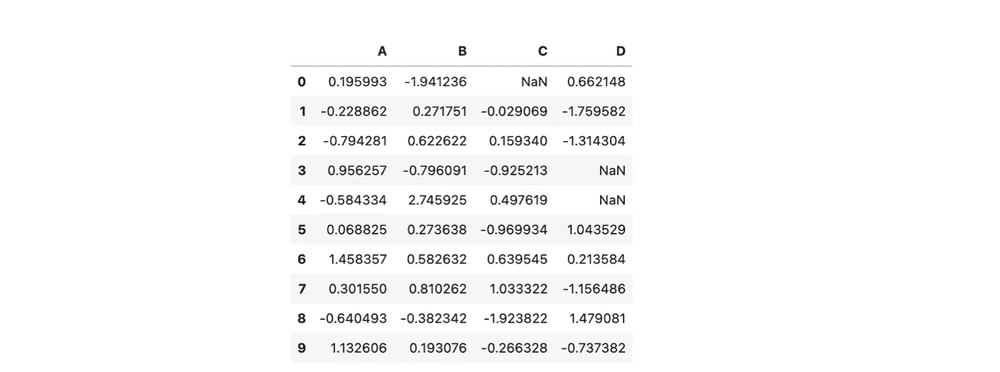
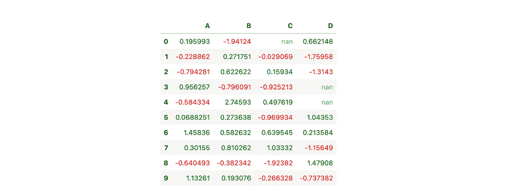
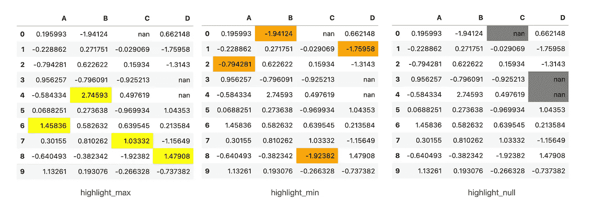
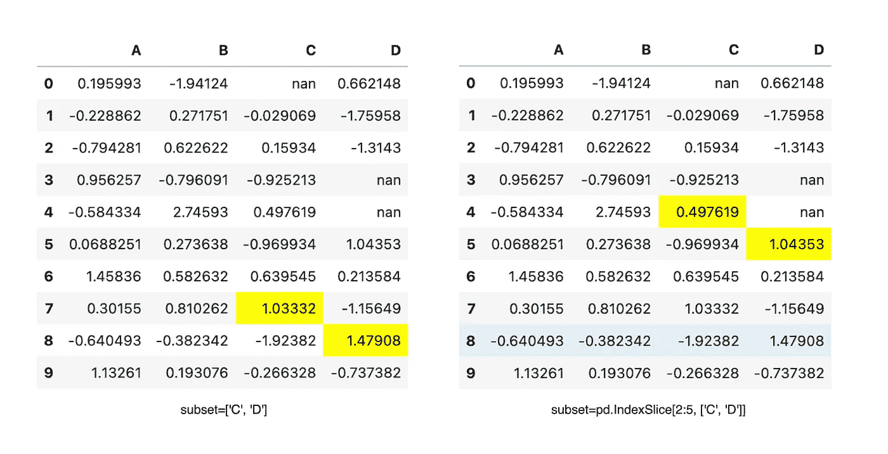
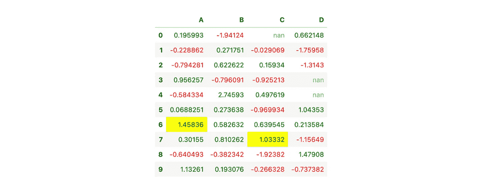
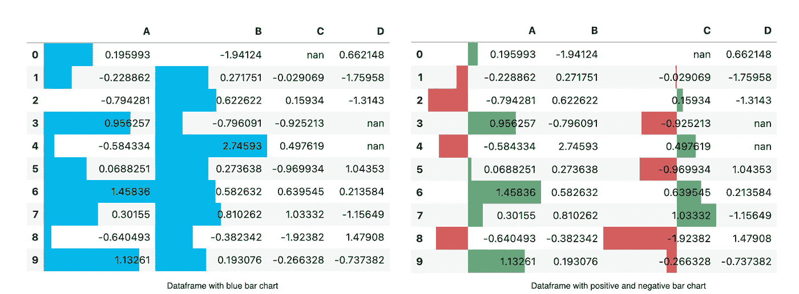
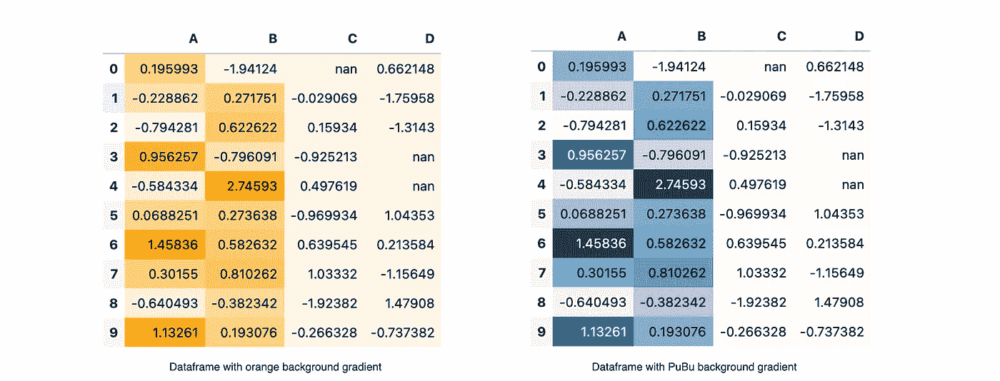

# 如何用 Python 设计你的数据框架

> 原文：<https://towardsdatascience.com/how-to-style-your-dataframe-with-python-eabf376d1efd?source=collection_archive---------36----------------------->

## 如何使用 Python 高亮显示、格式化或着色您的数据框

Arnel Hasanovic 在 [Unsplash](https://unsplash.com/s/photos/style-laptop?utm_source=unsplash&utm_medium=referral&utm_content=creditCopyText) 上拍摄的照片

我喜欢 Excel 的条件格式，这是一种简单而优雅的方式来突出你的表格中的关键要点。我们能在熊猫数据框中做同样的事情吗？绝对的！

在本文中，我们将学习如何格式化数据框:

*   根据条件给数字涂上颜色
*   突出显示最小值/最大值/空值
*   数据框中的条形图
*   热图

## 入门指南

让我们导入所需的库，并用随机数和 NaNs(不是数字)创建一个数据帧。

具有随机数和 NaNs 的数据帧

我们将使用这个数据帧来应用格式和样式。

## 根据情况给数字涂上颜色

我们将根据情况给数字涂上颜色。例如，我们希望负值为红色，位置值为绿色，NaN 为蓝色。

对数据帧应用颜色

首先，我们必须定义一个`apply_colour`函数来返回我们想要的颜色。然后我们使用`apply_map`将颜色应用到数据框的样式上。

> 对于`Styler.applymap`,你的函数应该接受一个标量并返回一个带有 CSS 属性-值对的字符串。

## 突出显示最小值/最大值/空值

有一个内置函数可以突出显示系列中数据的最小值/最大值/空值。

应用内置函数非常简单，我们只需将颜色参数传递给函数，它将突出显示每个系列中的最小值/最大值/空值。

**应用于子集**

如果我们只想突出显示某一列或某一行，我们可以使用 subset 参数。

例如，我们可以将`subset=['C','D']`传递给`highlight_max`，这样它将只突出显示列 C 和 d

我们也可以定义子集中的行的范围。我们可以使用`subset = pd.IndexSlice[2:5, ['C','D']]`将 C 列和 d 列的第 2 行切片到第 5 行。

> 对于行和列切片，任何到`.loc`的有效索引器都将工作。

**一起申请**

我们也可以将`highlight_max`和`applymap(apply_colour)`一起应用于数据帧。

带有 highlight_max 和 applycolour 的数据帧

塔当！现在你的数据框架上同时有了`highlight_max`和`applycolour`样式！

## 数据框中的条形图

我非常喜欢 Excel 中的数据栏条件格式，是的，我们也可以在 dataframe 中这样做！

`style.bar`用于在数据框中创建条形图。和`highligh_max`一样，我们可以给它传入`subset`或`color`参数。

在最新版本中，我们能够进一步定制条形图。现在，我们可以使用`align = 'mid’`将工具栏居中。此外，我们可以将列表`[color_negative, color_positive]`传递给颜色参数。

## 热图

我们也可以在数据帧上创建热图！

我们可以使用`seaborn`来得到一个漂亮的颜色图！

否则它接受来自 Matplotlib 的任何颜色图，你可以在这个[颜色图参考](https://matplotlib.org/stable/gallery/color/colormap_reference.html)中查看！与前面的函数相同，`background_gradient`也接受子集作为参数。

现在你已经学会了如何用 Python 设计你的数据框架的样式。希望这篇文章对你有用。可以在我的 [**Github**](https://github.com/chingjunetao/medium-article/blob/master/style-your-dataframe/style-dataframe.ipynb) 中查看完整的 Jupyter 笔记本。干杯！

PS:样式直接在 Github 中无法正常渲染，你可能想在你的本地机器上试试。

**如果你喜欢读这篇文章，你可能也会喜欢这些:**

 [## 使用 Python 清理数据的简单指南

### 如何使用 Python 删除重复数据、映射数据和处理空值

towardsdatascience.com](/simple-guide-to-data-cleaning-with-python-39203a14afeb)  [## 如何用 Python 管理 Google Drive 中的文件

### 作为一名数据分析师，大多数时候我需要将我提取的数据分享给我的产品经理/利益相关者和谷歌…

towardsdatascience.com](/how-to-manage-files-in-google-drive-with-python-d26471d91ecd) 

你可以在 Medium 上找到我其他作品的链接，在这里关注我****。感谢阅读！****