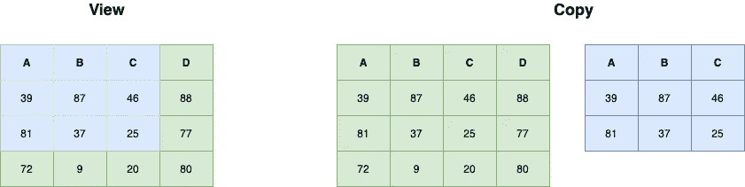

# 如何抑制熊猫设定 SettingWithCopyWarning

> 原文：<https://towardsdatascience.com/how-to-suppress-settingwithcopywarning-in-pandas-c0c759bd0f10?source=collection_archive---------3----------------------->

## 了解 pandas 中副本和视图之间的区别以及如何处理带有副本警告的设置


由 [Sandy Ravaloniaina](https://unsplash.com/@th3sand7?utm_source=unsplash&utm_medium=referral&utm_content=creditCopyText) 在 [Unsplash](https://unsplash.com/s/photos/warning?utm_source=unsplash&utm_medium=referral&utm_content=creditCopyText) 上拍摄

# 介绍

这无疑是新来的熊猫遇到的最常见的问题之一。本文解释了为什么首先抛出警告，并讨论了如何抑制它。此外，我们还将讨论一些提示和最佳实践，以避免收到此警告消息。

**即使** `**SettingWithCopyWarning**` **仍然是一个警告，您也必须确保您首先准确理解为什么会出现这个问题，以避免意外行为。**

首先，让我们创建一个虚拟数据集，我们将在这篇文章中使用。

```
import numpy as np
import pandas as pd # Set random seed so that results are reproducible
np.random.seed(0)df = pd.DataFrame(
    np.random.choice(100, (3, 4)), 
    columns=list('ABCD')
)print(df)
#     A   B   C   D
# 0  39  87  46  88
# 1  81  37  25  77
# 2  72   9  20  80
```

# 什么是设置 WithCopyWarning

在讨论如何抑制`SettingWithCopyWarning`之前，先了解这个警告是关于什么的，以及它是由什么触发的，会有所帮助。

`SettingWithCopyWarning`是一个警告，意味着您的代码可能仍然有效。然而，重要的是不要忽视它，而是首先理解为什么会提出它。这样，您就更容易相应地调整代码，从而不再引发警告。

## 熊猫中的视图和副本

当您对 pandas 数据帧执行过滤操作时，结果可能是数据帧本身的**视图**或**副本**，这取决于与 df 结构相关的一些实现细节。

**视图**与原始数据框架共享底层数据，因此当您修改视图时，您也可以修改原始对象。**副本**是原始数据帧的独立副本(子集),因此，对副本所做的任何更改都不会影响原始对象。



来源:[作者](https://gmyrianthous.medium.com/)

为了演示副本和视图之间的区别，让我们考虑下面的例子。

```
>>> df_slice = df.iloc[:3, :3]
>>> df_slice
    A   B   C
0  44  47  64
1  67   9  83
2  36  87  70
```

这个简单的切片返回一个**视图**，这意味着原始 df 中的变化将反映到`df_slice`中，反之亦然。

```
>>> df_slice.iloc[1, 1] = 1
>>>
>>> df_slice
    A   B   C
0  44  47  64
1  67   1  83
2  36  87  70
>>>
>>> df
    A   B   C   D
0  44  47  64  67
1  67   1  83  21
2  36  87  70  88
>>>
>>> df.iloc[1, 1] = -1
>>>
>>> df_slice
    A   B   C
0  44  47  64
1  67  -1  83
2  36  87  70
```

另一方面，对副本的操作不会对原始数据帧产生任何影响。例如，下面的操作将返回副本而不是视图

```
>>> df.loc[df.A > 5, 'B']
```

现在，如果您对副本应用操作，您很有可能会遇到下面的警告:

```
__main__:1: SettingWithCopyWarning:
A value is trying to be set on a copy of a slice from a DataFrame.
Try using .loc[row_indexer,col_indexer] = value insteadSee the caveats in the documentation: https://pandas.pydata.org/pandas-docs/stable/user_guide/indexing.html#returning-a-view-versus-a-copy
```

该消息只是警告用户他们正在操作一个副本，而不是原始对象本身。在下一节中，我们将讨论触发该警告的链式赋值或索引问题。

## 链式分配

如上所述，`SettingWithCopyWarning`表示潜在的**链式分配**。首先，让我们定义一些术语，以确保我们说的是同一种语言。

*   **赋值**是赋值(或**设置**)值的操作
*   **访问**是返回(或**获取**)值的操作。例如，当我们索引一个数据帧时，我们几乎是在访问它。
*   **索引**是分配或访问值的操作，可能只引用原始数据的子集(例如，列和/或行的子集)
*   **当我们以背靠背的方式执行多个索引操作时，就会出现链接**。例如，`df[1:][1:5]`是一个链接操作。

因此，**链式赋值**被定义为链式和赋值操作的组合。为了说明这种类型的操作，让我们考虑一个例子，在这个例子中，我们希望为每一个具有`A = 8`的记录将值`-1`赋给列`B`:

```
>>> df[df.A == 44]['B'] = 100
```

通常，上述操作会触发警告:

```
__main__:1: SettingWithCopyWarning:
A value is trying to be set on a copy of a slice from a DataFrame.
Try using .loc[row_indexer,col_indexer] = value insteadSee the caveats in the documentation: https://pandas.pydata.org/pandas-docs/stable/user_guide/indexing.html#returning-a-view-versus-a-copy
```

现在，如果我们打印出原始的`df`，上面的操作根本没有效果:

```
>>> df
    A   B   C   D
0  44  71  70  53
1  32  64  44  67
2  38   2  98  50
```

所以在上面的例子中，发出警告是因为我们将两个操作链接在一起:

*   `df[df.A == 44]`
*   `['B'] = -1`

这两个操作将在独立的上下文中依次执行。第一个操作是访问操作，即基于过滤条件返回数据帧的 **get** 操作，使得列`A`的值等于数值 44。第二个操作是赋值操作，它在原始数据帧的副本上设置特定值。

在接下来的部分中，我们将讨论一些方法，您可以使用这些方法来使这种操作更加安全，同时也抑制警告。

# 如何取消设置 WithCopyWarning

在这一节中，我们将讨论以下解决方法，这些方法可以用来修复您的代码，使`SettingWithCopyWarning`根本不会被引发。

*   如何使用`**loc[]**`以不提高`SettingWithCopyWarning`的方式对子集进行切片
*   在执行赋值操作之前，获取原始数据帧的**深度副本**
*   **禁用链式分配的检查**，使`SettingWithCopyWarning`不再上升

## 使用 loc 进行切片

现在，如果我们仔细检查提出的警告，我们会注意到它还附带了一个建议:

```
__main__:1: SettingWithCopyWarning:
A value is trying to be set on a copy of a slice from a DataFrame.
**Try using .loc[row_indexer,col_indexer] = value instead**See the caveats in the documentation: https://pandas.pydata.org/pandas-docs/stable/user_guide/indexing.html#returning-a-view-versus-a-copy
```

可用于抑制`SettingWithCopyWarning`的一种方法是将链式操作执行成单个`loc`操作。这将确保赋值发生在原始数据帧上，而不是副本上。因此，如果我们试图这样做，就不应该再发出警告。

为了说明如何使用`loc`来抑制`SettingWithCopyWarning`，让我们再次考虑上一节的例子。

```
>>> df[df.A == 44]['B'] = 100
```

上述语句可以重写为

```
>>> df.loc[df.A == 44, 'B'] = 100
```

现在，您会注意到不再发出警告，并且这次的赋值操作对原始数据帧产生了影响:

```
>>> df
    A    B   C   D
0  44  100  70  53
1  32   64  44  67
2  38    2  98  50
```

**一般情况下，您需要确保使用** `**loc**` **进行标签索引，使用** `**iloc**` **进行整数或位置索引，因为这样可以保证它们对原始对象进行操作。关于** `**loc**` **和** `**iloc**` **之间的区别以及如何使用它们的更多细节，请务必阅读下面的文章。**

[](/loc-vs-iloc-in-pandas-92fc125ed8eb) [## 熊猫中的 loc 与 iloc

towardsdatascience.com](/loc-vs-iloc-in-pandas-92fc125ed8eb) 

## 使用深层副本

一种不同的方法要求我们在尝试执行改变的赋值之前获取原始数据帧的深层副本。

首先，让我们展示一下，即使将链式操作分成两个语句，问题仍然会出现；

```
>>> df_2 = df[df.A == 44]
>>> df_2['B'] = 100
__main__:1: SettingWithCopyWarning:
A value is trying to be set on a copy of a slice from a DataFrame.
Try using .loc[row_indexer,col_indexer] = value insteadSee the caveats in the documentation: https://pandas.pydata.org/pandas-docs/stable/user_guide/indexing.html#returning-a-view-versus-a-copy
```

现在，另一个解决方法是使用`copy()`方法从第一个切片操作创建一个深度副本。

```
>>> df_2 = df[df.A == 44].copy(deep=True)
>>> df_2['B'] = 100
>>>
```

瞧啊。不会发出警告。

```
>>> df_2
    A    B   C   D
0  44  100  64  67
```

理解 Python 对象的浅层副本和深层副本之间的潜在差异也很重要。如果你想了解更多，请务必阅读下面的文章。

[](/whats-the-difference-between-shallow-and-deep-copies-in-python-ceee1e061926) [## Python 中浅拷贝和深拷贝有什么区别？

### Python 中的 copy()与 deepcopy()

towardsdatascience.com](/whats-the-difference-between-shallow-and-deep-copies-in-python-ceee1e061926) 

## 无视警告

`SettingWithCopyWarning`本质上警告用户操作可能是在副本上执行的，而不是在原始对象上。然而，也有假阳性，这意味着警告可能不准确。在这种情况下，您可以禁用检查，警告将不再出现。如果你不熟悉熊猫，确保这是你最后的选择。

例如，下面的切片将生成一个副本。你可以使用`._is_view`属性检查生成的数据帧。

```
>>> df_copy = df.loc[df.A > 32, 'B']
>>> df_copy
0    5
1    4
Name: B, dtype: int64
>>>
>>> df_copy._is_view
False
```

现在如果我们试图去做

```
>>> df_2 = df[['A']]
>>> df_2['A'] += 2
```

你会看到警告

```
__main__:1: SettingWithCopyWarning:
A value is trying to be set on a copy of a slice from a DataFrame.
Try using .loc[row_indexer,col_indexer] = value insteadSee the caveats in the documentation: [https://pandas.pydata.org/pandas-docs/stable/user_guide/indexing.html#returning-a-view-versus-a-copy](https://pandas.pydata.org/pandas-docs/stable/user_guide/indexing.html#returning-a-view-versus-a-copy)
```

即使结果是正确的:

```
>>> df_2
    A
0  26
1   3
2  99# the operation before had no effect on the original df
>>> df
    A   B   C   D
0  24  26  33  82
1   1  82  86  64
2  97  32   4  77
```

在这种情况下，您可以将`pd.options.mode.chained_assignment`设置为`None`:

```
>>> pd.options.mode.chained_assignment = None
>>> df_2[‘A’] += 2
>>>
```

**注意:**不要忘记将其设置回默认值`warn`。选项有`None`、`'warn'`或`'raise'`。

# 最后的想法

在今天的文章中，我们首先讨论了什么`SettingWithCopyWarning`以及何时被提出。我们已经在实践中看到了 pandas 数据帧或系列的副本和视图之间的差异，以及这如何在特定条件下触发`SettingWithCopyWarning`。

尽管`SettingWithCopyWarning`仍然是一个警告，可能不会导致您的 Python 代码失败，但是您必须确保理解为什么会出现这个问题，并尝试使用我们前面讨论的技术来调整代码。在极少数情况下，警告可能不会真正影响您的结果。如果您确信它不会给您带来任何麻烦，那么您甚至可以通过设置我们在本文最后一节看到的配置来禁用检查。

# 后续步骤

在这篇文章中，我们探讨了很多概念，如索引，切片，复制等。下面的文章更深入地讨论了这些概念，所以一定要读一读，以确保你能理解这篇文章中解释的所有概念。

[](/mastering-indexing-and-slicing-in-python-443e23457125) [## 掌握 Python 中的索引和切片

### 深入研究有序集合的索引和切片

towardsdatascience.com](/mastering-indexing-and-slicing-in-python-443e23457125) [](/dynamic-typing-in-python-307f7c22b24e) [## Python 中的动态类型

### 探索 Python 中对象引用的工作方式

towardsdatascience.com](/dynamic-typing-in-python-307f7c22b24e)