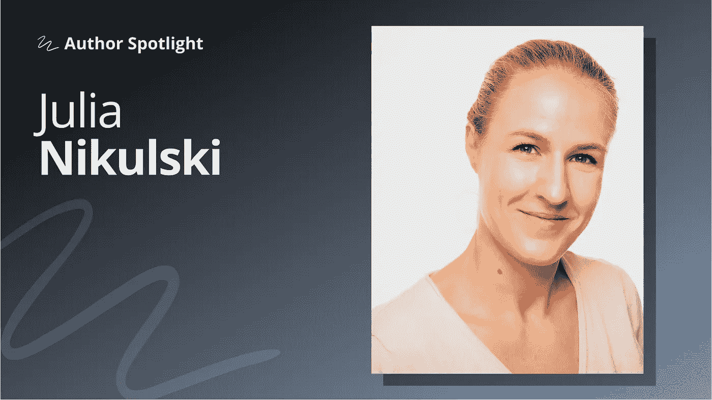

# 如何将职业转向数据科学(而不至于中途筋疲力尽)

> 原文：<https://towardsdatascience.com/how-to-switch-careers-into-data-science-without-burning-out-along-the-way-89577ddd630?source=collection_archive---------6----------------------->

## [作者聚焦](https://towardsdatascience.com/tagged/author-spotlights)

## *“投资教育从来都不是一个坏主意”*

*在 Author Spotlight 系列中，TDS 编辑与我们社区的成员谈论他们在数据科学领域的职业道路、他们的写作以及他们的灵感来源。今天，我们很高兴与朱莉娅·尼库尔斯基进行对话。*

Julia 目前正在攻读可持续发展管理硕士学位的最后一个学期，并在德国一家可持续发展智库担任研究助理。在完成企业管理和经济学学士学位后，她在金融行业担任分析师，重点是可持续金融。2019 年，她完成了 Udacity 的数据科学纳米学位。

## 朱莉娅，谢谢你和我们聊天！作为一名研究生和研究员，你最近最感兴趣的话题是什么？

我对可持续发展、金融和与数据科学相关的各种主题特别感兴趣。在可持续发展领域，[循环经济](https://www.ellenmacarthurfoundation.org/circular-economy/concept)、[可持续消费模式](https://www.un.org/sustainabledevelopment/sustainable-consumption-production/)以及[可持续发展、数字化转型和数据科学的交集](/data-science-for-sustainability-b912d5fb5d24)是我特别关心的问题。在数据方面，我喜欢研究 NLP 问题、时间序列预测和数据可视化。我最近的一个项目实现了 Longformer 模型来分析传记数据。我目前正在学习的一个领域是机器学习中的单元测试。

## **退一步说，你是如何找到进入数据科学的路的？**

作为一名金融分析师，我几乎没有任何编程技能。我在 R 中完成了一些大学项目，并在 Codecademy 上开设了一门 Python 课程，但从未抽出时间来开发实际的知识和技能。然而，我注意到至少对编程语言有一个大致的了解对于更有效地完成我的工作是多么重要。我的雇主还鼓励他们的员工获得技术技能，越来越多的数据科学家被聘用。

2017 年底，我决心再给编程一次机会。同时，我阅读了数据科学家的实际工作。当我开始学习 HarvardX 的 CS50 课程以获得对计算机科学的基本理解时，我对数据科学家的角色很感兴趣，并希望了解更多。这与我想休息一段时间，考虑换个职业的愿望不谋而合。我辞掉了工作，开始全职学习数据科学。

## 进入一个新领域最困难的部分是什么？

最具挑战性的时期实际上已经开始了。时间对我来说总是一个限制因素。学习一项新技能是很耗时的，而且用一份全职工作来做这项工作可能非常具有挑战性。我处于一个特殊的位置，可以辞掉工作，全职学习。然而，这不是一个容易的决定。当我告诉人们，我辞去了一份稳定的工作，自己学习技能，而其他人却因此获得了大学学位时，我遭到了相当多的怀疑和批评。我开始怀疑自己，同时感到有压力要快速学习这些技能*，以证明我做出了正确的决定。*

## ***你是如何度过这段充满挑战的时期的？***

*许多事情帮助我克服了这些问题。首先，我经常提醒自己，投资教育从来都不是一个坏主意。即使我没有被聘为数据科学家，我也会获得新的知识和技能，这对我未来的任何工作都有好处。第二，我创建了一个学习结构，确保我知道自己的长期目标是什么，同时实现更小、更容易实现的目标。对我个人来说，结构非常重要，我需要看到我正在取得的进步，以便保持动力和有效地工作。*

*第三，我在 Medium 和 TDS 上读到了人们进入数据科学的学习旅程和职业变化。虽然关于在六个月内从零编码技能到被聘为数据科学家的故事并没有真正安抚我的神经或消除压力，但它帮助我了解了其他人在开始进入该领域时的经历和挣扎。*

*最后，我有了学习之外的生活。我知道什么适合我，什么不适合。长时间的过度工作或学习会妨碍我放松和做我喜欢的事情，这是适得其反的。虽然我感到有压力要快速进步，但我有意安排休息时间来保持平衡，确保我能坚持我的目标。*

## ***对于刚刚开始数据科学之旅的人，您有什么建议？***

*想想你为什么要学习数据科学。了解你想从这次学习经历中获得什么可以帮助你设定目标，保持动力，并取得你满意的结果。目标应该雄心勃勃，但可以实现。如果你有一个无法实现的雄心勃勃的目标，这会让人失去动力。*

*调整你的学习以适应你的需要。正如我提到的，我需要有结构，我学习短视频教程和经常在小项目中应用获得的知识效果最好。知道如何学习最有效，会让你更容易获得新技能。最后，我建议要有耐心。虽然有些人能够在六个月内成为一名数据科学家，但给自己施加太大的压力会导致沮丧，甚至放弃你的目标。*

## *是什么激励你为更广泛的读者写作？*

*在 Udacity 攻读纳米学位期间，我开始接触媒体和 TDS 写作，在那里我必须写两篇关于我的项目的博文。除此之外，我继续写作，因为我喜欢解释概念和创建教程的过程，以帮助他人和扩展我自己的知识。此外，例如，写关于机器学习模型的技术文章可以证明我知道我在说什么。这对我来说尤其重要，因为我正在攻读大学学位之外的数据科学。能够指着某样东西说，“我可以应用它，并理解它是如何工作的，”即使我没有在大学学位中学习它，这也是非常有价值的。*

## ***对于那些可能成为** [**的人，你有什么见解可以分享给更多的读者吗？**](/questions-96667b06af5)*

*如果你想让你的故事引起观众的共鸣，你需要被告知并能够传达潜在的困难概念。我注意到我写的每一篇文章都拓展了我的知识面。特别是当我写机器学习时，我总是阅读学术期刊文章，以了解使用模型背后的实现和推理。我真的很享受这个获取和交流知识的过程。我也很高兴我与那些阅读我的故事、觉得它们有用、或者有意见并联系我的人建立了联系。*

## ***最后一个问题:您希望未来几年数据科学领域发生什么变化？***

*我希望数据科学界有更多的人考虑他们的技能对人类和地球的积极影响。公共部门、非政府组织和社区可以从熟练的数据科学家那里受益。我也希望数据伦理和数据隐私的话题能够成为数据科学领域和教育的一个更完整的部分。我个人希望更多地了解这些领域，以成为一名更负责任的数据科学家。*

*最后，我希望看到数据科学社区继续发展，因为我相信这个领域受益于多元化的视角和背景。*

*如果你想了解更多朱莉娅的工作和广泛的兴趣和项目，请访问她的 [Medium](https://medium.com/@julia.nikulski) 和 [GitHub](https://github.com/julianikulski/covid-19) 个人资料。以下是我们档案中她的一些出版集锦。*

*   *[**数据科学促进可持续发展**](/data-science-for-sustainability-b912d5fb5d24) ( *TDS* ，2021 年 1 月)
    这篇文章向读者展示了数据科学和可持续发展工作如何相互交叉和相互影响，并包括几个令人信服的真实案例。*
*   *</5-steps-to-develop-unique-data-science-project-ideas-6c2b3a0014b>****【2020 年 9 月*TDS*】
    如果你正在经历灵感滑坡，Julia 关于启动新项目的实用建议可能会有所帮助。它们从基于你的日常事务产生新的话题，到寻找没有被其他人广泛使用的数据集。*****
*   *****[**用 AdaBoost、random forests 和 XGBoost 进行时间序列预测**](/go-highly-accurate-or-go-home-61828afb0b13)**(*TDS*，2020 年 2 月)
    当你的模型没有产生整齐、完美的结果时，你怎么办？在本帖中，Julia 分享了她在一个极具挑战性的项目中所学到的有用的经验。*******
*   *******[**如何建立数据科学作品集网站**](/how-to-build-a-data-science-portfolio-website-335b0f253822)**(*TDS*，2020 年 5 月)
    在竞争激烈的市场中导航，求职者和职业转换者需要突出他们所拥有的所有相关技能和经验。在这里，Julia 向我们展示了构建有效的数据科学组合网站的过程，并涵盖了设置*和*内容理念。*********

*******请继续关注我们的下一位特色作者，即将推出！(如果您对希望在此空间看到的人有任何建议，请给我们留言。)*******