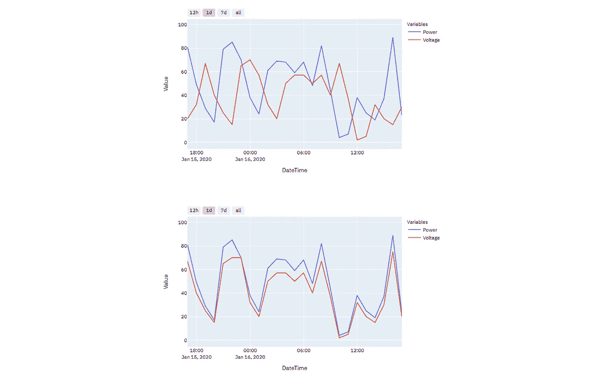
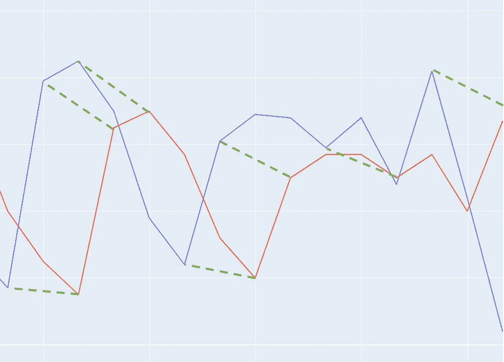
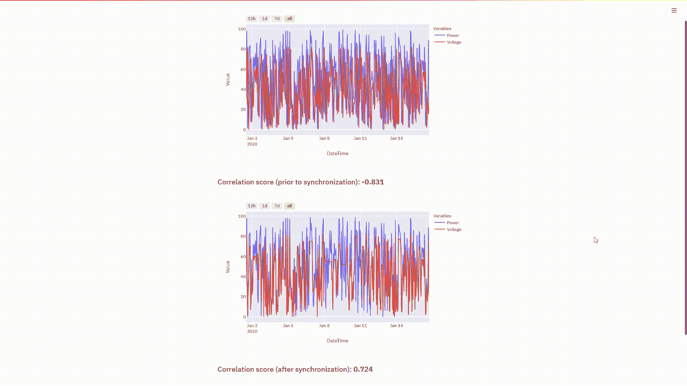

# 如何在 Python 中同步时间序列数据集

> 原文：<https://towardsdatascience.com/how-to-synchronize-time-series-datasets-in-python-f2ae51bee212?source=collection_archive---------6----------------------->

## 使用动态时间弯曲同步时序数据



图片作者。

## 介绍

在与数据相关的职业生涯中，人们可能遇到的最痛苦的事情之一就是不得不处理不同步的时间序列数据集。差异可能是由一系列原因造成的——夏令时调整、不准确的 SCADA 信号和损坏的数据等等。在同一个数据集中的不同点上发现几个差异甚至是很常见的，这需要您单独识别和纠正每一个差异。当你这样做的时候，你可能会无意中抵消另一个同步部分。幸运的是，在新颖的“动态时间扭曲”技术的帮助下，我们能够对我们所有的非同步数据集应用一种尺寸适合所有人的解决方案。

## 动态时间扭曲

简称 DTW 是一种计算两个数据序列之间最佳匹配的技术。换句话说，您正在寻找在任何给定时间从一个数据集到另一个数据集的最短路径。这种方法的美妙之处在于，它允许您根据需要对数据集应用尽可能多的校正，以确保每个点尽可能地同步。您甚至可以将它应用于不同长度的数据集。DTW 的应用是无止境的，你可以将它用于时态和非时态数据，如金融指标、股票市场指数、计算音频等等。唯一的警告是要确保你的数据没有空值或缺失值，因为这可能会影响 DTW 的工作。



DTW 的欧氏距离度量实现。图片作者。

用于查找对应点之间最短路径的距离度量可以是 Scipy 的距离度量[模块](https://docs.scipy.org/doc/scipy/reference/spatial.distance.html)提供的任何一个。虽然在大多数情况下欧几里得距离可以解决问题，但是您可能希望用其他距离来做好测量。

## 履行

为了实现我们自己的 DTW 版本，我们将使用 Python 中的 [fastdtw](https://pypi.org/project/fastdtw/) 库。这个包的新颖之处在于它简化了 warping 函数的复杂度，从而将复杂度从 O(n)降低到 O(n ),这在运行时带来了明显的不同。

请启动 Anaconda 或您选择的任何 Python IDE 并安装 fastdtw，如下所示:

```
pip install fastdtw
```

随后，导入所有必需的包:

```
import numpy as np
import pandas as pd
import streamlit as st
import plotly.express as px
from sklearn.metrics import r2_score
```

在运行同步之前，导入数据集并填写任何空值:

```
df = pd.read_csv('dataset.csv')df['Power'] = pd.to_numeric(df['Power'],errors='coerce')
df['Voltage'] = pd.to_numeric(df['Voltage'],errors='coerce')x = np.array(df['Power'].fillna(0))
y = np.array(df['Voltage'].fillna(0))
```

然后继续执行同步:

```
distance, path = fastdtw(x, y, dist=euclidean)
```

同步路径的结果将类似于以下内容:

```
path = [(0, 0), (0, 1), (0, 2), (1, 3), (2, 4),...]
```

参考数据集中的每个点将与目标数据集中的一个或多个点匹配，即参考数据的行 0 可以与目标数据的点 0、1 或 2 匹配。

现在您已经有了扭曲的路径，您可以继续创建具有同步结果的数据框，如下所示:

```
result = []for i in range(0,len(path)):
    result.append([df['DateTime'].iloc[path[i][0]],
    df['Power'].iloc[path[i][0]],
    df['Voltage'].iloc[path[i][1]]])df_sync = pd.DataFrame(data=result,columns=['DateTime','Power','Voltage']).dropna()
df_sync = df_sync.drop_duplicates(subset=['DateTime'])
df_sync = df_sync.sort_values(by='DateTime')
df_sync = df_sync.reset_index(drop=True)df_sync.to_csv('C:/Users/.../synchronized_dataset.csv',index=False)
```

最后，您可以使用 Sklearn 的 r2_score 模块计算相关性分数，以比较同步前后的相关性或同步级别:

```
correlation = r2_score(df['Power'],df['Voltage'])
```

## 数据可视化

为了绘制和可视化您的同步数据，我们将使用 Plotly 和 Streamlit——这是我最喜欢的两个库，用于可视化数据并将其渲染为应用程序。

您可以使用下面的函数来创建时间序列图。请确保您的时间戳采用 dd-mm-yyyy hh:mm 的正确格式，或者修改函数以适应您的数据。

要可视化和呈现您的图表，请在 Anaconda 提示符下键入以下命令来运行您的脚本:

```
cd C:/Users/.../local_directory
streamlit run synchronization.py
```

在这里，您可以看到同步前后的数据:



作者视觉。

## 结论

对于时间序列数据的快速和方便的同步，动态时间弯曲可能是唯一最有效的解决方案。虽然它不是完美无缺的，而且确实有一些缺点，比如边界条件匹配不佳，但它是我见过的最全面的解决方案。您也决不会局限于线性数据，实际上您可以同步不同维度的非线性数据。

如果您想了解更多关于数据可视化和 Python 的知识，请随时查看以下(附属链接)课程:

## 使用 Streamlit 开发 Web 应用程序:

[](https://www.amazon.com/Web-Application-Development-Streamlit-Applications/dp/1484281101?&linkCode=ll1&tag=mkhorasani09-20&linkId=a0cb2bc17df598006fd9029c58792a6b&language=en_US&ref_=as_li_ss_tl) [## 使用 Streamlit 开发 Web 应用程序:开发和部署安全且可伸缩的 Web 应用程序…

### 使用 Streamlit 开发 Web 应用程序:使用……开发安全且可扩展的 Web 应用程序并将其部署到云中

www.amazon.com](https://www.amazon.com/Web-Application-Development-Streamlit-Applications/dp/1484281101?&linkCode=ll1&tag=mkhorasani09-20&linkId=a0cb2bc17df598006fd9029c58792a6b&language=en_US&ref_=as_li_ss_tl) 

## 使用 Python 实现数据可视化:

[](https://www.coursera.org/learn/python-for-data-visualization?irclickid=xgMQ4KWb%3AxyIWO7Uo7Vva0OcUkGQgW2aEwvr1c0&irgwc=1&utm_medium=partners&utm_source=impact&utm_campaign=3308031&utm_content=b2c) [## 用 Python 实现数据可视化

### “一图胜千言”。我们都熟悉这个表达。它尤其适用于试图…

www.coursera.org](https://www.coursera.org/learn/python-for-data-visualization?irclickid=xgMQ4KWb%3AxyIWO7Uo7Vva0OcUkGQgW2aEwvr1c0&irgwc=1&utm_medium=partners&utm_source=impact&utm_campaign=3308031&utm_content=b2c) 

## 面向所有人的 Python 专业化:

[](https://www.coursera.org/specializations/python?irclickid=xgMQ4KWb%3AxyIWO7Uo7Vva0OcUkGQgW16Ewvr1c0&irgwc=1&utm_medium=partners&utm_source=impact&utm_campaign=3308031&utm_content=b2c) [## 面向所有人的 Python

### 学习用 Python 编程和分析数据。开发收集、清理、分析和可视化数据的程序…

www.coursera.org](https://www.coursera.org/specializations/python?irclickid=xgMQ4KWb%3AxyIWO7Uo7Vva0OcUkGQgW16Ewvr1c0&irgwc=1&utm_medium=partners&utm_source=impact&utm_campaign=3308031&utm_content=b2c) 

## GitHub 资源库:

[](https://github.com/mkhorasani/dynamic_time_warping_synchronzation) [## mkhorasani/动态时间扭曲同步

### 使用动态时间弯曲同步时序数据

github.com](https://github.com/mkhorasani/dynamic_time_warping_synchronzation) 

# 新到中？您可以在此订阅和解锁无限文章[。](https://khorasani.medium.com/membership)