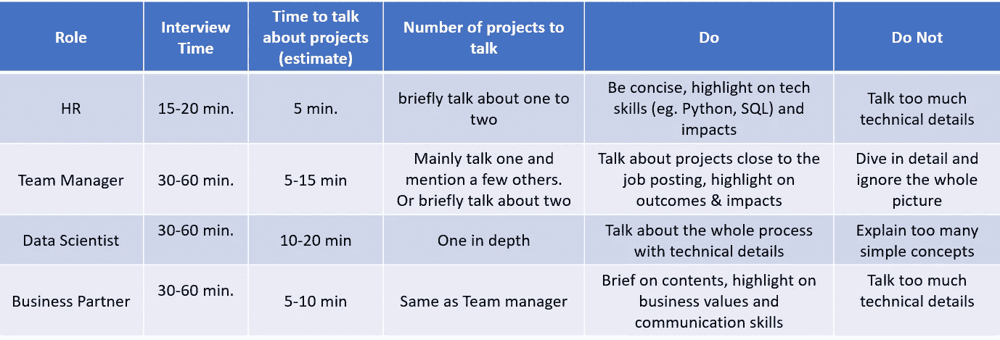
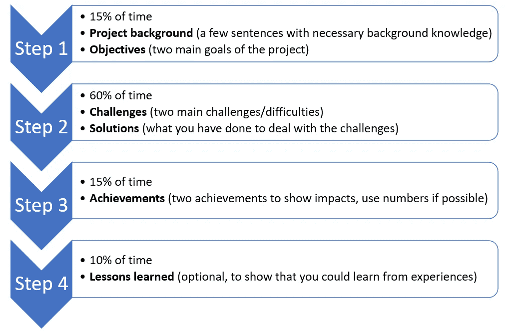
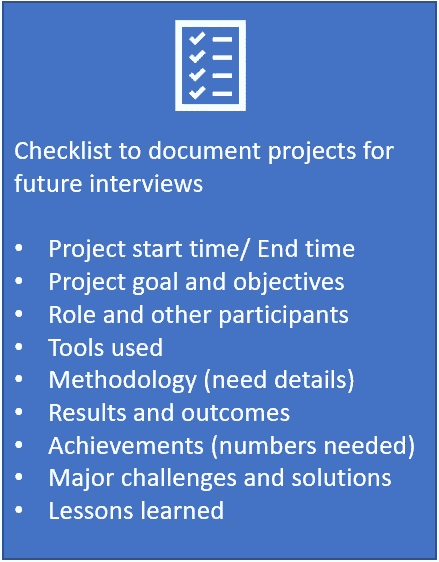

# 如何在数据科学工作面试中谈论你的项目

> 原文：<https://towardsdatascience.com/how-to-talk-about-your-projects-in-a-data-science-job-interview-a14ebdda5a1e?source=collection_archive---------9----------------------->

## [办公时间](https://towardsdatascience.com/tagged/office-hours)

## 以及如何用 4 步法来准备

由[尼克·莫瑞森](https://unsplash.com/@nickmorrison?utm_source=medium&utm_medium=referral)在 [Unsplash](https://unsplash.com?utm_source=medium&utm_medium=referral) 上拍摄的照片

准备工作面试是一个乏味的过程。数据科学家职位可能比其他技术职位更难，因为面试可能涵盖广泛的内容，包括但不限于统计、编码、产品问题、行为问题等。但是如果你问我在面试中你最常被问到什么，我的回答是:“**谈谈你做过的一个 DS 项目**”。

嗯，我认为从事数据科学项目是一回事，知道如何谈论它们是另一回事。在这个博客中，我希望与你分享一些如何在面试中有效地谈论你的 DS 项目的技巧，以及如何准备谈话。

# 1.是交流，不是聊天！

交流和聊天的区别是什么？在交流中，你是有目的地向你的听众传达你想让他们知道的某些信息。而在聊天中，它更像是没有明确目的的无组织的谈话，你可以让你的话题在这里和那里跳跃。因此，你确实需要为交流做好充分准备，但可能不需要为聊天做好准备。

**那么，通过谈论你的 DS 项目，你想传达什么信息呢？**

目标简单明了:你想向面试官展示你有能力做好这份工作。为了实现这一目标，你需要展示以下技能:

1) **技术技能** : Python、R、SQL、Spark、AWS 等。
2) **数据科学知识**:机器学习、统计学、ETL、数据可视化等。
3) **解决问题的技巧**:你是如何处理在项目开始时没有预料到的现实世界数据的困难的。
4) **沟通技巧**:你如何与他人合作，包括团队成员、利益相关者、项目经理等。

在 5-10 分钟内谈论你的项目，包括所有的信息，听起来很有挑战性。但是不要担心，我会在下面举例说明如何在你的谈话中包含所有的内容。

# 2.了解你的观众！

是的，当你和不同角色的面试官谈论你的项目时，确实会有所不同。通常，你会面试四类人:**人力资源、团队经理、数据科学家、商业伙伴/利益相关者**。总面试时间窗口根据你的面试官是谁而有所不同。例如，人力资源电话通常需要 15-20 分钟，而与数据科学家的面谈可能需要 30-60 分钟。因此，你需要注意你谈论你的项目所花的时间，这取决于你在和谁交谈。

下表展示了如何与不同的面试官谈论你的项目的一般准则。

作者图片

从表中可以看出，对于“说说你的 DS 项目”这个问题，你需要准备不同版本的答案。你需要很好地控制谈话的流程，强调不同的领域，不要给出太多或太少的技术细节。很有挑战性！

因此，接下来我将介绍一种策略/方法供你在面试中遵循，第 3.1 节将讨论我使用的 4 步法，我将在第 3.2 节向你展示一个例子。我们开始吧！

# 3.如何谈论你的 DS 项目？

## 3.1 四步法

你可能知道或听说过在面试中回答行为问题的“明星”方法。我发现谈论你的项目，并对方法进行一些调整，会很有帮助。根据我的经验，我总结了当你谈论你的项目时要遵循的四个步骤:

作者图片

**第一步。项目背景和目标**
这是你开始谈论你的项目的方式:通过提供一些背景信息，指出项目的目标或目的。这就好比“星”法中的“情境”和“任务”。第一步的目标是给你的面试官关于你的项目的基本知识，但是你不需要在这一部分花太多时间。取决于你在和谁交谈，背景信息可以是一句话，也可以是几个细节。你只需要一句话来描述你的主要目标。

*   **谈论什么作为“背景”**:你在这个项目中的角色，你是否与任何团队成员和/或业务伙伴合作，必要的业务需求解释和/或为什么这个项目是有价值的。你也可以提到一些你使用的编码语言或工具。
*   **谈什么“目标”**:对于大项目，你可能有多个目标，但我建议你陈述的主要目标不要超过两个。受限于面试时间，所以你要把这部分做的简洁有力，让面试官更容易跟随。你可以用一句话来陈述你的目标，格式如下:“我项目的目标是开发一个 ML 模型/DS 产品/创建一个工具/评估 XX 的影响”。

**第二步。挑战和解决方案**
我认为这是你故事中最重要的部分，也是面试官会问你最多问题的部分，所以要做好充分的准备和练习！你需要像在“明星”方法中那样谈论“行动”，但你需要在这里讲一个好故事。这就是为什么我发现谈论挑战和解决方案比仅仅列出你做过的工作更好。当你提到“挑战”时，它真的会吸引面试官的注意，因为他们想知道 1)你如何定义挑战，这代表了你的技能和能力，以及 2)你解决问题的技能，比如你如何处理工作中的困难。

*   **“挑战”谈什么**:我推荐谈*一个技术挑战和一个业务驱动的挑战*。如果这个项目是你的副业项目或没有商业场景的课程项目，那么你可以只关注技术挑战。

技术挑战的例子包括脏数据、数据不足、预测和响应变量之间的弱相关性、不平衡数据集、建模困难、部署困难等。

*   **谈论“解决方案”的内容**:在谈论完你遇到的挑战后，你可以用一句开场白开始谈论解决方案，比如“为了应对这些挑战，我做了以下事情”。然后你可以举例说明你是如何应对你之前提到的挑战的。记住使用“第一，第二，然后，最后”这样的词，让你的观点听起来有条理。

**第三步。成就**

成绩和“星”法中的“结果”有点不一样。这不仅仅是客观地列出结果，这是你“炫耀”你所取得的成就的部分，因为你经常会被问到“你为什么为这个项目感到自豪”这样的问题。同样，您可以从技术和面向业务的角度来处理这一部分。列出两三项成就就足够了，因为你不想花更多的时间谈论成就而不是工作(在第二步)。确保你的陈述能给面试官留下深刻印象。

*   **谈“成就”谈什么**:谈影响，如果有数字支持你的观点会更好。从技术角度来看，您可以将您的模型与以前的模型/方法在提高的准确性、运行时间等方面进行比较。如果模型已经投入生产，你可以提到模型用户的数量，用户的积极反馈，等等。如果这是你 Github 上的一个个人项目，你可以谈论你得到的星星的数量。从商业角度来看，销售提升、收入、防止损失都是值得谈论的好数字。

**第四步。吸取的教训**
如果你正在和人力资源部谈话或者面试时间很紧，可以跳过这一步。但是我建议你为这一部分做好准备，向面试官展示你能够从自己的经历中反思和学习。同样，这里有一两个强有力的声明就足够了。

*   **谈论“经验教训”:谈论你获得的技能，但需要与第二步中的故事相关。比如开发 ML 模型、制作高级图、创建 ETL 过程等技能。这些技能不一定都是技术性的，你可以加入一些软技能，比如与客户谈判，与非技术性的商务人士沟通等。**

## **3.2 示例**

****

**乔安娜·科辛斯卡在 [Unsplash](https://unsplash.com?utm_source=medium&utm_medium=referral) 上的照片**

**在上面提到的四步法的所有理论之后，我很确定你已经对这个过程有了一个大致的概念。现在希望用下面一个例子来说明*。请注意，这个例子只涵盖了重要的点，更多的细节需要在真正的面试中添加。**

**(第一步项目背景和目标)*我想谈谈我的识别欺诈交易的项目。首先，我希望向你们提供一些背景资料。我是这个项目的首席数据科学家，与销售部门的业务合作伙伴一起工作。该项目的目标是使用历史数据开发一个 ML 模型来预测交易是否是欺诈。***

**(第 2 步挑战和解决方案)*我在这个项目中遇到了两个挑战。第一个挑战是历史数据非常不平衡，因为我们在所有交易中只有 1%的欺诈。另一个挑战是我的商业伙伴没有技术背景，所以我需要学习与他们沟通的最佳方式来传达我的发现。为了应对这些挑战，我尝试了一些不同的方法。对于不平衡的数据集，我使用 SMOTE 采样并在 ML 模型中分配权重来处理不平衡。我还参加了 Coursera 课程，学习如何在商业环境中更有效地沟通。***

**(第三步成就)*我真的为这个项目感到骄傲，因为自从投入生产以来，ML 已经节省了 XX 美元。我还从我的商业伙伴那里得到了积极的反馈，该模型易于使用，总体准确率为 XX%。***

**(步骤 4 经验教训)*通过参与这个项目，我练习了开发不平衡数据分类模型的技能，并且积累了向非技术人员展示结果和分析的经验。***

# **4.面试怎么准备？**

**技巧 1:不要等到你准备好找工作的时候。早点准备！**

**这是我希望与你分享的最重要的提示。原因很简单:我们会忘记事情，所以最好在事情还历历在目的时候就写下来。我从自己的经历中了解到这一点，在一次面试中，我被问到关于一个实验设计的细节，这个实验来自我 5 年前做的一个项目。虽然我可以告诉面试官时间太长了，所以我记不起细节，但我为什么会让这种事情发生呢？因此，为了避免将来再次发生这种情况，当项目完成时，我会在 OneNote 中记录必要的细节。当然，你可以使用 Word 或 Google Docs 或任何你喜欢的东西，只要你记录下对你未来面试有用的东西。请查看下面的图片，作为记录您的工作的清单，其中包括第 3 节中提到的要点:**

****

**作者图片**

**请注意，不要记录贵公司禁止披露的敏感信息，也不要在采访中谈论这些内容！**

****提示 2:自己练习和计时。****

*   **首先，你可以通过查看你为项目记录的笔记来开始练习说话。我不建议把你想说的每一句话都写下来，但是你可以在笔记中添加关键句子和关键词。这可以确保你有一个有条理的说话方式。**
*   **针对不同类型的面试官进行练习和准备，记住本博客第二部分提到的差异，这样你就知道应该强调哪个部分，跳过哪个部分，这取决于面试官。**
*   **一旦你为不同的听众确定了要谈论的内容，记录下你练习的时间，并确保你的谈话长度在一个合理的时间范围内(参考本博客的第二部分)**
*   **让你的朋友或家人充当你的面试官，询问他们对你的语速、内容、结构和语气的反馈。**

****提示 3:熟悉你提到的每一个技术细节。****

**数据科学家是一个技术岗位，你首先要用技术技能打动面试官。因此，你需要确保你对你所谈论的一切都非常清楚，尤其是技术细节。准备好回答关于 ML 模型理论的问题，或者用于评估模型性能的模型度量的定义。通常，面试官会开始问一些关于你项目的理论问题。**

# **4.结论**

**找到一份理想的工作总是不容易。我相信每一个大的进步都来自于你迈出的小步。我希望这个博客能激发你在面试中更好地交流，并展示你已经完成的伟大工作。**

## **💖喜欢这个故事吗？请随意[订阅 DS 和 ML 粉丝的邮件列表](https://mingjie-zhao.medium.com/subscribe)，[成为会员](https://medium.com/@mingjie-zhao/membership)！🤩**

## **这篇博客最初发表在我的[个人网站](http://mingjiezhao.com)上。**

***免责声明:我在 3.2 节中创建了这个例子，只是为了在这篇博客中进行说明。和我工作中的任何项目都没有关系，这里陈述的所有数字和情况都是作为例子编造出来的。***