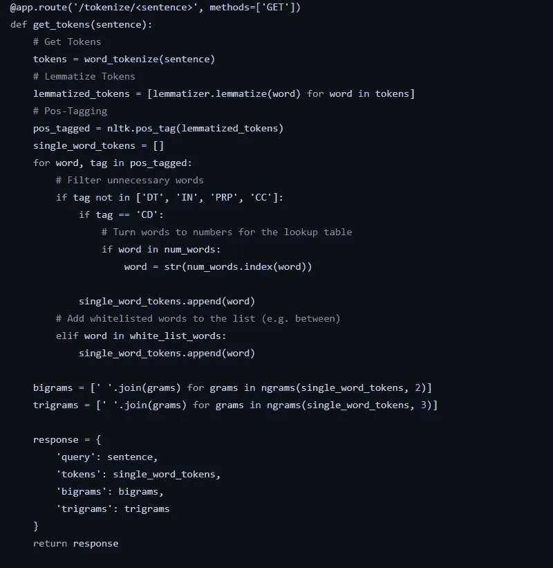
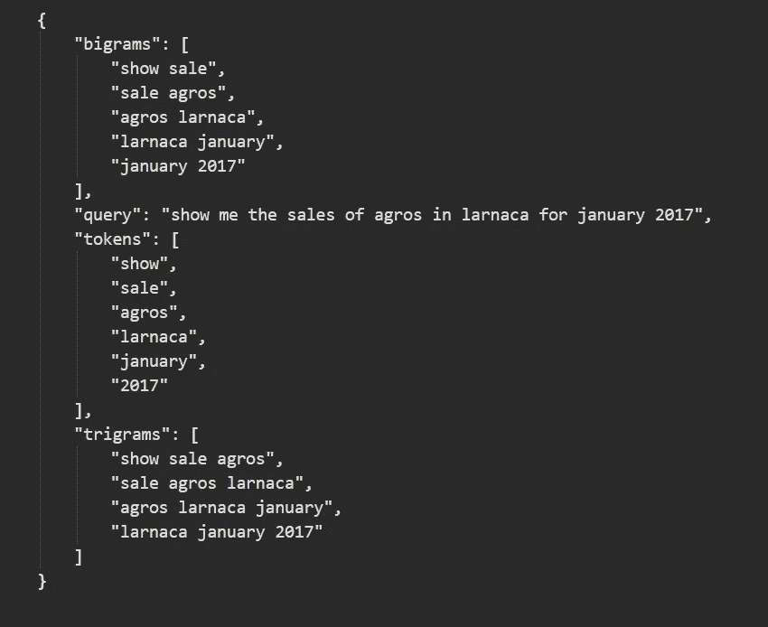
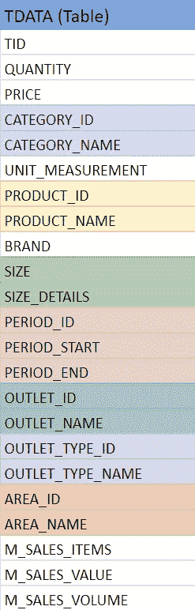
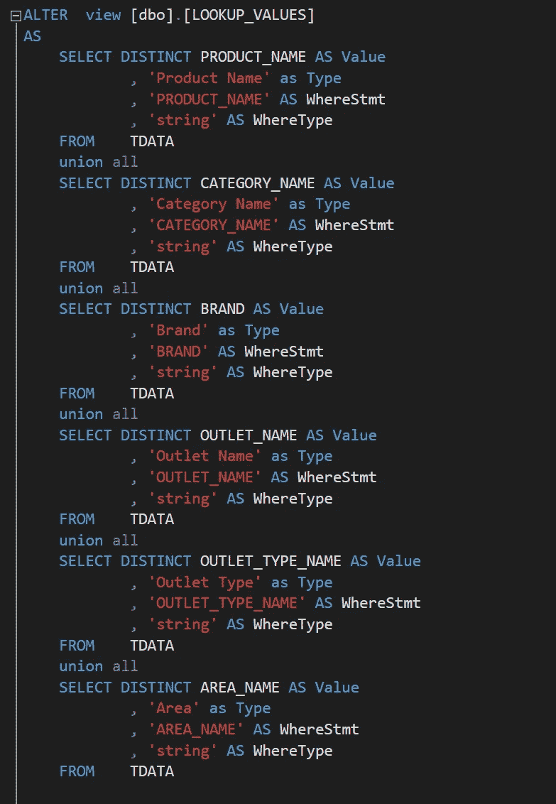
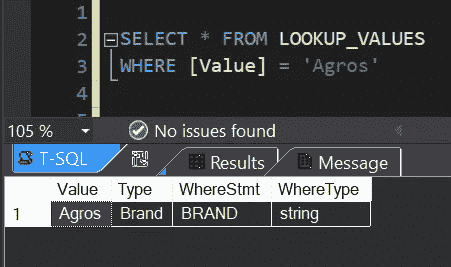
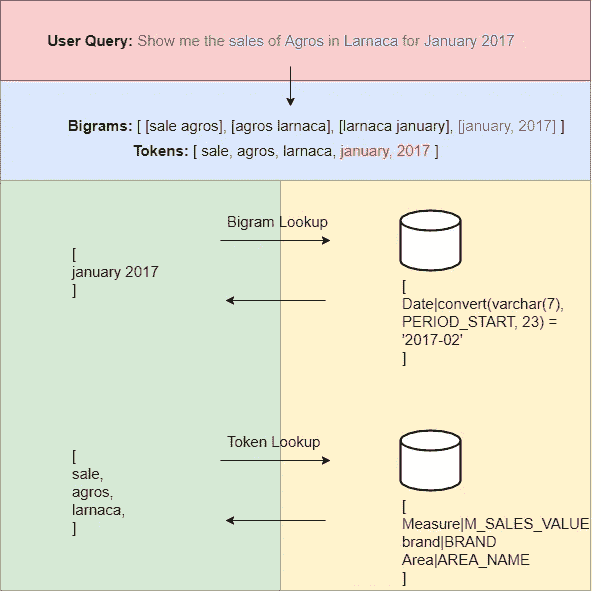
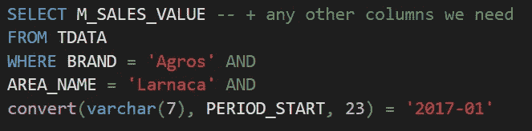

# 如何与您的数据库对话

> 原文：<https://towardsdatascience.com/how-to-talk-to-your-database-1dc5ffafba37?source=collection_archive---------44----------------------->

## 传统的方式

照片由[马太·亨利](https://burst.shopify.com/@matthew_henry?utm_campaign=photo_credit&utm_content=High+Res+Business+Pug+Working+On+Laptop+Picture+%E2%80%94+Free+Images&utm_medium=referral&utm_source=credit)发自[突发](https://burst.shopify.com/pets?utm_campaign=photo_credit&utm_content=High+Res+Business+Pug+Working+On+Laptop+Picture+%E2%80%94+Free+Images&utm_medium=referral&utm_source=credit)

## 介绍

毫无疑问，最近自然语言处理(NLP)中使用[转换器——神经网络](/transformers-141e32e69591)的进步确实令人瞩目。这些模型可以很好地执行不同类型的任务，如翻译、文本摘要和自动完成。作为变形金刚的一个不同变体，[视觉变形金刚](https://arxiv.org/abs/2010.11929)是图像分类和物体检测中许多计算机视觉任务的当前技术水平。

照片由 [Alina Grubnyak](https://unsplash.com/@alinnnaaaa?utm_source=medium&utm_medium=referral) 在 [Unsplash](https://unsplash.com?utm_source=medium&utm_medium=referral) 上拍摄

为了训练这些模型，我们需要大量的数据、专业知识和计算能力。不幸的是，对于中小型企业和个人来说，这可能相当昂贵。

本文的目的是从人工智能的炒作中退一步，并提供一种替代方法来完成这个 NLP 任务。在接下来的章节中，我们将看到如何使用自然语言——简单的英语——与数据库“对话”,而无需训练任何机器学习算法。

## 程序

第一步是结合若干基于规则的自然语言处理技术[对用户输入进行预处理，例如标记化、词条化和词性标注。](https://medium.com/mlearning-ai/nlp-tokenization-stemming-lemmatization-and-part-of-speech-tagging-9088ac068768)

Tokenizer API 方法代码(图片由作者提供)

例如，提供输入 ***“显示 2017 年 1 月拉纳卡的 agros 销售额”*** 将返回如下所示的响应。也可以玩玩 [API](https://github.com/FAlexandrou97/tokenizerAPI) ，如果发现什么 bug 或者有什么建议就告诉我。

Tokenizer API 示例响应(图片由作者提供)

接下来，我们创建一个平面表来表示我们的数据库模式。原因是查询单个表比连接多个表更简单。

平面表模式(作者图片)

在上面的例子中，仅仅通过列名，我们就可以识别出至少 7 个不同的表合并成 1 个。

发生在数据库级别的另一部分是映射视图。这个视图帮助我们找出每个标记/单词的含义，还可以在 SQL 中得到它的等价列名。比如给定“Agros”这个词，我们想得出的结论其实是一个品牌。

表格映射视图的一部分(作者图片)

上图显示了该视图的一部分。尽管一开始看起来有些混乱和不直观，但是一旦我们理解了它在生成 SQL 中的作用，它就变得有意义了。对于尽可能多的令牌，我们查询视图并根据令牌(或二元模型)的值进行过滤。

映射视图的使用示例(图片由作者提供)

下图显示了高级别的标记化和映射过程。我们首先提供用户查询，然后生成二元模型和令牌。为了提高效率，我们进行二元模型查找，并从我们的令牌中删除这些单词。

标记化和 SQL 映射过程(图片由作者提供)

一旦我们完成了映射，我们就可以通过编程方式将所有内容组合在一起来构造 SQL。我们用一个“AND”语句连接每个查找，最后我们执行查询来获得结果。

生成的 SQL(图片由作者提供)

## 结论

即使这个系统不像基于机器学习的系统那样智能和不能一般化，它也提供了为这个特定任务定制的更便宜和更快的解决方案。

下次见，感谢阅读！

> 这篇文章解释了我本科论文项目的一部分，你可以在这个 [GitHub repo](https://github.com/FAlexandrou97/MercuryNLQS) 中找到一个演示和源代码。

## 资源

1.  [变形金刚如何工作](/transformers-141e32e69591)
2.  [一幅图像值 16x16 个字:大规模图像识别的变形金刚](https://arxiv.org/abs/2010.11929)
3.  [自然语言处理:标记化、词干化、词条化和词性标注](https://medium.com/mlearning-ai/nlp-tokenization-stemming-lemmatization-and-part-of-speech-tagging-9088ac068768)