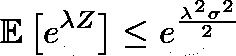
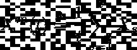
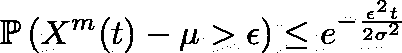
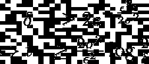
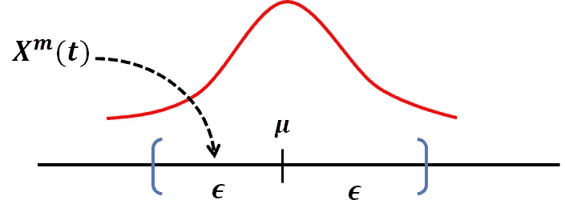
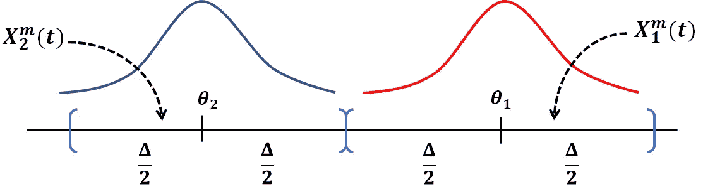
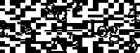
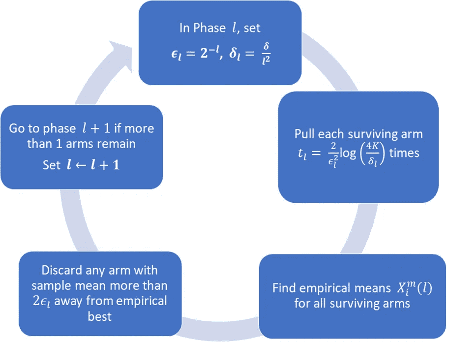
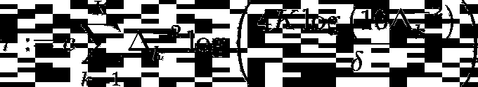
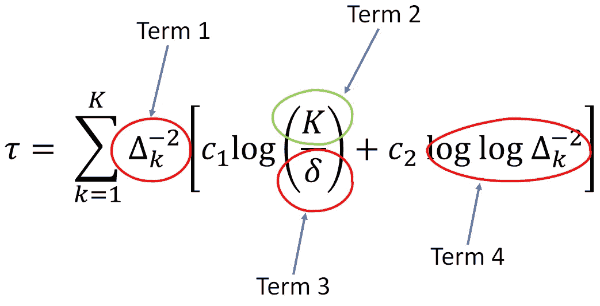

# 如何驯服你的强盗

> 原文：<https://towardsdatascience.com/how-to-tame-your-bandit-4c6b2723d0db?source=collection_archive---------13----------------------->

## 揭开纯粹探索的神秘面纱(第一部分)

一个独臂强盗。(照片由[马库斯·斯皮斯克](https://unsplash.com/@markusspiske?utm_source=medium&utm_medium=referral)在 [Unsplash](https://unsplash.com?utm_source=medium&utm_medium=referral) 上拍摄)

## TLDR

多臂强盗很棒，超越了简单的 A/B 测试，走上了*之路*。对于有强盗的假设检验，有效的算法和*非常*紧的样本大小界限是可用的。让我们检查一下！😃

# 在前一集里…

P 我的关于**的系列文章第 0 篇解释了为什么使用*顺序统计*可以显著地提高 A/B 测试的效率，以达到期望的性能水平(第 0 部分[点击此处](/why-most-a-b-tests-are-not-efficient-11b289414191))。在其中，我还解释了一个叫做“多臂 bandit”的统计结构如何概括顺序 A/B 测试，并提供了一个使用 Bandit 方法的优势列表。**

在过去的二十年里，班迪特背景下的序贯假设检验受到了研究者的广泛关注。计算机科学家和统计学家一样，已经开发了一个丰富的算法和证明技术的工具包来处理建立在异常严格的数学基础上的各种各样的此类问题。

在本系列的这一部分和随后的部分中，我希望呈现关于这个主题的大量文献中的一小部分，以帮助读者更好地欣赏顺序统计分析的强大功能。让我们首先了解我们正在处理的问题，特别是它不是什么。

# 纯探索≠后悔最小化！😮

多臂强盗(MAB)的设定包括 K 个动作，一些特别虐待狂的统计学家决定称之为'*武器*'，以唤起拉斯维加斯吃角子老虎机的可悲形象，又名独臂强盗，偷走你所有的钱。在继续下一步之前，我将快速总结一下 MAB 模型(新手可以参考这个网站上任何数量的关于后悔最小化的基础知识的文章)。

每个臂 K 代表一个分布 P(k)，1≤ k≤ K，拉臂代表从分布 P(k)中取样。在时间 t = 1，2，3，mab 算法拉臂 Aₜ.在时间 s 拉动臂 k 产生从分布 P(k)中抽取的样本 X(s，k)。这个样本被称为“奖励”。

分布 Pₖ的均值用θₖ表示，均值最大的臂称为**最佳臂**。不用说，除了它们所属的概率分布的*类*之外，我们并不先验地知道任何报酬分布。贯穿本文，我们将假设所有的奖励分布都在 [**亚高斯**](https://en.wikipedia.org/wiki/Sub-Gaussian_distribution) 类**中。**称随机变量 z 是σ-次高斯的，如果对于每个λ ∈ ℝ

亚高斯的定义(作者图片)

上面的参数σ本质上表现为 z 的方差的代理。在本文的其余部分，我们将假设我们的问题有一个**唯一的最佳臂**，并且该臂是**臂 1** 。此外，让δₖ= θ₁-θₖ表示臂 1 和 k 之间的平均回报差距。为了便于表示，让我们设置δ₁= δ₂.

**后悔最小化:**在上面的框架中，给定固定的时间范围 T，MAB 算法的后悔本质上测量了由于它没有拉最佳臂的所有时间而导致的回报损失。

后悔最小化不是这个系列的重点。我感兴趣的是激起普通读者对 A/B 测试的激进概括的兴趣，这种测试被不同地称为“*纯探索*”和“*最佳手臂识别*”

## 纯探索

给定置信参数δ∈(0，1)，找到概率至少为 1-δ的最佳臂，使用尽可能少的臂拉动。因此，我们的算法需要使用尽可能少的样本来找到 Arm 1。

杰瑞能通过你的测试吗？(照片由 [Ricky Kharawala](https://unsplash.com/@sweetmangostudios?utm_source=medium&utm_medium=referral) 在 [Unsplash](https://unsplash.com?utm_source=medium&utm_medium=referral) 上拍摄)

**例子:**一个医学研究者有一种药物的 K 种构型，她希望找出其中最有效的一种。

测试这一点的自然方法是通过注射不同配置的实验室小鼠，并观察每种配置的成功率。这样的实验并不关心老鼠本身如何受到药物的影响。事实上，所采用的协议必须相当积极地快速找出次优配置(或武器)(在她耗尽鼠标并不得不四处寻求更多资金之前)。

听起来可能很可怕，但这个例子有助于说明这两个问题之间的区别。后悔最小化算法，根据它们处理的问题的本质，必须“小心行事”，尽可能少地采样次优臂。纯粹的探索算法没有这种强迫性，只关心尽可能快地聚焦于最佳行动，而不关心在此期间他们会产生什么样的遗憾。

💡考虑到我们只有来自分布的样本，臂 k 的平均θₖ的一个很好的代理是从采样臂 k 到时间 t 所获得的平均回报。因此，我们应该研究如何*控制θₖ和这个平均值*之间的距离。幸运的是，两位著名的数学家发明了一种技术来做到这一点。

# 切尔诺夫和赫夫丁前来救援

在文章的剩余部分，给定随机变量 X₁，X₂，…由术语' ***样本意味着*** *'* 我们将指随机变量

“样本均值”的定义(图片由作者提供)

当 X₁，X₂，…也是独立同分布(IID)且均值为μ时，我们知道𝔼Xᵐ(t)=𝔼X₁=μ.为了突出μ在某种程度上代表了 IID 序列的基本事实，我们将称其为'*'(与样本均值相对)。*

## ***问题 1***

*Xᵐ(t 离μ有多远)？假设我们的 IID 序列 X₁，X₂，…由σ-亚高斯随机变量组成，标准[切尔诺夫-赫夫丁分析](https://en.wikipedia.org/wiki/Chernoff_bound)告诉我们*

**

*单面装订(图片由作者提供)*

*Xᵐ(t)-μ的情况也是如此*

**

*(Image by author)*

*💡 This means that O(1/ϵ² log(1/δ)) samples are needed to bring the sample mean to within ϵ of the true mean with high probability. This brings us to the next question.*

**

*The sample mean is close to the true mean for large enough t. (Image by author)*

> *O(1/ϵ² log(1/δ)) samples are needed to bring the sample mean to within ϵ of the true mean with high probability.*

## ***问题 2(回到单克隆抗体)***

*给定一个双臂土匪，假设已知δ=θ₁-θ₂，需要多少样本才能高概率找到更好的手臂？(回想一下，我们假设臂 1 是最佳臂。)*

*💡回答这个问题的一个方法是对两个臂采样足够的次数，以确保它们的样本均值 Xᵐ₁(t 和 Xᵐ₂(t 分别足够接近真实均值θ₁和θ₂，并且简单地选择具有较大样本均值的臂。*

*事实证明这非常有效！*

**

*臂 1 的样本均值比臂 2 的样本均值大得多(图片由作者提供)*

*根据上面的分析，假设我们现在处理的是 4 个区间，而不是 2 个，我们需要用δ/4 代替δ/2。还有，如图所示，在这种情况下，ϵ=δ/2。由此，我们看到*

**

*作者图片*

*样本确保在概率大于 1 - δ的情况下，臂 1 的样本均值 xᵐ₁(t)>θ₁-δ/2≥θ₂+δ/2 > xᵐ₂(t)，臂 2 的样本均值。所以，选择样本均值较大的臂给出正确答案的概率较大。*

*一个名为**动作消除或‘AE’**的非常简单的算法正好利用了这一原理，以高概率在多臂强盗中找到最佳臂。然而，AE 还必须应对增加的复杂性*

*   *事先不知道δᵢ=θ₁-θᵢ的差距，以及*
*   *不得不(潜在地)处理两个以上的臂。*

*让我们看看算法如何设法解决这个问题。*

# *动作消除算法*

*AE，顾名思义，是一种“消除”类型的算法，它分阶段进行，丢弃或…消除(啊哈！)在阶段结束时看起来不太理想的武器。*

*该算法巧妙地回避了需要知道的差距*

*   *选择每个阶段结束时样本均值最大的臂作为*当前*(或*经验*)最佳臂，*
*   *丢弃其样本均值在经验最佳值一定距离之外的所有臂，该距离在阶段开始时选择，以及*
*   *通过选择一个新的、更小的距离来开始下一阶段，以使武器在即将到来的阶段中存活。这意味着，随着阶段的进展，样本均值将不得不越来越接近经验最佳值，对应的臂才能存活。*

*下面的流程图说明了算法的细节。AE 从所有臂开始，并在一个阶段结束时恰好剩下一个臂时结束。请注意，由于ϵₗ随着阶段的进展呈指数下降，样本均值需要非常接近经验最佳值才能生存。换句话说，该算法非常积极地丢弃 arms。*

**

*给定置信度δ∈(0，1)的动作消除算法。(图片由作者提供)*

*分析 AE 在停止前消耗的样本数包括显示(很有可能)*

*   *臂 1 永远不会被消除*
*   *武器的样本手段永远不会比ϵₗ在每个阶段都远离它们真正的对手 *l* 。*
*   *臂 k 最多存在 o(log(8/δₖ)阶段。*

*这些观察意味着动作消除返回概率至少为 1-δ的最佳臂，消耗了最多以下数量的样本*

**

*活动消除消耗的样本数。(图片由作者提供)*

## *好消息和坏消息*

*我们将在后面看到，AE 样本量中的许多项实际上从根本上是不可避免的。然而，这种算法存在许多问题。*

*   *首先，不能保证动作消除会停止。样本均值估计可能会波动，Arm 1 可能会在早期被踢出局，一系列问题可能会破坏算法。*
*   *即使在 AE 停止的轨迹上，在概率 1-δ的集合之外，其性能也可能是任意差的。*
*   *在开始下一阶段之前，该算法实际上丢弃了在给定阶段收集的所有样本。*

*基于这些原因，我决定称动作消除法为‘无齿’算法(明白吗？😉无牙…被驯服的龙…)。无论如何，回到样本大小，我们现在会看到，尽管它没有什么作用，但 AE 样本复杂性的表达式是一个有价值的信息宝库。*

# *无齿算法的教训*

*让我们更仔细地看看样本量表达式。可以说，我只强调了“顺序”项，而隐藏了不相关的常量。*

**

*红色圆圈中的术语不能删除，但绿色圆圈中的术语可以删除。(图片由作者提供)*

*用红色圈出的术语是统计分析和随机过程理论中非常基本的问题的结果。在本系列接下来的部分中，我们将看到它们是如何出现的。简而言之，*

*   *事实上，第 1 项(σₖ1/δₖ)是任何好的纯探索算法所消耗的样本数的一个著名下限的最重要部分。*
*   *第 2 项(log(K))是弱并集的结果。我们将看到这个术语最终是如何被删除的。*
*   *第 3 项(log(1/δ))是统计分析中的一个基本极限。事实上，这篇文章暗示了为什么这个术语不可避免。你能找到它吗？提示:如果我给你δₖ的差距值，你能避免吗？*
*   *第 4 项(log(log(1/Delta)))来自一个有趣的现象，称为重对数的**定律，它控制着独立随机变量之和的增长率。***

# *结束语*

*   *在纯探索的背景下，AE 是最早提出的算法之一(并经过严格分析)。*
*   *AE 不是真的“无牙！”我只是用这个形容词来强调这样一个事实，即更先进的技术显示了接近最优的样本复杂性。事实上，AE 已经被许多研究者成功地用于解决 MABs 和强化学习中的几个问题(包括你的)😅)，通常作为更复杂算法中的构建块。*
*   *多年来，AE 的许多问题都已经解决了。在接下来的部分中，我将描述一些成功解决 AE 问题的尝试。*

*因此，在纯探索传奇的这一部分，我们正式定义了这个问题，并看到了如何构造一个算法来解决它。算法的性能分析给了我们一些提示，告诉我们在这种情况下什么可以做，什么不可以做。*

*在本系列的剩余部分，我将解释是什么使得这些术语不可避免，以及 log(K)术语是如何被消除的。*

***注:**参考资料将在第 2 部分末尾提供。*