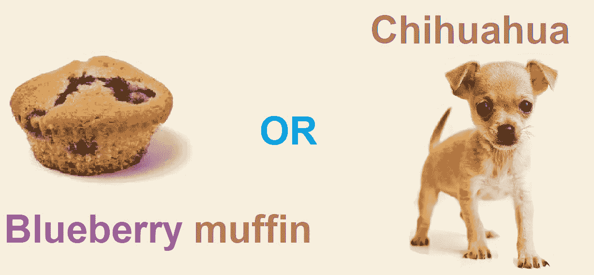
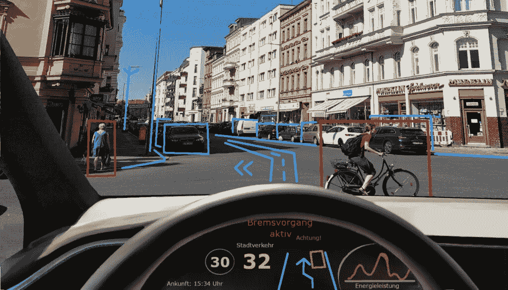
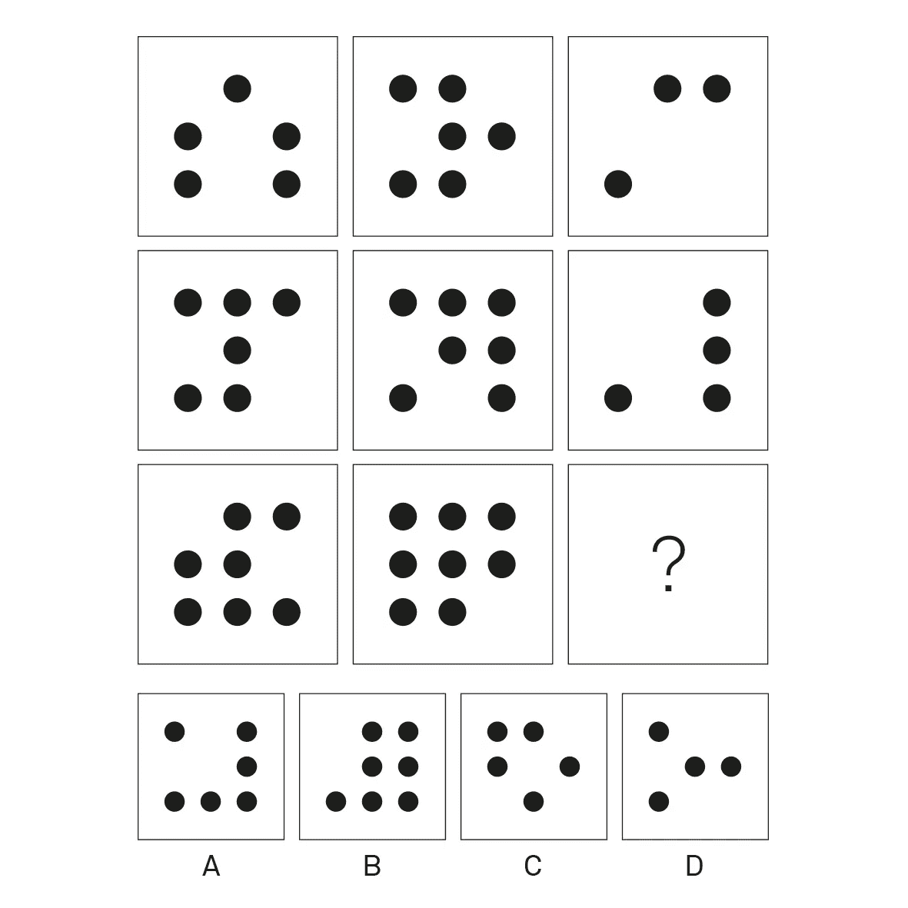
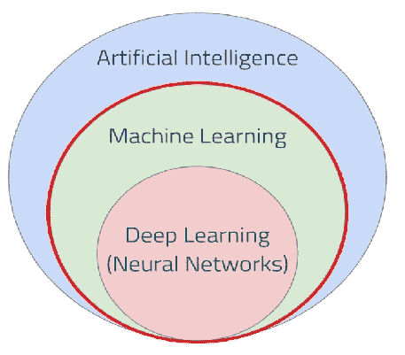
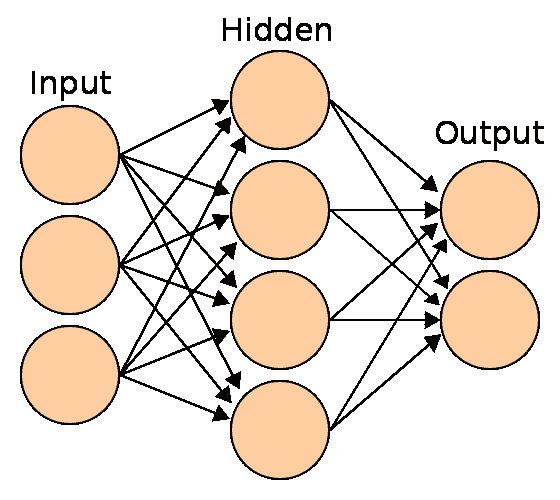

# 如何教计算机识别图像中的狗和蛋糕

> 原文：<https://towardsdatascience.com/how-to-teach-computer-to-recognize-dogs-and-cakes-from-images-d35b8cc845dd?source=collection_archive---------64----------------------->

## 从数据中提取隐藏的知识

做松饼还是不做松饼——这是个问题！图片作者。

人工智能是一个非常有趣的话题，引发了许多情感。这是因为新技术的发展涉及许多机会和威胁。

*一些人工智能技术已经存在了很长时间，但计算能力和数值优化例程的进步，海量数据的可用性，导致了该领域的巨大突破。*

人工智能被广泛用于在购物或简单地在网上搜索信息时提供个性化推荐。更先进的发明包括自动驾驶汽车——以一种简化的方式，根据从安装在车上的各种传感器收集的数据，对车辆的下一步行动做出决定。

在自动化车辆中使用人工智能。图片由来自 macaubusiness.com[的 Nelson Moura 拍摄。](https://www.macaubusiness.com/um-launches-ai-driving-course/)

谈到威胁，你可能知道一些科幻电影，其中反叛机器获得了自我意识，并试图接管世界。正是因为这样的形象，围绕人工智能产生了许多神话和恐惧。让我们试着回答一个基本问题——人工智能是发展的威胁还是机遇？

# 有可能理解 AI 吗？

首先，我们应该说明这个神秘的人工智能(AI)实际上是什么。

正如形容词 artificial 通常不会给我们带来太多的问题，因为我们会将它与人类创造的一些非自然物体联系起来——一台机器，一个纯粹的工程生物——智能这个词会带来很多问题。为什么？因为它是一个抽象的概念，我们可以理解为解决问题或者处理各种情况的能力。为了更好地理解什么是智力，我将在这里提到它的测量方法。

最经典的智力测试(智商测试)是瑞文进步矩阵测试。我相信你们很多人都接触过它们，因为它们是用各种颜色的几何形状的矩阵进行的测试，缺少了最后一个元素。接受检查的人必须抓住(矩阵的)模式元素之间的关系，并从下面给出的例子中指出缺少的元素。这就是测试一般智力——识别模式的能力——的方法。**人工智能是任何形式的非自然智能，由机器实现，或者更近一点来说，由人造程序实现——算法**。同样重要的是，任务由设备本身执行，而不需要来自用户端的持续监督。

瑞文渐进矩阵测试中的智商测试项目。图片由[维基共享资源](https://www.google.com/url?sa=i&url=https%3A%2F%2Fcommons.wikimedia.org%2Fwiki%2FFile%3ARaven_Progressive_Matrix.jpg&psig=AOvVaw3VEd11KEi8wBSDNoYFpVzU&ust=1627212309119000&source=images&cd=vfe&ved=0CAwQjhxqFwoTCLiPsLDM-_ECFQAAAAAdAAAAABAD)提供。

# 几门学科的结合

我们可以将机器学习视为从数据中提取隐藏知识的技术。根据可用的数据类型和手头的研究问题，科学家将选择使用特定的学习模型来训练算法:

*   监督学习(与老师):当所有呈现给机器的数据都被注释，即被标记，以与我们期望机器给出的答案完全相同的方式出现；
*   无监督学习(无老师):发生在我们拥有大量无任何标签的数据，主机的任务是确定数据的结构；
*   强化学习(与评论家一起):通过试错法学习，机器寻求制定任务的解决方案，它的行动会得到奖励(当它做正确的事情时)或惩罚(当它做错时)——机器不会得到任何其他提示或建议。

人工智能领域。图片作者。

除了人工智能，还有几个更密切相关的领域值得了解，至少知道名字。在这里，我们可以详细列出机器学习、数据科学和深度学习等。可以说，机器学习是人工智能的一个子领域，而人工智能又是计算机科学的一个子领域。

## 简单来说，机器学习使人工智能领域的自适应解决方案得以使用。

我们可以将机器学习视为从数据中提取隐藏知识的技术。根据可用的数据类型和手头的研究问题，科学家将选择使用特定的学习模型来训练算法:

*   首先，这种机器的眼睛是如何构造的，
*   其次，数据，比如图像，是如何被机器处理的，以及它们的算法。

# 计算机视觉过程

现在，我们继续介绍介绍的要点——解释这种基于神经网络的计算机视觉实际上是如何工作的。这里我必须说明两件事:

我们来思考一下机器学习的过程。第一件事是构造算法本身，即定义一定的规则或模型，第二件事是定义参数，参数在过程中迭代改变其值。

在计算机这个现代计算机器中，我们想要重现某个过程，例如检测图像中的某些东西。当我们谈论一台计算机器时，我们实际上要解一个数学方程，这并不奇怪。对于简化的任务，想象我们有一系列数学运算，其中一些参数具有未知的真实值——这些是自适应参数(模型权重)，它们将在机器学习过程中改变它们的值。权重乘以输入数据的总和称为输入的线性组合。这有点像收据——我们将商品数量乘以其单价，然后将结果相加，得到最终付款。这里，物品的未知价格是重量，购买物品的数量是输入数据，网络的答案应该是总价。

# 神经网络模型

这种单一的数学方程以及对其结果的适当反应(激活函数)可以被称为人工神经元。就像大脑中的神经元形成某些结构一样，人工神经元被组合成称为神经网络的复杂结构，我们可以在其中区分层。在下图中，它象征性地显示出来——每个神经元是一个圆形。开始时，在左侧，有一层神经元，称为输入层。在我们的计算机视觉任务中——对带有狗或松饼的图像进行分类——输入数据是组成分析图像的所有像素。在右侧，有一个给出预测的输出层—在我们的例子中是两个类。中间可能还有几个隐藏层。下一层中的神经元连接到前一层中的所有神经元。

简单的神经网络模型。图片由[维基共享](https://commons.wikimedia.org/wiki/File:Raven_Progressive_Matrix.jpg)提供。

# 开始上课吧

有了这些知识，我们就可以进入实践部分了。在[仓库](https://github.com/majsylw/chihuahua-vs-muffin)中，你会找到 jupyter 笔记本，你可以用它来进一步学习。实用部分是用波兰语写的，但它是基于来自 SJSU ML 俱乐部英语初学者研讨会的[材料。](https://github.com/mlatsjsu/workshop-chihuahua-vs-muffin)

作为 NAVOICA 项目的一部分，与弗罗茨瓦夫理工大学和 OPI 合作，在 2020/21 年冬季(波兰)为波兰学生进行了深度学习练习。查看我的[视频](https://www.youtube.com/watch?v=N8fxWXUJXyI)教程(PL)。

*原载于 2021 年 1 月 18 日*[*https://majsylw . netlify . app*](https://majsylw.netlify.app/post/ai4teenegers/)*。*

<https://github.com/majsylw/chihuahua-vs-muffin> 