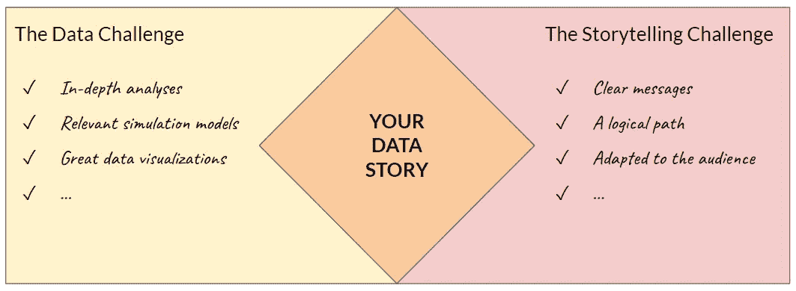
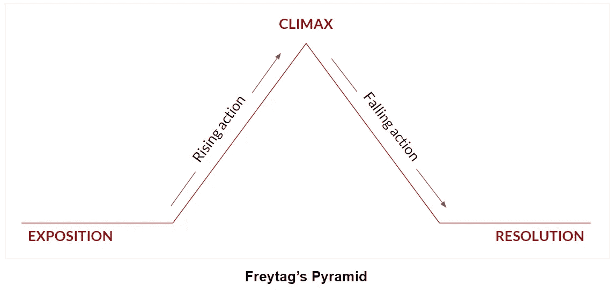

# 如何用数据讲述一个令人信服的故事

> 原文：<https://towardsdatascience.com/how-to-tell-a-compelling-story-with-data-d00ea8cd1bb?source=collection_archive---------12----------------------->

## [数据新闻](https://towardsdatascience.com/tagged/data-journalism)

## 将任何数据分析转化为难忘故事的 3 个步骤

T 这里有很多关于讲故事的炒作。就像数据一样。对我来说，讲故事只是“合理组织你的想法”的另一种说法。在任何数据分析的背景下，当涉及到**通过数据**传达信息时，给你的想法带来一个适当的结构似乎更加合理。

然而，如何最好地呈现您所进行的数据分析的输出并不总是不言而喻的。尤其是当涉及到技术数据操作时，分析可以进行几天、几周甚至几个月。**如何最终将您的所有产出整合在一起，讲述一个引人注目的数据故事？**

照片由 [Rain Bennett](https://unsplash.com/@rainbennett?utm_source=unsplash&utm_medium=referral&utm_content=creditCopyText) 在 [Unsplash](https://unsplash.com/?utm_source=unsplash&utm_medium=referral&utm_content=creditCopyText) 上拍摄

# 让我们来设定场景

你发现了有趣的数据来处理。你独自或与同事进行了出色的数据分析。也许你花了几天几夜“让数据说话”，找到了有见地的结果。但是你做到了:你最终发现了有趣的结果，并且希望你能找到你开始分析的问题的答案。等等，这个分析是关于什么的？

在这篇文章中，我想带您踏上我最近在公司进行的一次数据分析之旅。从我的老板最初提出要求，到我展示我的成果，我经历了混合数据分析和讲故事的几个步骤。这就是为什么我想与你分享一些关于如何从任何数据分析中讲述令人信服的数据故事的**技巧**。

简单地说，我的老板让我建立同质的、相同规模的员工团队，这样就可以在具有相似背景的群体中规划 Excel 培训。如果你对这个分析的细节更感兴趣，可以看看本文中的[。在找到了一种基于可用数据来回答他的请求的方法之后(这将是“数据挑战”)，我必须向他和其他利益相关者展示我的方法的结果:这就是我所说的“讲故事的挑战”。](/building-a-k-means-clustering-model-for-population-a-b-testing-with-bigquery-57410d1b7d89)

玛丽·勒费夫尔

# 第一步:收集你的想法

如果你进行过一定的数据分析，你应该知道你最初为什么开始它。然而，这说起来容易做起来难:当你在数据处理和解释中前进时，有时你可能会忘记分析的主要目标。别担心，我以前去过那里。

因此**在进行“你是谁”数据分析之前回到“为什么”是从**开始的关键一步。问自己以下问题:

*   你想回答什么问题？
*   你想达到什么目标？
*   在这种情况下，您的数据有什么关系？

在我的例子中，我进行这个数据分析的原因是由上下文本身给出的。我的团队需要组成四个相同级别的员工小组，以便让每个人都能与具有相同技术背景的同事一起接受优秀的培训。我必须回答的问题是:如何最好地为这次培训组成四个小组？我必须达到的目标是形成具有相同数量个体的同质群体。为了做到这一点，我会使用我所掌握的数据:关于员工资历、Excel 熟练程度以及平均每天花在电脑上的时间的数据。

玛丽·勒费夫尔

# 第二步:确定你的受众

在讲述您的故事时，需要考虑的一个关键因素是您的数据故事面向的个人。《剑桥词典》对观众的定义之一是:*“观看或收听演出、电影、公共活动等的人群。，要么一起在一个地方，要么分开”*。我想在这里强调一下**集团**的概念。特别是对于数据故事，你的听众可能没有相同的背景来理解你的数据分析的技术元素。

既然你已经清楚地知道了为什么，让我们把注意力放在世卫组织上。为了确定你的故事的目标受众，你应该问自己以下问题:

*   什么定义了你的观众群体？
*   您的受众预先拥有什么类型的知识(如技术或行业相关知识)？
*   你的故事为他们提供了什么额外的价值？

回到我之前的例子，我面临的挑战是说服我团队的老板，我的方法是将员工分成四个相似组的最佳方式。这是在更大范围内应用这种方法的第一次测试，所以我的故事将首先提交给我的老板，但最终它可能会被提交给其他部门并应用。因此，我的听众由团队领导组成，他们对数据科学有着模糊的认识(而我在分析中使用了 k-means 聚类)和非常以业务为导向的思维。我的故事带来的额外价值是在未来建立个人团体时节省时间。

你的观众是谁？戴维·拉古萨在 [Unsplash](https://unsplash.com/?utm_source=unsplash&utm_medium=referral&utm_content=creditCopyText) 上的照片

# 第三步:建立你的叙述

对于这一最终阶段，请确保您拥有数据故事内容所需的所有元素:

*   为什么:这个数据故事相关的根本原因及其回答的问题
*   世卫组织:这个数据故事面向的受众以及他们应该面对的方式
*   内容:数据分析的有形元素以数据可视化的形式呈现(表格、图表、图片……)

如果你接受的话，你的最终任务是将所有这些元素整合成一个一致且令人信服的数据故事。在这里，你想抓住你的观众的注意力，不仅仅是给他们一个有趣的故事，而是告诉他们一个真正让他们着迷的故事。为此，让我们转向文学或电影中的故事世界。一种常用的戏剧结构叫做弗雷塔格金字塔。在这种结构下，任何故事情节都由五部分组成:

1.  展览会
2.  上升动作
3.  高潮
4.  下落动作
5.  灾难还是解决

你应该关注的是这个金字塔的第一、第三和最后几个元素，因为它们构成了你故事的核心结构。不要犹豫让你的听众参与到整个故事中来，比如问他们在故事的这个或那个时刻会做什么。

玛丽·勒费夫尔

尽管我的例子是一个非常短的数据故事(例如，与一个一小时的大规模数据分析项目的演示相比)，我也应用了这种类型的结构。我是这样建造的:

1.  在计划的 Excel 培训开始之前，必须建立参与者小组。挑战在于建立由相似个体组成的同等规模的团队。
2.  我们第一次尝试将如此多样化的个体分成群体失败了:要么群体是相似的，但不是相同的大小，要么他们是相同的大小，但相对异质。当将这个问题扩展到整个公司时，这种随机分组方法将会失败。
3.  我发现使用机器学习算法可以帮助我们建立个体集群。因此，我将 k-means 聚类算法应用于我们的问题，并将其参数化以适应我们的数据集。
4.  我采取了以下步骤——在这里，我将更详细地介绍我的方法和假设。
5.  这一旅程将我们带到了预期的结果:我们现在能够建立具有相似特征的相同规模的个体群体。Tadaaa，这是与他们对应的训练组的人员列表。

# 总结思想:获得信任

为了总结您正在尝试构建的这个“数据故事中的故事”，我想提高对您将集成到数据故事中的数据可视化片段的认识。讲述一个故事，尤其是当它依赖于技术分析时，不应该误导读者，让他相信你的故事，而不管你的论点是否正确。从这个意义上来说，特别注意你的故事元素的质量和真实性对于获得你的观众的信任是至关重要的:

*   与他们分享你的分析中可能包含的潜在偏见
*   用数字系统地支持你的陈述
*   问问自己关于数据可视化的三个“黄金问题”

要进一步了解数据可视化方面的内容，您可以查看这篇文章:

 [## 创建数据可视化时你应该问自己的 3 个问题

### 和 3 个记忆它们的迷因

towardsdatascience.com](/3-questions-you-should-ask-yourself-when-creating-data-visualizations-fa255652508a) 

快乐讲故事！

*你喜欢读这篇文章吗？* [*成为*](https://marie-lefevre.medium.com/membership) *的一员，加入一个不断成长的充满好奇心的社区吧！*