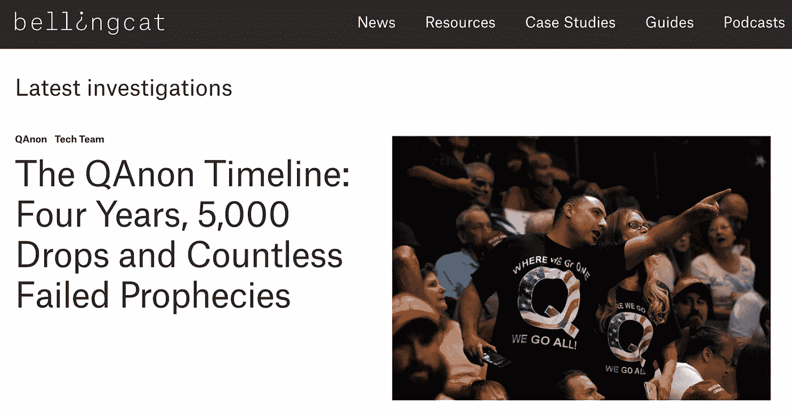
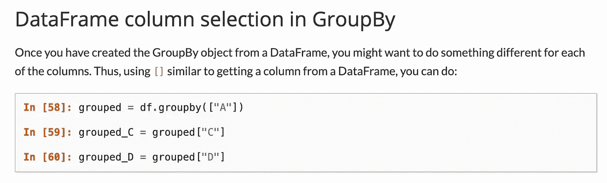
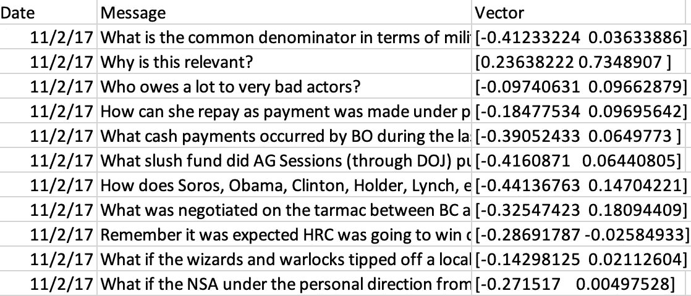
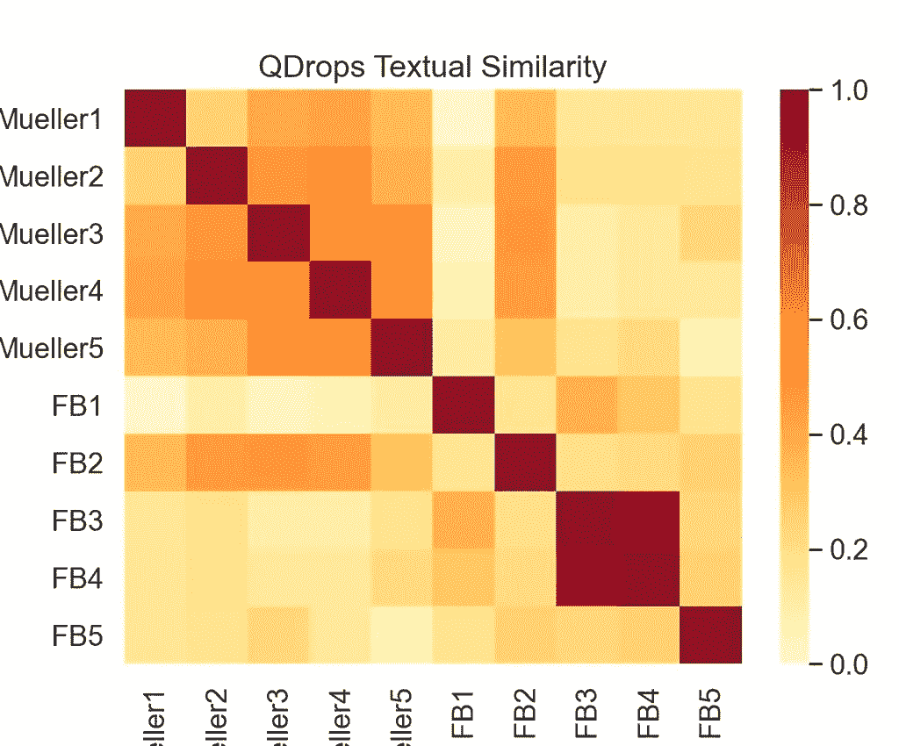

# 如何用情感分析讲故事

> 原文：<https://towardsdatascience.com/how-to-tell-stories-with-sentiment-analysis-f94cf9f8ca71?source=collection_archive---------16----------------------->

## *一名记者在分析 QAnon 时试图将数学引入新闻编辑室*

上周，我发表了“[《卡侬时间线:四年，5000 滴和无数失败的预言》](https://www.bellingcat.com/news/americas/2021/01/29/the-qanon-timeline/)。这项调查是与 Bellingcat 合作进行的，belling cat 是一家新闻编辑室，通过创新的开源和数据驱动的报道重塑了调查性新闻报道，最近在《NYT》、《华尔街日报》、《金融时报》、《华盛顿邮报》等上进行了专题报道。



我从开源社区的同事、数据科学家和记者那里收到了数量惊人的反馈。

到目前为止，最受欢迎的问题和兴趣点是方法论——我使用情绪分析来获得对 Qanon 增长故事的定量和定性见解。

今天关于数据科学，我将揭示我的方法。我还将深入解释如何在讲故事中应用这种创新的新方法，这有望成为任何对从数据中提炼有意义的故事感兴趣的人的宝贵财富。

# 开始使用数据🍕

QAnon 调查的核心是一个包含 4952 个所谓“Q 滴”的数据集，这些神秘的信息是阴谋论的核心。这些帖子是由一个被简称为“Q”的匿名人士发布的，他的追随者认为这个人是美国政治内幕消息的来源。每当一个 Q drop 出现，全世界的信徒都急切地试图解读它隐藏的含义，将他们与现实世界的事件联系起来。

Q 滴[数据集](https://docs.google.com/spreadsheets/d/11MhW-P-9el9dg_cTjutwtIiQGMfL8jfH3SOaLZSBV2g/edit#gid=1596710080)是在图片板 8kun 上找到的，被 Q 关注者用作评论 Q 滴的位置。它包含的帖子可以追溯到 2017 年 10 月，当时 QAnon 理论是一种边缘在线爱好，并持续到 2020 年 10 月——到那时它们已经被太认真了。

# 方法学

> *本次调查的目标是阐明 QAnon 阴谋论随时间推移的主要发展和讨论。为此，我们将数据分成多个子集，每个子集有一到三个月的时间间隔。*
> 
> *对于每个子集，我们运行了一个* [*聚类算法*](https://scikit-learn.org/stable/modules/generated/sklearn.cluster.AgglomerativeClustering.html) *，将具有相似情感的句子分组在一起。利用聚类的结果，我们总结了每个时间段的主要主题和值得注意的发展。*
> 
> *“情绪”是使用* [*通用句子编码器*](https://tfhub.dev/google/universal-sentence-encoder/1) *进行评估的，这是一种学术上认可的文本分类模型，根据其含义将每个 Q 下降转换为一组数字——一个向量。*
> 
> *意义相近的 Q 滴，向量相似。两个向量的接近程度可以通过计算它们的点积来计算。因此，我们能够评估句子之间情感的“接近程度”,以便对每个 Q drop 的文本进行分类。*

综上所述，这里有三个主要步骤。我们将逐个介绍它们，而上面的部分可以作为这些步骤如何组合在一起的高层次概述。

1.  **将数据分割成多个部分**
2.  **情感分析**
3.  **算法聚类**

# 1)拆分数据🐼🐍

首先，我们希望在更短的时间间隔内将数据分割成多个子集，并执行任何必要的数据清理。这只是数据分析 101，所以我不打算进入太多的细节，但会推荐一些额外的资源，如果你有兴趣阅读更多！

我最喜欢的数据分析工具是 Python + Pandas dynamic duo。这里欢迎您使用任何编程语言，但是如果您第一次尝试数据分析，我强烈建议您使用这种技术。

*🐍对于运行 Python 编程语言来说，*[*py charm*](https://www.jetbrains.com/pycharm/)*是我首选的开发环境，但是很多数据科学家也更喜欢使用* [*Jupyter 笔记本*](https://jupyter.org/) *。*

🐼 [*Pandas*](https://pandas.pydata.org/) *是一个广泛流行且超级强大的 Python 数据分析库。*

如果你对介绍导入数据集和清理数据的熊猫教程感兴趣，这里有一个很好的[资源，来自数据科学](/an-introduction-to-pandas-in-python-b06d2dd51aba)。另外，我推荐 Pandas 用于任何数据分析任务的另一个原因是因为它的强大的“分组”功能。

Pandas [Groupby 函数](https://pandas.pydata.org/pandas-docs/stable/user_guide/groupby.html)允许我们获取一个数据帧(Pandas 中的一个数据集),并基于一个属性轻松地将其分割成子集。



在这个用例中，我们可以按月“分组”,按时间间隔划分数据集。按月分组的具体代码片段可以在这篇 stack overflow [文章](https://stackoverflow.com/questions/44908383/how-can-i-group-by-month-from-a-date-field-using-python-pandas/44908576)中找到，在 Pandas 中遍历“分组”数据的惊人指南可以在[这里](https://pandas.pydata.org/pandas-docs/stable/user_guide/groupby.html)找到。

# 2)情感分析

文字很难处理——我们更喜欢数字！(从来没有其他记者这么说过，但对于情感分析来说，这是非常正确的。)

理想的目标是将每个 Q 液滴转换成代表其含义的数字数组，这样我们的液滴数据集看起来更像这样:



那么…我们该怎么做呢？

答案是[单词嵌入](https://en.wikipedia.org/wiki/Word_embedding)，这是一种对文本的学习表征，意思相似的单词有相似的表征。由于单词嵌入是自然语言处理中的一种技术，也是机器学习的一个子集，因此基本上有两种方法可以做到这一点:

a)从 Qanon 相关数据中训练我们自己的单词嵌入模型。

b)借用别人的文字嵌入模型，将文字转换成数字。

由于前者需要许多许多个月的工作，我们将采用后者。在这个例子中，我使用了谷歌发布的一个学术上备受好评的单词嵌入模型，该模型用包括政治文本在内的各种数据进行了训练，并针对句子和短段落进行了优化。这个模型的教程“通用句子编码器”可以在[这里](https://tfhub.dev/google/universal-sentence-encoder/1)找到。

🦜 [通用句子编码器使用指南](https://tfhub.dev/google/universal-sentence-encoder/1)

```
from absl import logging
import tensorflow as tf
import tensorflow_hub as hub
import numpy as nptf.compat.v1.disable_eager_execution()

embed = hub.Module("https://tfhub.dev/google/universal-sentence-encoder/1")

paragraph1 = (
    "I am a sentence for which I would like to get its embedding."
    "Universal Sentence Encoder embeddings also support short paragraphs. "
    "There is no hard limit on how long the paragraph is. Roughly, the longer "
    "the more 'diluted' the embedding will be.")

paragraph2 = "There are Puppets. There are Puppet Masters. Which is MUELLER?"

messages = [paragraph1, paragraph2]

with tf.Session() as session:
  session.run([tf.global_variables_initializer(), tf.tables_initializer()])
  message_embeddings = session.run(embed(messages))

  for i, message_embedding in enumerate(np.array(message_embeddings).tolist()):
    print("Message: {}".format(messages[i]))
    print("Embedding size: {}".format(len(message_embedding)))
    message_embedding_snippet = ", ".join(
        (str(x) for x in message_embedding[:3]))
    print("Embedding: [{},...]\n".format(message_embedding_snippet))
```

在上面的片段中，我们首先导入 [TensorFlow](https://www.tensorflow.org/tutorials/text/word_embeddings) ，这是一个由 Google 开发的流行的 Python 机器学习库。

接下来的代码部分全部来自通用语句编码器指南，在第 8 行，我们从互联网上下载了“嵌入”模块，它获取我们的输入文本，并将文本转换为一个向量，一个 512 个数字的列表。输出数据包含在“message_embeddings”变量中，我们可以用它来分析数据并将数据导出到 excel 表中。

# 3)将事物聚集在一起

在我们将相似的液滴聚集在一起之前，我们需要知道如何评估两个液滴是相似的。幸运的是，我们已经将 Q 值转换成了向量(基本上是数字数组)。回想一下高中数学，两个向量的“相似性”与其点积成正比，平行向量的点积等于 1。

在 Python 中，求两个向量的点积非常简单:

```
import numpy as npprint(np.dot(a, b))
```

# 升温[地图]

让我们来看一个实际例子吧！下面我们有来自 Q 滴的 10 句话。其中五项与罗伯特·穆勒有关，五项与脸书有关。

> *10 句话列表:*
> 
> *米勒:“有木偶。有傀儡师。哪个是[穆勒]？”，
> 米勒 2:"试图取代[JC]成为联邦调查局局长失败[试图重新获得联邦调查局的控制权]。"，
> 米勒 3:“【米勒】【爱泼斯坦埋葬&掩盖真相】”MUELLER 4:"[MUELLER][阴谋推翻正式当选的总统]。"米勒 5:“美国历史上最大的丑闻。叛国。”，
> face book 1:“FB 是什么？”，
> Facebook2:“间谍工具？”，
> Facebook3:“谁创造的？”，
> Facebook4:“到底是谁创造的？”，
> Facebook5:“没有什么是看起来那样的。”*

使用 Python 中的 [Seaborn](https://seaborn.pydata.org/generated/seaborn.heatmap.html) 库制作的热图，我们可以在从 0 到 1 的范围内可视化每对句子的点积。对角线都是暗红色的，因为每一滴都是相同的。请注意左上角大部分是橙色的，因为穆勒的句子彼此更相关，而脸书的句子除了 FB3(“谁创造了它”)和 FB4(“谁真正创造了它”)之外几乎没有关系，这两个句子非常相似，并且都是红色的。



最后一步，我们可以对 Q 个液滴运行聚类算法，将相似的液滴分类在一起。在这个例子中，我们使用了[聚集聚类](https://scikit-learn.org/stable/modules/generated/sklearn.cluster.AgglomerativeClustering.html)，尽管有许多其他的聚类算法。

这里有一个在 Python 中应用聚集聚类的[教程。它能够根据相似性对向量/数字列表进行分组，同时考虑到我们快速查看向量时得到的数学知识。](https://scikit-learn.org/stable/modules/generated/sklearn.cluster.AgglomerativeClustering.html)

```
from sklearn.cluster import AgglomerativeClustering
import pandas as pd
import os

CSV_Path = os.path.join('data.csv')
df = pd.read_csv(CSV_Path)

arr = df.iloc[:,1].to_numpy()
vector = df.iloc[:,3].to_numpy()
dates = df.iloc[:,0].to_numpy()

dates = dates.tolist()[0:200]
sentences = arr.tolist()[0:200]
vector = vector.tolist()[0:200]

for i in range (len(vector)):
    vector[i] = vector[i][1:-1].split()

clustering = AgglomerativeClustering(n_clusters=3).fit(vector)
print(clustering.labels_)
```

我们简化并指定我们想要的聚类数，并在 Q 个点的子集上运行该算法。我通常喜欢根据子集中的数量下降来修改聚类的数量。这是该算法的一个局限性，另一个聚类算法如 [KD 意味着](https://www.kdnuggets.com/2018/07/clustering-using-k-means-algorithm.html)可能能够更好地预测数据集的最佳聚类数。

最后，在数据集上执行算法后，我们可以通读每个聚类中最常见的趋势，然后写下它们，这是计算机永远无法自动化的调查的定性/新闻部分。

这是最终产品的链接，这是调查 Q 滴的方法论的结果:*🍕* [*《卡农时间线》:四年，五千滴，无数次失败的预言*](https://www.bellingcat.com/news/americas/2021/01/29/the-qanon-timeline/) *。*

> **感谢阅读！我目前是 BBC 非洲之眼的开源调查员和自由数据记者。你也可以订阅我的简讯** [**括号**](https://brackets.substack.com/about) **，每周一次深入科技、数据和新闻的新兴交叉领域。如果您有任何问题或意见，请直接在 Twitter @上联系我@**[**Edward _ the 6**](https://twitter.com/edward_the6)**。**