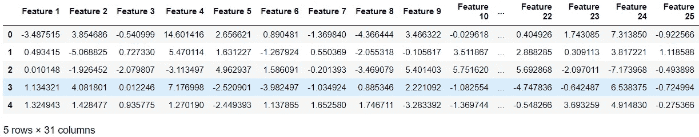
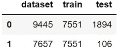
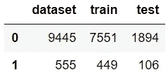
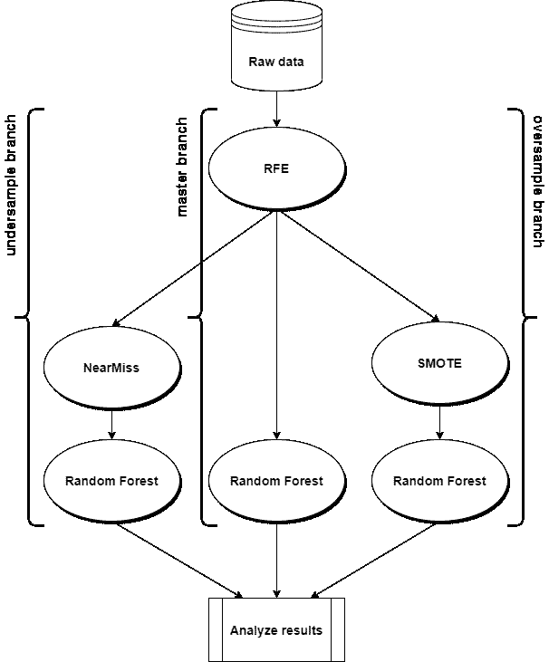
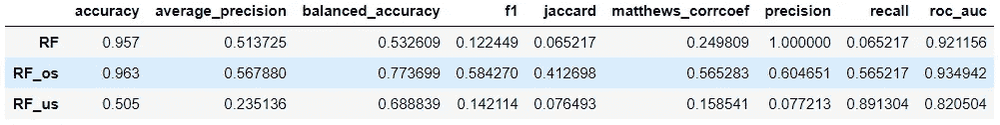
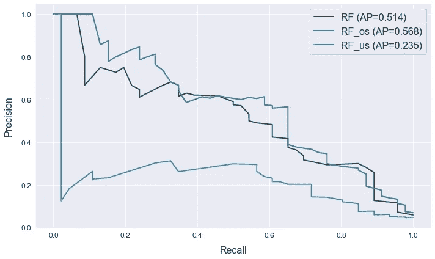

# 如何用几行 Python 测试多个机器学习管道

> 原文：<https://towardsdatascience.com/how-to-test-multiple-machine-learning-pipelines-with-just-a-few-lines-of-python-1a16cb4686d?source=collection_archive---------13----------------------->


昆腾·德格拉夫在 [Unsplash](https://unsplash.com?utm_source=medium&utm_medium=referral) 上的照片

# 介绍

在项目的探索阶段，数据科学家试图为他的特定用例找到最佳的管道。因为几乎不可能预先知道哪种转换将对模型的结果最有益，所以这个过程通常包括尝试不同的方法。例如，如果我们正在处理一个不平衡的数据集，我们应该对少数类进行过采样还是对多数类进行欠采样？在这个故事中，我将解释如何使用 [ATOM](https://github.com/tvdboom/ATOM) 包来快速帮助您评估在不同管道上训练的模型的性能。ATOM 是一个开源的 Python 包，旨在帮助数据科学家加快机器学习管道的探索。如果你想对图书馆有一个温和的介绍，请阅读这个故事。

# 管理管道

解释如何管理多个管道的最简单的方法是通过一个例子。在本例中，我们将:

1.  创建一个不平衡的数据集，并将其提供给 atom

2.使用[递归特征消除](https://scikit-learn.org/stable/modules/generated/sklearn.feature_selection.RFE.html)减少特征数量(RFE)

3.训练三个[随机森林](https://scikit-learn.org/stable/modules/generated/sklearn.ensemble.RandomForestClassifier.html)(射频)模型:

*   一个直接在不平衡数据集上训练
*   在应用[过采样](https://en.wikipedia.org/wiki/Oversampling_and_undersampling_in_data_analysis)后对数据集进行训练
*   一个在应用[欠采样](https://en.wikipedia.org/wiki/Oversampling_and_undersampling_in_data_analysis)后在数据集上训练

4.比较结果

我们将用不到 20 行代码完成所有这些工作！让我们开始吧。

**创建数据集**

我们开始创建一个模拟二进制分类数据集，将 0.95–0.05 比例的样本分配给每个类。然后，数据被输入到 atom。

```
from atom import ATOMClassifier
from sklearn.datasets import make_classification# Create an imbalanced dataset
X, y = make_classification(
    n_samples=5000,
    n_features=30,
    n_informative=20,
    weights=(0.95,),
)# Load the dataset into atom
atom = ATOMClassifier(X, y, test_size=0.2, verbose=2)
```

数据集被自动分为训练集和测试集。输出如下所示。

```
<< ================== ATOM ================== >>
Algorithm task: binary classification.

Dataset stats ====================== >>
Shape: (5000, 31)
Scaled: False
Outlier values: 582 (0.5%)
---------------------------------------
Train set size: 4000
Test set size: 1000
---------------------------------------
|    | dataset     | train       | test       |
|---:|:------------|:------------|:-----------|
|  0 | 4731 (17.6) | 3777 (16.9) | 954 (20.7) |
|  1 | 269 (1.0)   | 223 (1.0)   | 46 (1.0)   |
```

我们可以立即看到数据集是不平衡的，因为它包含的 0 比 1 多 18 倍。我们来看一下数据。注意，由于输入不是 dataframe，atom 为列指定了默认名称。

`atom.dataset.head()`



**执行特征选择**

出于解释的目的，我们将从一个数据转换步骤开始，我们希望在我们将要测试的所有管道中共享这个步骤。通常，这类似于特征缩放或缺失值的插补。在这种情况下，我们将数据的维度从 30 个特征减少到 12 个特征。有了 atom，就像这样简单。

`atom.feature_selection("RFE", solver="RF", n_features=12)`

此命令使用随机森林作为估计器来运行 RFE。剩余的数据集包含最有希望的要素。

```
Fitting FeatureSelector...
Performing feature selection...
 --> The RFE selected 12 features from the dataset.
   >>> Dropping feature Feature 2 (rank 3).
   >>> Dropping feature Feature 3 (rank 8).
   >>> Dropping feature Feature 5 (rank 10).
   >>> Dropping feature Feature 7 (rank 17).
   >>> Dropping feature Feature 8 (rank 12).
   >>> Dropping feature Feature 11 (rank 19).
   >>> Dropping feature Feature 13 (rank 13).
   >>> Dropping feature Feature 14 (rank 11).
   >>> Dropping feature Feature 15 (rank 15).
   >>> Dropping feature Feature 17 (rank 4).
   >>> Dropping feature Feature 19 (rank 16).
   >>> Dropping feature Feature 20 (rank 2).
   >>> Dropping feature Feature 21 (rank 6).
   >>> Dropping feature Feature 23 (rank 5).
   >>> Dropping feature Feature 24 (rank 9).
   >>> Dropping feature Feature 25 (rank 18).
   >>> Dropping feature Feature 26 (rank 7).
   >>> Dropping feature Feature 27 (rank 14).
```

现在，我们直接在不平衡数据集上训练我们的第一个模型。使用`run`方法，我们在训练集上拟合一个随机森林，并在测试集上对其进行评估。

`atom.run(models="RF", metric="balanced_accuracy")`

```
Training ===================================== >>
Models: RF
Metric: balanced_accuracy

Results for Random Forest:         
Fit ---------------------------------------------
Train evaluation --> balanced_accuracy: 1.0
Test evaluation --> balanced_accuracy: 0.5326
Time elapsed: 0.733s
-------------------------------------------------
Total time: 0.733s

Final results ========================= >>
Duration: 0.733s
------------------------------------------
Random Forest --> balanced_accuracy: 0.5326
```

**分支系统**

在继续之前，是时候解释一下 ATOM 的分支系统了。分支系统允许您在同一个 atom 实例中管理多个管道。每个管道都存储在一个单独的分支中，可以通过`branch`属性进行访问。分支包含数据集的副本，以及适合该特定数据集的所有转换器和模型。从 atom 调用的方法总是使用当前分支中的数据集，以及`atom.dataset`等数据属性。默认情况下，atom 从一个名为`master`的分支开始。致电分支机构，了解其包含的变压器和型号的概况。

`atom.branch`

```
Branch: master
 --> Pipeline: 
   >>> FeatureSelector
     --> strategy: RFE
     --> solver: RandomForestClassifier(n_jobs=1, random_state=1)
     --> n_features: 12
     --> max_frac_repeated: 1.0
     --> max_correlation: 1.0
     --> kwargs: {}
 --> Models: RF
```

当前分支包含我们之前调用的用于特征选择的类，以及我们刚刚训练的模型。

**过采样**

现在是时候测试模型在对数据集进行过采样后的表现了。在这里，我们创建一个名为`oversample`的新分支。

`atom.branch = "oversample"`

```
New branch oversample successfully created!
```

**注意:**创建新分支会自动将当前分支更改为新分支。要在现有分支之间切换，只需输入所需分支的名称，例如`atom.branch = "master"`即可返回主分支。

过采样分支从当前分支(主分支)中分离出来，采用其数据集和转换器。这意味着特性选择转换器现在也是过采样流水线中的一个步骤。像这样分割分支可以避免重新计算之前的转换。

使用 [SMOTE](https://imbalanced-learn.org/stable/references/generated/imblearn.over_sampling.SMOTE.html) 调用`balance`方法对数据集进行过采样。

`atom.balance(strategy="smote")`

```
Oversampling with SMOTE...
 --> Adding 7102 samples to class: 1.
```

请记住，该方法仅转换当前分支中的数据集。主分支中的数据集保持不变。快速检查转换是否有效。

`atom.classes`



请注意，只有训练集是平衡的，因为我们希望在测试集中保留原始的类分布。

现在，我们可以在过采样数据集上训练一个随机森林模型。为了将这个模型与我们训练的第一个模型区分开来，我们在模型的缩写后面添加了一个标记(os 表示过采样)。

`atom.run(models="RF_os", metric="balanced_accuracy")`

```
Training ===================================== >>
Models: RF_os
Metric: balanced_accuracy

Results for Random Forest:         
Fit ---------------------------------------------
Train evaluation --> balanced_accuracy: 1.0
Test evaluation --> balanced_accuracy: 0.7737
Time elapsed: 1.325s
-------------------------------------------------
Total time: 1.325s

Final results ========================= >>
Duration: 1.341s
------------------------------------------
Random Forest --> balanced_accuracy: 0.7737
```

**欠采样**

需要一个新的分支来对数据进行欠采样。由于当前分支包含过采样数据集，我们必须将新分支从仅包含 RFE 变换器的主分支中分离出来。

`atom.branch = "undersample_from_master"`

```
New branch undersample successfully created!
```

在新分支和现有分支之间添加`_from_`，将其从现有分支而不是当前分支中分离出来。检查欠采样分支中的数据集是否仍然不平衡。

`atom.classes`



再次调用`balance`方法，使用 [NearMiss](https://imbalanced-learn.org/dev/references/generated/imblearn.under_sampling.NearMiss.html) 对数据进行欠采样。

`atom.balance(strategy="NearMiss")`

```
Undersampling with NearMiss...
 --> Removing 7102 samples from class: 0.
```

并使用新标签(us 表示欠采样)拟合随机森林。

`atom.run(models="RF_us", metric="balanced_accuracy")`

```
Training ===================================== >>
Models: RF_us
Metric: balanced_accuracy

Results for Random Forest:         
Fit ---------------------------------------------
Train evaluation --> balanced_accuracy: 1.0
Test evaluation --> balanced_accuracy: 0.6888
Time elapsed: 0.189s
-------------------------------------------------
Total time: 0.189s

Final results ========================= >>
Duration: 0.189s
------------------------------------------
Random Forest --> balanced_accuracy: 0.6888
```

如果我们现在查看我们的分支，我们会看到管道只包含我们想要的两个转换。

`atom.branch`

```
Branch: undersample
 --> Pipeline: 
   >>> FeatureSelector
     --> strategy: RFE
     --> solver: RandomForestClassifier(n_jobs=1, random_state=1)
     --> n_features: 12
     --> max_frac_repeated: 1.0
     --> max_correlation: 1.0
     --> kwargs: {}
   >>> Balancer
     --> strategy: NearMiss
     --> kwargs: {}
 --> Models: RF_us
```

**分析结果**

我们最终在 atom 实例中获得了我们想要的三个模型。分支系统现在看起来如下。



RFE 变换在三个分支之间共享，但是之后，每个分支遵循不同的路径。主分支没有其他变压器，而其他两个分支各自应用不同的平衡算法。所有三个分支都包含一个随机森林模型，每个都在不同的数据集上进行训练。剩下的就是比较结果了。

`atom.evaluate()`



`atom.plot_prc()`



# 结论

我们已经了解了如何使用 ATOM 包轻松比较多个机器学习管道。将所有管道(以及模型)放在同一个 atom 实例中有几个优点:

*   代码更短，这使得笔记本不那么杂乱，并且更容易维护概览
*   跨管道共享的转换不需要重新计算
*   使用 atom 的绘图方法可以更容易地比较结果

我们所经历的例子非常简单，但是 ATOM 可以做得更多！要了解更多信息，请查看[这个相关的故事](/atom-a-python-package-for-fast-exploration-of-machine-learning-pipelines-653956a16e7b)或者看看软件包的[文档](https://tvdboom.github.io/ATOM/)。对于 bug 或功能需求，请不要犹豫，在 [GitHub](https://github.com/tvdboom/ATOM) 上发帖或给我发邮件。