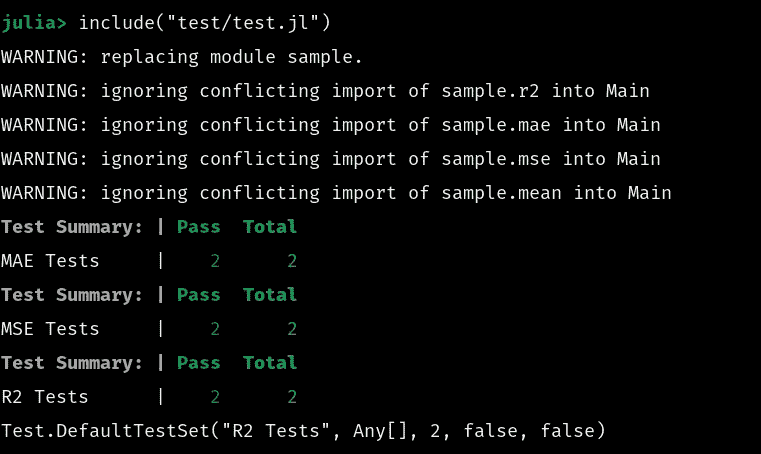

# 如何用 Julia 测试你的软件

> 原文：<https://towardsdatascience.com/how-to-test-your-software-with-julia-4050379a9f3?source=collection_archive---------14----------------------->

## 确保你的 Julia 软件实际上与测试包一起工作！


(src =[https://pixabay.com/images/id-731198/](https://pixabay.com/images/id-731198/)

# 介绍

测试是迭代软件开发最重要的方面之一。这是因为测试可以自动揭示软件的问题，而不需要实际使用软件。不用说，将甚至不工作的软件推送到存储库可能是个坏主意，测试可以避免碰到这个问题。在 Julia 编程语言中实现测试，我认为这是一个非常棒和独特的实现。我认为它很棒，因为它提供了一种使用条件和宏测试软件的非常结构化和简单的方法。今天我想为 Julia 介绍一下 Testing.jl 包的基础知识，这样你就可以在犯下大错之前确保你的软件正常工作。

# 设置包

为了演示 Julia 的测试包，我们首先需要建立一个新项目。为了建立一个新的项目，我们可以使用 Pkg.generate()，或者 Pkg REPL 中的 generate 命令。一旦进入朱莉娅 press，我将按下]并生成我们命名为“Sample”的新项目

```
julia> ]
([@v1](http://twitter.com/v1).6) pkg> generate sample
```

接下来，我将退格退出 REPL，然后按；参加 REPL 的狂欢。然后，我们将 cd 放入新的项目文件夹。

```
julia> ;
shell> cd sample
```

现在，我将 cd 放入 source 文件夹，并对 sample.jl 文件进行 nano，添加一个我们可以测试的新函数。

```
shell> cd src
/home/emmett/dev/julia/sample/srcshell> nano sample.jl
```

在这个文件中，我放了一些用于模型验证的函数，以及用于支持它们的函数:

```
mean(x) = sum(x) / length(x)
function mae(actual,pred)
    l = length(actual)
    lp = length(pred)
    if l != lp
        throw(ArgumentError("The array shape does not match!"))
    end
    result = actual-pred
    maeunf = mean(result)
    if maeunf < 0
        maeunf = (maeunf - maeunf) - maeunf
    end
    return(maeunf)
endfunction mse(y,ŷ)
    diff = y .- ŷ
    diff = diff .^ 2
    Σdiff = sum(diff)
    return(Σdiff)
end
function correlationcoeff(x,y)
    n = length(x)
    yl = length(y)
    [@assert](http://twitter.com/assert) n == yl DimensionMismatch("These Arrays are not the same size.")
    xy = x .* y
    sx = sum(x)
    sy = sum(y)
    sxy = sum(xy)
    x2 = x .^ 2
    y2 = y .^ 2
    sx2 = sum(x2)
    sy2 = sum(y2)
    ((n*sxy) - (sx * sy)) / (sqrt((((n*sx2)-(sx^2)) * ((n*sy2)-(sy^2)))))
endfunction r2(actual,pred)
    l = length(actual)
    lp = length(pred)
    if l != lp
        throw(ArgumentError("The array shape does not match!"))
    end
    r = correlationcoeff(actual,pred)
    rsq = r^2
    rsq = rsq * 100
    return(rsq)
end
export r2, mae, mse
```

然后我使用 ctrl+O 来删除新的缓冲区，现在我们可以开始实际测试这些函数了！

# 测试

现在我们实际上已经有了一个要测试的包，我们可以着手设置我们的测试环境了。对于 Julia 包，测试和文档都被认为是独立于原始包的包。记住，我们将再次使用 generate 命令来创建这两个项目目录。我们将激活这个新的测试环境，然后将测试依赖项添加到它的虚拟环境中。

```
shell> cd ..
/home/emmett/dev/julia/sample([@v1](http://twitter.com/v1).6) pkg> activate test
  Activating new environment at `~/dev/julia/sample/test/Project.toml`(test) pkg> add Test
    Updating registry at `~/.julia/registries/General`
   Resolving package versions...
    Updating `~/dev/julia/sample/test/Project.toml`
  [8dfed614] + Test
    Updating `~/dev/julia/sample/test/Manifest.toml`
  [2a0f44e3] + Base64
  [b77e0a4c] + InteractiveUtils
  [56ddb016] + Logging
  [d6f4376e] + Markdown
  [9a3f8284] + Random
  [9e88b42a] + Serialization
  [8dfed614] + Test(test) pkg>
```

现在我们可以编写测试算法了。包内的第一个函数是 MAE。为了执行测试，我们需要启动一个测试集。这是通过测试集宏完成的。在宏之后，我们提供一个字符串作为第一个参数，然后我们提供一个表达式作为第二个参数。字符串是测试集的标题，表达式是执行测试的代码。我们可以使用 begin 和 end 块创建这样的表达式。所有这些看起来就像这样:

```
using Testinclude("../src/sample.jl")using Main.sample[@testset](http://twitter.com/testset) "MAE tests" beginend
```

我们将从两者相等的测试开始这些测试，对于这个场景，MAE 应该是 1。测试宏接受一个参数，这个参数是一个布尔值。让我们在两个相等数组的 MAE 上使用一个 bool 类型的按位运算符，它应该等于零。

```
x = [5, 10, 15]
y = [5, 10, 15]
[@test](http://twitter.com/test) mae(x, y) == 0
```

我们的下一个测试将会是，我们是否真的得到了 dims 差异的平均值。

```
x, y = [4, 10, 15], [5, 10, 15]
    [@test](http://twitter.com/test) mae(x, y) == mean([1, 0, 0])
```

对于最终的测试集，如下所示:

```
using Main.sample: r2, mae, mse, mean
[@testset](http://twitter.com/testset) "MAE Tests" begin
    x = [5, 10, 15]
    y = [5, 10, 15]
    [@test](http://twitter.com/test) mae(x, y) == 0
    x, y = [4, 10, 15], [5, 10, 15]
    [@test](http://twitter.com/test) mae(x, y) == mean([1, 0, 0])
end
```

接下来，我们将为 MSE 函数开始一个新的测试集。我们将做一个断言测试，和一个零测试，就像我们之前做的一样。

```
[@testset](http://twitter.com/testset) "MSE Tests" begin
x = [5, 10, 15]
y = [5, 10, 15]
[@test](http://twitter.com/test) mse(x, y) == 0
y = [4, 10, 15]
y2 = [6, 10, 15]
[@test](http://twitter.com/test) mse(x, y) == mse(x, y2)
end
```

接下来，我们将测试我们的 r 函数。因为我们的 r 函数要返回一个百分比，我们将检查返回的类型是否为 Float64，然后检查它是否小于 1。

```
[@testset](http://twitter.com/testset) "R2 Tests" begin
x = randn(50)
y = randn(50)
[@test](http://twitter.com/test) r2(x, y) <= 1
[@test](http://twitter.com/test) typeof(r2(x, y)) == Float64
```

现在，我们可以通过返回到 REPL 并包含这些代码来运行我们的测试。

```
include("test/test.jl")
```



(图片由作者提供)

# 结论

无论你创建什么样的软件，测试它总是很重要的。Julia 有一个非常酷的测试软件的方法，它利用宏并使测试非常有条理。与许多其他测试风格相比，我更喜欢这种方法，我认为 Julia 使用这种方法使测试变得轻而易举。非常感谢您阅读我的文章，我希望所提供的信息对使您的软件更好地工作是有价值的！感谢您的阅读！