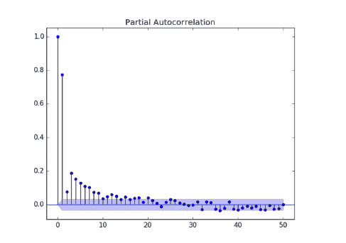
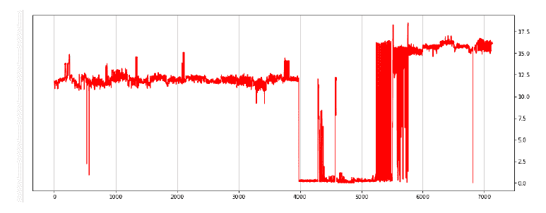

# 如何看待数据、数据科学和时间序列

> 原文：<https://towardsdatascience.com/how-to-think-about-data-data-science-and-time-series-7b2fdb74bee3?source=collection_archive---------37----------------------->

## 什么是数据、数据科学和时间序列？

数据是对世界的测量。我们可以通过多种方式获取数据；我们可以在一个时间点捕捉不同人的特征数据，从人群中收集样本**横截面数据**，并找到例如身高分布，即所收集样本中个体的平均身高。我们还可以在多个时间点收集这样的样本，也许可以看到平均高度如何随时间变化——这是**面板数据**。最后，我们可以专注于一个个体而不是一个群体，多年来每天收集他们的身高测量值，并跟踪他们的身高演变。这个最后的数据将是一个**时间序列**类型的数据样本。为理解时间序列样本而开发的思想可以从一个人的高度转化为海事部门中一艘船的各种测量值的变化的演化。但是我们所说的“理解”时间序列是什么意思呢？它意味着创建一个**函数 f(x)** 来捕捉数据点如何随时间变化；在存在某种模式的情况下，该**函数将捕获该模式**，这样我们将能够描述/总结/抽象/概括时间序列过程。例如，如果我们在一个孩子生命的前 10 年里每年测量他的身高，我们发现他的身高从 70 厘米开始，每年增长 7 厘米，到 10 岁时达到 140 厘米，那么这个函数看起来就像:

```
**f(x) = b*x(t-1) + 7			(1)**
```

f(x)是下一年的观测值，x 是当年的观测值；因此，从一年到下一年的过渡由上面的函数定义(在前一个值的基础上增加 7 厘米)。换句话说，该函数捕获了数据生成过程，它被正式称为**模型**。在数据科学领域，我们使用**数据来告诉我们模型看起来像什么**。这意味着我们事先不知道孩子身高的进化是他们每年长高 7 厘米。我们“训练”一种算法，该算法找到这种模式，并发出通知我们这种模式的模型。因此，这个模型对于**信息/研究原因**是有用的，但是对于**预测**原因也是重要的。如果你知道这是孩子身高演变的方式，你可以用今天的身高，加上 7，得到明年身高的预测！如你所见，在时间序列的例子中，这个个体的观察是相关的。如果我们收集横截面数据(在一个时间点上许多不同个体的身高),就没有理由假设他们的身高以任何方式相关——假设从人群中随机抽取样本。如果我们要从人群中挑选一个新的个体，知道最后被选中的个体的身高并不重要。这与时间序列形成对比，在时间序列中，如果我们明年对同一个人进行采样，知道最后一次观察(他们今年的身高)确实会告诉我们他们可能的身高。

# 自回归模型

转到稍微更技术性的材料，人们可以很快发现并非所有的时间序列都是相同的。个人的身高可以被视为每年大致呈线性增长，但比雷埃夫斯港的室外温度显然不是线性的！我们看不到每年的温度比去年高 7 度！这里我们看到一个每年重复的季节性模式。分析这些温度数据的数据科学算法/函数将与我们的第一个函数有很大不同。有人可能会说，假设我们有每月观测数据，它会是这样的:

> `**f(x) = b*x(t-12) (2)**`

这意味着本月的观察与 12 个月前相同，有道理；通过对比去年 7 月和今年 4 月的气温，可以最好地预测 7 月的气温。从技术上讲，这被称为**自回归**模型。有见识的读者可能知道什么是回归；我们只是针对横截面数据的情况讨论了这个函数/模型，例如，在横截面数据中，我们发现一个人的身高如何根据父母的身高而变化。但是在这里，因为我们在时间序列空间内，高度在先前的时间点上回归到自身；因此出现了自动回归。在正常回归的情况下，我们可能有一个我们试图预测的因变量和许多自变量/特征，其中一些将能够解释因变量的变化。真正**显著的变量被保留在最终的模型/函数中，**，因为数据告诉我们它们是有用的预测器。在时间序列自回归模型的情况下，要包括在自回归中的候选变量是人的身高观察的所有以前的滞后，模型告诉我们哪些过去的时期/滞后对于解释当前的观察是重要的。在温度的例子中，模型告诉我们，无论我们现在观察的是什么时间戳，重要的自回归变量都有 12 个滞后；当前值始终取决于之前的 12 个周期。寻找显著自回归变量的方法与横截面案例非常相似，在横截面案例中，我们可以从探索不同变量的相关性开始，保留一些变量，然后对最相关的变量进行回归，以得出最能代表数据的模型的最终**特征选择**。在时间序列的情况下，通过使用 **Box-Jenkins** 方法，我们运行自相关和偏自相关图，以查看时间序列的观测值与过去不同滞后时间的观测值之间的相关性。



作者图片

在上面的部分自相关图中，我们看到这个时间序列具有这样的特征，即当前值依赖于 1 到 9 个滞后之前的值(高于蓝色阈值)。因此，如果我们想要自回归该变量(称其为高度只是为了连续性)，我们将选择 9 个特征，即 9 个高度滞后，以最好地表示最终模型中的数据。一个更有经验的建模者会知道一个**简约**/简单的模型总是更好的，所以他们会只选择第一个滞后作为一个特征，因为它是高度相关的，并且比其他滞后携带更多关于下一个值的信息。因此，他们只会在模型中选择一个如下所示的特征:

```
**f(x) = b*x(t-1)				(3)**
```

自回归将给出 **b** 的值，即告诉我们控制所有其他因素的系数，最后一个滞后值对当前值的贡献如此之大。现在，在这一点上，探索这个 b 值是很有趣的，因为它背后隐藏着整个世界的特性。如果这个 b 值小于 1，那么它意味着这个过程是**静止的**！这意味着它会回复到一个恒定的平均值，不会向一个随机的方向爆炸。在第一个模型(1)中，该模型不是平稳的(它是非平稳的— **单位根**)，因为 b 是 1；如果这个人的身高等于去年的身高加 7，那么去年的身高应该乘以 b=1。如果我们有一个均值回归过程，b 会更小，例如 0.3，这表明如果在 1 个周期中我们看到一个高值，下一个周期我们应该预期不会看到这样高的值。一般来说，平稳过程更容易预测，因为它们始终有一个恒定的分布，并回复到一个恒定的均值。


作者图片

这是一个均值在 12 左右的平稳过程的例子。如果值为 13，请确保以下值之一将回到或低于 12。

# 移动平均模型

我们已经说过，建模这一过程的一种方法是使用自回归，其中我们发现在解释当前观察值时哪个滞后是重要的，但也有其他建模方法。第二种方式是移动平均线过程。这里，将每个时间段的预测值与实际值进行比较，定义“误差”值。现在，我们可以不在滞后观测值中(例如在自回归-AR 中)而是在滞后误差中回归当前观测值！这直观地告诉我们，如果一个时期发生**“错误”/冲击**，其影响将持续到未来多少个时期；这就相当于说当前值是由许多年前的误差解释的。同样，我们遵循相同的回归方法，在所有滞后误差中，我们找出哪些误差是显著的，并将其纳入模型。例如，在对石油价格建模时，如果出现冠状病毒导致的石油价格下跌(就像 2020 年 3 月发生的那样)，价格需要多长时间才能恢复正常？这是 MA lags 的数量。现在我们知道了 AR 模型(自回归)和 MA 模型(移动平均)，如果我们把它们结合起来，我们就得到 ARIMA 模型！在这种模型中，平稳时间序列的下一个值取决于某些滞后的值以及某些滞后的误差。

# ARCH / GARCH

继续讨论时间序列建模的其他方法，还有 ARCH 和 GARCH 模型。这代表自回归条件异方差，是关于时间序列的波动性/方差/垂直分布的建模。因此，现在我们不是像在 AR 中那样将当前值回归到滞后值，而是将当前的**方差**回归到某个滞后之前的观测值的方差。我们的目标是检测波动性激增持续多长时间，或者它会以何种方式重演。这是有用的，因为如果我们发现当发动机的温度变化增加时，它会在未来更多的时期内增加更多，我们会比我们知道变化中的 1 个峰值通常伴随着收缩和向恒定平均值的强烈返回更担心。

```
**σ = b*σ(t-1)				(4)**
```

这些模型看起来是这样的:一个时期的标准偏差或方差基于前一时期的标准偏差或方差回归。

# 政权

接下来，我们必须理解时间序列的结构或基本模型会随着时间而变化。例如，在儿童身高的例子中，从 0 岁到 18 岁的演变不同于 18-50 岁。换句话说，在高度的时间序列中有两种不同的“状态”,应该用两种不同的模型来描述。第一个是每年增加 7 厘米，第二个是恒定的；每年的值与前一年相同。在其他时间序列中，我们可能会发现更多的制度，以及在未来重复出现的制度:



作者图片

在船速的时间序列中，我们清楚地看到两种不同的状态，一种是当船移动时平均 12 节，另一种是当船停在港口时平均 0 节。显然，有经验的建模者需要为每个状态(旅行/不旅行)准备 2 个不同的模型。更有经验的建模者可以有一个模型来预测每个状态/状态持续多长时间，这样他们对未来的预测就可以及时地在两种状态之间摆动。这类序列的著名模型是**马尔可夫切换自回归**，其中模型从一个自回归模型切换到另一个模型，遵循马尔可夫过程；即无记忆过程，其中转移概率矩阵定义了这样的概率，即给定当前状态/制度，下一个状态是旅行的概率是 P(旅行),非旅行的概率是 P(非旅行)。因此，这是一个 2x2 **转换矩阵**，捕捉状态如何根据我们所处的状态进行转换。问题是，有 0.9 的概率停留在同一个州/政权将永远是 0.9，无论你已经在该政权停留了多少时期。因此，在 1 个方案中停留的小时数的模型更有用。

# 结构模型/向量自回归

到目前为止，我们已经研究了仅使用时间序列本身获得时间序列的下一个值的预测的情况。当然，一个序列的值不仅取决于过去，也取决于不同的序列。例如，发动机的温度不仅可以通过前一时期的温度来预测，还可以通过当前时期的船速、上一时期的船速、上一时期的 RPM、当前时期或上一时期的风速来预测。这在多元自回归或向量自回归(VAR)等更高级的模型下，开辟了一个全新的可能相关性世界。在多元时间序列的情况下，模型看起来像这样:

```
**f(x,y) = b*x(t-1) + c*y(t-1)			(5)**
```

这表明一个变量在某一点上的回归是基于它自身的滞后和另一个时间序列的滞后值。在多变量时间序列的世界中，这两个变量都被认为是内生的，即变量 y 不像正常回归情况那样是外生的。这意味着我们需要 2 个方程来模拟它们，1 个方程用来显示 x 如何影响 y，1 个方程用来显示 y 如何影响 x。这些模型通常被称为**结构模型或时间联立方程**模型。

```
**X(t) = b*X(t-1) + c*Y(t-1)			(6)
Y(t) = b1*Y(t-1) + c1*X(t-1)			(7)**
```

这里有两个变量和两个方程。直觉是，如果我们要在一个多变量环境中模拟和预测一艘船上发动机的温度，我们可以用船的速度作为解释变量；我们将根据当前速度确定下一个温度，因为船只速度越快，RPM 越高，导致温度升高。另一方面， **2 变量可能以相反的方式**相关，这需要在系统的第二方程中捕捉:温度越高，船长越有可能降低速度，以使发动机不会过热。

为了求解这个方程组，大致有两种方法:一种是基于领域专业知识来"**识别**系统并找到系数，另一种是理论方法，即**向量自回归**方法。在第一种方法中，传统的“ **Cowles Commission** ”方法用于识别联立方程/结构模型，为了识别 2 个变量(2 个方程)之间的 2 种不同关系，我们需要 2 个外生变量的帮助。如果等式(6)中的 X 是容器的温度，Y 是容器的速度，我们可以将系统增强为如下所示:

```
**X(t) = b*X(t-1) + c*Y(t-1) + d*F(t-1)		(8)
Y(t) = b1*Y(t-1) + c1*X(t-1) + d1*G(t-1)	(9)**
```

我们在这里添加的是每个方程中的一个外生因子，它将帮助我们求解这些方程，并找到系数 b、b1、c、c1、d 和 d1(我们总共在搜索 6 个未知数)。

为了更好地理解这里发生的事情，让我们引入一个**供应和需求概念**，在这里我们对船舶发动机的需求和船舶发动机的供应进行建模。供给曲线向上倾斜，2 个轴是温度和速度。因此，运动的提供者(发动机)随着速度的增加要求更多的温度——向上倾斜的供给曲线。另一方面，随着温度的升高，运动的消费者(船长)要求更低的速度——向下倾斜的需求曲线。等式 8 是供给曲线，其中一个周期中速度(Y)的增加导致下一个周期中温度(X)的增加，等式 9 是需求曲线，其中当前周期中温度的增加导致速度下降(由于机长避免过热)。


作者图片

假设我们有很多速度和温度的数据，并且我们从领域专家那里了解到这两个变量之间的两种对立关系，那么我们如何将一种关系产生的数据点与另一种关系产生的数据点分开呢？换句话说，我们如何找到需求和供给曲线的形状，以及如何找到等式 8 和 9 中的系数？利用上述的**外生因素**:为了找到供给曲线，我们在需求方程(9)上引入因子 G，其**向上移动需求曲线，暴露供给曲线的斜率**，并在供给方程上引入因子 F，其**向外移动供给曲线，暴露需求曲线的斜率**(即需求方程的系数)。F 的一个例子可能是突然的零风速条件，这将供应曲线向外移动，这是有意义的，因为现在对于相同的发动机温度/发动机功率，你可以获得比恶劣天气条件下更高的速度。G 的一个例子是，船长采取了不那么保守的态度，即使在高温下也允许更高的速度。

在使用向量自回归求解结构模型的第二种方法中，我们不需要使用任何外生变量或限制来识别系统，我们只需将所有变量接受为**内生**，对它们的滞后进行回归，并继续使用**脉冲响应函数、格兰杰因果关系和预测**来获得感兴趣变量的准确预测。如果在基准数据上运行，这种向量自回归可以给我们在正常条件下每个变量及其滞后对其他时间序列贡献多少的系数，然后如果在“异常”时期运行，它可以突出系数已经改变，因此表明变量已经改变，不再影响因变量。这是检测系列是否出现异常的可靠方法。

# 向量误差修正模型

作为 VAR 模型的扩展，人们可以利用**协整**的概念，建立误差修正或向量误差修正模型(VECM)。当两个或两个以上的非平稳变量在相互回归时，有一个平稳的剩余时间序列时，就会发生协整。趋势稳定的两个时间序列，这意味着它们有一个趋势，如果它们之间的“差异”是稳定的，即具有恒定的平均值，那么这两个序列是协整的。这意味着从长远来看，这两个系列是相关的；协整关系反映了长期关系。VECM 将短期偏差与协整关系结合在一个模型中。因此，人们可以想象，我们可以在 VECM 的协整部分获得变量的长期(基准)关系，在模型的其余部分获得短期偏差(异常)。这可能是使用 VECM 的一种新方法。

# 主成分分析

此外，我们可以使用主成分分析或动态因子模型，找出哪些时间序列是同步的，可以只用一个**潜在**变量来表示。**因子加载**，即选择包含在每个潜在因子下的变量，将会建议哪些变量在正常条件下是“相关的”。

# 相关

否则，更简单的方法是找出时间序列之间的相关性(忽略时间作为解释维度)。