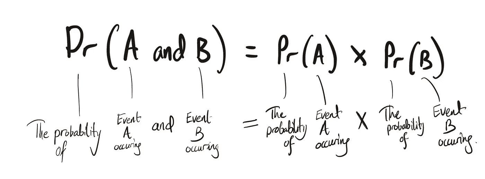

# 如何思考概率

> 原文：<https://towardsdatascience.com/how-to-think-about-probability-b828098e1a6a?source=collection_archive---------23----------------------->

## 数据科学导论

## 数据科学的离散概率

克利姆·穆萨利莫夫在 [Unsplash](https://unsplash.com?utm_source=medium&utm_medium=referral) 上的照片

如果我必须用一句话来解释机器学习模型是如何工作的，我的答案会是*“通过计算(条件)概率。”*概率论是最复杂的数据科学任务的基础。这篇文章简单易懂地介绍了概率论。

在这里，我们将涵盖:

*   离散概率
*   独立事件和条件事件
*   概率的简单数学符号

# 离散概率

抛硬币，你将只有两种可能的结果(正面或反面)。从一副标准牌中抽出一张牌，你会有五十二种可能结果中的一种。当结果是固定数量的可能结果之一时，我们称之为“*分类*结果。离散概率处理我们的结果是明确的事件。

在本文中，我们将使用从标准的 52 副牌中抽取的例子。但是你可以把我们在这里学到的概念应用到任何离散概率的问题上。

通常，我们使用概率的目的是为了进行预测。我们试图找出哪种可能的结果是最有可能发生的。在计算这些概率时，我们需要考虑我们试图预测的事件是独立的还是有条件的。

# 独立性ˌ自立性

## 独立事件

假设我让你从一副标准洗牌牌中抽一张牌。你的牌是红色的概率正好是 50%,因为你是从一副有 26 张红色和 26 张黑色的牌中随机抽取的。

现在，我们把你的牌放回牌堆，重新洗牌。你下一次抽牌也是红牌的概率有多大？50%,因为我们有与第一次抽签相同的初始条件——随机洗牌中的 26 张红牌和 26 张黑牌。

因为第一次抽奖的结果对任何后续抽奖的概率没有影响，所以我们称这些*事件为独立*事件。

## 条件事件

现在，假设我们再次开始同样的实验。但这一次，在你抽完第一张牌后，我们不会把它放回牌堆里。如果第一次抽牌是一张红牌，那么第二张牌也是红牌的概率是多少？

第一次抽牌后，牌组不再均衡。如果你抽了一张红卡，那副牌现在还剩下 25 张红卡和 26 张黑卡。这改变了下一次抽签的概率。因为剩下的红色牌比黑色牌少，所以再抽一张红色牌的可能性降低了。抽到红牌的概率是:

*   第一次抽牌时的 26/52 (0.50)
*   *25/51* (0.49)第二次抽签

这向我们展示了一个事件的结果如何影响下一个事件的概率。如果我们不把牌放回牌堆，每一次抽牌都会影响下一次的概率。我们称这些*为条件*概率。

# 计算概率(数学符号)

## 乘法法则

让我们继续我们的纸牌游戏的例子。我们要计算抽任何花色的红脸牌(国王、王后或杰克)的概率。我们可以认为这是两个事件。抽红牌**和抽面牌**:

1.  事件 *A* =抽红牌
2.  事件 *B* =抽一张脸牌

我们知道一副牌中有 26/52 张红色牌和 12/52 张正面牌。因此，我们可以计算这些事件的概率如下:

1.  事件 A = 26/52 = 0.5
2.  事件 B = 12/52 = 0.23

我们可以通过考虑每个事件发生的“概率空间”来形象化这个问题——我们用事件发生的概率来表示每个圆的大小:

可视化事件 A 和事件 b 的概率。

要得到红脸牌，我们感兴趣的区域是抽到了红牌和抽到了脸牌的概率的交集(重叠)。

可视化事件 A **和** B 同时发生的概率(两个概率空间的交集)。*图片作者。*

为了得到这个空间，我们用拿到红卡的概率乘以拿到脸卡的概率:

Pr(A 和 B) = Pr(A) * Pr(B)。*图片作者。*

所以我们可以把抽到红脸牌的概率计算为:

*   Pr(A 和 B) = Pr(A) * Pr(B)
*   Pr(A 和 B) = 0.5 * 0.23
*   Pr(A 和 B) = 0.115

在这些简单的情况下，我们可以直接验证我们的结果。我们知道一副 52 张牌中只有 6 张红脸牌，这样我们就有 6/52 的机会(或 0.115)。

## 加法法则

让我们继续我们的纸牌游戏的例子。这一次，我们要计算任意花色抽到红牌**或** a 面牌(国王、王后或杰克)的概率。我们可以采用同样的方法，把这看作两个事件:

1.  事件 *A* =抽红牌
2.  事件 B =抽一张脸牌

事件和每个事件的概率与我们之前的示例相同:

1.  事件 A = 26/52 = 0.5
2.  事件 B = 12/52 = 0.23

这个图像帮助我们想象抽一张红卡、一张脸卡或一张红脸卡的概率。

可视化事件 A **和** B 同时发生的概率(两个概率空间的交集)。*图片作者。*

然而，当试图计算抽红牌**或抽脸牌**的概率时，这些事件中的任何三个都会满足我们的标准。我们要寻找的是重叠概率的总面积。

想象事件 A **或** B 发生的概率。*作者图片。*

因此，总结加法法则，我们可以说

Pr(A 或 B) = Pr(A) + Pr(B) - Pr(A 和 B)。*图片作者。*

换个角度看概率空间图，让我们知道为什么需要减去 A 和 b 的概率。

为什么我们在计算作者的**或** B. *图像的概率时要减去 A **和** B 的概率。*

如果我们将事件 A 和事件 B 的概率分别相加，我们将两次考虑两个空间之间的重叠，并过度报告 *A 或 B* 的概率。

*   Pr(A 或 B) = Pr(A) + Pr(B) - Pr(A 和 B)
*   Pr(A 或 B)= 0.5+0.23–0.115
*   Pr(A 或 B) = 0.615

我们可以直接验证我们的结果。我们知道，一副牌中有 32 张牌满足或事件的概率(26 张红牌+ 6 张黑脸牌)。这给了我们 32/52(或 0.615)。

# 条件事件

你第一次听牌时拿到红脸牌，第二次又拿到 a 的概率有多大？我们可以将此分解为两个独立的事件:

1.  事件 *A* =在第一次抽牌时抽一张红脸牌
2.  *事件 B =在第二次抽牌时抽出一张 a*

**在这个例子中，我们引入了条件性。事件 B 发生在事件 A 之后，事件 A 的结果影响事件 B 的概率。**

**我们可以认为这是试图计算事件 A 和 B 发生的概率。对于类似的情况，我们再次使用乘法规则，并稍微调整一下条件性因素:**

****

**Pr(A 和 B) = Pr(A) * Pr(B|A) —竖线表示“鉴于”。它用来表示条件性。*图片作者。***

**如果我们的第一次听牌是红脸牌，那么我们的牌组中还剩下 51 张牌。其中 4 张会是 a。因此，在第二次抽牌时，抽到 a 的概率是 4/51。我们计算任一事件的概率如下:**

*   **Pr(A) = 6/52 = 0.115**
*   **Pr(B | A) = 4/51 = 0.078**

**所以，抽一张红脸牌后跟一张 a 的概率是:**

*   **Pr(A 和 B) = Pr(A) * Pr(B|A)**
*   **Pr(A 和 B) = 0.115 * 0.078**
*   **Pr(A 和 B) = 0.009**

**我们可以将此规则扩展到多个条件事件:**

****

**多重条件事件的乘法法则。*图片作者。***

**在现实世界中，我们的算法基于概率的平衡做出预测。我们现在可以看到这是如何根据我们的预测任务而变化的。我们是否在考虑:**

*   **单个事件还是多个事件？**
*   **特定的事件顺序？**
*   **从属事件还是独立事件？**

**虽然离散概率构成了我们在数据科学统计学中所学内容的基础，但它很少直接应用于现实世界的问题。我们的下一篇文章将考虑一种更实用的方法来思考概率。**