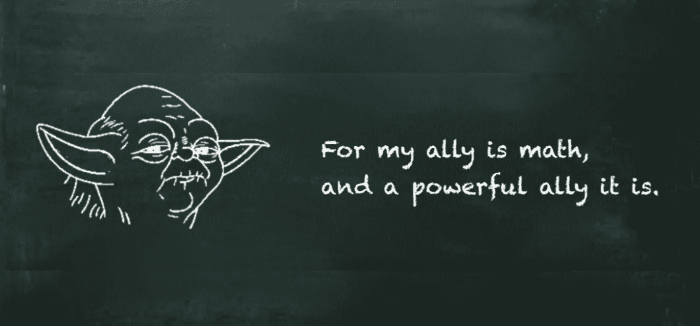

# 如何看待纠缠量子比特

> 原文：<https://towardsdatascience.com/how-to-think-of-entangled-qubits-506aa1ac268c?source=collection_archive---------23----------------------->

## 抱歉，会有点疼。

量子机器学习要不要入门？看看 [**动手量子机器学习用 Python**](https://www.pyqml.com/page?ref=medium_entangled&dest=/) **。**

在之前的帖子中，我们了解了量子计算的两种不同观点。首先，[我们将量子比特视为概率系统](https://medium.com/a-bit-of-qubit/how-to-think-of-quantum-computing-as-a-beginner-da3f20769a3)。第二，[我们应用线性代数来可视化布洛赫球](/thinking-of-quantum-systems-in-linear-algebra-5436dc9c44eb)中的量子位状态。

不幸的是，当我们在最感兴趣的时候看量子位时，这两种观点都是不充分的。那是他们纠缠在一起的时候。

我们最终得到了不亚于一场大爆炸的结果。

作者图片

那么，我们为什么不再问问欧比旺的意见呢？

作者图片

单个量子位的图形表示是没有用的，因为两个纠缠的量子位共享一个叠加态。它们不再相互独立。他们的价值观相互关联。一旦你测量了一个量子位，另一个量子位的状态就会立即改变。

但是每个球体只覆盖一个量子位。

当我们处理纠缠量子比特时，我们需要看整个量子系统。单个量子位是 0 和 1 的组合。所以当你测量它的时候，你可以在这两种状态中找到它。

如果你有一个由两个量子位组成的量子系统，你可以发现它处于四种状态之一:00、01、10 或 11。如果你有三个量子比特，有八个状态，如果你有𝑛量子比特，有 2^𝑛状态。

是时候看看你在前两篇文章中可能忽略的一件事了。这是数学。

作者图片

向量是量子位状态的数学表示。对于量子位，这些是

量子叠加是这两种基态的组合。

𝛼和𝛽的值是我们已经知道的概率幅度。它们的平方表示测量量子位为 0 (𝛼)或 1 (𝛽)的概率。𝛼越大，量子位被测量为 0 的概率就越大。𝛽越大，量子位被测量为 1 的概率就越大。

由于概率的总和必须是 1，我们可以说它们的总和必须是`1`。

现在，假设我们有两个量子位。让我们称他们为|𝑎⟩和|𝑏⟩.两个量子位中的每一个都有自己的概率振幅:

当我们同时观察这两个量子位时，有四种不同的基态组合。这些组合中的每一种都有其概率幅度。这些是两个相应状态的概率振幅的乘积。

这四种状态各自形成一个量子系统。因此，我们可以用一个方程来表示它们。虽然我们可以自由地为这个态选择一个任意的名字，但是我们使用|𝑎𝑏⟩，因为这个态是|𝑎⟩和|𝑏⟩.的集体量子态

量子位状态的这种表示类似于单量子位状态|𝜓⟩.的表示唯一的区别是双量子位系统有更多的维度。它有四个基本状态向量，而不是两个。

所有管理单一量子位元的规则，都适用于由两个量子位元组成的系统。它的工作原理相似。因此，所有概率的总和(记住状态的概率是振幅的平方)必须是 1:

不出所料，用两个量子位的系统工作与用一个量子位的系统工作是相似的。唯一的区别是，向量的维数更大。

一个向量代表一个量子位状态，一个矩阵代表一个量子位变换。

在我们的例子中，我们从为每个向量添加 CNOT 矩阵和另一个矩阵开始，比如𝐻|𝑎⟩⊗𝑋|𝑏⟩.此外，张量积是结合的。这意味着我们可以将术语重组如下:

手工处理这种大小的矩阵很麻烦。幸运的是，我们有计算机来计算矩阵和张量积。

那么，让我们来计算由𝐶𝑁𝑂𝑇(𝐻⊗𝑋).表示的矩阵

我们可以看到一个两量子位变换门的矩阵有 4 乘 4 维。它对应于两个量子位的状态向量所具有的四维空间。

除了更多的维度，这里没有什么特别的。我们可以将这个矩阵预先放置在两个量子位的系统中。

当我们将这个矩阵乘以初始状态向量时

然后，我们有效地选择矩阵的第一列，并将其作为新的状态向量。

数学揭示了四种状态的振幅。让我们更仔细地看看结果。

我们通过方程引入了两个量子比特的状态

从这个等式中，我们可以推导出外部值的乘积等于内部值的乘积。

每一边都是每个量子位元振幅值的产物:𝑎0a0、𝑎1a1、𝑏0b0 和𝑏1

但是当我们检查 CNOT 门的结果时，我们得到如下结果:

显然，这是一个矛盾。这个矛盾证明了我们不能再用两个独立的量子比特来描述这个量子态了。它已经成为一种共享状态。

# 结论

数学并不是量子计算的唯一视角。然而，这是最精确的一个。而且，当布洛赫球不确定时，数学提供了一个清晰的解释。

不幸的是，数学是量子计算最不直观的视角。然而，即使数学有时看起来像象形文字，但它不是。

作者图片

数学是许多教科书、博客文章中教授的一门语言，是的，学校也教授数学。

尽管如此，我仍然相信我们不应该仅仅用数学来解释量子计算。我们应该利用我们所有的不同视角。我们应该尽可能让读者容易理解。但是，我们不应该对读者隐藏所有的数学知识。

量子机器学习要不要入门？看看 [**动手量子机器学习用 Python**](https://www.pyqml.com/page?ref=medium_entangled&dest=/) **。**

在这里免费获得前三章。