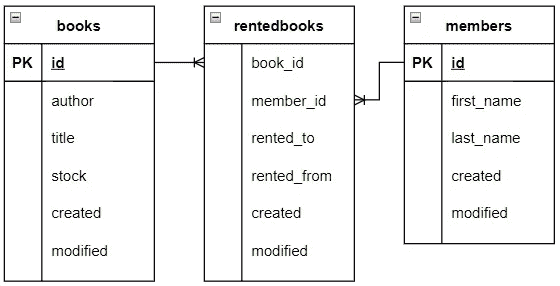
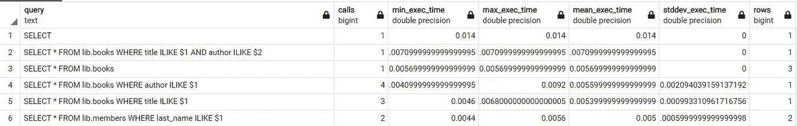

# 如何跟踪 Postgres 数据库中所有查询的统计数据，以防止缓慢的查询或瓶颈

> 原文：<https://towardsdatascience.com/how-to-track-statistics-on-all-queries-in-your-postgres-database-to-prevent-slow-queries-or-730d3f94076c?source=collection_archive---------8----------------------->

## 用这个扩展提供的重要统计数据来优化数据库性能


这种延伸就像一件救生背心；你永远不会希望你需要它，但它在困难的情况下会非常有用(图片由 [Unsplash](https://unsplash.com/photos/owm3TQrv6N4) 上的[卡斯滕·温内格特](https://unsplash.com/@karsten116)提供)

你有没有想过为什么你的应用程序的某些部分突然变得非常慢？可以是你的数据库吗？你会怎么发现？如果有一个扩展来跟踪它执行的所有查询的统计数据，以便您可以分析数据库性能并清除瓶颈，这不是很好吗？

在本文中，我们将看到一个名为 pg_stat_statements 的 Postgres 扩展。它对数据库执行的所有查询进行统计，从而提供关于数据库性能的重要信息。有了它，您可以轻松地跟踪数据库的性能，检测缓慢的查询，消除瓶颈并防止问题发生。

我们将首先进行非常简单的安装。然后我们演示如何使用它。我们来编码吧！

# 这个扩展是做什么的？

Pg_stat_statements 是 Postgres 的扩展，它跟踪服务器执行的所有查询的执行统计信息。这个扩展跟踪静态数据，比如

*   该语句被调用的次数
*   语句的最快和最慢执行
*   语句执行时间的平均值和标准差
*   已检索或受影响的总行数
*   关于块的信息(命中、读取、写入、变脏等。)

这对于分析查询的质量非常有用。使用统计数据，很容易调试数据库中的问题，跟踪缓慢的查询和表，并防止与数据库相关的问题。


这一扩展将帮助我们保持数据在数据库中顺畅流动(图片由[丹尼斯·内沃扎伊](https://unsplash.com/@dnevozhai)在 [Unsplash](https://unsplash.com/photos/7nrsVjvALnA) 上拍摄)

# 装置

安装 pg_stat_statements 非常简单，只需要三个步骤。在这一部分中，我们将介绍每个步骤，然后向您展示如何在本地安装的 Postgres 实例和 Postgres 的 Dockerized 版本中执行这些步骤。如果你对 Docker 不熟悉，可以看看这篇文章，这篇文章由 Docker【**和【[**撰写。**](https://mikehuls.medium.com/docker-compose-for-absolute-beginners-how-does-it-work-and-how-to-use-it-examples-733ca24c5e6c)**

**步骤如下:**

1.  **给`postgresql.conf`添加几行**
2.  **在数据库中创建扩展**
3.  **重启 Postgres**

## **1.修改 postgresql.conf**

**这个文件存储了 Postgres 的一些配置。我们需要修改它，以便告诉 Postgres 在我们的语句中存储一些统计数据是可以的。**

****本地安装** 首先我们来处理`postgresql.conf`文件。找到文件(通常位于 Postgres 安装位置的`data`文件夹中(windows 示例:`C:\Program Files\PostgreSQL\14\data`)并打开它。找到写着`# — Shared Library Preloading`的行，并添加以下三行:**

```
shared_preload_libraries = 'pg_stat_statements'
pg_stat_statements.max = 10000
pg_stat_statements.track = all
```

**我们将在`docker-compose.yml`文件中定义一些额外的命令，以便将额外的行添加到`postgres.conf`:**

**在第 13 行中，我们将 pg _ stat _ 语句包含到 shared_preload_libraries 中。搞定了。**

## **步骤 2:创建扩展**

**这是一个非常简单的步骤。我们将在 PgAdmin(或另一个数据库 GUI 工具)中执行下面的语句**

```
CREATE EXTENSION pg_stat_statements;
```

## **第三步:重启 Postgres**

**也没那么难；在 windows 中，按下`control-r`并运行`services.msc`。找到 Postgres，右键，重启。使用 Docker 时，只需重启容器。**

****

**安装完成！让我们为一些问题计时(图片由 [Veri Ivanova](https://unsplash.com/@veri_ivanova) 在 [Unsplash](https://unsplash.com/photos/p3Pj7jOYvnM) 上提供)**

# **演示**

**现在所有无聊的事情都已经过去了，让我们看看这个扩展能给我们带来的巨大优势吧！我们将假装是一个图书馆，创建一个出租书籍的数据库。**

## **设置-创建表**

**我们将创建三个表:**

****

**我们简单的数据库结构(图片由作者提供)**

**在执行了创建这些表的语句之后，当我们调用`SELECT [some columns] FROM pg_stat_statements`时，我们已经看到了一些统计数据:**

****

**我们的首次统计(图片由作者提供)**

**如您所见，这些统计数据主要涉及创建我们的表的语句。**

## **重置我们的统计数据**

**下一步是插入一些数据，以便我们可以运行一些查询并检查结果。因为我们对以前操作的统计数据不感兴趣，所以我们调用`SELECT pg_stat_statements_reset();`来清除所有当前的统计数据。**

## **插入一些数据并运行一些查询**

**下一步；插入一些数据！**

**并运行一些查询:**

**如您所见，我们执行了一些不同的查询。**

## **分析我们的查询**

**现在我们可以调用`SELECT * FROM pg_stat_statements`并分析执行统计数据。我选择了一些列，并根据平均执行时间对行进行了排序。这是返回的内容:**

****

**来自我们新扩展的一批新的执行统计数据(图片由作者提供)**

**这些结果不言自明，但让我们快速浏览一遍。第一条记录包含了我们执行两个连接的最后一个最大的查询，难怪它是最慢的！
请注意，我们在`lib.books`中选择了三个不同的标题。这由记录 5 表示；显示我们对过滤标题的`books`表进行了三次调用。**

****

**使用统计数据，我们可以调整我们的数据库，以优化性能！(图片由[妮娜·梅尔卡多](https://unsplash.com/@nina_mercado)在 [Unsplash](https://unsplash.com/photos/Y_t0n-T4H5M) 上拍摄)**

# **结论**

**通过这篇短文，我们完成了一个非常有用的扩展。我希望已经展示了简单的安装以及它可以为您提供的监视和改进数据库的价值。如果你有建议/澄清，请评论，以便我可以改进这篇文章。同时，看看我的其他关于各种编程相关主题的文章:**

*   **[删除到另一个表中](https://mikehuls.medium.com/sql-delete-into-another-table-b5b946a42299)**
*   **[更新到另一个标签页](https://mikehuls.medium.com/sql-update-into-another-table-bfc3dff79a66) le**
*   **[在一条语句中插入、删除和更新](https://mikehuls.medium.com/sql-insert-delete-and-update-in-one-statement-sync-your-tables-with-merge-14814215d32c)**
*   **[更新选择一批记录](https://mikehuls.medium.com/sql-update-select-in-one-query-b067a7e60136)**
*   **[插入到唯一的表中](https://mikehuls.medium.com/sql-inserting-only-unique-values-in-a-unique-table-af2eb3b9890a)**
*   **[了解索引如何加快查询速度](https://mikehuls.medium.com/sql-understand-how-indices-work-under-the-hood-to-speed-up-your-queries-a7f07eef4080)**

**编码快乐！**

**—迈克**

**页（page 的缩写）学生:比如我正在做的事情？[跟我来！](https://mikehuls.medium.com/membership)**