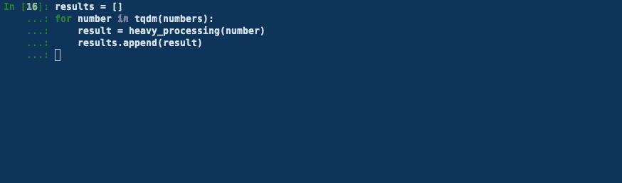
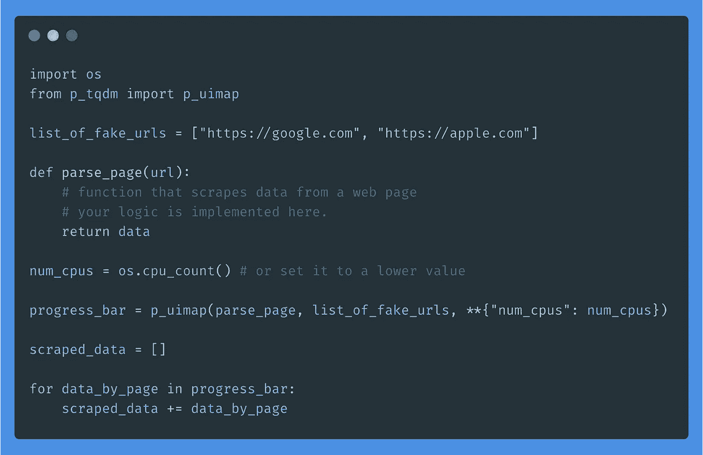

# 如何用 TQDM 跟踪 Python 中并行任务的进度

> 原文：<https://towardsdatascience.com/how-to-track-the-progress-of-parallel-tasks-in-python-with-tqdm-6d93339f03fe?source=collection_archive---------4----------------------->

## 将 TQDM 与多处理相结合

马克-奥利维耶·乔多因在 [Unsplash](https://unsplash.com?utm_source=medium&utm_medium=referral) 拍摄的照片

Python 是一种很棒的编程语言。这是一把用于多个领域的瑞士刀:分析和可视化数据，训练机器学习模型，构建 API，抓取网站，DevOps，MLOps，显然还有更多事情。

这种语言的多功能性，除了其他的[东西](https://hackernoon.com/why-is-python-so-slow-e5074b6fe55b)之外，也是有代价的:**与其他编程语言相比，Python 是缓慢的**。

> 那么，我应该换一种语言吗？

不急。有很多方法可以提高 Python 的速度。

在本帖中，**我们将把多重处理视为其中一种方式。**我们将看到如何在用例中利用它，以及如何使用**稍加修改的 TQDM 版本来跟踪并行任务的进度。**

你知道， [TQDM](https://github.com/tqdm/tqdm) ，这个很棒的进度条，你可能以前用过，用来跟踪你的 for 循环的进度。

今天，我们将看到它是如何被用来跟踪并行任务的。

好的，我们来看看。🔍

# 什么是多重处理？

多重处理允许您创建可以并发运行的程序，并利用工作站的多个内核。

当进程启动时，每个进程都有自己的内存。这使得在使用多重处理时很难共享多个对象。

作者图片

当您有 CPU 密集型操作，如数据处理(标记化、图像增强、过滤等)时，多处理非常有用。).

作为一名数据科学家，您可以使用多处理来加速您的工作负载。

# p_tqdm:并行任务的进度条

正如你可能猜到的，“p”代表平行。

> `**p_tqdm**`是对 [pathos.multiprocessing](https://github.com/uqfoundation/pathos/blob/master/pathos/multiprocessing.py) 和 [tqdm](https://github.com/tqdm/tqdm) 的包装。
> 
> 与 Python 的默认多处理库不同，pathos 提供了一个更加灵活的并行映射，可以应用几乎任何类型的函数——包括 lambda 函数、嵌套函数和类方法——并且可以轻松处理带有多个参数的函数。tqdm 应用于 pathos 的平行图之上，并显示一个进度条，包括预计完成时间。— [Github](https://github.com/swansonk14/p_tqdm) 。

这里没有什么要补充的，让我们看看这个包装器的运行情况。

假设您有一大串数字要处理。

为了简单起见，我们假设这种“繁重的处理”将包括等待 5 毫秒并向一个数字添加一个常数(当然，您可以在这里想象任何更复杂的方式)。

让我们依次运行这个函数，

根据 TQDM，这些任务需要 **8 分 42 秒(~ 10000x0.05s 秒)**

作者 GIF

现在，如果我们尝试同时运行这些任务，

我们看到完成它们所需的时间是**大约 42 秒，大约等于 500 / 12，12 是我的笔记本电脑的内核数。**

GIF 格式

👉如果您想将内核数量设置为较低的值，您可以添加`num_cpus` kwarg。这就像打字一样简单:

👉除了使用 p_map，您还可以使用:

*   `p_imap`:做同样的事情，但不是返回一个列表，而是返回一个迭代器
*   `p_umap``:返回一个无序列表(处理速度不是特别快)
*   `p_uimap`:返回无序元素的迭代器

# 资源

*   [https://github.com/swansonk14/p_tqdm](https://github.com/swansonk14/p_tqdm)
*   [https://github.com/tqdm/tqdm](https://github.com/tqdm/tqdm)
*   [https://medium . com/@ rvi swa 00/multi-processing-in-python-to-speed-your-data-science-8a 810267 b07](https://medium.com/@rviswa00/multi-processing-in-python-to-speed-up-your-data-science-8a810267b07)
*   [https://timber . io/blog/multi processing-vs-multi threading-in-python-what-you-need-to-know/](https://timber.io/blog/multiprocessing-vs-multithreading-in-python-what-you-need-to-know/)
*   [https://hackernoon.com/why-is-python-so-slow-e5074b6fe55b](https://hackernoon.com/why-is-python-so-slow-e5074b6fe55b)

# 感谢阅读🙏

谢谢你坚持到最后。我希望您发现在您的项目中使用`p_tqdm`来并行化工作负载并轻松直观地跟踪它们的进度是有用的。

我们演示的例子非常简单，但是您可以想象在许多场景中`p_tqdm`会派上用场。作为一名数据科学家，每当我抓取数据或处理数据时，我的脚本通常会花时间运行。能够在并行化这些操作的同时跟踪它们是非常有趣的。

下面是我如何使用`p_tqdm`来加速刮擦:

作者提供的图片——用于抓取的样板代码

如果你想玩这个库，不要犹豫在 [Github](https://github.com/swansonk14/p_tqdm) 上查看它的代码。

我就这些了。下次见！👋

# 新到中？你可以订阅每月 5 美元，并解锁无限的文章——[点击这里。](https://ahmedbesbes.medium.com/membership)

照片由[卡斯滕·怀恩吉尔特](https://unsplash.com/@karsten116?utm_source=medium&utm_medium=referral)在 [Unsplash](https://unsplash.com?utm_source=medium&utm_medium=referral) 上拍摄