# 如何使用专家知识训练贝叶斯网络？

> 原文：<https://towardsdatascience.com/how-to-train-a-bayesian-network-bn-using-expert-knowledge-583135d872d7?source=collection_archive---------17----------------------->

马修·费尼在 [Unsplash](https://unsplash.com/s/photos/knowledge?utm_source=unsplash&utm_medium=referral&utm_content=creditCopyText) 上的照片

## [实践教程](https://towardsdatascience.com/tagged/hands-on-tutorials)

## 基于专家知识的机器学习

贝叶斯网络是一个强大的 IA 工具，可以用于一些需要混合数据和专家知识的问题。与机器学习(仅基于数据)不同，BN 带来了向人类询问因果定律(单向)的可能性，因果定律存在于我们想要解决的问题的上下文中。

bn 是表示变量之间概率关系的直接非循环图，其中节点表示变量，弧线表示依赖关系。

创建 BN 有三个主要步骤:

1.首先，确定要解决的问题中的主要变量。每个变量对应于网络的一个节点。为每个变量选择数字状态很重要，例如，通常有两种状态(真或假)。

2.其次，定义网络结构，即所有变量(节点)之间的因果关系。

3.第三，定义控制变量之间关系的概率规则。

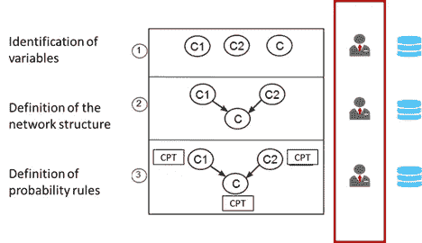

(作者创作)

每个步骤都可以使用数据、专家知识或两者的结合来完成。在这个例子中，我将展示如何只用专业知识创建一个 BN。

贝叶斯网络的一个基本(教科书类型)例子如下:我们有四个变量，它们都有两种状态(真/假)。我们想知道在天空多云的情况下，草被弄湿的概率；因此，可能会下雨。此外，如果天空不是多云(是晴天)，一个洒水器将被激活(使用太阳能)，它将灌溉草地。

前两步如下图所示:

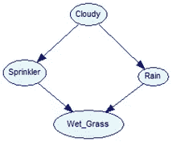

贝叶斯网络(作者使用 Genie 软件创建)

如果是阴天，可能会下雨= >阴天节点和雨天节点之间的正因果关系。

如果不是多云天气(是晴天)，那么洒水喷头将被激活= >多云节点和洒水喷头节点之间的负因果关系。

最后，草地可能是湿的，原因有两个:正在下雨，或者洒水器被激活= >所以洒水器和雨节点与 wet_grass 节点有正因果关系。

因果关系通过条件概率表(CPT)来表达。

第三步在于创建那些 CPT。在这种情况下基于先前的专家知识。

**多云节点:**

多云节点 CPT

这是“输入节点”，我们从另一个来源假设多云(多云=真)的概率是 50%。所以，是晴天(多云=假)的概率也是 50%。在贝叶斯逻辑中，这是先验知识(来自于“是否”方面的专家)。

**雨节点:**

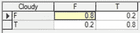

雨节 CPT

雨节点 CPT 应该代表多云节点和雨节点之间的正因果关系。因此，专家(或注册经验)说，鉴于天空多云，下雨的概率为 80%。也就是说，当天空多云(多云=真)时，下雨(下雨=真)的概率为 80%。同理，当天空不多云(多云=假)时，有 80%的概率不会下雨(下雨=假)。

其他情况是上述概率的补充。当天气多云时，不下雨的可能性是 20%。不多云的时候，下雨的概率是 20%。

需要注意的是，所有这些概率都来自于“专家”，或者如我之前所说的“人类知识”。

**洒水节点:**

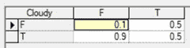

喷头节点 CPT

洒水喷头 CPT 节点应代表多云节点和洒水喷头节点之间的负因果关系

CPT 配置来自 Spinkler 功能逻辑:当天气晴朗时(多云=假),洒水器将以 90%的概率被激活(洒水器=真)。因此，补充说明，当天气晴朗时，喷头有 10%的概率不会启动。

当天空多云(多云=真)时，Spinkler 没有基线配置。因此，概率为 50%(真)，50%(假)。

同样，这些数字来自“专家”或人类知识，在这种情况下，来自喷灌机的基线配置。

**湿 _ 草节点:**

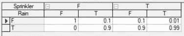

湿 _ 草节点 CPT

最后，Wet_Grass CPT 要表示洒水节点和 Wet_Grass 节点之间的正因果关系，以及雨水节点和 wet_grass 节点之间的正因果关系。

这个 CPT 比较复杂。专家可以完成它，或者贝叶斯定理可以帮助我们计算每个值。我已经在前一篇文章中解释了如何使用这个定理来计算这些值。所以我就不在这里做了，我让下面的链接:

 [## 贝叶斯思维导论:从贝叶斯定理到贝叶斯网络

### 假设世界上存在一种非常罕见的疾病。你患这种疾病的几率只有千分之一。你想要…

towardsdatascience.com](/will-you-become-a-zombie-if-a-99-accuracy-test-result-positive-3da371f5134) 

我们可以使用与其他节点相同的逻辑来检查这个 CPT 告诉我们的内容:

如果是阴天，下雨的可能性很大(80%)；[【mag R1】](#_msocom_1)另外，我们还可以加上 10%的概率，即使是阴天，洒水器也会被激活。求和是通过贝叶斯逻辑完成的，(即“*加上*“条件概率”)。结果是草地有 99%的可能性是湿的:

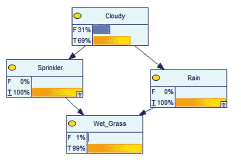

作者使用 Genie 软件创作

另一种情况是，当洒水装置关闭并且没有下雨时，我们不会期望看到草是湿的:

作者使用 Genie 软件创作

另外两种可能是洒水器开着的时候，不是下雨的时候。或者，当洒水装置关闭并且下雨时。在这两种情况下，在湿草 CPT 之后，我们发现看到湿草的概率是 90%:

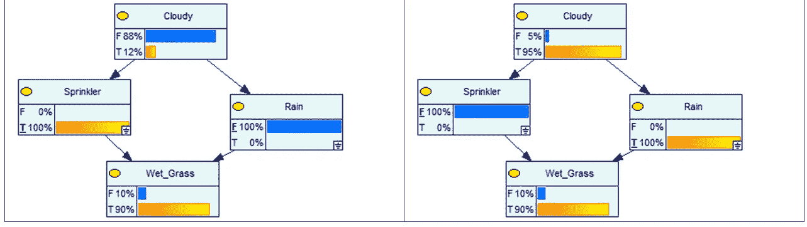

作者使用 Genie 软件创作

我们看到贝叶斯网络如何尊重 CPT 的逻辑，这是可预测的，因为 CPT 是以这种方式“*人工构建的*”。

然而，这个小例子可以向我们展示贝叶斯网络的范围，也就是说，基于我们用来创建 CPT 的信息，我们可以实验更多在构建它时没有包括的案例(我认为这就是人工智能的意义)。

**测试一个 BN 的学习**

每个节点的基线概率分布在下一个网络中表示:

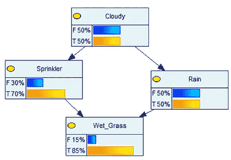

作者使用 Genie 软件创作

这个网络将条件概率显示在一起。在我们不知道天气是否多云的一天(真= 50%的概率)，我们可以预期有 85%的概率会有湿草。这是可以解释的，因为我们有 70%的机会打开洒水器，有 50%的机会下雨。

然而，我们可以开始玩网络，看看它告诉我们什么:

如果是阴天(100%真实)，喷头有 50%的概率开着，下雨有 80%的概率。因此，草地将有 85%的概率是湿的

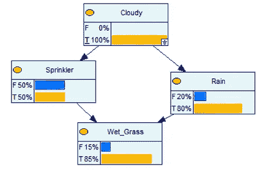

作者使用 Genie 软件创作

反之，如果不是阴天，90%的概率会开着洒水车，20%的概率会下雨。因此，草地潮湿的概率为 84%。

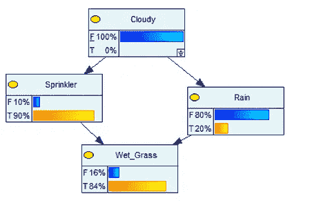

作者使用 Genie 软件创作

**新增病例:**

这是我们可以开发 BN 潜力的时候(当它被正确建造的时候)。我们可以探索更接近真实世界的不同案例(巨大的组合):

例如，如果多云的概率是 20%、40%、60%或 80%，会发生什么？

这些网络显示了在这些情况下发生了什么:

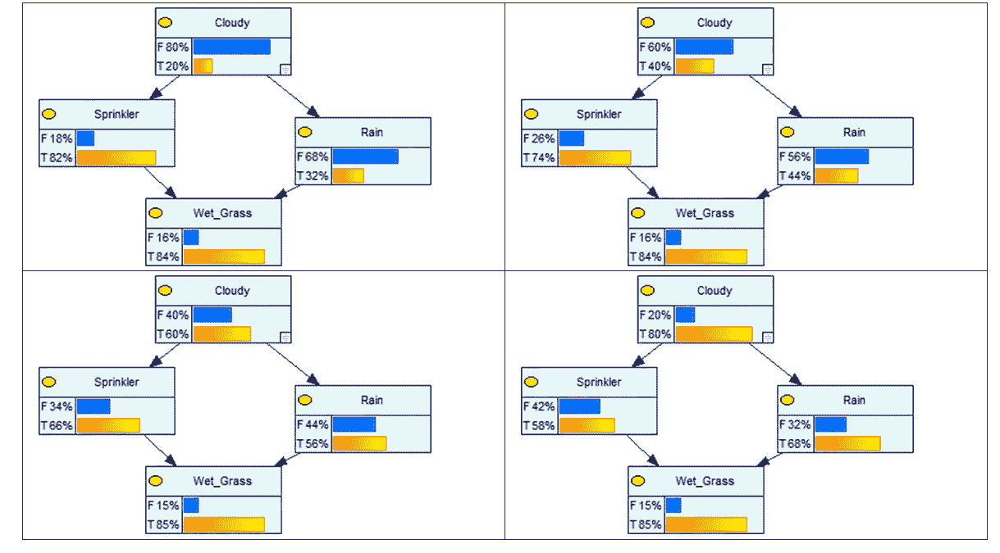

作者使用 Genie 软件创作

我们看到**在所有情况下，当天空因下雨而多云时，以及当天空因洒水器而不多云时，草将是湿的**。所以，如果我们这种配置的目标是让草地尽可能的湿润，那么洒水器就是最好的选择！国阵从数量上解释了原因。

我用了四个例子，但是如果我们测试所有的值(多云=真从 0%到 100%)，Wet_grass =真的状态，会一直在 84%到 85%之间。

逆向传播:从 BN 中获得更多价值。

我们还可以为目标节点(Wet_grass)设置“证据”,以便测试网络中的不同场景。这使我们能够作出决定。

例如，假设我们不知道天气是否多云，(50%对，50%错)，如果我们希望草地是湿的，我们需要洒水器以 78%的概率打开，雨将以 56%的概率到来:

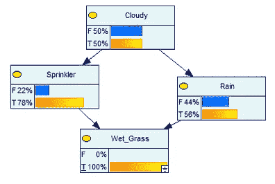

作者使用 Genie 软件创作

再举一个例子:我希望我的草永远是湿的。

案例 1:天气频道宣布有超过 95%的可能性是阴天。有必要用我的洒水器吗？答案是否定的。

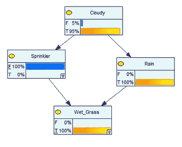

作者使用 Genie 软件创作

案例 2:天气频道宣布阴天的概率小于 12%。为了 100%确定我的草地会是湿的，我必须使用我的洒水器。

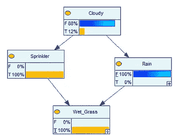

作者使用 Genie 软件创作

**影响分析**

最后可以做一个网络的影响力分析。它向我们展示了哪些是最有影响力的节点，以及最有影响力的链接:

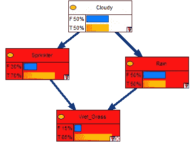

作者使用 Genie 软件创作

这个例子尽可能简单，但它告诉我们，我们需要洒水器或雨水来湿润草地(红色)。它还向我们表明，雨和多云天空之间的关系比多云天空和洒水器之间的关系更强一点(这可以从连接箭头的粗细看出)。

**结论**

这篇文章用一个非常简单的例子详尽地展示了如何使用专家知识来构建和训练一个 BN。

我展示了 BN 建模现实生活问题的范围和能力，包括概率知识和概率组合。

然而，现实生活中的问题有更高(真的更高)的复杂程度。

为此，有必要使用数据和人类知识。我将在下一篇文章中解释这一点。

> 如果你想继续阅读这样的故事，你可以[在这里订阅！](https://fesan818181.medium.com/membership)