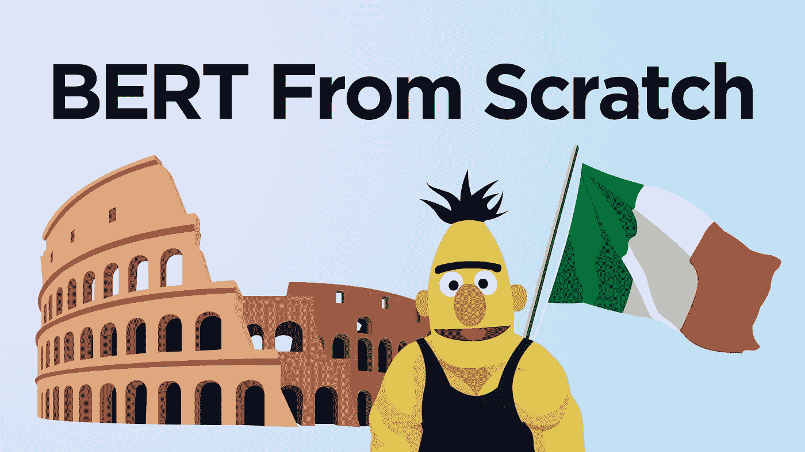
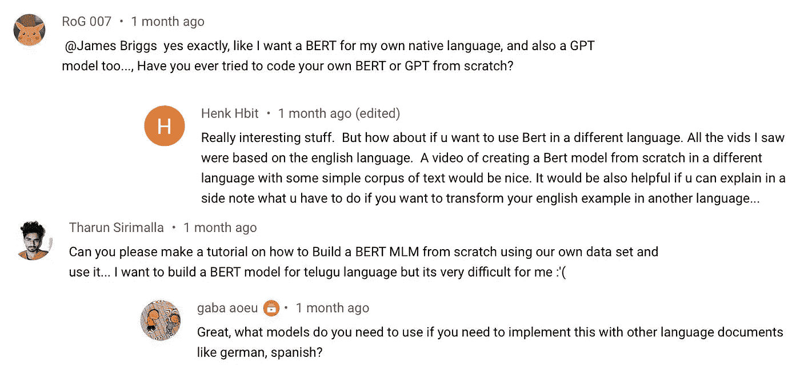
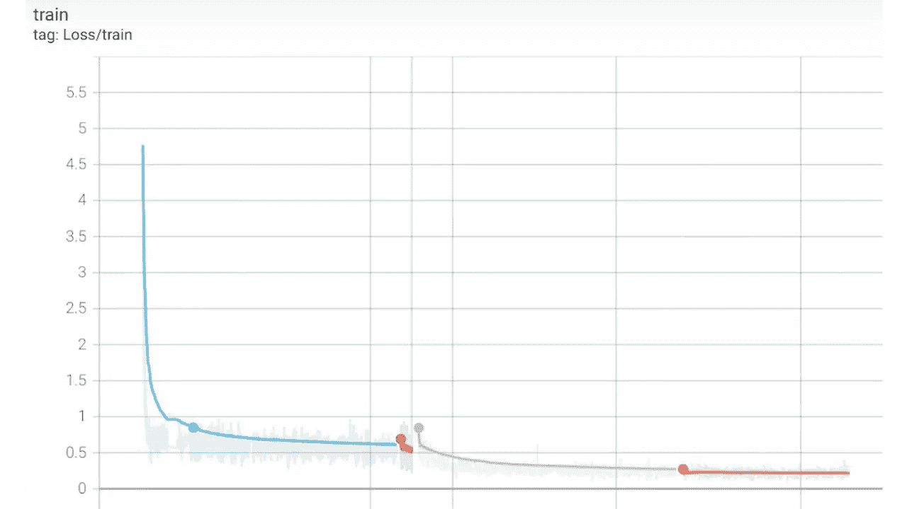

# 如何从头开始训练 BERT 模型

> 原文：<https://towardsdatascience.com/how-to-train-a-bert-model-from-scratch-72cfce554fc6?source=collection_archive---------0----------------------->

## 见见伯特的意大利表弟，菲利波托



伯特，但在意大利——作者图片

我的所有文章都聚焦于 BERT——这个模型主宰了自然语言处理(NLP)的世界，标志着语言模型的新时代。

对于那些以前没有使用过变形金刚模型的人来说，这个过程看起来有点像这样:

*   `pip install transformers`
*   初始化预训练的变压器模型— `from_pretrained`。
*   用一些数据测试一下。
*   *也许*对模型进行微调(再多训练一些)。

现在，这是一个伟大的方法，但如果我们只是这样做，我们缺乏对创建我们自己的变形金刚模型背后的理解。

此外，如果我们无法创建自己的变压器模型，我们必须依赖适合我们问题的预训练模型，但情况并非总是如此:



一些关于非英语 BERT 模型的评论

因此，在本文中，我们将探索构建我们自己的 transformer 模型所必须采取的步骤——特别是 BERT 的进一步开发版本，称为 RoBERTa。

# 概述

这个过程有几个步骤，所以在我们开始之前，让我们先总结一下我们需要做什么。总的来说，有四个关键部分:

*   获取数据
*   构建标记器
*   创建输入管道
*   训练模型

一旦我们完成了每一个部分，我们将使用我们构建的记号赋予器和模型——并保存它们，这样我们就可以像使用`from_pretrained`一样使用它们。

# 获取数据

和任何机器学习项目一样，我们需要数据。在用于训练 transformer 模型的数据方面，我们确实有太多的选择了——我们可以使用几乎任何文本数据。

使用 HuggingFace 的数据集库下载 OSCAR 数据集的视频演练

而且，如果说我们在互联网上有很多东西的话，那就是非结构化文本数据。

从互联网上搜集的文本领域中最大的数据集之一是 OSCAR 数据集。

OSCAR 数据集拥有大量不同的语言，其中一个最明显的从头训练用例是，我们可以将 BERT 应用于一些不太常用的语言，如泰卢固语或纳瓦霍语。

不幸的是，我唯一能说的语言是英语，但我的女朋友是意大利人，所以她——劳拉，将评估我们说意大利语的伯特模型的结果——菲利贝托。

因此，为了下载奥斯卡数据集的意大利部分，我们将使用 HuggingFace 的`datasets`库——我们可以用`pip install datasets`安装它。然后我们下载 OSCAR_IT:

我们来看看`dataset`这个物体。

很好，现在让我们以一种在构建我们的标记器时可以使用的格式存储我们的数据。我们需要从我们的数据集中创建一组仅包含`text`特性的明文文件，并且我们将使用换行符`\n`分割每个*样本*。

在我们的`data/text/oscar_it`目录中，我们会找到:


包含我们的明文 OSCAR 文件的目录

# 构建标记器

下一个是记号赋予者！当使用转换器时，我们通常加载一个记号赋予器，以及它各自的转换器模型——记号赋予器是这个过程中的一个关键组件。

构建自定义令牌化器的视频演练

在构建我们的标记器时，我们将向它提供我们所有的 OSCAR 数据，指定我们的词汇大小(标记器中的标记数量)，以及任何特殊的标记。

现在，罗伯塔特殊令牌看起来像这样:

因此，我们确保将它们包含在我们的标记器的`train`方法调用的`special_tokens`参数中。

我们的标记器现在已经准备好了，我们可以将它保存为文件供以后使用:

现在我们有两个文件定义了新的 *FiliBERTo* 记号赋予器:

*   *merges.txt* —执行文本到标记的初始映射
*   vocab.json —将令牌映射到令牌 id

有了这些，我们可以继续初始化我们的记号赋予器，这样我们就可以像使用任何其他`from_pretrained`记号赋予器一样使用它。

## 初始化标记器

我们首先使用之前构建的两个文件初始化记号赋予器——使用一个简单的`from_pretrained`:

现在我们的记号赋予器已经准备好了，我们可以试着用它来编码一些文本。当编码时，我们使用通常使用的两种方法，`encode`和`encode_batch`。

从编码对象`tokens`中，我们将提取`input_ids`和`attention_mask`张量用于 FiliBERTo。

# 创建输入管道

我们培训流程的输入管道是整个流程中更复杂的部分。它包括我们获取原始的 OSCAR 训练数据，对其进行转换，并将其加载到准备好进行训练的`DataLoader`中。

MLM 输入管道的视频演练

## 准备数据

我们将从一个样本开始，逐步完成准备逻辑。

首先，我们需要打开我们的文件——与我们保存为*的文件相同。txt* 文件在先。我们基于换行符`\n`分割每个样本，因为这表示单个样本。

然后，我们使用`tokenizer`对我们的数据进行编码——确保包括关键参数，如`max_length`、`padding`和`truncation`。

现在我们可以继续创建我们的张量——我们将通过掩蔽语言建模(MLM)来训练我们的模型。所以，我们需要三个张量:

*   ***input_ids*** —我们的 *token_ids* 有大约 15%的令牌使用屏蔽令牌`<mask>`屏蔽。
*   ***attention _ mask***—**1**s 和 **0** s 的张量，标记“真实”记号/填充记号的位置——用于注意力计算。
*   ***标签*** —我们的 *token_ids* 带有**号**屏蔽。

如果你不熟悉 MLM，我在这里已经解释过了。

我们的`attention_mask`和`labels`张量就是从我们的`batch`中简单提取出来的。然而`input_ids`张量需要更多的关注，对于这个张量，我们屏蔽了大约 15%的记号——给它们分配记号 ID `3`。

在最终输出中，我们可以看到一个编码的`input_ids`张量的一部分。第一个令牌 ID 是`1`—`[CLS]`令牌。围绕张量我们有几个`3`记号 id——这些是我们新添加的`[MASK]`记号。

## 构建数据加载器

接下来，我们定义我们的`Dataset`类——我们用它来初始化我们的三个编码张量作为 PyTorch `torch.utils.data.Dataset`对象。

最后，我们的`dataset`被加载到 PyTorch `DataLoader`对象中——在训练期间，我们用它将数据加载到我们的模型中。

# 训练模型

我们训练需要两样东西，我们的`DataLoader`和一个模型。我们有——但没有模型。

## 初始化模型

为了训练，我们需要一个未经训练的`BERTLMHeadModel`。为此，我们首先需要创建一个 RoBERTa 配置对象来描述我们希望用来初始化 FiliBERTo 的参数。

然后，我们用语言建模(LM)头导入并初始化我们的 RoBERTa 模型。

## 培训准备

在进入我们的训练循环之前，我们需要设置一些东西。首先，我们设置 GPU/CPU 使用率。然后我们激活模型的训练模式——最后，初始化我们的优化器。

## 培养

终于——训练时间到了！我们就像平时通过 PyTorch 训练一样训练。

如果我们去 Tensorboard，我们会发现随着时间的推移我们的损失——它看起来很有希望。



损失/时间—在此图表中，多个培训课程串联在一起

# 真正的考验

现在是真正考验的时候了。我们建立了一个 MLM 管道，并请劳拉评估结果。可以在这里看 22:44 的视频回顾:

我们首先使用`'fill-mask'`参数初始化一个`pipeline`对象。然后像这样开始测试我们的模型:

*“ciao****来了*** *va？”*正确答案！这是我的意大利语达到的最高水平——所以，让我们把它交给劳拉。

我们从*开始，“早上好，来弗吉尼亚吗？”* —或者*“日安，你好吗？”*:

第一个回答，“buongiorno，chi va？”意思是“日安，谁在那里？”—如无意义。但是，我们的第二个答案是正确的！

接下来，是一个稍微难一点的短语，*“你好，我的鸽子？”* —或者*“嗨，今天下午我们在哪里见面？”*:

我们返回一些更积极的结果:

```
✅ "hi, where do we see each other this afternoon?"
✅ "hi, where do we meet this afternoon?"
❌ "hi, where here we are this afternoon?"
✅ "hi, where are we meeting this afternoon?"
✅ "hi, where do we meet this afternoon?"
```

最后，还有一个更难的句子，“你成功了吗？”或者“如果我们选择了另一天，会发生什么？”：

我们在这里也给出了一些更好的答案:

```
✅ "what would have happened if we had chosen another day?"
✅ "what would have happened if I had chosen another day?"
✅ "what would have happened if they had chosen another day?"
✅ "what would have happened if you had chosen another day?"
❌ "what would have happened if another day was chosen?"
```

总的来说，看起来我们的模型通过了 Laura 的测试——我们现在有了一个名为 FiliBERTo 的合格的意大利语言模型！

这就是从头开始训练 BERT 模型的演练！

我们已经覆盖了很多领域，从获取和格式化我们的数据，一直到使用语言建模来训练我们的原始 BERT 模型。

我希望你喜欢这篇文章！如果你有任何问题，请通过推特或者在下面的评论中告诉我。如果你想要更多这样的内容，我也会在 YouTube 上发布。

感谢阅读！

[🤖《变形金刚》课程 NLP 的 70%折扣](https://bit.ly/nlp-transformers)

**所有图片均由作者提供，除非另有说明*