# 如何用 TensorFlow 在 10 分钟内训练一个分类模型

> 原文：<https://towardsdatascience.com/how-to-train-a-classification-model-with-tensorflow-in-10-minutes-fd2b7cfba86?source=collection_archive---------3----------------------->

## 从数据收集和准备到模型训练和评估—包括源代码


照片由[爆裂](https://unsplash.com/@burst?utm_source=unsplash&utm_medium=referral&utm_content=creditCopyText)于[未爆裂](https://unsplash.com/?utm_source=unsplash&utm_medium=referral&utm_content=creditCopyText)

深度学习无处不在。从销售预测到在图像数据上分割皮肤病，只要有高质量的数据，深度学习算法没有做不到的事情。

如果深度学习和 TensorFlow 对你来说很陌生，那你来对地方了。本文将向您展示在表格数据上构建分类模型的整个过程。您将在一次会议中完成从数据收集和准备到训练和评估神经网络模型的过程。我们开始吧。

您将需要安装 TensorFlow 2+、Numpy、Pandas、Matplotlib 和 Scikit-Learn 来跟进。

不想看书？请观看我的视频:

跳到一个部分:

```
**·** [**DATASET USED**](#efa5)
**·** [**DATA PREPARATION AND EXPLORATION**](#ccbc)
  ∘ [Basic preparation](#3c5e)
  ∘ [Converting to a binary classification problem](#6d40)
  ∘ [Train/test split](#541e)
  ∘ [Data scaling](#0d9d)
**·** [**TRAINING A CLASSIFICATION MODEL WITH TENSORFLOW**](#3a77)
  ∘ [Defining a neural network architecture](#1597)
  ∘ [Visualizing model performance](#c871)
  ∘ [Making predictions](#11c8)
  ∘ [Model evaluation on test data](#1656)
```

你可以在 [GitHub](https://github.com/better-data-science/TensorFlow) 上下载源代码。

# 使用的数据集

让我们避免不必要的麻烦，坚持简单的数据集。来自 Kaggle 的[葡萄酒质量数据集](https://www.kaggle.com/shelvigarg/wine-quality-dataset)对今天来说已经足够好了:


图片 1——来自 Kaggle 的葡萄酒质量数据集(图片由作者提供)

数据集基本上是干净的，但默认情况下不是为二元分类(好酒/劣酒)而设计的。取而代之的是，葡萄酒是按等级来评定的。我们稍后会解决这个问题。

下载并解压 CSV 文件到你的机器上，然后打开 JupyterLab。您可以自由使用任何其他 IDE，但下面所有的截图都将来自 Jupyter。

# 数据准备和探索

第一步是导入 Numpy 和 Pandas，然后导入数据集。下面的代码片段实现了这一点，并打印了一个 5 行的随机样本:

```
import numpy as np
import pandas as pd 

df = pd.read_csv('data/winequalityN.csv')
df.sample(5)
```

以下是数据集的外观:

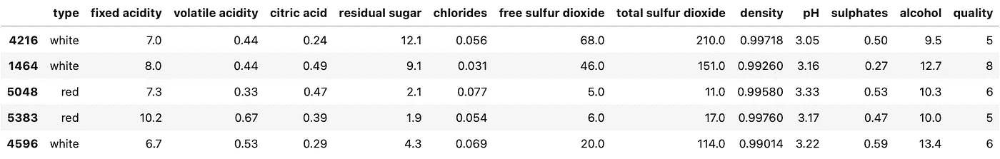

图片 2 —葡萄酒质量数据集(图片由作者提供)

它基本上是干净的，但仍有一些工作要做。

## 基本准备

数据集有一些缺失值，但数量并不多，因为总共有 6497 行:

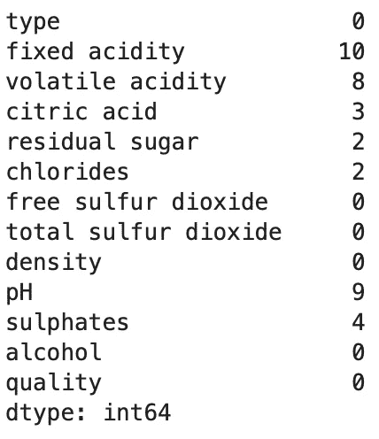

图 3-缺失值计数(作者图片)

运行以下代码来消除它们:

```
df = df.dropna()
```

唯一的非数字特征是`type`。可以是*白色* (4870 行)或*红色* (1593 行)。下面的代码片段将这个特性转换成一个名为`is_white_wine`的二进制特性，其中如果`type`是白色的*则值为 1，否则为 0:*

```
df['is_white_wine'] = [
    1 if typ == 'white' else 0 for typ in df['type']
]
df.drop('type', axis=1, inplace=True)
```

现在所有的特性都是数值型的，只剩下一件事要做——将目标变量(`quality`)二进制化。

## 转化为二进制分类问题

葡萄酒的等级从 3 到 9，假设越高越好。以下是价值计数:

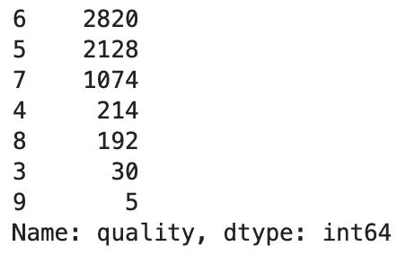

图 4 —目标变量值计数(作者图片)

为了简单起见，我们将把它转换成一个二进制变量。我们会将任何 6 级及以上的葡萄酒归类为*好* (1)，其他所有葡萄酒归类为*差* (0)。代码如下:

```
df['is_good_wine'] = [
    1 if quality >= 6 else 0 for quality in df['quality']
]
df.drop('quality', axis=1, inplace=True)

df.head()
```

这是数据集现在的样子:

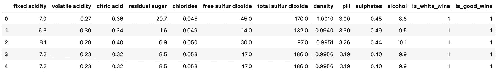

图 5-准备后的数据集(作者提供的图片)

你现在有 4091 种好酒和 2372 种劣酒。班级不平衡，但我们可以解决这个问题。接下来，让我们将数据集分成训练集和测试集。

## 训练/测试分割

我们会坚持标准的 80:20 分成。代码如下:

```
from sklearn.model_selection import train_test_split

X = df.drop('is_good_wine', axis=1)
y = df['is_good_wine']

X_train, X_test, y_train, y_test = train_test_split(
    X, y, 
    test_size=0.2, random_state=42
)
```

现在，定型集中有 5170 行，测试集中有 1293 行。训练一个稍微像样的神经网络模型应该就够了。在开始培训之前，让我们先对数据进行缩放。

## 数据缩放

像`sulphates`和`citric acid`这样的特征的值接近于零，而`total sulfur dioxide`是以百为单位。如果你让它们保持原样，你会混淆神经网络，因为它会认为更高规模的特征更重要。

这就是伸缩性发挥作用的地方。我们将使用来自 Scikit-Learn 的`StandardScaler`来拟合和转换训练数据，并将转换应用于测试数据:

```
from sklearn.preprocessing import StandardScaler

scaler = StandardScaler()
X_train_scaled = scaler.fit_transform(X_train)
X_test_scaled = scaler.transform(X_test)
```

下面是前三个缩放行的样子:

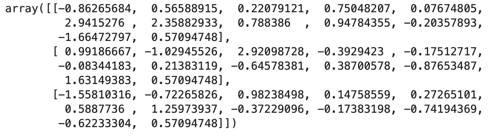

图片 6 —缩放的训练集(图片由作者提供)

现在取值范围更窄了，所以神经网络应该能做得更好。让我们训练模型，看看我们是否能得到一些像样的东西。

# 用 TensorFlow 训练分类模型

在训练二元分类模型时，您需要记住几件事情:

*   **输出层结构** —您可能想要用 sigmoid 函数激活一个神经元。这将输出一个概率，然后你可以分配给好酒(P > 0.5)或坏酒(P < = 0.5)。
*   **损失函数** —二进制交叉熵是最合适的。不要误认为是分类交叉熵。
*   **类平衡** —目标变量中的类平衡吗？换句话说，你有大致相同数量的好酒和坏酒吗？否则，*准确性*可能不是最佳评估指标。我们还将使用*精度*和*召回*。

考虑到以上三点，接下来让我们定义一个神经网络架构。

## 定义神经网络架构

我完全是随机选择这个架构的，所以可以随意调整。该模型从 12 个输入特征到 128 个神经元的第一隐藏层，接着是 256 个神经元的两个附加隐藏层。最后有一个单神经元输出层。隐藏层使用 ReLU 作为激活函数，输出层使用 Sigmoid。

代码如下:

```
import tensorflow as tf
tf.random.set_seed(42)

model = tf.keras.Sequential([
    tf.keras.layers.Dense(128, activation='relu'),
    tf.keras.layers.Dense(256, activation='relu'),
    tf.keras.layers.Dense(256, activation='relu'),
    tf.keras.layers.Dense(1, activation='sigmoid')
])

model.compile(
    loss=tf.keras.losses.binary_crossentropy,
    optimizer=tf.keras.optimizers.Adam(lr=0.03),
    metrics=[
        tf.keras.metrics.BinaryAccuracy(name='accuracy'),
        tf.keras.metrics.Precision(name='precision'),
        tf.keras.metrics.Recall(name='recall')
    ]
)

history = model.fit(X_train_scaled, y_train, epochs=100)
```

这将启动培训过程。在我的机器上，一个纪元大约需要 1 秒钟(M1·MBP):

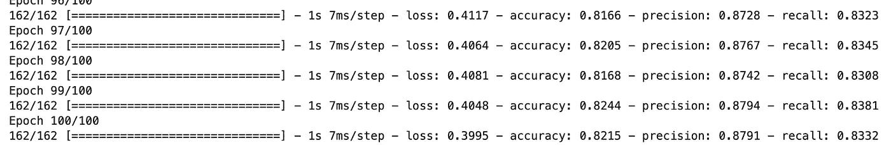

图 7-模型训练(图片由作者提供)

我们在训练过程中跟踪丢失、准确度、精确度和召回，并将其保存到`history`。我们现在可以可视化这些指标，以了解模型的运行情况。

## 可视化模型性能

让我们从导入 Matplotlib 并稍微调整一下默认样式开始。以下代码片段将使绘图变大，并删除顶部和右侧的脊线:

```
import matplotlib.pyplot as plt
from matplotlib import rcParams

rcParams['figure.figsize'] = (18, 8)
rcParams['axes.spines.top'] = False
rcParams['axes.spines.right'] = False
```

该图将有多条线——损失线、准确度线、精确度线和回忆线。它们都共用 X 轴，代表纪元编号(`np.arange(1, 101)`)。我们应该看到损失在减少，其他指标在增加:

```
plt.plot(
    np.arange(1, 101), 
    history.history['loss'], label='Loss'
)
plt.plot(
    np.arange(1, 101), 
    history.history['accuracy'], label='Accuracy'
)
plt.plot(
    np.arange(1, 101), 
    history.history['precision'], label='Precision'
)
plt.plot(
    np.arange(1, 101), 
    history.history['recall'], label='Recall'
)
plt.title('Evaluation metrics', size=20)
plt.xlabel('Epoch', size=14)
plt.legend();
```

让我们来看看:

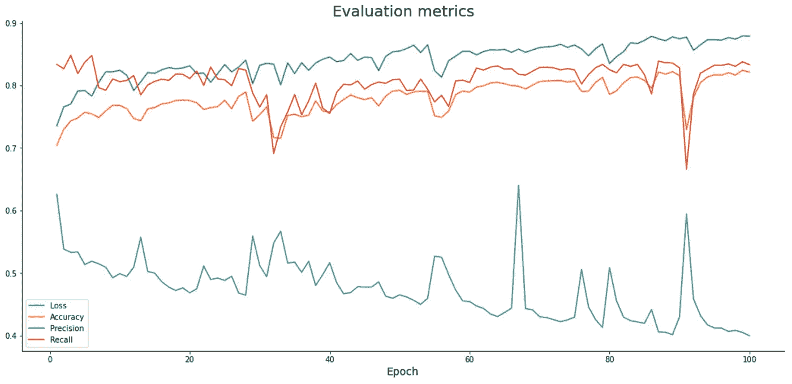

图 8 —培训期间的模特表现(图片由作者提供)

当我们训练模型时，准确度、精确度和召回率稍微增加，而损失减少。所有都有偶尔的峰值，如果你训练模型更长时间，这些峰值有望消失。

根据图表，你可以为更多的时期训练模型，因为没有稳定期的迹象。

但是我们是否过度适应了呢？接下来我们来回答这个问题。

## 做预测

您现在可以使用`predict()`函数来获得缩放测试数据的预测概率:

```
predictions = model.predict(X_test_scaled)
```

以下是它们的样子:

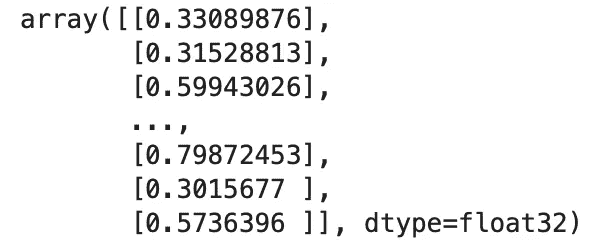

图片 9 —预测概率(图片由作者提供)

你必须在评估之前将它们转换成类。逻辑很简单——如果概率大于 0.5，我们指定 1(好酒)，否则指定 0(坏酒):

```
prediction_classes = [
    1 if prob > 0.5 else 0 for prob in np.ravel(predictions)
]
```

下面是前 20 个的样子:

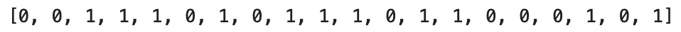

图片 10-预测类(作者图片)

这就是我们所需要的—接下来让我们评估这个模型。

## 测试数据的模型评估

让我们从混淆矩阵开始:

```
from sklearn.metrics import confusion_matrix

print(confusion_matrix(y_test, prediction_classes))
```

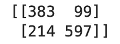

图 11 —混淆矩阵(图片由作者提供)

假阴性(214)比假阳性(99)多，所以测试集上的召回值将低于精度。

下面的代码片段显示了测试集的准确度、精确度和召回率:

```
from sklearn.metrics import accuracy_score, precision_score, recall_score

print(f'Accuracy: {accuracy_score(y_test, prediction_classes):.2f}')
print(f'Precision: {precision_score(y_test, prediction_classes):.2f}')
print(f'Recall: {recall_score(y_test, prediction_classes):.2f}')
```

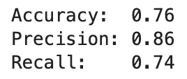

图 12 —测试集的准确度、精确度和召回率(图片由作者提供)

与列车组评估相比，所有值都略低:

*   **精度** : 0.82
*   **精度** : 0.88
*   **回忆** : 0.83

这个模型有点过度拟合了，但在几分钟内仍然是不错的工作。我们将在下一篇文章中讨论优化。

# 离别赠言

这就做到了——你现在知道如何训练一个简单的神经网络进行二进制分类。我们今天使用的数据集相对干净，几乎不需要任何准备工作。不要习惯那种感觉。

我们还有很多可以改进的地方。例如，您可以向网络添加额外的层，增加神经元的数量，选择不同的激活函数，选择不同的优化器，添加删除层，等等。可能性几乎是无穷无尽的，所以一切都归结于实验。

下一篇文章将涉及优化—您将学习如何自动找到最佳学习速率和神经网络架构，如果您想了解更多，请继续关注。

感谢阅读。

喜欢这篇文章吗？成为 [*中等会员*](https://medium.com/@radecicdario/membership) *继续无限制学习。如果你使用下面的链接，我会收到你的一部分会员费，不需要你额外付费。*

[](https://medium.com/@radecicdario/membership) [## 通过我的推荐链接加入 Medium-Dario rade ci

### 作为一个媒体会员，你的会员费的一部分会给你阅读的作家，你可以完全接触到每一个故事…

medium.com](https://medium.com/@radecicdario/membership) 

# 保持联系

*   注册我的[简讯](https://mailchi.mp/46a3d2989d9b/bdssubscribe)
*   在 YouTube[上订阅](https://www.youtube.com/c/BetterDataScience)
*   在 [LinkedIn](https://www.linkedin.com/in/darioradecic/) 上连接