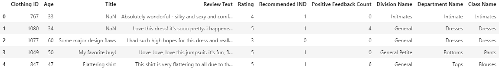
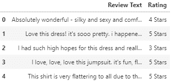
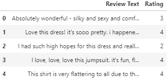
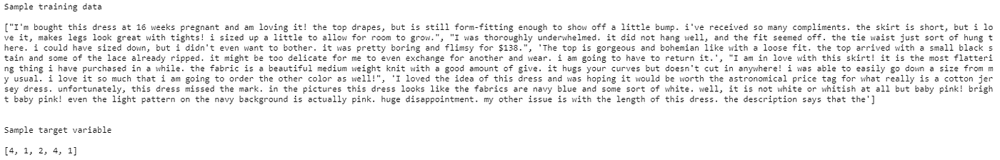
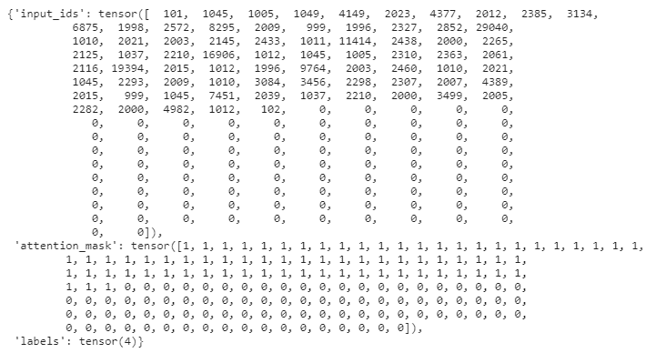
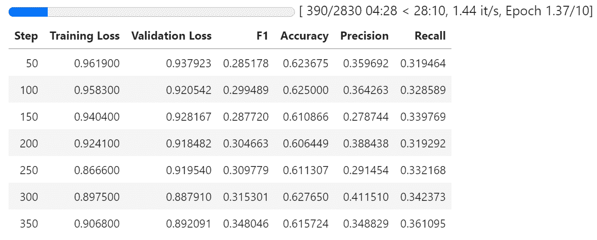
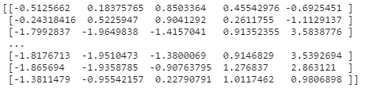
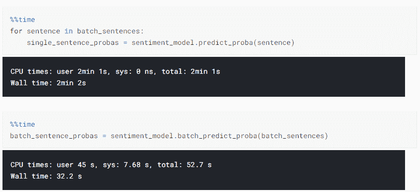
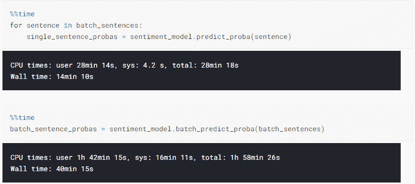

# 深度学习的情感分析

> 原文：<https://towardsdatascience.com/how-to-train-a-deep-learning-sentiment-analysis-model-4716c946c2ea?source=collection_archive---------6----------------------->

## 如何训练自己的高性能情绪分析模型


照片由 [Pietro Jeng](https://unsplash.com/@pietrozj?utm_source=medium&utm_medium=referral) 在 [Unsplash](https://unsplash.com?utm_source=medium&utm_medium=referral) 上拍摄

# 目标

情感分析是自然语言处理中的一种技术，用于识别与文本相关联的情感。情感分析的常见用例包括监控客户在社交媒体上的反馈、品牌和活动监控。

在本文中，我们将探讨如何利用预先训练好的 HuggingFace 模型，在自定义数据集上训练自己的情感分析模型。我们还将研究如何在 CPU 和 GPU 环境中高效地对微调后的模型执行单次和批量预测。如果您正在寻找一个开箱即用的情感分析模型，请查看我以前的文章[如何用 python](https://medium.com/@edwin.tan/sentiment-analysis-in-python-with-3-lines-of-code-9382a649c23d) 执行情感分析，其中只有 3 行代码。

# 装置

```
pip install transformers
pip install fast_ml==3.68
pip install datasets
```

# 导入包

```
import numpy as np
import pandas as pd
from fast_ml.model_development import train_valid_test_split
from transformers import Trainer, TrainingArguments, AutoConfig, AutoTokenizer, AutoModelForSequenceClassification
import torch
from torch import nn
from torch.nn.functional import softmax
from sklearn.metrics import classification_report
from sklearn.preprocessing import LabelEncoder
import datasets
```

启用 GPU 加速器(如果可用)。

```
DEVICE = torch.device("cuda" if torch.cuda.is_available() else "cpu")
print (f'Device Availble: {DEVICE}')
```

# 数据准备

我们将使用一个电子商务数据集，其中包含文本评论和女装评级。

```
df = pd.read_csv('/kaggle/input/womens-ecommerce-clothing-reviews/Womens Clothing E-Commerce Reviews.csv')
df.drop(columns = ['Unnamed: 0'], inplace = True)
df.head()
```



我们只对`Review Text`和`Rating`列感兴趣。`Review Text`列用作模型的输入变量，而`Rating`列是我们的目标变量，其值从 1(最不利)到 5(最有利)。

为了清楚起见，让我们在每个整数评级后面附加“星”或“星”。

```
df_reviews = df.loc[:, ['Review Text', 'Rating']].dropna()
df_reviews['Rating'] = df_reviews['Rating'].apply(lambda x: f'{x} Stars' if x != 1 else f'{x} Star')
```

这是现在数据的样子，1，2，3，4，5 颗星是我们的类标签。



让我们使用 Sklearn 的`LabelEncoder`对评级进行编码。

```
le = LabelEncoder()
df_reviews['Rating'] = le.fit_transform(df_reviews['Rating'])
df_reviews.head()
```

请注意，`Rating`列已经从文本转换为整数列。



`Rating`栏中的数字范围从 0 到 4。这些是将用于训练模型的类标签的类 id。每个类 id 对应一个等级。

```
print (le.classes_)>> ['1 Star' '2 Stars' '3 Stars' **'4 Stars'** '5 Stars']
```

列表的位置索引是类 id (0 到 4 ),该位置的值是原始评级。例如，在位置号 3，类别 id 是“3 ”,它对应于类别标签“4 星”。

让我们将数据分别按照 80%、10%和 10%的比例拆分为训练、验证和测试。

```
(train_texts, train_labels,
 val_texts, val_labels,
 test_texts, test_labels) = train_valid_test_split(df_reviews, target = 'Rating', train_size=0.8, valid_size=0.1, test_size=0.1)
```

将熊猫系列的评论文本转换成句子列表。

```
train_texts = train_texts['Review Text'].to_list()
train_labels = train_labels.to_list()
val_texts = val_texts['Review Text'].to_list()
val_labels = val_labels.to_list()
test_texts = test_texts['Review Text'].to_list()
test_labels = test_labels.to_list()
```



创建一个`DataLoader`类，用于在训练和推理阶段处理和加载数据。

```
class DataLoader(torch.utils.data.Dataset):
    def __init__(self, sentences=None, labels=None):
        self.sentences = sentences
        self.labels = labels
        self.tokenizer = AutoTokenizer.from_pretrained('distilbert-base-uncased')

        if bool(sentences):
            self.encodings = self.tokenizer(self.sentences,
                                            truncation = True,
                                            padding = True)

    def __getitem__(self, idx):
        item = {key: torch.tensor(val[idx]) for key, val in self.encodings.items()}

        if self.labels == None:
            item['labels'] = None
        else:
            item['labels'] = torch.tensor(self.labels[idx])
        return item def __len__(self):
        return len(self.sentences)

    def encode(self, x):
        return self.tokenizer(x, return_tensors = 'pt').to(DEVICE)
```

让我们来看看`DataLoader`的运行情况。

```
train_dataset = DataLoader(train_texts, train_labels)
val_dataset = DataLoader(val_texts, val_labels)
test_dataset = DataLoader(test_texts, test_labels)
```

`DataLoader`初始化一个预训练的标记器，并对输入句子进行编码。我们可以通过使用`__getitem__`函数从`DataLoader`中获得一条记录。下面是输入句子进行标记化后的结果。

```
print (train_dataset.__getitem__(0))
```



输出数据是一个由 3 个键值对组成的字典

*   `input_ids`:这包含一个整数张量，其中每个整数代表原始句子中的单词。`tokenizer`步骤将单个单词转换成由整数表示的符号。第一个记号`101`是句子的开始记号，而`102`记号是句子的结束记号。请注意，有许多尾随零，这是由于在`tokenizer`步骤中应用于句子的填充。
*   `attention_mask`:这是一个二进制值数组。`attention_mask`的每个位置对应`input_ids`中相同位置的一个令牌。`1`表示应该关注给定位置的令牌，`0`表示给定位置的令牌是填充值。
*   `labels`:这是目标标签

# 定义评估指标

我们希望在培训阶段定期对模型性能进行评估。为此，我们需要一个度量计算函数，它接受一个元组`(prediction, label)`作为参数，并返回一个度量字典:`{'metric1':value1,` metric2 `:value2}`。

```
f1 = datasets.load_metric('f1')
accuracy = datasets.load_metric('accuracy')
precision = datasets.load_metric('precision')
recall = datasets.load_metric('recall')def compute_metrics(eval_pred):
    metrics_dict = {}
    predictions, labels = eval_pred
    predictions = np.argmax(predictions, axis=1)

    metrics_dict.update(f1.compute(predictions = predictions, references = labels, average = 'macro'))
    metrics_dict.update(accuracy.compute(predictions = predictions, references = labels))
    metrics_dict.update(precision.compute(predictions = predictions, references = labels, average = 'macro'))
    metrics_dict.update(recall.compute(predictions = predictions, references = labels, average = 'macro')) return metrics_dict
```

# 培养

接下来，我们从预训练的检查点配置实例化一个`distilbert-base-uncased`模型。

```
id2label = {idx:label for idx, label in enumerate(le.classes_)}
label2id = {label:idx for idx, label in enumerate(le.classes_)}config = AutoConfig.from_pretrained('distilbert-base-uncased',
                                    num_labels = 5,
                                    id2label = id2label,
                                    label2id = label2id)model = AutoModelForSequenceClassification.from_config(config)
```

*   `num_labels`:类别数
*   `id2label`:将类别 id 映射到类别标签的字典`{0: '1 Star', 1: '2 Stars', 2: '3 Stars', 3: '4 Stars', 4: '5 Stars'}`
*   `label2id`:将类别标签映射到类别 id 的映射字典`{'1 Star': 0, '2 Stars': 1, '3 Stars': 2, '4 Stars': 3, '5 Stars': 4}`

让我们检查一下模型配置。`id2label`和`label2id`字典已经合并到配置中。我们可以在推理过程中从模型的配置中检索这些字典，以便为预测的类 id 找出相应的类标签。

```
print (config)>> DistilBertConfig {
  "activation": "gelu",
  "architectures": [
    "DistilBertForMaskedLM"
  ],
  "attention_dropout": 0.1,
  "dim": 768,
  "dropout": 0.1,
  "hidden_dim": 3072,
  "id2label": {
    "0": "1 Star",
    "1": "2 Stars",
    "2": "3 Stars",
    "3": "4 Stars",
    "4": "5 Stars"
  },
  "initializer_range": 0.02,
  "label2id": {
    "1 Star": 0,
    "2 Stars": 1,
    "3 Stars": 2,
    "4 Stars": 3,
    "5 Stars": 4
  },
  "max_position_embeddings": 512,
  "model_type": "distilbert",
  "n_heads": 12,
  "n_layers": 6,
  "pad_token_id": 0,
  "qa_dropout": 0.1,
  "seq_classif_dropout": 0.2,
  "sinusoidal_pos_embds": false,
  "tie_weights_": true,
  "transformers_version": "4.6.1",
  "vocab_size": 30522
}
```

我们还可以使用以下方法来检查模型架构

```
print (model)
```

设置训练参数。

```
training_args = TrainingArguments(
    output_dir='/kaggle/working/results',
    num_train_epochs=10,
    per_device_train_batch_size=64,
    per_device_eval_batch_size=64,
    warmup_steps=500,
    weight_decay=0.05,
    report_to='none',
    evaluation_strategy='steps',
    logging_dir='/kagge/working/logs',
    logging_steps=50)
```

*   `report_to`支持将训练工件和结果记录到 mlflow、tensorboard、azure_ml 等平台
*   `per_device_train_batch_size`是训练期间每个 TPU/GPU/CPU 的批量大小。如果您的设备面临内存不足的问题，请降低此值
*   `per_device_eval_batch_size`是评估期间每个 TPU/GPU/CPU 的批量大小。如果您的设备面临内存不足的问题，请降低此值
*   `logging_step`确定培训期间进行指标评估的频率

实例化`Trainer`。在引擎盖下，`Trainer`基于给定的训练参数、模型、数据集和指标运行训练和评估循环。

```
trainer = Trainer(
    model=model,
    args=training_args,
    train_dataset=train_dataset,
    eval_dataset=val_dataset,
    compute_metrics=compute_metrics)
```

开始训练吧！

```
trainer.train()
```

每 50 步进行一次评估。我们可以通过改变`TrainingArguments`中的`logging_steps`参数来改变求值的间隔。除了默认的训练和验证损失指标之外，我们还获得了之前在`compute_metric`函数中定义的额外指标。



# 估价

让我们在测试集上评估我们的训练。

```
eval_results = trainer.predict(test_dataset)
```

`Trainer`的`predict`函数返回 3 项:

1.  原始预测分数的数组

```
print (test_results.predictions)
```



2.地面真实标签 id

```
print (test_results.label_ids)

>> [1 1 4 ... 4 3 1]
```

3.韵律学

```
print (test_results.metrics)

>> {'test_loss': 0.9638910293579102,
		'test_f1': 0.28503729426950286,
		'test_accuracy': 0.5982339955849889,
		'test_precision': 0.2740061405117546,
		'test_recall': 0.30397183356136337,
		'test_runtime': 5.7367,
		'test_samples_per_second': 394.826,
		'test_mem_cpu_alloc_delta': 0,
		'test_mem_gpu_alloc_delta': 0,
		'test_mem_cpu_peaked_delta': 0,
		'test_mem_gpu_peaked_delta': 348141568}
```

模型预测函数输出未标准化的概率得分。为了找到类别概率，我们对未标准化的分数取一个软最大值。具有最高类别概率的类别被认为是预测类别。我们可以通过取类概率的 argmax 来找到它。我们之前存储在模型配置中的`id2label`属性可用于将类别 id (0-4)映射到类别标签(1 星，2 星..).

```
label2id_mapper = model.config.id2label
proba = softmax(torch.from_numpy(test_results.predictions))
pred = [label2id_mapper[i] for i in torch.argmax(proba, dim = -1).numpy()]
actual = [label2id_mapper[i] for i in test_results.label_ids]
```

我们使用 Sklearn 的`classification_report`来获得精确度、召回率、f1 和准确度分数。

```
class_report = classification_report(actual, pred, output_dict = True)
pd.DataFrame(class_report)
```

# 保存模型

```
trainer.save_model('/kaggle/working/sentiment_model')
```

# 推理

在本节中，我们将了解如何加载已定型模型并对其执行预测。让我们在另一个笔记本上测试一下这个推论。

# 设置

```
import pandas as pd
import numpy as np
from transformers import Trainer, TrainingArguments, AutoConfig, AutoTokenizer, AutoModelForSequenceClassification
import torch
from torch import nn
from torch.nn.functional import softmax
```

这种推断可以在 GPU 或 CPU 环境中工作。如果可用，在您的环境中启用 GPU。

```
DEVICE = torch.device("cuda" if torch.cuda.is_available() else "cpu")
print (f'Device Availble: {DEVICE}')
```

这与我们在培训阶段使用的`DataLoader`相同

```
class DataLoader(torch.utils.data.Dataset):
    def __init__(self, sentences=None, labels=None):
        self.sentences = sentences
        self.labels = labels
        self.tokenizer = AutoTokenizer.from_pretrained('distilbert-base-uncased')

        if bool(sentences):
            self.encodings = self.tokenizer(self.sentences,
                                            truncation = True,
                                            padding = True)

    def __getitem__(self, idx):
        item = {key: torch.tensor(val[idx]) for key, val in self.encodings.items()}

        if self.labels == None:
            item['labels'] = None
        else:
            item['labels'] = torch.tensor(self.labels[idx])
        return item def __len__(self):
        return len(self.sentences)

    def encode(self, x):
        return self.tokenizer(x, return_tensors = 'pt').to(DEVICE)
```

# 创建模型类

`SentimentModel`类帮助初始化模型，包含分别用于单个和批量预测的`predict_proba`和`batch_predict_proba`方法。`batch_predict_proba`使用 HuggingFace 的`Trainer`进行批量评分。

```
class SentimentModel():

    def __init__(self, model_path):

        self.model = AutoModelForSequenceClassification.from_pretrained(model_path).to(DEVICE)
        args =  TrainingArguments(output_dir='/kaggle/working/results', per_device_eval_batch_size=64)
        self.batch_model = Trainer(model = self.model, args= args)
        self.single_dataloader = DataLoader()

    def batch_predict_proba(self, x):

        predictions = self.batch_model.predict(DataLoader(x))
        logits = torch.from_numpy(predictions.predictions)

        if DEVICE == 'cpu':
            proba = torch.nn.functional.softmax(logits, dim = 1).detach().numpy()
        else:
            proba = torch.nn.functional.softmax(logits, dim = 1).to('cpu').detach().numpy() return proba

    def predict_proba(self, x):

        x = self.single_dataloader.encode(x).to(DEVICE)
        predictions = self.model(**x)
        logits = predictions.logits

        if DEVICE == 'cpu':
            proba = torch.nn.functional.softmax(logits, dim = 1).detach().numpy()
        else:
            proba = torch.nn.functional.softmax(logits, dim = 1).to('cpu').detach().numpy() return proba
```

# 数据准备

让我们加载一些样本数据

```
df = pd.read_csv('/kaggle/input/womens-ecommerce-clothing-reviews/Womens Clothing E-Commerce Reviews.csv')
df.drop(columns = ['Unnamed: 0'], inplace = True)
df_reviews = df.loc[:, ['Review Text', 'Rating']].dropna()
df_reviews['Rating'] = df_reviews['Rating'].apply(lambda x: f'{x} Stars' if x != 1 else f'{x} Star')
df_reviews.head()
```

我们将创建两组数据。一个用于批量评分，另一个用于单次评分。

```
batch_sentences = df_reviews.sample(n = 10000, random_state = 1)['Review Text'].to_list()
single_sentence = df_reviews.sample(n = 1, random_state = 1)['Review Text'].to_list()[0]
```

# 预测

实例化模型

```
sentiment_model = SentimentModel('../input/fine-tune-huggingface-sentiment-analysis/sentiment_model')
```

使用`predict_proba`方法预测单个句子。

```
single_sentence_probas = sentiment_model.predict_proba(single_sentence)
id2label = sentiment_model.model.config.id2label
predicted_class_label = id2label[np.argmax(single_sentence_probas)]print (predicted_class_label)
>> 5 Stars
```

使用`batch_predict_proba`方法对一批句子进行预测。

```
batch_sentence_probas = sentiment_model.batch_predict_proba(batch_sentences)
predicted_class_labels = [id2label[i] for i in np.argmax(batch_sentence_probas, axis = -1)]
```

# 推理速度

让我们比较一下`predict_proba`和`batch_predict_proba`方法之间的推理速度

对于 CPU 和 GPU 环境中的 10k 样本数据。我们将对 10k 个样本进行迭代，`predict_proba`每次进行一次预测，同时使用`batch_predict_proa`方法对所有 10k 个样本进行评分，无需迭代。

```
%%time
for sentence in batch_sentences:
    single_sentence_probas = sentiment_model.predict_proba(sentence)%%time
batch_sentence_probas = sentiment_model.batch_predict_proba(batch_sentences)
```

**GPU 环境**

遍历`predict_proba`大约需要 2 分钟，而对于 10k 样本数据`batch_predict_proba`大约需要 30 秒。批量预测比在 GPU 环境下使用单次预测快了差不多 4 倍。



**CPU 环境**

在 CPU 环境中，`predict_proba`花费了大约 14 分钟，而`batch_predict_proba`花费了大约 40 分钟，几乎是原来的 3 倍。



因此，对于大型数据集，如果您有 GPU，请使用`batch_predict_proba`。如果您无法访问 GPU，您最好使用`predict_proba`遍历数据集。

# 结论

在本文中，我们研究了:

*   如何利用预训练的 HuggingFace 模型来训练自己的深度学习情感分析模型
*   如何创建单项和批量评分预测方法
*   CPU 和 GPU 环境中单次和批量评分的推断速度

这篇文章的笔记本可以在这里找到:

*   [训练](https://www.kaggle.com/edwintyh/huggingface-sentiment-analysis-inference)
*   [推论](https://www.kaggle.com/edwintyh/huggingface-sentiment-analysis-inference)

[加入 Medium](https://medium.com/@edwin.tan/membership) 阅读更多这样的故事。