# 如何在噪声数据上训练细粒度多标签分类模型

> 原文：<https://towardsdatascience.com/how-to-train-a-fine-grained-multilabel-classification-model-on-noisy-data-8d84d4f65781?source=collection_archive---------30----------------------->

## 时尚 AI

## 基于 Fastai 和 DeepFashion 数据集的服装属性识别


图片由 [TanaCh](https://www.shutterstock.com/g/Chugunjva+Tetiana) 根据 Shutterstock.com[的许可使用](https://www.shutterstock.com/)

噪声标签的问题对于每个处理过手动注释数据的人来说都很熟悉。每当多个贡献者参与数据标注任务时，由于不同的参与者将具有不同的标注标准，这将不可避免地导致数据误标注。面临这个问题的组织经常会推迟深度学习产品的开发，并优先考虑数据清理。然而，有一些方法可以帮助建立适当的模型，同时不断提高数据质量。在本文中，我将解决细粒度多标签分类中的噪声数据问题。

在我的上一篇文章“[用 DeepFashion 数据集和 Fastai](/clothes-classification-with-the-deepfashion-dataset-and-fast-ai-1e174cbf0cdc) 进行服装分类”中，我遇到了嘈杂标签的问题。毫无疑问，数据中的噪音影响了模型的质量。即使最终我能够在单标签分类任务中获得良好的准确性，如果我找不到这个问题的解决方案，我也会质疑继续这个项目的可能性。概括地说，我的目标是将服装项目建模为一个图表，该图表包含服装类型、属性及其关系(无论两个项目是否可以组合成一个外观)。作为第一步，我正在为服装类型和属性识别构建模型，这些模型将用于在图形建模之前标记我自己的数据。尽管噪声标签对于简单的单标签分类模型来说不是一个大问题，但是多标签属性分类意味着学习语义相近的类别之间的细微差异。这在有噪声的数据上尤其难以解决。

在本文中，我将介绍为多标签属性分类训练模型的过程。文章包含以下几个部分:

1.  数据
2.  评估指标的选择
3.  损失函数的选择
4.  模特培训
5.  估价
6.  摘要

在我的解决方案中，我使用 PyTorch 和 Fastai 库。本文中使用的完整代码可从[这里](https://github.com/tsennikova/fashion-ai/blob/main/fashion-attribute-recognition.ipynb)获得。

# 数据

我使用了 [DeepFasion 数据集](http://mmlab.ie.cuhk.edu.hk/projects/DeepFashion.html)，这是一个大规模的服装数据库，用于服装类别和属性预测，由香港中文大学多媒体实验室收集。

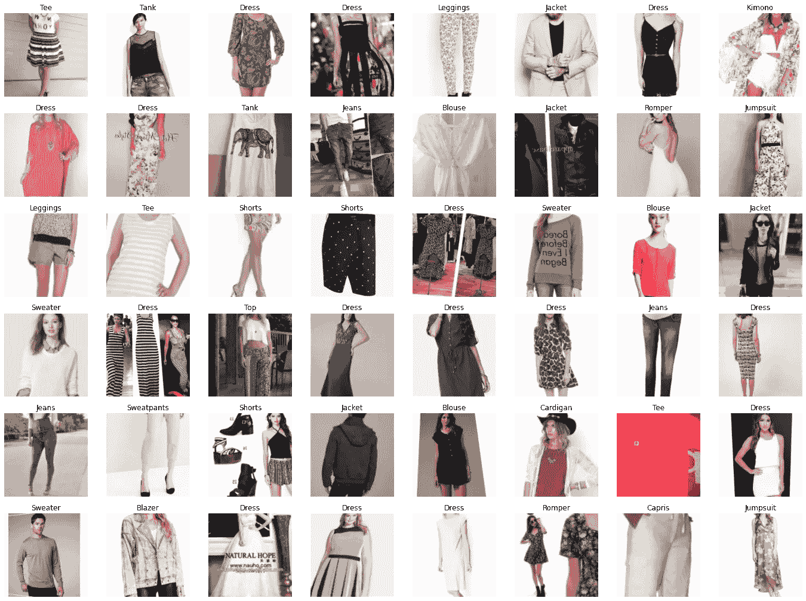

分类基准于 2016 年发布。它评估了 FashionNet 模型在预测 46 个类别和 1000 个服装属性方面的性能。原论文请参见 [DeepFashion:用丰富的注释支持健壮的服装识别和检索，CVPR 2016](https://www.cv-foundation.org/openaccess/content_cvpr_2016/papers/Liu_DeepFashion_Powering_Robust_CVPR_2016_paper.pdf) 。

DeepFashion 数据库包含几个数据集。对于这个项目，使用了类别和属性预测基准。该数据集包含 289，222 张不同的服装图片，标有 1000 种不同的属性，其中我使用了 98 种属性，分别对应于款式、面料、季节和图案类型。

训练标签以以下格式存储在 multilabel-train.csv 中:

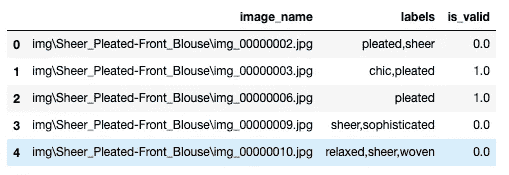

训练数据文件

数据集包含图像的位置、字符串对象形式的标签以及图像是否属于验证集的指示符。

为了加载图像，我们将使用一个*数据块*，它将图像的完整路径和作为标签的字符串列表作为输入。为此，我们将创建两个助手函数来解析输入格式。我们还将创建一个 splitter 函数，它将基于 *is_valid* 列创建训练集和验证集。

当调用数据块 API 时，我们需要指定变量的类型。在我们的例子中，自变量是 ImageBlock，因变量是 MultiCategoryBlock。MultiCategoryBlock 希望标签存储为字符串列表。 *get_y* 方法会搞定的。

让我们看看数据集中的一些图像:

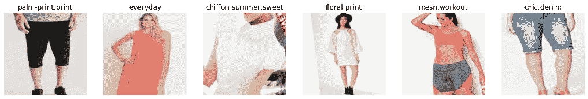

带标签的训练图像

显然，原始数据集在标签中包含了大量噪声。例如，第一张图片上没有掌纹，第二张图片上的“日常”服装看起来比上一张图片上的“时尚”牛仔短裤更花哨。这就是我在本文中要解决的问题，但是首先，我们需要为我们的解决方案选择一个合适的评估指标。

# 评估指标的选择

现在，当数据被加载时，让我们看一下目标变量:

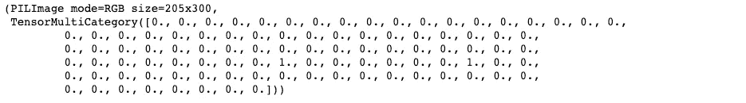

我们传递给 *dblock* 变量的标签列表被转换成稀疏的独热编码向量。稀疏性将影响我们对评估指标的选择。fastai 中的默认选择是 *accuracy_multi* 。但是，它不适用于稀疏标注。我们来看看为什么。方法 *accuracy_multi* 在 fastai 中定义如下:

如果我们创建一个零张量作为“预测”，并将其与目标值一起发送到 *accuracy_multi* ，我们将已经达到 98%的准确度。这意味着即使我们的模型不预测任何标签，它仍然有 98%的准确性。

```
TensorMultiCategory(0.9796)
```

因此，我们需要找到另一个评估指标，反映我们模型的实际学习进度和性能。一个选择可能是 **FBeta** 分数。 **FBeta** 是 **F-score** 的概括。虽然 **F-score** 被定义为精度和召回率的调和平均值，并赋予两者相同的权重，但是 **FBeta** 增加了一个称为 Beta 的权重配置参数。beta 参数决定了回忆在综合得分中的权重。beta < 1 更重视精度，而 beta > 1 更倾向于召回(beta - > 0 只考虑精度，beta - > +inf 只考虑召回)。

让我们看看它是如何处理我们的“0-预测”问题的:

```
0.0
```

在没有预测的情况下，它会给我们 FBeta=0。我们还可以测试其他一些极端情况。例如随机预测:

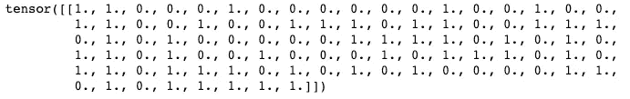

```
0.001
```

随机生成的预测的 FBeta 分数接近 0。而在“完美”预测上，其中预测=目标 Fbeta 分数等于 1:

```
1.0
```

这看起来像是评估指标的有效选项。现在让我们选择一个损失函数。

# 损失函数的选择

回到训练标签的例子，它们被编码为独热编码向量。这种编码也被称为**硬编码**。硬编码标签的问题在于，正确类别的预测概率非常大，而不正确类别的预测概率非常低。该模型将以接近 1 的置信度对每个训练示例进行正确分类，这可能会导致多个问题。第一个问题是过度拟合。另外两个问题与我们数据集中标签的性质有关。

如果我们仔细观察数据集中的标签:

```
['abstract-print', 'animal', 'baroque', 'basic', 'beach', 'bird-print', 'boho', 'botanical-print', 'camouflage', 'cargo', 'chic', 'chiffon', 'circle', 'civil', 'colorblock', 'cotton', 'cozy', 'crochet', 'cute', 'denim', 'dotted', 'elegant', 'everyday', 'fancy', 'faux-fur', 'faux-leather', 'faux-suede', 'feather', 'floral', 'fur', 'glitter', 'graphic', 'grid-print', 'grunge', 'knotted', 'leaf-print', 'leather', 'leopard-print', 'linen', 'linen-blend', 'logo', 'luxe', 'marble-print', 'medallion-print', 'mesh', 'metallic', 'mixed-print', 'multi-stripe', 'neon', 'neoprene', 'nets', 'netted', 'nylon', 'oil', 'ombre', 'organza', 'ornate-print', 'paisley-print', 'palm-print', 'party', 'patched', 'pattern', 'pleated', 'print', 'relaxed', 'retro', 'safari', 'sateen', 'satin', 'sheer', 'smart', 'soft', 'solid', 'sophisticated', 'sparkling', 'sporty', 'springs', 'square', 'star', 'strap', 'stretch', 'striped', 'suede', 'summer', 'sweet', 'textured', 'thermal', 'tie-dye', 'training', 'triangle', 'tropical', 'tweed', 'utility', 'velvet', 'weekend', 'workout', 'woven', 'zigzag']
```

我们可以看到衣服属性标签在语义上非常接近。例如:“植物印花”和“花卉”，或者“人造革”和“皮革”，即使对人来说也很难区分。当我们在编码为 One-Hot 的语义相似的标签上训练模型时，正确和不正确的类之间的差异非常大，即使它们在语义上可能非常接近。在这种情况下，模型预测标签的置信度是不受限制的，并且会随着类别而变化，这使得正确类别的分离更具挑战性。

最后，正如我们在数据部分看到的，DeepFashion 数据集受到嘈杂标签的影响。数据由多个参与者手动标注，这些参与者可能具有不同的标注标准，这导致了数据的错误标注。结果，用硬编码标签训练的模型将以高置信度学习不正确的特征。因此，我们需要挑战数据集中的标签，并问自己这样一个问题:真正的标签是否真的是真的。一种方法是通过将损失目标值从 1 降低到 0.9 来给标签分配概率。这种方法被称为标签平滑，并在论文[中详细讨论了标签平滑何时有帮助？](https://arxiv.org/pdf/1906.02629.pdf)。

标签平滑防止网络变得过于自信，并使其不太可能过度拟合。此外，它通过引入平滑参数 *α* 来统一正确和错误类别之间的差异。结果，每个不正确的类标签将与正确的类标签等距，这使得更容易分离语义相似的类。我们将在损失函数中实现标签平滑，并使用它来训练我们的模型。

在 fastai 中，多标签分类问题的损失函数的默认选择是一个 *BCEWithLogitsLossFlat* ，它是一个带有 Logits 的二元交叉熵。*

**实际上是一个 sigmoid 函数，它是 logit 函数的逆函数，将交叉熵的任意实值映射回[0，1]范围，这是我们通常希望在 0 和 1 之间编码的目标。*

我们将把 *BCEWithLogitsLossFlat* 包装在*LabelSmoothingBCEWithLogitsLossFlat*类中，并在调用 BCEWithLogitsLossFlat 之前应用标签平滑:

让我们比较一下训练网络时使用和不使用标签平滑的损失值。

**无标签平滑:**

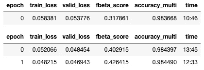

我们可以看到损失值非常小。由于有 0|1 个目标，该模型对其分配的标签过于自信。

**现在让我们用平滑标签来训练网络:**

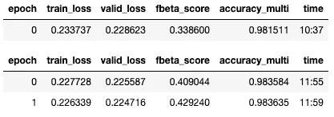

当我们通过平滑标签来训练模型时，我们观察到较高的损失值，这起初可能是违反直觉的。原因是标签平滑降低了目标的确定性。在这种情况下，更高的损失实际上是一个理想的结果。

我们还可以观察到，仅在一个时期的训练之后，该模型就具有 98%的准确性。这是我们之前在选择评估指标时讨论的问题。

# 模特培训

我们继续使用标签平滑来训练模型。现在，我们将检查我们的*数据加载器*中的数据，并逐渐增加每个小批量的学习率，以观察损失值如何随着学习率的变化而变化。我们的目标是找到最有效的学习速率，使网络更快地收敛。

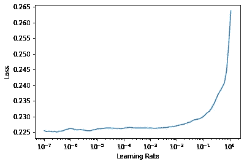

三个时期后的损失曲线

由于我们的模型已经训练了三个时期，网络的权重不再是随机的，我们没有观察到任何急剧下降的损失。为了进一步的训练，我们将采用一系列权重，从下降点到损失再次开始增长的点，并检查我们是否可以改进模型。

在这个解决方案中，我使用预先训练好的 [ResNet34](https://en.wikipedia.org/wiki/Residual_neural_network) 模型。从预训练模型转移的层已经擅长识别基本视觉概念，并且不需要太多训练。然而，负责识别特定于我们问题的复杂形状的深层仍然会受益于更高的学习率。因此，我们需要对第一层使用较小的学习速率，对最后一层使用较大的学习速率，以允许它们更快地进行微调。

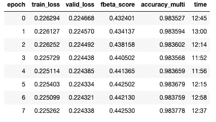

正如我们所看到的，我们的网络在学习方面取得了进步。然而，很难判断我们是需要继续训练还是停下来不要过度适应模型。绘制培训和验证损失图可以帮助我们评估是否需要继续。

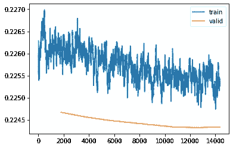

培训与验证损失

该图显示验证损失不再改善那么多。如果我们继续训练，我们将增加训练和验证损失之间的差距，这将意味着我们过度拟合我们的模型。所以，我们最好现在就停止训练，进入下一步，测评。

# 模型评估

如果我们绘制验证 FBeta 分数，我们可以看到它是如何随着每个时期而改进的。

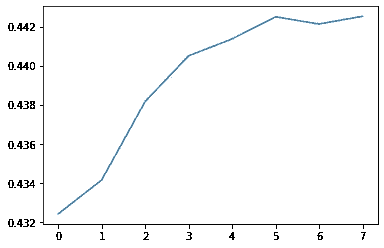

每个时期的验证 FBeta

## 对训练数据集的评估

首先，我们将查看训练数据集上的预测，以估计我们的模型是否学习了合理的模式。

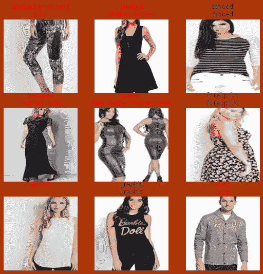

对训练数据的评估

第一行包含原始标签，第二行包含预测。我们的预测与标签并不完全匹配，但预测的标签是有意义的。总的来说，我们的模型抓住了主要概念。

## 对测试数据集的评估

现在让我们加载测试数据，并检查模型在其上的表现。

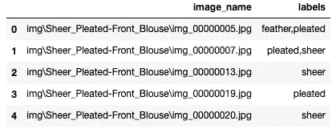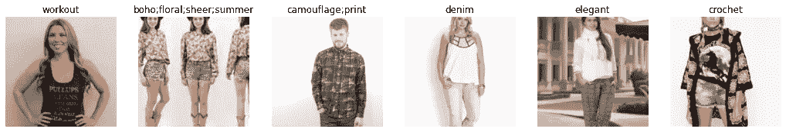

测试批次

```
[0.22433756291866302,0.44253026656767896,0.9837779402732849]
```

第一个值是 loss，第二个是非常接近验证值的 FBeta，最后一个是 fastai 库中的 Accuracy Multi。

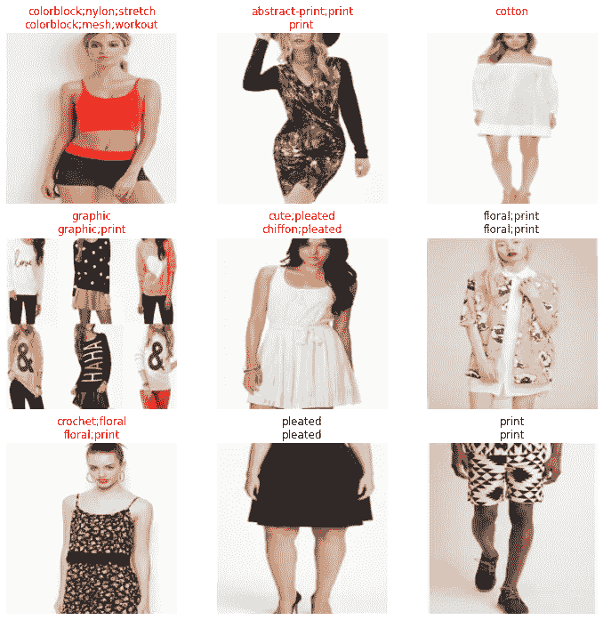

测试数据的评估

当查看测试数据上的属性预测时，我会说预测的标签实际上比原始标签更好。

# 对用户指定数据集的评估

最后，我们将检查模型如何处理我的图像。我用智能手机相机拍了 98 张自己衣服的照片。让我们加载图像，并检查模型是否可以正确地对它们进行分类。

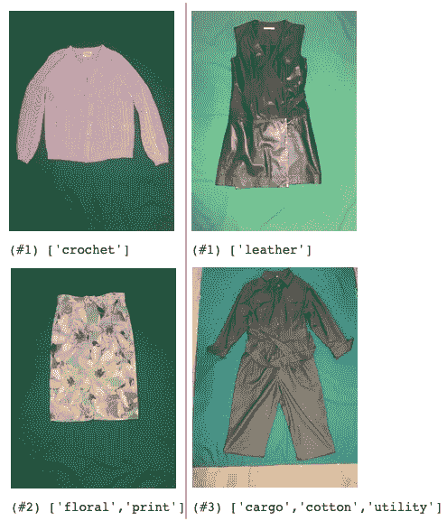

用户数据评估

分配的标签看起来非常好。尽管训练数据有噪声，但模型能够学习时尚概念，并对看不见的用户图像进行很好的概括。值得一提的是，我没有标记自己的数据集，因为这将是一项重大的工作。因此，我将使用训练好的模型来获取我自己的数据的标签。

# 摘要

在本文中，我演示了如何使用 Fastai 库和 DeepFashion 数据集训练一个多标签属性识别模型。

毫无疑问，通过提高训练标签的质量，可以显著提高模型的性能。然而，该模型已经能够提供足够的结果，即使在噪音数据。正如我们所看到的，有一些方法允许在持续改进训练数据质量的同时提供操作就绪的模型。这是一项重要的学习，因为许多组织由于数据质量而推迟了深度学习产品的开发。

*感谢您阅读这篇文章！如有任何问题，请在下方留言或通过* [*LinkedIn*](https://www.linkedin.com/in/tatiana-sennikova-7b864140/) *联系我。*

# 如果你喜欢这篇文章，这里有一些你可能喜欢的其他文章:

</clothes-classification-with-the-deepfashion-dataset-and-fast-ai-1e174cbf0cdc>  </how-to-build-a-baseline-model-be6ce42389fc> 