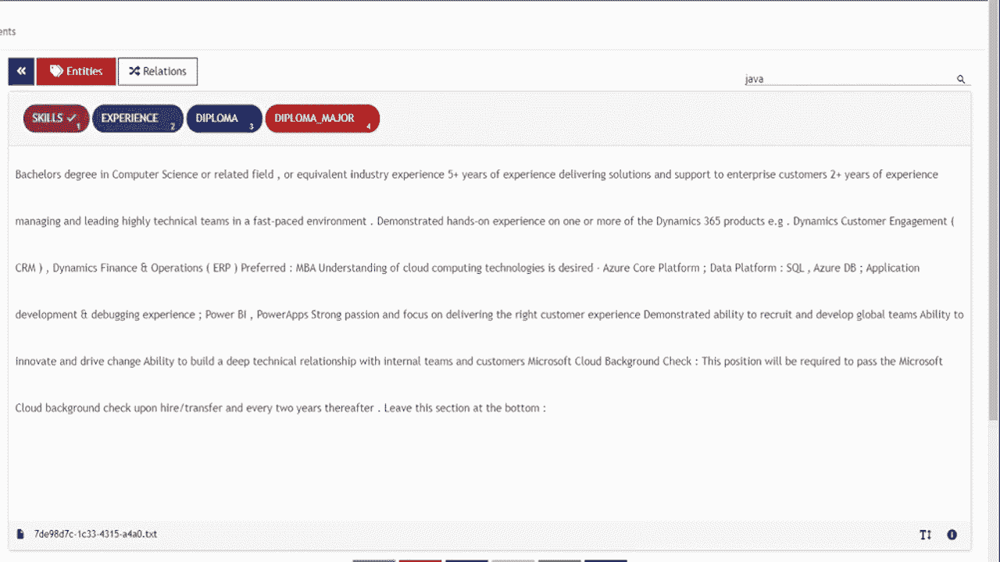
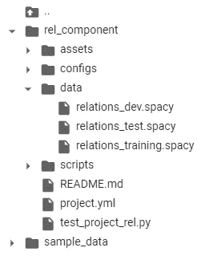
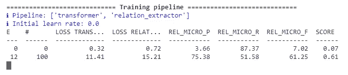
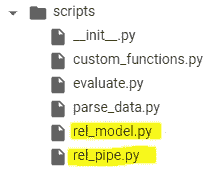

# 如何使用带 spaCy 3 的 BERT 变换器训练联合实体和关系提取分类器

> 原文：<https://towardsdatascience.com/how-to-train-a-joint-entities-and-relation-extraction-classifier-using-bert-transformer-with-spacy-49eb08d91b5c?source=collection_archive---------2----------------------->

## 如何使用 Transformer 和 spaCy3 训练关系提取分类器的分步指南


照片由 [JJ 英](https://unsplash.com/@jjying?utm_source=unsplash&utm_medium=referral&utm_content=creditCopyText)在 [Unsplash](https://unsplash.com/s/photos/science?utm_source=unsplash&utm_medium=referral&utm_content=creditCopyText)

# **简介**

NLP 技术最有用的应用之一是从非结构化文本中提取信息，如合同、财务文档、医疗记录等。—使自动数据查询能够获得新的见解。传统上，命名实体识别被广泛用于识别文本中的实体，并存储数据以进行高级查询和过滤。然而，如果我们想从语义上理解非结构化的文本，**仅仅 NER 是不够的，因为我们不知道实体是如何相互关联的**。执行联合 NER 和关系提取将通过知识图开辟一种全新的信息检索方式，在知识图中，您可以浏览不同的节点以发现隐藏的关系。因此，联合执行这些任务将是有益的。

在我的[上一篇文章](/how-to-fine-tune-bert-transformer-with-spacy-3-6a90bfe57647)中，我们使用 spaCy3 对 NER 的 BERT 模型进行了微调，现在我们将使用 spaCy 的新 Thinc 库向管道添加关系提取。我们按照 [spaCy 的文档](https://spacy.io/usage/layers-architectures#component-rel)中概述的步骤训练关系提取模型。我们将比较使用 transformers 和 tok2vec 算法的关系分类器的性能。最后，我们将在网上找到的职位描述上测试该模型。

# **关系分类:**

在其核心，关系提取模型是一个分类器，它为给定的实体对 **{e1，e2}** 预测关系 **r** 。在变压器的情况下，该分类器被添加到输出隐藏状态的顶部。有关关系提取的更多信息，请阅读这篇出色的文章[概述了关系分类的微调变压器模型的理论。](/bert-s-for-relation-extraction-in-nlp-2c7c3ab487c4)

我们要微调的预训练模型是 roberta-base 模型，但是您可以使用 huggingface 库中可用的任何预训练模型，只需在配置文件中输入名称即可(见下文)。

在本教程中，我们将提取两个实体{经验，技能}之间的关系作为中的**经验，以及{文凭，文凭 _ 专业}之间的关系作为**中的**学位。目标是提取特定技能和与所需文凭相关的文凭专业所需的经验年限。当然，您可以为自己的用例训练自己的关系分类器，例如在健康记录中查找症状的原因/结果，或者在财务文档中查找公司收购。可能性是无限的…**

在本教程中，我们将只涵盖实体关系提取部分。对于使用 spaCy 3 微调伯特 NER，请参考我的[以前的文章](/how-to-fine-tune-bert-transformer-with-spacy-3-6a90bfe57647)。

# **数据标注:**

正如在我的[上一篇文章](/how-to-fine-tune-bert-transformer-with-spacy-3-6a90bfe57647)中，我们使用 [UBIAI](https://ubiai.tools) 文本注释工具来执行联合实体和关系注释，因为它的通用接口允许我们在实体和关系注释之间轻松切换(见下文):



UBIAI 的联合实体和关系注释接口

对于本教程，我只注释了大约 100 个包含实体和关系的文档。对于生产，我们当然需要更多的带注释的数据。

# **数据准备:**

在训练模型之前，我们需要将带注释的数据转换成二进制空间文件。我们首先将 UBIAI 生成的注释拆分到 training/dev/test 中，并分别保存它们。我们修改 spaCy 的教程 repo 中提供的[代码](https://github.com/explosion/projects/blob/v3/tutorials/rel_component/scripts/parse_data.py\)，为我们自己的注释创建二进制文件([转换代码](https://github.com/walidamamou/relation_extraction_transformer))。

我们对训练、开发和测试数据集重复这一步骤，以生成三个二进制空间文件(github 中提供的[文件)。](https://github.com/walidamamou/relation_extraction_transformer)

# **关系抽取模型训练:**

为了训练，我们将从我们的黄金语料库中提供实体，并在这些实体上训练分类器。

*   打开一个新的 Google Colab 项目，确保在笔记本设置中选择 GPU 作为硬件加速器。确保通过运行以下命令启用 GPU:！英伟达-smi
*   每晚安装空间:

```
!pip install -U spacy-nightly --pre
```

*   安装轮包并克隆空间的关系提取报告:

```
!pip install -U pip setuptools wheel
!python -m spacy project clone tutorials/rel_component
```

*   安装变压器管道和空间变压器库:

```
!python -m spacy download en_core_web_trf
!pip install -U spacy transformers
```

*   将目录更改为 rel_component 文件夹:cd rel_component
*   在 rel_component 中创建一个名为“data”的文件夹，并将培训、开发和测试二进制文件上传到其中:



培训文件夹

*   打开 project.yml 文件并更新培训、开发和测试路径:

```
train_file: "data/relations_training.spacy"dev_file: "data/relations_dev.spacy"test_file: "data/relations_test.spacy"
```

*   您可以通过转到 configs/rel_trf.cfg 并输入模型的名称来更改预训练的转换器模型(例如，如果您想要使用不同的语言):

```
[components.transformer.model]@architectures = "spacy-transformers.TransformerModel.v1"name = "roberta-base" # Transformer model from huggingfacetokenizer_config = {"use_fast": true}
```

*   在开始训练之前，我们将把 configs/rel_trf.cfg 中的 max_length 从默认的 100 令牌减少到 20，以提高模型的效率。max_length 对应于两个实体之间的**最大距离**，超过该距离的实体将不被考虑进行关系分类。结果，来自同一文档的两个实体将被分类，只要它们在彼此的最大距离(在标记数量上)内。

```
[components.relation_extractor.model.create_instance_tensor.get_instances]@misc = "rel_instance_generator.v1"max_length = 20
```

*   我们最终准备好训练和评估关系提取模型；只需运行以下命令:

```
!spacy project run train_gpu # command to train train transformers
!spacy project run evaluate # command to evaluate on test dataset
```

您应该开始看到 P、R 和 F 分数开始更新:



模型培训正在进行中

模型完成训练后，对测试数据集的评估将立即开始，并显示预测与黄金标签。该模型将与我们模型的分数一起保存在名为“training”的文件夹中。

要训练非变压器模型 tok2vec，请改为运行以下命令:

```
!spacy project run train_cpu # command to train train tok2vec
!spacy project run evaluate
```

我们可以比较这两种模型的性能:

```
# Transformer model
"performance":{"rel_micro_p":0.8476190476,"rel_micro_r":0.9468085106,"rel_micro_f":0.8944723618,}
# Tok2vec model
  "performance":{"rel_micro_p":0.8604651163,"rel_micro_r":0.7872340426,"rel_micro_f":0.8222222222,}
```

基于 transformer 的模型的精度和召回分数明显优于 tok2vec，并证明了 transformer 在处理少量注释数据时的有效性。

# **联合实体和关系提取管道:**

假设我们已经在我的[上一篇文章](/how-to-fine-tune-bert-transformer-with-spacy-3-6a90bfe57647)中训练了一个 transformer NER 模型，我们将从网上找到的工作描述中提取实体(这不是训练的一部分，也不是开发集的一部分),并将它们提供给关系提取模型以对关系进行分类。

*   安装空间变压器和变压器管道
*   加载 NER 模型并提取实体:

```
import spacynlp = spacy.load("NER Model Repo/model-best")Text=['''2+ years of non-internship professional software development experience
Programming experience with at least one modern language such as Java, C++, or C# including object-oriented design.1+ years of experience contributing to the architecture and design (architecture, design patterns, reliability and scaling) of new and current systems.Bachelor / MS Degree in Computer Science. Preferably a PhD in data science.8+ years of professional experience in software development. 2+ years of experience in project management.Experience in mentoring junior software engineers to improve their skills, and make them more effective, product software engineers.Experience in data structures, algorithm design, complexity analysis, object-oriented design.3+ years experience in at least one modern programming language such as Java, Scala, Python, C++, C#Experience in professional software engineering practices & best practices for the full software development life cycle, including coding standards, code reviews, source control management, build processes, testing, and operationsExperience in communicating with users, other technical teams, and management to collect requirements, describe software product features, and technical designs.Experience with building complex software systems that have been successfully delivered to customersProven ability to take a project from scoping requirements through actual launch of the project, with experience in the subsequent operation of the system in production''']for doc in nlp.pipe(text, disable=["tagger"]): print(f"spans: {[(e.start, e.text, e.label_) for e in doc.ents]}")
```

*   我们打印提取的实体:

```
spans: [(0, '2+ years', 'EXPERIENCE'), (7, 'professional software development', 'SKILLS'), (12, 'Programming', 'SKILLS'), (22, 'Java', 'SKILLS'), (24, 'C++', 'SKILLS'), (27, 'C#', 'SKILLS'), (30, 'object-oriented design', 'SKILLS'), (36, '1+ years', 'EXPERIENCE'), (41, 'contributing to the', 'SKILLS'), (46, 'design', 'SKILLS'), (48, 'architecture', 'SKILLS'), (50, 'design patterns', 'SKILLS'), (55, 'scaling', 'SKILLS'), (60, 'current systems', 'SKILLS'), (64, 'Bachelor', 'DIPLOMA'), (68, 'Computer Science', 'DIPLOMA_MAJOR'), (75, '8+ years', 'EXPERIENCE'), (82, 'software development', 'SKILLS'), (88, 'mentoring junior software engineers', 'SKILLS'), (103, 'product software engineers', 'SKILLS'), (110, 'data structures', 'SKILLS'), (113, 'algorithm design', 'SKILLS'), (116, 'complexity analysis', 'SKILLS'), (119, 'object-oriented design', 'SKILLS'), (135, 'Java', 'SKILLS'), (137, 'Scala', 'SKILLS'), (139, 'Python', 'SKILLS'), (141, 'C++', 'SKILLS'), (143, 'C#', 'SKILLS'), (148, 'professional software engineering', 'SKILLS'), (151, 'practices', 'SKILLS'), (153, 'best practices', 'SKILLS'), (158, 'software development', 'SKILLS'), (164, 'coding', 'SKILLS'), (167, 'code reviews', 'SKILLS'), (170, 'source control management', 'SKILLS'), (174, 'build processes', 'SKILLS'), (177, 'testing', 'SKILLS'), (180, 'operations', 'SKILLS'), (184, 'communicating', 'SKILLS'), (193, 'management', 'SKILLS'), (199, 'software product', 'SKILLS'), (204, 'technical designs', 'SKILLS'), (210, 'building complex software systems', 'SKILLS'), (229, 'scoping requirements', 'SKILLS')]
```

我们已经成功地从文本中提取了所有的技能、工作年限、文凭和文凭专业！接下来，我们加载关系提取模型，并对实体之间的关系进行分类。

注意:确保将 rel_pipe 和 rel_model 从脚本文件夹复制到主文件夹中:



脚本文件夹

```
import randomimport typerfrom pathlib import Pathimport spacyfrom spacy.tokens import DocBin, Docfrom spacy.training.example import Examplefrom rel_pipe import make_relation_extractor, score_relationsfrom rel_model import create_relation_model, create_classification_layer, create_instances, create_tensors# We load the relation extraction (REL) modelnlp2 = spacy.load("training/model-best")# We take the entities generated from the NER pipeline and input them to the REL pipelinefor name, proc in nlp2.pipeline:
          doc = proc(doc)# Here, we split the paragraph into sentences and apply the relation extraction for each pair of entities found in each sentence.for value, rel_dict in doc._.rel.items():
        for sent in doc.sents:
          for e in sent.ents:
            for b in sent.ents:
              if e.start == value[0] and b.start == value[1]:
                if rel_dict['EXPERIENCE_IN'] >=0.9 :
                  print(f" entities: {e.text, b.text} --> predicted relation: {rel_dict}")
```

在这里，我们显示了所有具有关系 **Experience_in** 且置信度得分高于 90%的实体:

```
"entities":("2+ years", "professional software development"") --> **predicted relation**":
{"DEGREE_IN":1.2778723e-07,"EXPERIENCE_IN":0.9694631}"entities":"(""1+ years", "contributing to the"") -->
**predicted relation**":
{"DEGREE_IN":1.4581254e-07,"EXPERIENCE_IN":0.9205434}"entities":"(""1+ years","design"") --> 
**predicted relation**":
{"DEGREE_IN":1.8895419e-07,"EXPERIENCE_IN":0.94121873}"entities":"(""1+ years","architecture"") --> 
**predicted relation**":
{"DEGREE_IN":1.9635708e-07,"EXPERIENCE_IN":0.9399484}"entities":"(""1+ years","design patterns"") --> 
**predicted relation**":
{"DEGREE_IN":1.9823732e-07,"EXPERIENCE_IN":0.9423302}"entities":"(""1+ years", "scaling"") --> 
**predicted relation**":
{"DEGREE_IN":1.892173e-07,"EXPERIENCE_IN":0.96628445}entities: ('2+ years', 'project management') --> 
**predicted relation**:
{'DEGREE_IN': 5.175297e-07, 'EXPERIENCE_IN': 0.9911635}"entities":"(""8+ years","software development"") -->
**predicted relation**":
{"DEGREE_IN":4.914319e-08,"EXPERIENCE_IN":0.994812}"entities":"(""3+ years","Java"") -->
**predicted relation**":
{"DEGREE_IN":9.288566e-08,"EXPERIENCE_IN":0.99975795}"entities":"(""3+ years","Scala"") --> 
**predicted relation**":
{"DEGREE_IN":2.8477e-07,"EXPERIENCE_IN":0.99982494}"entities":"(""3+ years","Python"") -->
**predicted relation**":
{"DEGREE_IN":3.3149718e-07,"EXPERIENCE_IN":0.9998517}"entities":"(""3+ years","C++"") -->
**predicted relation**":
{"DEGREE_IN":2.2569053e-07,"EXPERIENCE_IN":0.99986637}
```

值得注意的是，我们能够正确地提取几乎所有年的经验以及他们各自的技能，而没有假阳性或假阴性！

让我们看看具有关系 **Degree_in:** 的实体

```
entities: ('Bachelor / MS', 'Computer Science') -->
predicted relation: 
{'DEGREE_IN': 0.9943974, 'EXPERIENCE_IN':1.8361954e-09} entities: ('PhD', 'data science') --> predicted relation: {'DEGREE_IN': 0.98883855, 'EXPERIENCE_IN': 5.2092592e-09}
```

再次，我们成功提取了文凭和文凭专业的所有关系！

这再次证明了，无论是对于 NER 还是关系提取，使用少量的注释数据就可以很容易地将 transformer 模型调整到您自己的领域特定情况。

只有一百个带注释的文档，我们能够训练一个性能良好的关系分类器。此外，我们可以使用这个初始模型来自动注释数百个未标记的数据，并进行最小的校正。这可以显著加快标注过程并提高模型性能。

# **结论:**

变形金刚真正改变了自然语言处理的领域，我对它们在信息提取方面的应用感到特别兴奋。我想对 explosion AI(spaCy developers)和 huggingface 提供开源解决方案以促进变压器的采用表示感谢。

如果您的项目需要数据注释，请不要犹豫尝试 [UBIAI](https://ubiai.tools) 注释工具。我们提供了许多可编程的标注解决方案(如 ML 自动标注、正则表达式、字典等)，以最大限度地减少手工标注。

最后，查看[这篇文章](https://walidamamou.medium.com/building-a-knowledge-graph-for-job-search-using-bert-transformer-8677c8b3a2e7)，了解如何利用 NER 和关系提取模型来构建知识图表并提取新的见解。

如果您有任何意见，请在下方留言或发送电子邮件至 admin@ubiai.tools！

在 Twitter 上关注我们