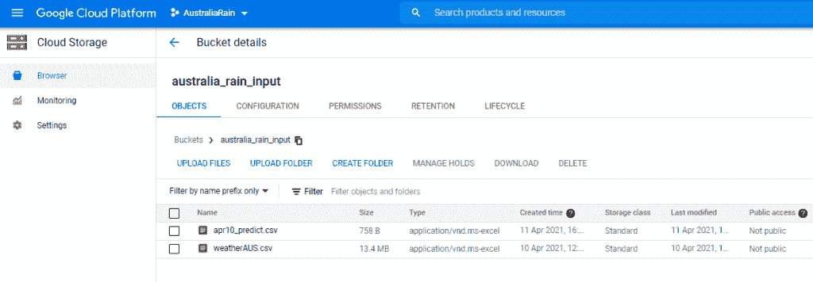
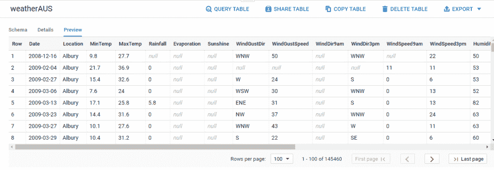
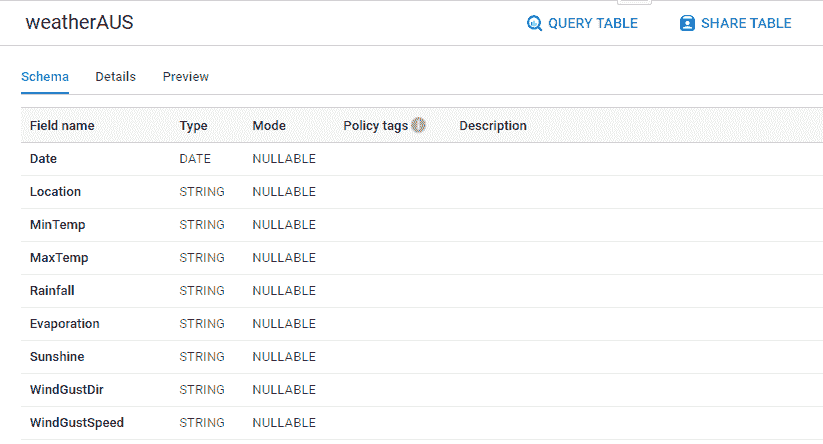
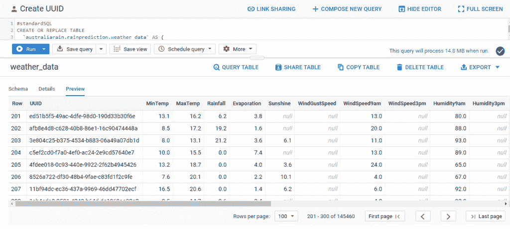
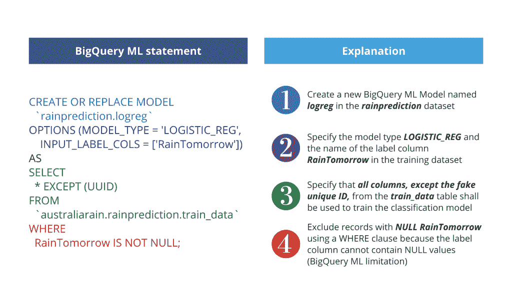
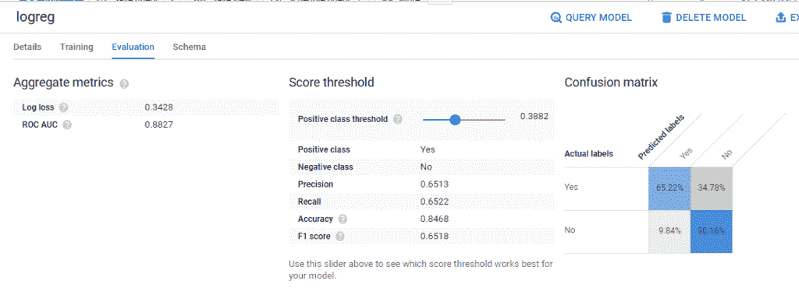
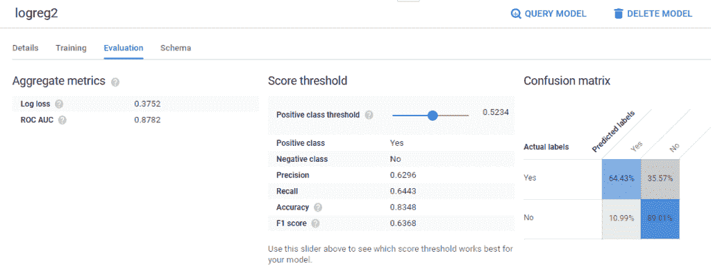
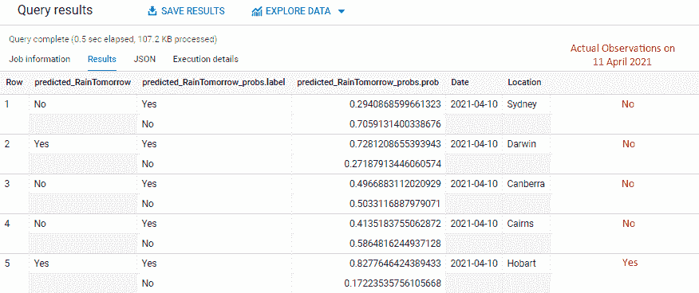

# 如何使用 Google BigQuery ML 训练一个模型来预测第二天的降雨

> 原文：<https://towardsdatascience.com/how-to-train-a-model-to-predict-next-day-rain-with-google-bigquery-ml-d2231c05dcd8?source=collection_archive---------46----------------------->

## 用大家都非常熟悉的 SQL 语法预测未来，速度快得惊人，而且简单。


*照片由* [*安娜·阿特金斯*](https://unsplash.com/@ak1?utm_source=unsplash&utm_medium=referral&utm_content=creditCopyText)*[*Unsplash*](https://unsplash.com/s/photos/rain?utm_source=unsplash&utm_medium=referral&utm_content=creditCopyText)*

*预计会下雨。只有两个简单的词，但有时赌注可能比明天出门前拿一把伞要高得多。雨水可能会破坏野餐计划，也可能会给急于拯救遭受旱灾的农作物的农民带来巨大的快乐。*

*学习如何预测第二天的降雨是用 Google BigQuery 探索机器学习的一种简单实用的方法。所以，让我们来看看如何让它发生。*

***在这篇文章中，你会发现:***

1.  *为什么机器学习要用 BigQuery ML？*
2.  *如何将数据集摄取并拆分成训练集和测试集？*
3.  *如何训练和评估一个分类模型？*
4.  *如何预测第二天的降雨？*

# *为什么机器学习要用 BigQuery ML？*

*想象一下，作为一名生活在 SQL 中的数据分析师，您了解 BigQuery 数据仓库中存储了哪些数据。你可能最近学习了一些关于机器学习的基础知识，但绝不是一个可以闭着眼睛写 Python 代码的狂热的 ML 专家。*

*然而，你**想要用 BigQuery 数据集建立一个机器学习模型，来预测某些可能对你的业务有价值的行为**。你需要尽快得到它，因为在商界，时间不等人。*

*如果你不太了解复杂的 ML 框架，比如 TensorFlow 或 Keras，你应该如何在短时间内实现它呢？在不疯狂使用 Python 或 Java 编程的情况下，如何编写完整的 ML 解决方案呢？*

*这也是 BigQuery ML 真正能够大放异彩的地方。简而言之，它允许你使用标准的 SQL 查询在 BigQuery 中创建和训练机器学习模型。这种方法有 3 个主要好处。*

*   *你不需要花费太多的时间去尝试用各种各样的新工具从你的 BigQuery 数据仓库中导出数据*
*   *如果有法律限制或合规性要求严格控制如何导出数据并将其转移到进行分析和机器学习，您就不必寻求大量批准(当然，遵守访问控制政策和常识在这里仍然适用。)*
*   *你不需要把自己逼疯去用 Python/ Java 创建一个 ML 解决方案，也不需要加入长长的等待名单去麻烦别人(甚至整个团队)来帮你。*

*那么，这对企业到底意味着什么呢？这意味着**一种更简单、更快速的方式来利用机器学习来预测未来可能发生的事情，以及企业应该如何应对，以有效抓住机遇或减轻风险。***

*提醒一句，目前 BigQuery ML on 支持一系列特定的模型。它们包括线性回归、逻辑回归、K 均值聚类、张量流、矩阵分解、XGBoost、深度神经网络和基于 ARIMA 的时间序列模型。*

*我个人认为可用的选项足以为常见的 ML 用例快速构建基线模型。但是请务必查看 [BigQuery 文档](https://cloud.google.com/bigquery-ml/docs/reference/standard-sql/bigqueryml-syntax-create-boosted-tree)以获得最新的产品列表。*

# *开始之前*

## *我们的目标和游戏计划*

*在进入 BigQuery 之前，这里是我们想要实现的:给定今天关于风向、降雨量、最低温度、最高温度、云量等等的观测数据，我们能预测明天是否会下雨吗？*

*我们拥有的是一个 [Kaggle 数据集](https://www.kaggle.com/jsphyg/weather-dataset-rattle-package)，包含了 2007 年至 2017 年间澳大利亚选定地点的 10 年天气观测数据。下面是我们关于如何将数据集转化为分类模型的游戏计划，我们可以用它来预测 2021 年的第二天降雨。*

**

*作者图片*

*诚然，我们正试图创建一个非常简化的降雨预报，它无处不在，以至于人们很容易忽视它的巨大价值:从大量数据中预测未来的能力。但是，不要被它的简单性所迷惑，因为预测能力是唯一重要的东西，而不是花哨的 ML 算法或脑筋急转弯技术！*

## *初始设置*

*在我们为那些令人兴奋的机器学习的东西疯狂之前，这里有 3 件你需要设置的事情。*

1.  *在谷歌云平台上创建一个项目*
2.  *在 BigQuery 上创建数据集*
3.  *从我的 [GitHub](https://github.com/Skye-Tran/BigQueryML-AUSRainPrediction.git) 下载以下 2 个 CSV 文件，然后[将它们](https://cloud.google.com/storage/docs/uploading-objects)上传到 Google 云存储*

*   *weatherAUS.csv:可以从 [Kaggle](https://www.kaggle.com/jsphyg/weather-dataset-rattle-package) 下载。我们用它来训练和测试 ML 模型*
*   *apr10_predict.csv:可从我的 [GitHub](https://github.com/Skye-Tran/BigQueryML-AUSRainPrediction.git) &下载，包含 2021 年 4 月 10 日的天气观测。我们用它来预测 4 月 11 日是否会下雨*

**

**新项目“澳大利亚铁路”&数据集“降雨预测”已创建(图片由作者提供)**

**

**上传到云存储的 2 个 CSV 文件(图片由作者提供)**

# *摄取和分割数据集*

## *摄取数据集*

***第一步。将云存储中的 2 个 CSV 文件加载到 BigQuery***

*由于 weatherAUS 数据集将空值写成“NA”字符串，所以我将使用 bq load 命令通过 null_marker 选项直接将“NA”字符串作为空值导入。下面是怎么做的。*

*在 GCP 控制台上，单击页面顶部的激活云外壳按钮来配置您的 Google 云外壳计算机。给它一分钟左右的加载时间。*

**

*作者图片*

*要加载 weatherAUS 数据集，请输入下面的命令 ***，但要记住更新云存储 URI(以 gs://开头，以。因为您的 csv 文件将位于不同的位置*** 。*

```
*bq load --autodetect --null_marker="NA" --source_format=CSV rainprediction.weatherAUS gs://australia_rain_input/weatherAUS.csv*
```

**

*作者图片*

*当看到要求授权云壳的弹出窗口时，点击**授权**。*

**

*作者图片*

*等到看到当前状态:DONE，然后输入下一个命令来加载 apr10_predict 数据集。 ***但是也别忘了更新云存储 URI。****

```
*bq load --autodetect --source_format=CSV rainprediction.apr10_predict gs://australia_rain_input/apr10_predict.csv*
```

*看到当前状态:完成此加载作业后，刷新您的浏览器。*

**

*作者图片*

*仔细检查是否可以在 BigQuery 中新创建的数据集下看到两个名为 weatherAUS 和 apr10_predict 的新表。*

**

*作者图片*

***步骤二。查看加载到 BigQuery** 中的数据*

*weatherAUS 表的快速预览**显示有 145，460 行数据。标签(即我们试图预测的)是 RainTomorrow，所有其他列是预测器(即我们可能用来预测第二天是否下雨的变量)。***

**

*作者图片*

*不要忘记查看**模式**来验证数据类型。在 BigQuery ML 中，确保每一列的数据类型正确总是有好处的。*

*为什么这样因为不同的数据类型会导致非常不同的数据预处理处理，这些处理是由 BigQuery ML 自动执行的。简而言之，混合数据类型可能导致次优的数据处理，最终阻碍 ML 模型的准确性。*

**

*作者图片*

*在我们的例子中，MinTemp、MaxTemp、rainbow、Sunshine 等数值使用字符串类型似乎有点奇怪。请记住这一点，因为我们将在下一节中解决它。*

## *将数据集分成训练集和测试集*

*接下来，我们将把数据集分成训练集和测试集。*

*   *训练集:训练一个分类模型，把给定的天气观测映射到规定的标签(即 RainTomorrow)。*
*   *测试集:严格用于评估最大似然模型是否可以用该模型以前没有见过的新数据进行预测*

***第一步。创建一个假的唯一 ID 列，并更正数值的数据类型***

**

*作者图片*

***第二步。基于伪唯一 ID 列(UUID)分割数据集***

*为了获得我的训练和测试集的可重复数据采样，我使用了下面由 [Christy Bergman](/lessons-learned-using-google-cloud-bigquery-ml-dfd4763463c) 编写的 BigQuery 代码。*

**

*训练集(图片由作者提供)*

**

*测试集(图片由作者提供)*

# *训练和评估分类模型*

## *使用创建模型训练 ML 模型*

***训练一个简单的逻辑回归模型***

*现在最激动人心的部分来了！让我们创建一个逻辑回归模型，这是分类问题的最简单的模型类型。大伙儿，击鼓吧！*

**

*作者图片*

*在 BigQuery 中运行上述语句后，我们将获得第一个分类模型，该模型将天气观测结果映射为明天下雨是或否。哒哒！*

**

*作者图片*

***定制逻辑回归模型***

*众所周知，许多精明的 ML 工程师在优化他们的模型时喜欢自由选择。但另一方面，如果你是一名 ML 新手或在关键时刻，必须做出如此多的选择(例如，学习速度，如何以及以什么比例将输入数据分成训练集和评估集等等)可能会令人生畏。*

*幸运的是， **BigQuery ML 已经将某些设置作为默认设置**。从上面的例子可以看出，不需要处理无数的选择，只需要几行代码就可以相对容易地建立并运行一个像样的 ML 模型。*

*但是如果我们想要定制某些设置来满足我们的需求呢？让我们尝试定制我们的逻辑回归模型来反映 3 个变化。*

1.  *随机抽取 20%的训练数据用于评估(目前 BigQuery ML 仅使用 10，000 行进行评估，因为我们的数据集超过 50，000 行。)*
2.  *纠正不平衡的训练数据集(默认选项是不平衡权重。)*
3.  *应用 L2 正则化来惩罚复杂性，从而控制过度拟合(默认选项是没有 L2 正则化。)*

**

*作者图片*

*哦，等等！是不是意味着我们可以定制任何东西，任何东西？没有。至少现在不会，但是可以随时查看 [BigQuery 文档](https://cloud.google.com/bigquery-ml/docs/reference/standard-sql/bigqueryml-syntax-create-boosted-tree)来了解您不能定制的内容，并尝试您可以定制的内容。*

## *用 ML 评估分类模型。评价*

*是时候使用测试数据集来验证我们第一个简单的逻辑回归模型的性能了。让我们看看这样一个简单的模型(没有任何花哨的微调)能够用前所未见的新数据预测明天的降雨。*

*这个查询再简单不过了。*

**

*作者图片*

*由于测试集的 ROC _ AUC(0.878)与训练集的 ROC _ AUC(0.880)几乎相同，因此我们的模型没有过拟合。0.85 的精度看起来也还过得去。当然，可以用[转换条款](https://cloud.google.com/bigquery-ml/docs/reference/standard-sql/bigqueryml-preprocessing-functions)做更多的功能工程来提高 F1_score，但是现在，让我们坚持现有的。*

# *用分类模型预测第二天的降雨*

*在 apr10_predict 表中，我收集了 2021 年 4 月 10 日澳大利亚几个地方的[每日天气观测](http://www.bom.gov.au/climate/dwo/)。接下来，我们将使用逻辑回归模型来预测 2021 年 4 月 11 日是否会下雨。*

**

*作者图片*

*让我解释一下上面的截图是怎么回事。*

1.  ****predicted _ rain tomorrow***根据我选择的 0.6 阈值显示 4 月 11 日是否可能下雨。只要“下雨”的概率超过 0.6，模型就会预测第二天“明天下雨”。*
2.  *接下来的两列***predicted _ rain tomorrow _ probs . label***和***predicted _ rain tomorrow _ probs . prob***显示了 BigQuery 如何得出预测。在第一行中，模型计算出悉尼“不下雨”的概率是 0.75，而“下雨”的概率只有 0.25。因为“下雨”的概率低于阈值 0.6，所以对第二天下雨的预测是“不”。*
3.  *红色的最后一栏是我添加到截图中的，这样你可以很容易地比较预测和 4 月 11 日的实际降雨。这不是模型在执行查询时会给你的。*

*如果你仍然想知道阈值在分类模型中意味着什么，看看这个[简单的解释](https://developers.google.com/machine-learning/crash-course/classification/thresholding)。但是就预测而言，我们只对达尔文的预测是错误的。我会说这并不坏，因为我们只花很少的时间在 Google BigQuery 中编写简单的查询。*

*当时间是最重要的，并且您的数据在 BigQuery 中随时可用时，就是这样了——big query ML 是您的最佳选择！*

# *包扎*

*现在，您可以快速浏览如何训练和评估分类模型，以及如何使用 BigQuery ML 预测第二天的降雨量！BigQuery ML 能否取代其他类似 Tensorflow、Keras 等行业标准的机器学习框架？可能不是因为让 ML 在现实生活中发挥作用是一系列相互竞争的目标之间的权衡，如速度、简单性和准确性。*

*如果你是一个精明的 ML 工程师，**更喜欢大量的自由来试验各种 ML 模型和不同的数据预处理技术，以实现极其精确的预测，你可能最好去别处看看**。这是因为 BigQuery ML 目前提供的选择有限，因为它保留了它的简单性和速度。*

*然而，作为一个欣赏**快速测试一个新想法或者创建一个足够好的 ML 基线模型**的人，我确实看到了 BigQuery ML 的价值。**我不必为尝试从数据仓库导出数据而烦恼**，因为我正在 BigQuery(数据仓库本身)中训练和部署 ML 模型。此外，没有必要使用 Python 或 Java 构建一个完整的 ML 管道，因为我可以使用 SQL 用几行代码创建一个模型。有什么不喜欢的？*

*感谢您的阅读。对我如何能做得更好有反馈，或者只是想聊天？在评论里告诉我或者在 [LinkedIn](https://www.linkedin.com/in/skyetran/) 上找到我。祝大家这周过得愉快！*

**原载于 2021 年 4 月 12 日 http://thedigitalskye.com*[](http://thedigitalskye.com/2021/04/13/how-to-train-a-classification-model-to-predict-next-day-rain-with-google-bigquery-ml/)**。***