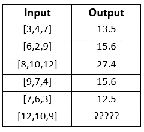
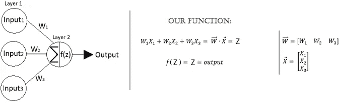
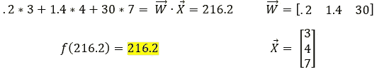
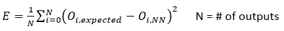
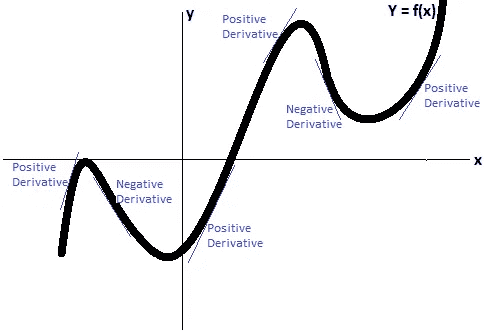
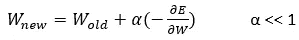
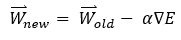
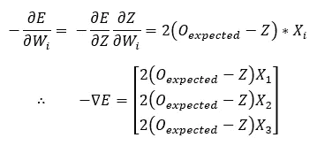

# 如何从零开始训练一个神经网络

> 原文：<https://towardsdatascience.com/how-to-train-a-neural-network-from-scratch-952bbcdae729?source=collection_archive---------31----------------------->

## 寻找神经网络权重背后的直觉，并附有示例。

在这篇文章中，我将继续我们关于人工神经网络的讨论，并给出一个用 python 编写的非常简单的神经网络的例子。我正在写的这一系列文章的目的是从头开始对 ANN 的作一个完整的解释，而不是躲在特殊的库后面。Tensorflow 非常适合原型制作和生产，但对于教育来说，唯一的学习方法是拿起铅笔和纸，开始学习数学。

在上一篇文章中，我回顾了人工神经网络背后的灵感以及如何对人脑进行数学建模(你可以在这里找到这篇文章)。我们的下一步是为我们的模型找到正确的权重。

## 将输入映射到输出

假设我们有一个输入和输出的列表。这些可以是任何东西，股票特征和价格，财产特征和销售价格，学生行为和平均考试分数，它们可以是任何东西；但是让我们保持一般的东西，说我们有一些输入和输出。

****图片作者****

我们的目标是预测最后一次输入的输出。为此，我们必须找到将这些输入映射到其输出的关系(函数)。现在为了学习，我把这个关系做成了线性。这告诉我们可以用身份激活函数代替 sigmoid，而且只有 1 层(输出层)。

如果你看不出为什么一个线性关系只给我们一层具有身份激活功能；请容忍我。在我解释之前，让我给你看一下我们的神经网络，并向你展示它所代表的功能。

*注意我们如何通过应用点积来清理事物。它的代码效率也更高。请记住，这个神经网络也会有偏差，我们可以通过手动输入 1 作为输入之一，然后对这个 1 应用一个权重来给出偏差。现在，忽略偏见。*****图片作者****

如果我们有更多的层使用相同的功能，那么我们总是可以简化到上面的方程。自己尝试一下，添加一个中间层，每个中间层有 2 个神经元，每个神经元都有身份激活函数，然后写出对应于网络的方程，并将其简化。

你可以用许多不同的方法很容易地解决这里的重量。毕竟只是一个线性方程组。但是，让我们试着在一般情况下解决这个问题，我们没有线性关系。

## 用误差函数来衡量我们的错误程度

所以，让我们找点乐子吧。如果不把它看作一个线性方程组，我们怎么能算出重量呢？好吧，你必须从某个地方开始，所以让我们先瞎猜一下它们可能是什么。我猜 W1 = .2，W2 = 1.4，W3 = 30。

现在让我们看看我们的猜测有多好，并在其中一个输入上进行测试(使用上表中的相同数据)。

****图片作者****

回想一下，根据我们的数据，正确的输出(或预期输出)应该是 13.5；我们太离谱了！让我们用一个*误差函数*来量化我们到底错了多少。当神经网络输出正确的值时，我们希望误差为 0。先说；误差=正确输出-我们的 ANN 的输出(例如；0 = 13.5–13.5，如果我们的权重正确)。

我们快到了。实际地想，我们的错误是我们想要最小化的。那么，我们当前误差函数的最小值是多少？没有最低！实际上，我们可能会有-∞误差。我们通过对函数求平方来解决这个问题，所以它不能是负的，误差=(正确的输出-我们的人工神经网络的输出)。注意这个误差函数的形状是一个以 0 为中心的抛物线。这是单个输出神经元的误差。如果我们有多个输出，那么我们只取所有输出的平均误差。所以，我们有；

*这被称为均方误差函数。这是有 N 个输出的一般情况。总误差是每个输出的平均误差。在我们的例子中，N = 1。*****图片作者****

## 最小化我们的错误(最小化我们的错误)

当你把一个砝码改变很小的量时(∂W)，你会得到一个误差和变化(∂E).)因此，如果我们想知道这个权重的变化对误差的影响有多大，我们可以取 2，∂E/∂W.的比值，这可以看作是误差函数对这个权重的偏导数，或者这个权重的微小变化如何改变误差。

这对我们有什么帮助？好吧，如果你擅长微积分，你可能知道这是什么方向。但是，如果你不是，看看下面的图表。

*回想一下，导数只是一个斜率。*****图片作者****

这只是一个任意的函数。取这条线上的任何一点，把你的手指放在上面。现在，大声说出这一点的斜率是正还是负。如果斜率为正，沿+X 方向移动手指一点点。如果是负数，在-X 方向移动它。如果斜率为 0…选择另一个点。为了几个点这样做。注意到什么了吗？

不管怎样，你总是朝着线上更高的值移动手指。

> 导数的方向总是上升的方向。

如果导数为负，X 的减少将增加 y。如果导数为正，X 的增加将增加 y。

回到我们和∂E/∂W.的神经网络，我们想减少误差，所以我们想把重心移向下降的方向。我们可以通过计算这个导数，然后求负来做到这一点。现在，我们将重心向这个负导数的方向移动一小步。或者；

α确保我们朝着这个方向迈出很小的一步。它被称为学习率，是另一个超参数。****图片作者****

这只是我们网络中的一个重量。我们可以把这个表达式写成矩阵形式，记住梯度只是一个包含所有∂E/∂Wi.导数的向量矩阵形式如下所示；

记住坡度就是最陡的上坡方向。我们想下降，所以我们去负梯度的方向。****图片作者****

现在，上述等式可以重复应用于权重，直到它们收敛到正确的值。如果我们的网络更大，找到这个梯度有点痛苦，但只要我们使用可微分的激活函数，它总是可能的。这个等式的重复应用被称为*梯度下降*算法。

## 快速小结

让我总结一下过去的 2 页。我们有数据和一些输出。我们知道这些数据和输出之间有某种关系。受人脑的启发，我们可以构建一个人工神经网络。我们用随机权重初始化这个神经网络，然后开始在我们拥有的数据和输出上测试它。当我们测试时，我们通过使用误差函数来量化我们的网络有多错误，然后使用梯度下降来最小化这个误差函数。

# 例子

既然我们对训练神经网络背后的理论有了一个想法，我们需要专注于如何实现这个理论。早些时候，我给出了一些输入和输出的例子，并为找到它们的关系制定了游戏计划。

手动找到正确的权重是困难的，几乎是不可能的(不把它当作一个线性方程组)。但是通过使用梯度下降算法和我们之前推导出的误差函数，我们可以用正确的方法来计算这些权重。

## 寻找我们函数的梯度

现在，这是我们从输入到错误的神经网络。记住，为了学习，我们忽略了偏见。我们将在下一个项目中添加它。

****图片作者****

我们希望找到误差相对于每个重量的导数(每个重量的微小变化对误差的影响)，然后将该重量向求反导数的方向(或最陡下降的方向)移动一点点。我们可以使用如下所示的链式法则来做到这一点；

*链式法则看起来吓人，其实就是简单的除法。注意，你可以取消∂Z's，就像处理分数一样(你基本上就是这样)。另一种思考方式是。如果你想知道权重的变化对误差的影响有多大，你首先需要知道它对 Z 的影响有多大，然后你需要知道 Z 对误差的影响有多大。此外，掠夺者 3 点符号意味着“因此”。*****图片作者****

就这样，我们找到了我们的梯度！现在我们只需要迭代地应用梯度下降更新来使我们的权重收敛。下面是执行此操作的代码:

*坡度下降的提示。*****图片作者****

更新权重 2000 次通常就足够了，如果你猜测荒谬的权重在数万或更高，可能需要更多。看看你运行这段代码后得到的权重，是不是得到了[.5，. 9，1.2]？这就是我用来生成这些数据的确切重量。

这难道不可思议吗？！通过使用微积分和数据，我们可以近似任何两个相关事物之间的关系！你可能会说，“这是一个简单的例子，我可以在 2 分钟内解决它，把它当作一个线性方程组”。嗯，你完全正确。但是，如果有 5 或 6 层，每层有 1000 多个神经元，每层都使用 sigmoid 激活功能，会怎么样呢？以任何方式手工解决都是不可能的。我们需要的是一个系统的算法，可以找到我们网络中权重的梯度，我在这里[过了](https://doingengineering21.medium.com/full-implementation-of-gradient-descent-no-holding-back-86e688f36064)。

> 感谢您的阅读！如果这篇文章在某种程度上帮助了你，或者你有什么意见或问题，请在下面留下回复，让我知道！此外，如果你注意到我在某个地方犯了错误，或者我可以解释得更清楚一些，那么如果你能通过回复让我知道，我会很感激。

> 这是一系列文章的继续，这些文章从头开始对神经网络进行了直观的解释。其他文章请参见下面的链接:
> 
> [第 1 部分:什么是人工神经网络](/what-is-an-artificial-neural-network-b508c821ace8)
> 
> 第 2 部分:如何从头开始训练神经网络
> 
> [第 3 部分:梯度下降的全面实施](https://doingengineering21.medium.com/full-implementation-of-gradient-descent-no-holding-back-86e688f36064)
> 
> [第 4 部分:梯度下降的实现(示例)](https://doingengineering21.medium.com/implementing-gradient-descent-example-102b4454ea67)
> 
> [第五部分:如何在 python 中对手写数字进行分类](https://doingengineering21.medium.com/how-to-classify-handwritten-digits-in-python-7706b1ab93a3)