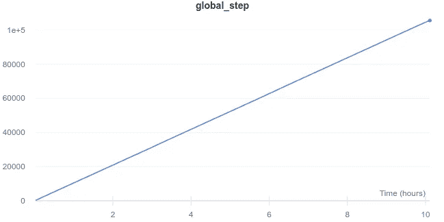
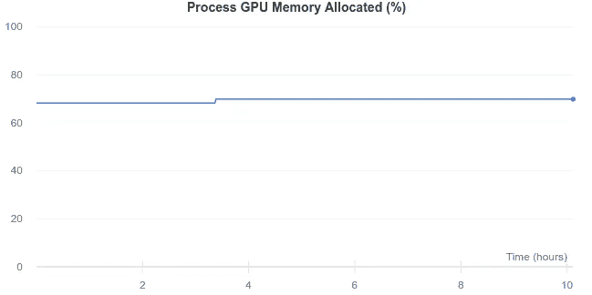
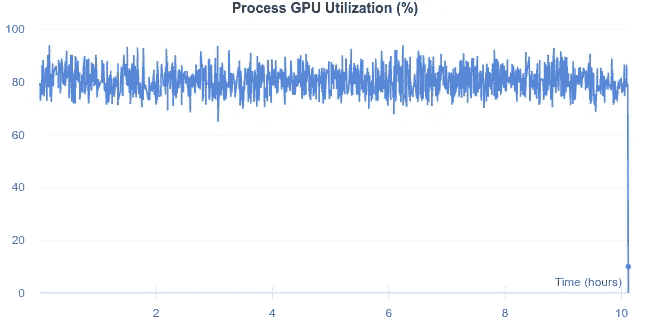
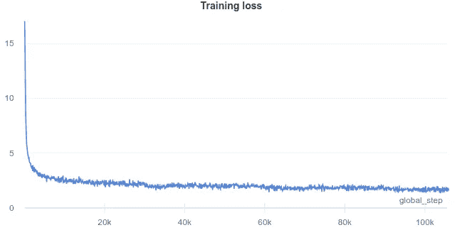
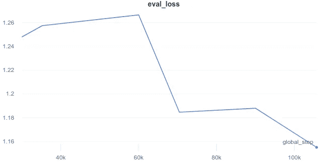

# 如何用简单的变形金刚训练一个 mT5 翻译模型

> 原文：<https://towardsdatascience.com/how-to-train-an-mt5-model-for-translation-with-simple-transformers-30ba5fa66c5f?source=collection_archive---------8----------------------->

## mT5 模型在一百多种不同的语言上进行了预训练。让我们看看如何利用这一点来训练一种低资源语言——僧伽罗语的双语翻译模型。


亚历山大·巴甫洛夫·波德瓦尼在 [Unsplash](https://unsplash.com?utm_source=medium&utm_medium=referral) 拍摄的照片

mT5 是一个多语言 Transformer 模型，在包含来自 101 种不同语言的文本的数据集(mC4)上进行了预训练。mT5 模型的体系结构(基于 T5)被设计成支持任何自然语言处理任务(分类、NER、问题回答等)。)通过将所需的任务重新架构为序列到序列的任务。

换句话说，文本进去，文本出来。例如，在分类任务中，模型的输入可以是要分类的文本序列，模型的输出将是该序列的类标签。对于翻译来说，这就更简单了。进去的文本是一种语言，出来的文本是另一种语言。

考虑到 mT5 的多语言能力和序列到序列格式对语言翻译的适用性，让我们看看如何为机器翻译微调 mT5 模型。在本文中，我们将训练一个翻译模型在僧伽罗语(我的母语！)和英语。为像僧伽罗语这样的低资源语言训练好的翻译模型是相当具有挑战性的，因为资源(训练数据)的低可用性。希望在一个巨大的数据集(包括僧伽罗语，尽管不是很多)上的多语言预训练将有助于 mT5 模型以直接僧伽罗语-英语(反之亦然)序列的形式补偿不充分的训练数据。

我们将使用简单的变形金刚库(基于 Huggingface 变形金刚库构建)来训练 mT5 模型。训练和测试数据将从[Tatoeba 翻译挑战赛](https://github.com/Helsinki-NLP/Tatoeba-Challenge)中获得。图形和图表由[权重&偏差](https://wandb.ai/)生成，这在用于实验跟踪和超参数优化的简单变压器中得到本地支持。

*注:在简单变形金刚 Github repo 的* `*examples/t5/mt5_translation*` *目录(* [*链接*](https://github.com/ThilinaRajapakse/simpletransformers/tree/master/examples/t5/mt5_translation) *)中可以找到本文的所有代码。*

# 概述

1.  安装简单的变压器
2.  下载数据集进行翻译
3.  训练模型
4.  评估模型—计算 BLEU 分数
5.  包裹

# 设置

*您可以在简易变形金刚* [*文档*](https://simpletransformers.ai/docs/installation/) *中找到最新的安装说明。*

1.从[这里](https://www.anaconda.com/distribution)安装 Anaconda 或 Miniconda 包管理器。

2.创建新的虚拟环境并安装软件包。

```
conda create -n st python pandas tqdm sacrebleu
conda activate st
```

3.如果使用 CUDA:

```
conda install pytorch>=1.6 cudatoolkit=10.2 -c pytorch
```

否则:

```
conda install pytorch cpuonly -c pytorch
```

4.安装简单的变压器。

```
pip install simpletransformers
```

# 数据准备

培训和测试可从 Tatoeba 翻译挑战[数据](https://github.com/Helsinki-NLP/Tatoeba-Challenge/blob/master/Data.md)页面获得。你还可以在那里找到大量其他语言的数据集(包括《指环王》中精灵使用的语言*辛达林语*😀).

如果您想尝试为另一种语言训练翻译模型，可以下载该语言的数据集，而不是僧伽罗语。本文中的所有其他步骤适用于任何语言数据集。

*如果你懒得搜索数据集，这里有* [*直接链接*](https://object.pouta.csc.fi/Tatoeba-Challenge/eng-sin.tar) *。*😜

1.  下载(压缩的)翻译数据集并解压缩存档。
2.  提取`train.trg.gz`和`train.src.gz`档案(是的，训练数据在档案里面的档案里)。
3.  检查`data/eng-sin/`目录下是否有`train.trg, train.src, test.trg, test.src`文件。(如果没有，将文件移动到这个位置可能是最容易的，因为代码示例将假设这些文件可以在这里找到)

现在，让我们构建`tsv`文件，我们将使用它来训练和测试我们的 mT5 模型。

运行上面的代码会将两个文件`train.tsv`和`eval.tsv`写入`data/`目录。

# 模特培训

一旦我们有了数据文件，我们就可以开始训练模型了。

首先，我们将导入必要的东西并设置日志记录。

接下来，我们设置我们的培训和评估数据。

这里，我们从数据集中删除了`prefix`值，因为我们希望模型根据输入来推断所需的任务。如果输入是英语，那么它应该被翻译成僧伽罗语。如果是僧伽罗语，那就要翻译成英语。模型应该不需要一个前缀就能在训练后搞清楚这一点！

*您可以使用前缀值来告诉 mT5(或 T5)执行特定的任务。这对于训练一个可以执行多项任务的模型非常有用，如下文所示。*

</going-global-how-to-multi-task-in-multiple-languages-with-the-mt5-transformer-892617cd890c>  

## GPU 内存使用侧记

训练转换器模型所需的 GPU 内存量取决于许多不同的因素(最大序列长度、层数、注意力头数、隐藏维度的大小、词汇表的大小等)。).其中，模型的最大序列长度是最重要的。

对于 mT5 模型中使用的自注意机制，存储器需求随着输入序列长度的平方增长( *O(n)空间复杂度*)。也就是说，当序列长度加倍时，所需的内存增加了四倍。

此外，mT5 的词汇量比 T5 大得多(大约 250，000 个令牌到大约 32，000 个令牌)，这导致 mT5 在所需的 GPU 内存方面相当糟糕。

从所有这些中得出的结论是，我们可以输入到模型中的令牌数(最大序列长度)是以*巨大的*溢价而来的。基于这一点，如果模型不需要前缀，那么在前缀上使用少量的标记也是一种浪费。

现在，让我们回到训练模型！

这里，我们指定我们希望如何设置模型，并根据`model_args`初始化预训练的 mT5 模型。

我使用的最大序列长度(`max_seq_length`)为 96，训练/评估批量为 20。通常，批量越大意味着 GPU 利用率越高，因此训练时间越短。如前所述，更长的序列需要更多的 GPU 内存，这意味着更小的批量和更长的训练时间。最大序列长度为 96，这使得该模型可以处理相当长的文本(通常是几个句子)，同时保持训练时间的实用性。

*请注意，您可能需要调整这些值，以便在您自己的 GPU 上训练模型。如果 GPU 内存不足(CUDA 内存错误)，请尝试减少批处理大小和/或最大序列长度。*

*如果你想尝试微调的模型，你可以在 Huggingface 模型 hub 上找到* [*这里*](https://huggingface.co/thilina/mt5-sinhalese-english) *。*

现在，要运行训练，我们只需要调用`train_model()`方法。

就这么简单！经过微调的模型将在培训结束时保存到`outputs`目录中(有关模型保存的更多信息，请参见[文档](https://simpletransformers.ai/docs/tips-and-tricks/#saving-checkpoints))。

通过这些设置，该模型在 RTX 3090 (24 GB VRAM)上完成培训需要 10 个多小时。



培训花费的时间—按作者

我可能已经得到了稍微大一点的批量(正如你在下面看到的)，但是我不想冒训练崩溃的风险，因为我整夜都在运行它！



培训期间的 GPU 内存使用情况—按作者

安全起见，批处理大小为 20 意味着 GPU 没有得到充分利用，但是，80%左右也不错！



GPU 利用率(核心数)—按作者

# 可视化培训进度

在`model_args`中设置`wandb_project`值告诉简单的变压器自动记录重量&偏差的训练进度。你可以在这里找到这个实验[的所有记录数据。](https://wandb.ai/thilina/MT5%20Sinhala-English%20Translation?workspace=user-thilina)

## 培训损失



培训损失图表—按作者

## 评估损失



评估损失图表—按作者

这里的实际损失值并没有告诉我们太多，但是它们正在减少的事实确实意味着模型正在学习！

事实上，由于评估损失仍在减少，该模型似乎尚未收敛。再训练一两个纪元可能会很好地提高模型的性能，但是，这将需要另外 10 或 20 个小时！

*使用终端命令* `*simple-viewer*` *，在基于网络的图形用户界面(Streamlit app)中尝试微调后的模型。*

# 评估模型

用于评估和比较机器翻译模型的标准度量是 BLEU 分数，特别是机器翻译年会(WMT)使用的 BLEU 方案。SacreBLEU 库可以用来计算这个分数。

*关于 BLEU 评分的更多信息，请参考 Matt Post 的这篇* [*论文*](https://arxiv.org/abs/1804.08771) *。*

由于 Tatoeba Challenge 还提供了基准翻译模型的 BLEU 分数，因此我们可以轻松地将我们的模型与基准模型进行比较。

现在，让我们加载我们的微调模型，看看它是如何叠加的！

我们导入必要的东西(注意`sacrebleu`库)并初始化模型，就像我们为训练所做的一样，除了我们从`outputs/`加载微调的模型，而不是预训练的模型。

我们还为使用模型生成文本(解码)设置了一些参数。这里，`max_length`是模型输出而不是输入的最大长度。

*如果您想进一步了解解码过程，请参考本* [*文章*](/asking-the-right-questions-training-a-t5-transformer-model-on-a-new-task-691ebba2d72c) *中的* ***解码算法*** *部分以及本优* [*笔记本*](https://github.com/huggingface/blog/blob/master/notebooks/02_how_to_generate.ipynb) *by Huggingface。*

接下来，我们将准备用于评估的数据。

在这里，我们加载评估数据，并准备单独的输入和真实翻译列表(从英语到僧伽罗语，反之亦然)。

加载并准备好模型和评估数据后，我们就可以开始翻译了。对于简单的变压器，我们只需用输入数据调用`model.predict()`。然后，我们使用`sacrebleu`工具来计算 BLEU 分数。

*如果您按照安装说明进行操作，那么* `*sacrebleu*` *库应该安装在您的虚拟环境中。如果没有，可以用* `*pip install sacrebleu*` *安装。*

运行该程序会得到以下分数(四舍五入):

*   英语到僧伽罗语:10.3
*   僧伽罗语对英语:24.4

这两个分数都比翻译模型在 Tatoeba 挑战赛中发布的[分数有所提高！](https://github.com/Helsinki-NLP/Tatoeba-Challenge/blob/master/results/tatoeba-results-langgroup.md)

# 包扎

尽管训练数据有限，但 mT5 模型在僧伽罗语和英语之间的翻译方面做得很好。

mT5 超过了 Tatoeba 挑战赛公布的分数。但是，应该注意的是，除了僧伽罗语和英语之外，挑战赛中的基准模型还针对其他几种语言进行了训练。此外，mT5 模型需要更多的计算资源来培训和使用。另一方面，mT5 模型有潜力通过更多的训练来提高当前的分数。

最后，你可以在 Huggingface 模型中心[这里](https://huggingface.co/thilina/mt5-sinhalese-english)找到微调过的模型。可以直接用简单的变压器使用，如下图。

```
from simpletransformers.t5 import T5Model model = T5Model("mt5", "thilina/mt5-sinhalese-english")print(model.predict(["Let's translate!"]))
```