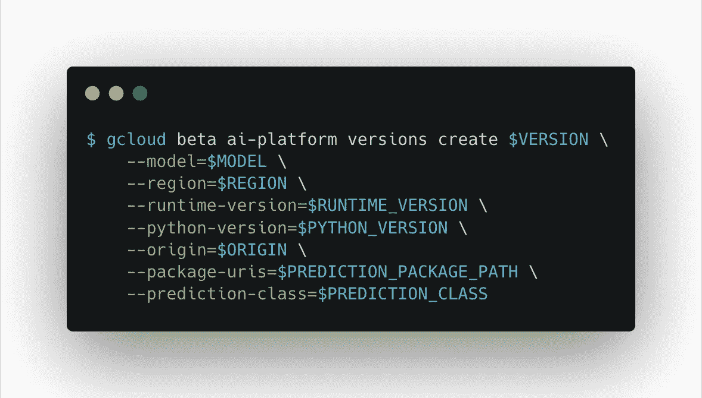

# 如何在 Google 云平台上用 Vaex 训练和部署一个机器学习模型

> 原文：<https://towardsdatascience.com/how-to-train-and-deploy-a-vaex-model-pipeline-on-google-cloud-platform-d5023ef46322?source=collection_archive---------19----------------------->

股票图片来自[pixabay.com](http://pixabay.com)

# 介绍

T 训练机器学习(ML)模型通常是一项相当漫长且计算密集型的任务，尤其是在使用大量数据时。

无论您使用的是您最喜欢的深度学习框架、可信的梯度增强机器还是定制的系综，模型训练阶段都可以轻松消耗您笔记本电脑或本地服务器上的大部分(如果不是全部)可用资源，从而有效地“冻结”您的机器，并阻止您执行其他任务。或者，你手头可能甚至没有足够的资源来训练一个复杂的模型来处理你辛辛苦苦收集的所有数据，或者使用你精心设计的所有功能。

最重要的是，管理 ML 模型是一个持续的过程:人们可能需要相对频繁地重新训练模型，以考虑新数据、概念漂移、领域中的变化，或者只是通过调整输入特征、架构或超参数来改进模型。

因此，如果没有必要，将 ML 模型创建的繁重阶段外包给由公认的云提供商管理的服务会非常方便。使用这种方法，计算资源将不是问题。如今，人们可以“租用”连接了数百个 vCPUs 和数 TB RAM 的计算实例，或者提供定制的集群配置。此外，用户可以提交多个独立运行的培训作业，这些作业不会相互竞争资源。所有这些意味着您可以将更多的时间花在创建最佳模型上，而几乎没有时间管理、维护和配置您的计算资源。值得注意的是，随着时间的推移，这些服务变得越来越便宜，越来越容易获得。

# 谷歌云平台和 Vaex

通过[谷歌云控制台](http://console.cloud.google.com/)看到的谷歌云 AI 平台(作者截屏)

那么 [Vaex](https://github.com/vaexio/vaex) 如何适应这一切呢？即使在云环境中，使用 Vaex 作为构建 ML 解决方案的核心技术也有很多好处。首先，您可以将数据托管在谷歌云存储(GCS)或亚马逊网络服务(AWS) S3 存储桶上，并根据“需要”将其缓慢地传输到您的计算实例。这意味着只下载您的模型需要的特定列，而不是全部文件。甚至可以选择只下载一小部分数据，这对测试和持续集成特别有用。

所有 Vaex 转换都是通过完全并行的高效核外算法完成的。这意味着您总是可以充分利用出租的计算实例，而无需任何额外的设置。无内存复制策略使您可以更轻松地选择所需的机器类型，同时在不牺牲性能的情况下最大限度地降低成本。

整篇文章将重点介绍更多的好处。因此，事不宜迟，让我们看看如何使用 Vaex 来构建 ML 解决方案，然后如何使用 GCP 来实现它。

# 在开始之前

本文假设了 GCP 的一些基本知识，以及如何通过[谷歌云控制台、](https://console.cloud.google.com/)和通过`gcloud` [命令行工具](https://cloud.google.com/sdk/gcloud)与它交互。如果你想跟随这个教程，你需要一个经过认证的谷歌账户，一个 GCP 项目，和一个已经设置好的 GCS 桶。如果你不确定如何做，有许多有用的指南。如果有疑问，GCP 官方文档总是一个好的起点。

*本文中的所有材料都可以在这里* *以及各种其他 Vaex 示例中找到。*

# 使用 Vaex 创建自定义 ML 管道

这个例子使用了公共的[异构活动识别(HAR)](https://archive.ics.uci.edu/ml/datasets/Heterogeneity+Activity+Recognition) 数据集。它包含了从一组志愿者身上获取的几组测量数据，这些志愿者正在进行六种活动中的一种:行走、上下楼梯、坐着、站着和骑自行车。测量结果通过流行的智能手机和智能手表设备获取，包括分别从板载加速度计和陀螺仪采样的三轴加速度和角速度。数据集还包含“*创建时间”*和“*到达时间”*列，它们是分别由操作系统和移动应用程序附加到每个测量样本的时间戳。目标是仅使用单个测量样本来检测佩戴者进行的特定活动。活动本身在“ *gt* ”栏中指定，该栏代表“地面实况”。

以下示例使用通过智能手机设备获得的加速度计数据。它包含了超过 1300 万个样本。为了简洁起见，我们不会对数据进行任何探索性分析，而是直接构建一个生产就绪的解决方案。

让我们从创建一个 Python 脚本开始，该脚本将获取数据，设计相关的特性，并训练和验证一个模型。因为我们使用的是 Vaex，所以获取数据很简单。如果数据是 [HDF5](https://en.wikipedia.org/wiki/Hierarchical_Data_Format#HDF5) 文件格式，并托管在 GCS(或亚马逊的 S3)上，Vaex 将缓慢地传输分析所需的部分。因为我们已经知道需要哪些数据列，所以可以立即预取它们:

下一步是将数据随机分成 3 组:训练、验证和测试。验证集将在训练阶段用作质量控制，而测试集将是已训练模型的最终独立性能指标。

此时，我们可以开始创建一些有用的功能。让我们从做几个坐标变换开始。我们将把三轴加速度测量值从笛卡尔坐标转换到球坐标，以及通过 PCA 变换转换到它们的“自然”坐标系:

即使上面的一些转换并不太复杂，我们仍然可以选择通过 [numba](http://numba.pydata.org/) 使用即时编译来加速它们。请注意，我们还使用了在 *vaex-ml* 版本 0.11 中可用的新 API，而不是更传统的 scikit-learn“fit&transform”方法。

为了捕捉数据中的一些非线性，我们可以在 PCA 组件之间创建一些特征交互:

现在，我们将变得更有创造性。首先，让我们计算每个活动类别的每个主成分的平均值和标准偏差。然后，我们将计算每个主成分的值与每个组的平均值之间的差异，并按该组的标准偏差进行缩放:

请注意我们是如何结合使用 Vaex 和 Pandas 来创建这些功能的。虽然不会存储`df_summary`数据帧，但它的值会被“记住”,作为在`for`循环中定义的表达式的一部分，该循环遵循`groupby`聚合。上面的代码块是一个例子，展示了如何快速清晰地创建新特性，而不需要创建定制的`Transformer`类。

特征工程的另一个有趣的方法是对已经定义的特征子集应用聚类算法，并将得到的聚类标签用作附加特征。 *vaex-ml* 包直接实现了`KMeans`聚类算法，所以保证了非常快速和内存高效。使用`KMeans`算法，我们创建 3 组聚类标签:一组通过对 PCA 组件进行聚类，另一组通过对 PCA 交互组件进行聚类:

在 Vaex 中，任何模型都被视为一个转换器，因此它的输出很容易用作下游计算图中的任何其他功能。

最后，我们还可以利用时间戳特性，计算"*到达时间"*和"*创建时间"*列之间的差异，我们对其应用标准缩放:

定义完所有特性后，为了方便起见，我们可以将它们收集到一个列表中:

数据准备的最后一部分是将目标列" *gt"* 编码成数字格式。在编码之后，我们还将定义一个逆映射字典，稍后我们将使用它将预测的类翻译成它们真正的标签。

至此，我们终于准备好开始训练模型了。您可能已经注意到，我们没有费心去显式地创建一个管道来允许所有的数据转换被传播到验证和测试集。这是因为 Vaex 数据帧隐式记录了对数据进行的所有转换和修改。过滤器、分类编码、缩放，甚至 ML 模型的输出都被认为是数据转换，并且是数据帧的*状态*的一部分。因此，为了加快验证设置，以便我们可以在模型训练期间将其用作参考点，我们只需获取`df_train`的*状态*并将其应用于`df_val`:

现在我们准备实例化和训练模型，我们已经选择它作为一个 [LightGBM](https://lightgbm.readthedocs.io/en/latest/) 分类器:

当与 Vaex 配合使用时，ML 型号也是变压器。这意味着可以将预测添加到数据帧中，就像应用另一种变换一样。这在构建集成时非常有用，对于执行模型诊断也是如此。在我们的例子中，LightGBM 模型的输出是概率数组。为了使输出对模型的最终用户更有意义，我们将找到最可能的类，并对其应用逆转换，这样我们就可以获得最可能的活动的名称——这是一系列转换中的又一个！

一旦模型被训练，我们可以通过计算验证集和测试集上的两个度量来了解它的性能，到目前为止，后者在这个过程中完全没有使用过。同样，要获得预测，我们需要做的就是从`df_train`获得状态，现在包括模型预测，并将其应用于`df_val`和`df_test`数据帧:

注意上面和前面代码块中`log`函数的用法，它是标准 Python 日志记录系统的一个实例。当这段代码在 AI 平台上运行时，日志将被自动捕获，并在 GCP 的集中[云日志](https://cloud.google.com/logging)部分提供。整洁！

我们结束了。最后一步是将最终的*状态*文件保存在 Google 云存储(GCS)桶中，以便以后部署。Vaex 可以将*状态*文件直接保存到 GCS 或 S3 桶中；

# 在 GCP 训练定制的 Vaex 管道

现在，我们的训练脚本已经准备好了，它需要被制作成一个 Python 包，以便可以在 AI 平台上安装和执行。让我们称我们的训练模块为“har_model”。其组成文件应按照以下树形结构组织:

作者制作的训练目录树。

请注意，我们还包含了一个空的“__init__”。py ”,因此 Python 将“har_model”目录视为一个包。“setup.py”脚本安装软件包以及所需的依赖项:

人工智能平台的好处在于，在向 GCP 提交作业之前，我们可以在本地运行我们的包。这对于调试和测试非常有用。以下 shell 命令将以与云中相同的方式在本地执行培训脚本:

由于当前解决方案中的核心技术是 Vaex，人们可以很容易地限制它使用一小部分数据来使测试运行得更快。一旦我们确定培训模块按预期运行，我们就可以通过以下命令向 GCP 提交培训作业:

给定大量的参数，将上面的命令作为 [shell 脚本](https://github.com/vaexio/vaex-examples/blob/master/medium-gcp-ai-platform/ai-platform-train/submit_train_job.sh)的一部分来执行会非常方便。这样，它可以被版本控制，或者作为 CI/CD 管道的一部分。

一旦上述命令被执行，人工智能平台培训工作将开始，你可以在 GCP 的日志记录部分监控其进展。使用我们在上面的例子中选择的机器类型( *n1-highcpu-32，*32 vcpu，28GB RAM)，整个培训工作需要大约 20 分钟。工作完成后，我们可以检查日志，看看模型在测试集上的表现如何:

GCP 日志查看器的屏幕截图，显示了上面文本中描述的培训作业的日志输出。

就是这样——通过最少的设置，我们成功地在 GCP 训练了一条完全定制的 Vaex 管道！管道本身包含完整的特征工程和数据处理步骤、分类算法和后处理操作，具有 Vaex *状态*文件的形式，并保存到指定的 GCS 存储桶中，以备部署。

# 在 GCP 铺设 Vaex 管道

AI 平台是部署 ML 模型的一种相当方便的方式。它确保了预测服务的高可用性，并使部署和查询多个模型版本变得容易，这对于进行 A/B 测试是很有用的。

部署 Vaex 管道非常简单——预测服务器需要做的就是将传入的批次或数据样本转换为 Vaex 数据帧，并对其应用*状态*文件。

为了部署定制的 Vaex 管道，我们必须指导 AI 平台如何处理特定于我们问题的请求。我们可以通过编写一个实现[预测器接口](https://cloud.google.com/ai-platform/prediction/docs/custom-prediction-routines#predictor-class)的小类来做到这一点:

上面的`VaexPredictor`类有两个关键方法:`from_path`方法只是从 GCS 桶中读取*状态*文件，而`predict`方法将数据转换为 Vaex 数据帧格式，对其应用*状态*文件，并返回预测。注意，`predict`方法可以方便地截取以 Python `list`或`dict`类型传递的数据。

下一步是将`VaexPredictor`类打包成一个`.tar.gz`源代码发行版 Python 包。该包需要包括获得预测所需的所有依赖项。创建这样的包需要一个“setup.py”文件:

通过运行以下 shell 命令来创建软件包:

最后，我们需要将预测包移动到 GCS，这样 AI 平台就可以拾取并部署它:

为了方便起见，将上述两个命令捆绑在一个 [bash 脚本中可能会很方便](https://github.com/vaexio/vaex-examples/blob/master/medium-gcp-ai-platform/ai-platform-deploy/vaex_predictor/make_package.sh)，尤其是在创建预测包时需要迭代几次的情况下。

作为参考，该示例项目的部署部分的目录树应该如下所示:

我们现在准备好部署预测包了。首先在 shell 中定义一些环境变量会非常方便:

模型部署是通过以下两个命令完成的。首先，我们需要在 AI 平台上创建一个“模型”资源，如下所示:

然后，我们创建模型的“版本”资源，它指向模型制品，即*状态*文件，以及预测器类:

执行上述命令可能需要一两分钟的时间。就是这样！我们的 Vaex 模型现在已经部署完毕，可以响应传入的预测请求了！

我们现在准备好查询我们的模型。发送到 AI 平台的批量数据需要采用 [JSON](https://www.json.org/json-en.html) 格式。如果输入是列表的形式，文件的每一行都应该是包含单个样本特征的列表。应注意的是，要素的顺序与预测器类的预期一致。这种文件的示例如下所示:

一个列表格式的输入文件的例子，input_list.json，用于查询“har_model”。

然后使用以下命令发送预测请求:

输入数据也可以格式化为 JSON 对象。这里可以更加灵活—一行可以是单个或多个样本:

一个 dict 格式的输入文件的例子，input_dict.json，用于查询“har_model”。

下面是使用上面的文件查询我们的“har_model”的简短屏幕截图:

就这么简单！

ML 模型的寿命不是无限的。当取消部署模型时，需要首先删除版本资源，然后删除模型资源:

最后，值得注意的是，尽管我们在本例中在 GCP 上训练了模型，但这根本不是部署需求。所有需要做的就是让*状态*文件驻留在一个 GCS 桶中，以便预测模块可以拾取它。人们可以训练模型并在本地创建*状态*文件，或者使用任何其他可用的服务。

# 摘要

我希望这篇文章证明了 [Vaex](https://github.com/vaexio/vaex) 是构建 ML 解决方案的优秀工具。它的表达系统和自动管道对这项任务特别有用，而它高效的核外算法确保了速度并保持低计算成本。

将 Vaex 与 GCP 结合使用会带来可观的价值。Vaex 能够直接从 GCS 传输数据，并且只传输那些对模型绝对必要的部分。在 Google Clouds 的 AI 平台上训练 ML 模型也相当方便，尤其是对于要求更高、运行时间更长的模型。由于 Vaex 模型的整个转换管道都包含在一个单独的*状态*文件中，用 AI 平台部署它是很简单的。

数据科学快乐！

# 附录:AI 平台统一

2020 年 11 月中旬，谷歌推出了人工智能平台的下一个迭代，称为人工智能平台统一。顾名思义，这个版本统一了 GCP 提供的所有 ML 相关服务:autoML，随时可以使用的 API 以及培训和部署定制模型的选项都可以在同一个地方找到。

新的人工智能平台带来的一个重大改进是可以选择使用定制的 [Docker](https://www.docker.com/) 容器来训练和部署模型。与“经典”人工智能平台相比，这带来了额外的灵活性，在“经典”人工智能平台中，只有特定的环境可用，安装或修改其内容的选项有限。

让我们看看如何使用统一的 AI 平台来训练和部署我们在本文前面构建的 Vaex 解决方案，现在使用定制的 Docker 容器。

训练模型相当简单:我们需要做的就是创建一个 Docker 映像，当它启动时将执行我们之前准备的训练脚本。我们首先创建一个[*docker file*](https://docs.docker.com/engine/reference/builder/)*:*

在上面的 *Dockerfile、* " [env.yml](https://github.com/vaexio/vaex-examples/blob/master/medium-gcp-ai-platform/ai-platform-train/env.yml) 中，我们需要的所有依赖项都可以通过 [conda](https://docs.conda.io/en/latest/) 、 [mamba](https://mamba.readthedocs.io/en/latest/) 或 [pip](https://pip.pypa.io/en/stable/) 安装。“setup.py”和“har_model”组成了我们前面定义的模型训练包。然后，我们安装所需的依赖项和模型训练包，最后设置一个 [*入口点*](https://docs.docker.com/engine/reference/builder/#entrypoint) ，以便在容器运行时开始训练过程。提示:如果你想建造非常小的码头集装箱，看看 Uwe Korn 的指南。

现在，我们可以在本地构建 Docker 映像，并将其推送到 Google 的[容器注册表](https://cloud.google.com/container-registry)，但是简单地使用[云构建](https://cloud.google.com/build)并在 GCP 构建映像要方便得多:

然后，我们可以启动容器，并通过执行以下命令开始培训工作:

可以通过云日志记录来监控培训进度，云日志记录可以捕获来自自定义 Docker 容器的任何日志。大约 20 分钟后，作业应该完成，我们可以通过 Google Cloud 控制台对其进行检查:

现在，让我们在统一的 AI 平台上部署我们刚刚使用自定义 Docker 容器训练的模型。启动时，容器应该运行一个 web 应用程序，该应用程序将使用预测来响应请求。web 应用程序应该至少实现两种方法:一种是人工智能平台将用来进行“健康检查”的方法，即确保 web 应用程序按预期运行，另一种方法将接受传入的预测请求并使用答案进行响应。有关容器要求和所有可用定制选项的更多信息，您可以查看[官方文档](https://cloud.google.com/ai-platform-unified/docs/predictions/custom-container-requirements)。

我们不会详细讨论如何构建这样一个 web 应用程序，因为 web 上有大量的相关资源。作为参考，您可以在这里看到我们为[这个示例准备的 web 应用程序。](https://github.com/vaexio/vaex-examples/blob/master/medium-gcp-ai-platform/ai-platform-deploy/docker/app.py)

在构建和测试 web 应用程序之后，我们需要创建一个 Docker 容器，在启动时运行它。按照与创建模型训练容器相同的步骤，很容易做到这一点。

一旦 Docker 映像在 Container Registry 中可用，我们需要通过下面的`gcloud`命令将它变成一个模型资源:

下一步是创建用于访问模型的模型端点:

我们现在可以像这样将模型资源部署到端点:

这一步可能需要几分钟才能完成。请注意，您可以将几个模型资源部署到一个端点，也可以将一个模型部署到多个端点。

模型现在终于部署好了，可以接受请求了。请求应采用 JSON 格式，并具有以下结构:

[在这里你可以看到](https://github.com/vaexio/vaex-examples/blob/master/medium-gcp-ai-platform/ai-platform-deploy/input_json.json)对于这个特殊的例子，这样一个文件看起来会是什么样子。Google Cloud 控制台还会给你一个如何查询模型端点的例子。它看起来会像这样:

就是这样！当您的模型超过其生存期时，不要忘记取消部署它并删除端点和模型资源，以避免不必要的成本。可以这样做:

最后，我们可以将培训和部署视为两个独立的、完全独立的过程。这意味着可以使用“经典的”人工智能平台进行训练，使用统一的人工智能平台部署模型，反之亦然。当然，人们总是可以“在内部”或者使用任何可用的资源来创建模型，并且只使用 GCP 来服务。