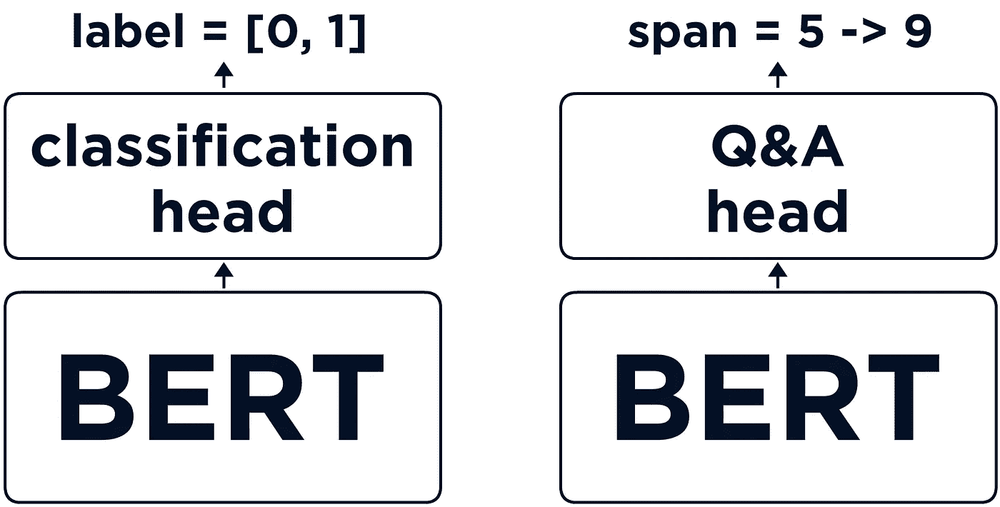
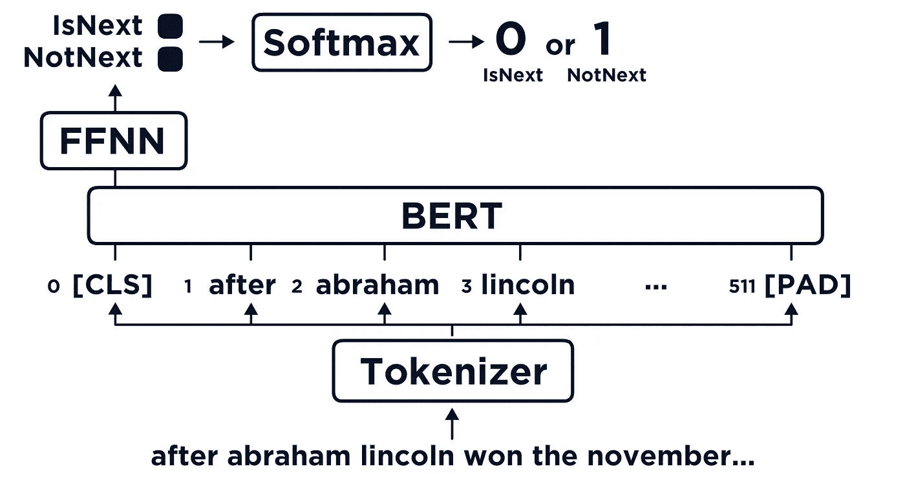
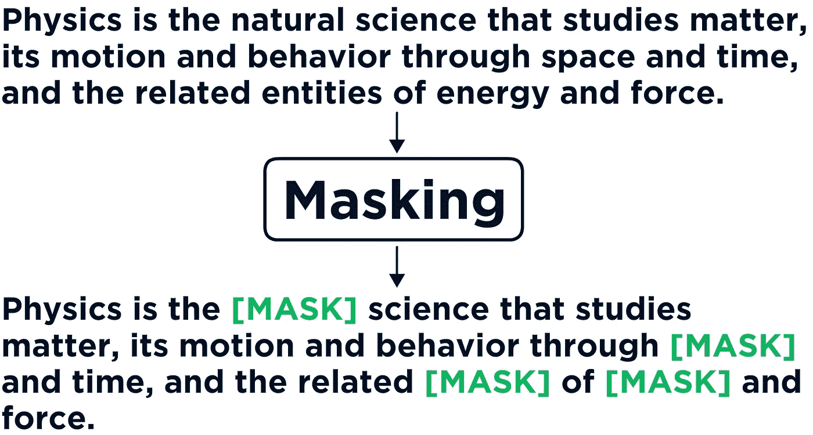
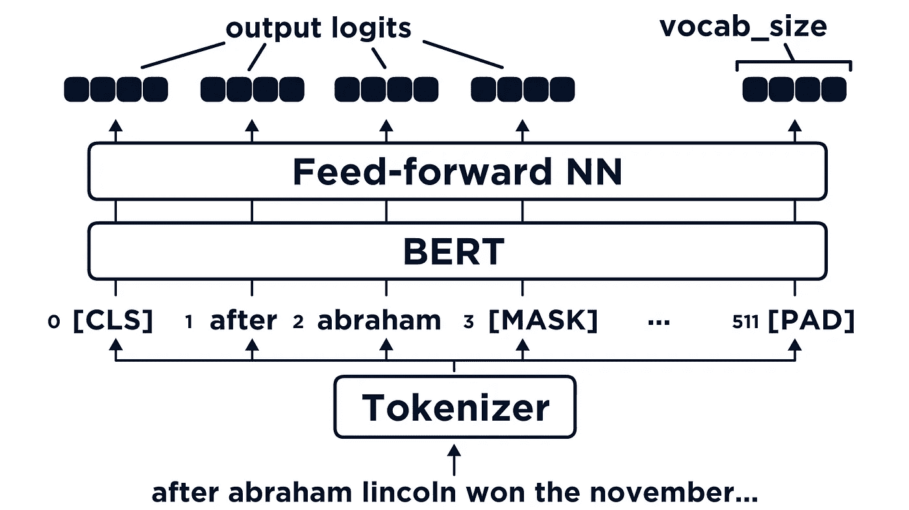

# 如何训练伯特

> 原文：<https://towardsdatascience.com/how-to-train-bert-aaad00533168?source=collection_archive---------0----------------------->

## 训练变形金刚的速射指南

像这样的形式需要预先训练——由作者生成图像。

transformer 模型的成功在很大程度上要归功于它能够采用 Google 和 OpenAI 等公司在巨大数据集上预先训练的模型，并将它们应用到我们自己的用例中。

有时，这就是我们所需要的——我们采用模型并按原样滚动。

但在其他时候，我们发现我们确实需要对模型进行微调。我们需要在我们的特定用例上对它进行更多的*培训。*

每个变压器模型都是不同的，针对不同用例的微调也是不同的——因此我们将重点关注核心 BERT 模型的微调。并附有一些脚注，说明我们如何为几个最常见的应用程序修改它。

你可以在这里观看文章的视频版本:

# 它是如何工作的

首先，这些是如何工作的？我假设你对变形金刚和伯特有一定的了解，如果你不知道我在说什么——先看看[这篇文章](/how-transformers-work-6cb4629506df)。

《变形金刚》的威力源自谷歌和 OpenAI 等大公司将变形金刚模型预先训练到非常高的标准。

现在，当我说按照非常高的标准进行预培训时，OpenAI 的 GPT-3 的估计培训成本在 460 万美元到 1200 万美元之间[1][2]。

我没有多余的 1200 万美元来训练模特，你呢？

通常，原始的预训练模型对于我们的需求来说已经足够了，我们不需要担心进一步的训练。

但有时，我们可能需要——幸运的是，变形金刚在制造时就考虑到了这一点。对于 BERT，我们可以将进一步培训的可能性分为两类。

首先，我们对核心 BERT 模型本身进行了微调。这种方法包括使用 Google 在训练原始模型时使用的相同训练方法——我们稍后将更深入地讨论这一点。

(左)带分类头的 BERT，(右)带问答头的 BERT。

第二，我们可以添加不同的*头*到我们的模型中，这给了伯特新的能力。这些是我们模型末尾的额外层，为不同的用例修改输出。例如，我们会使用不同的标题来回答问题或进行分类。

在本文中，我们将重点关注对核心 BERT 模型的微调——这允许我们对 BERT 进行微调，以更好地理解我们的用例中特定的语言风格。

## 微调内核

使用两种方法训练 BERT 的核心，下一句预测(NSP)和屏蔽语言建模(MLM)。

1。 **下一个句子预测**包括将句子对作为模型的输入，这些对中的一些对将是真的*对*，其他的将不是。

两个连续的句子形成一个“真对”，其他的都不是真对。

BERTs 在这里的任务是准确地识别哪些对是真正的对，哪些不是。

还记得我说过我们可以用不同的头来训练伯特吗？NSP(和 MLM)也用特殊的头。这里使用的 head 将来自分类器令牌的输出处理到一个密集的 NN 中，输出两个*类*。

我们的分类头密集层消耗来自分类任务中使用的`[CLS]`(分类器)标记位置的输出。

这个`[CLS]`令牌的输出是一个 768 维的向量，它被传递给我们具有两个节点的密集 NN 层——我们的`IsNextSentence`和`NotNextSentence`类。

BERT 中 NSP 任务的高级视图。

这两个输出是我们对 BERT 是否相信句子 B 在句子 a 之后的真/假预测。索引 **0** 告诉我们 BERT 相信句子 B *在句子 a 之后。*

训练后，NSP 头被丢弃——我们保留的只是许多 BERT 层中经过微调的*权重。*

2。 **屏蔽语言建模**包括获取一大块文本，屏蔽给定数量的标记，并要求 BERT 预测被屏蔽的单词是什么。

通过屏蔽操作处理原始文本，用**【屏蔽】**标记替换随机标记。

每个序列中有 15%的单词被`[MASK]`标记屏蔽。

一个分类头被附加到该模型上，并且每个标记将被馈送到一个前馈神经网络中，随后是一个 softmax 函数。每个令牌的输出维数等于 vocab 的大小。

MLM 进程的高级视图。

这意味着从每个记号位置，我们将得到最高概率记号的输出预测。我们用我们的词汇把它翻译成一个特定的单词。

在训练期间，当计算损失函数时，对未被屏蔽的记号的预测被忽略。

同样，与 NSP 一样，MLM *头部*在训练后被丢弃——留给我们优化的模型权重。

# 用代码

我们知道 NSP 和 MLM 的微调是如何工作的，但是我们如何在代码中应用它呢？

好了，我们可以从导入*变形金刚*、 *PyTorch* ，以及我们的训练数据— *冥想*(在这里找到训练数据[的副本)开始。](https://github.com/jamescalam/transformers/blob/main/data/text/meditations/clean.txt)

现在我们在`text`中有一个段落列表——一些，但不是全部，包含多个句子。这是我们在构建 NSP 培训数据时需要的。

## 为 NSP 做准备

为了准备 NSP 的数据，我们需要创建一个非随机句子(两个句子最初在一起)和随机句子的混合。

为此，我们将创建一个从`text`中提取的*句子包*，然后我们可以在创建随机`NotNextSentence`对时从中随机选择一个句子。

我们的**包**包含与**文本**相同的数据，但是按句子分割——通过使用句点字符来标识。

在创建我们的`bag`之后，我们可以继续创建我们的 50/50 随机/非随机 NSP 训练数据。为此，我们将创建一个句子 As、句子 Bs 以及它们各自的`IsNextSentence`或`NotNextSentence`标签的列表。

我们可以在控制台输出中看到，标签 *1* 表示随机句子(`NotNextSentence`)，标签 *0* 表示非随机句子(`IsNextSentence`)。

## 标记化

我们现在可以标记我们的数据。如同典型的 BERT 模型一样，我们将序列截断/填充到长度为 *512* 的记号。

这里有几件事我们应该注意。因为我们标记了两个句子，所以我们的标记器在 *token_type_ids* 张量中自动将 *0* 值应用于句子 A，将 *1* 值应用于句子 B。尾随零与填充标记对齐。

其次，在 *input_ids* 张量中，记号赋予器自动在这两个句子之间放置一个 *SEP* 记号(102)——标记两者之间的边界。

伯特在表演 NSP 的时候需要看到这两者。

## NSP 标签

我们的 NSP 标签必须放在一个叫做 *next_sentence_label* 的张量中。我们通过获取我们的`label`变量，并将其转换为`torch.LongTensor`——也必须使用`.T`进行转置，从而轻松地创建它:

## MLM 的屏蔽

对于 MLM，我们需要`clone`我们当前的 *input_ids* 张量来创建一个 MLM *标签*张量——然后我们移动到屏蔽 *input_ids* 张量中大约 15%的记号。

现在我们克隆了我们的*标签*，我们屏蔽了 *input_ids* 中的令牌。

请注意，我们在这里添加了一些规则，通过在创建`mask_arr`时添加额外的逻辑，我们确保不屏蔽任何特殊的令牌，例如 *CLS* (101)、 *SEP* (102)和 *PAD* (0)令牌。

## 数据加载器

我们所有的输入和标签张量都准备好了——我们现在需要做的就是将它们格式化为 PyTorch dataset 对象，以便可以将它们加载到 PyTorch Dataloader 中——这将在训练期间向我们的模型提供批量数据。

数据加载器期望使用`__len__`方法检查数据集中的样本总数，使用`__getitem__`方法提取样本。

## 培训设置

进入训练循环之前的最后一步是准备模型训练设置。

我们首先检查我们是否有可用的 GPU，如果有，我们将模型移到它上面进行训练。然后，我们激活模型中的训练参数，并用加权衰减初始化 Adam 优化器。

培养

最后，我们开始训练我们的模型。我们训练两个纪元，并使用`tqdm`为我们的训练循环创建一个进度条。

在循环中，我们:

*   初始化渐变，这样我们就不会从上一步计算的渐变开始。
*   将所有批量张量移动到选中的`device` (GPU 或 CPU)。
*   将一切输入模型，提取损失。
*   使用`loss.backward()`计算每个参数的损失。
*   基于计算的损失更新参数权重。
*   将相关信息打印到进度条(`loop`)。

就这样，我们用 MLM 和 NSP 对我们的模型进行了微调！

关于使用屏蔽语言建模和下一个句子预测微调 BERT 的文章到此结束。我们已经介绍了什么是 MLM 和 NSP，它们是如何工作的，以及我们如何用它们来微调我们的模型。

有很多地方可以对 BERT 进行微调，但是概念和实现并不太复杂——同时功能非常强大。

使用我们在这里学到的知识，我们可以采用 NLP 中最好的模型，并对它们进行微调以适应我们更特定于领域的语言用例——只需要未标记的文本——通常是很容易找到的数据源。

我希望你喜欢这篇文章！如果你有任何问题，请通过 [Twitter](https://twitter.com/jamescalam) 或在下面的评论中告诉我。如果你想要更多这样的内容，我也会在 YouTube 上发布。

感谢阅读！

# 参考

[1] B. Dickson，[《GPT 3 号未披露的故事》是 OpenAI 的转变](https://bdtechtalks.com/2020/08/17/openai-gpt-3-commercial-ai/) (2020)，TechTalks

[2] K. Wiggers， [OpenAI 巨大的 GPT-3 模型令人印象深刻，但大小并不代表一切](https://venturebeat.com/2020/06/01/ai-machine-learning-openai-gpt-3-size-isnt-everything/) (2020)，VentureBeat

[朱庇特笔记本](https://github.com/jamescalam/transformers/blob/main/course/training/08_mlm_and_nsp_training.ipynb)

如果你有兴趣了解更多关于 MLM 和 NSP 背后的逻辑，以及一般的变形金刚，请查看我的 NLP 变形金刚课程:

[🤖《变形金刚》NLP 课程 70%的折扣](https://bit.ly/nlp-transformers)

**所有图片均由作者提供，除非另有说明*