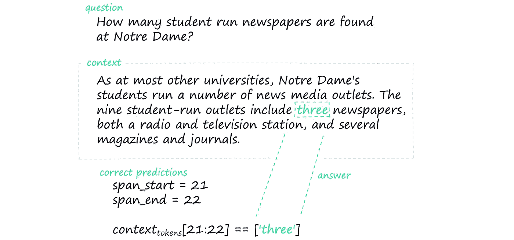

# 如何训练 Bert 进行任何语言的问答

> 原文：<https://towardsdatascience.com/how-to-train-bert-for-q-a-in-any-language-63b62c780014?source=collection_archive---------2----------------------->

## 从零开始的多语言问答简单指南


杰里米·贝赞格在 [Unsplash](https://unsplash.com?utm_source=medium&utm_medium=referral) 上的照片

问答(Q&A)变压器应用广泛，是现代自然语言处理的非常酷的应用。

乍一看，我们大多数人会认为建造这样的东西是一个非常困难的壮举。幸运的是，我们大多数人都错了。

尽管变形金刚有着令人难以置信的性能，但训练或微调它们来完成特定任务却异常简单。

再加上网上可用的许多*大规模*语言数据集，我们就拥有了构建一些令人难以置信的工具所需的一切。

我们将解释从头开始训练 Bert transformer 模型*所需的关键步骤*，以及我们如何针对 Q & A 微调该模型。这里的一个关键因素是数据集，我们也将在整篇文章中概述它。

# 从零开始问答

第一，变形金刚训练流程是什么样子的？虽然这些模型非常强大，但训练过程却出奇的简单。

我们首先需要明白的是，有一个*核心* Bert 模型。这个核心模型充当了中央转换引擎——正是这个引擎构建了对语言的理解。

这个中央模块的输出本身并不是特别有用。它只是一个语言理解引擎，它不能告诉你一个句子是快乐还是悲伤，识别实体，或者回答我们的问题。

对于所有这些任务以及更多的任务，我们需要一个训练有素的变压器头。

变压器的头部连接到核心引擎。核心引擎消耗一些文本，并将其处理成有意义的数字向量。这些向量是我们变压器头的丰富信息输入。

每个 transformer 头的结构都是为特定任务而构建的，许多只不过是由几个前馈神经网络层组成，其组织方式是，一旦训练了头，我们就可以产生有意义的功能。

因此，要从头构建问答 Bert 模型，我们必须:

*   训练一个核心 Bert 引擎。
*   培养一个问答 Bert 问答头。

有时可能没有使用您的语言的现有 Bert 模型。如果是这种情况，您还必须训练一个 Bert 单词片段标记器。我已经在这里[写了这个](/how-to-build-a-wordpiece-tokenizer-for-bert-f505d97dddbb)。

为了简洁起见，这里我们将只关注两个模型训练任务。让我们进入核心的 Bert 训练过程。

# 训练核心

伯特最初是用两个并行的过程训练的。掩蔽语言建模(MLM)和下一句预测(NSP)。两者都需要大量的训练数据，这些数据必须是非结构化文本的形式。

幸运的是，如果说我们在互联网上有很多东西的话，那就是非结构化文本。

## MLM 和 NSP 的数据集

对于 MLM 和 NSP，我们只需要一个大型的非结构化文本数据集。在多语言非结构化文本方面，没有比 OSCAR 语料库更好的来源了。

OSCAR 目前涵盖 166 种语言，从英语到纳瓦特尔语。[完整列表可在此处找到](https://oscar-corpus.com)。

从 OSCAR 下载数据最简单的方法是通过 HuggingFace 的`datasets`库。我个人会 100%推荐采取这种方式。我们可以非常快速地下载——例如——奥斯卡的英文子集，如下所示:

还有大量其他可用的数据集，我们可以在 [HuggingFace 的数据集查看器](https://huggingface.co/datasets/viewer/)上找到。

当下载较小的数据集时，我们可以毫无问题地使用上面的代码——但是较大的数据集(特别是来自 OSCAR 的数据集)可能会非常大——OSCAR 的意大利子集有 69GB 的数据，而英国只有 1.8TB。

在这种情况下，我们可以通过将`streaming=True`参数添加到`load_datasets`来*流式传输*数据。

然后，要么用`streaming=True`构建完整的输入管道，要么只遍历数据集的较小部分并将它们存储在内存中(通常`streaming=True`会导致代码问题，在这种情况下，后一种选择是最好的)。

如果你需要通过 HF 数据集下载数据的细节方面的帮助，我会在这段视频中一一介绍:

一旦数据下载完毕，我们就开始用 MLM ( *和* NSP，如果愿意的话)训练核心模型。

## 屏蔽语言建模

MLM 包括向伯特提供一个句子，其中几个单词(或*记号*)已经使用*掩码*记号隐藏起来。这个掩码标记无非是隐藏原始单词。

```
**ORIGINAL**: "flying fish flew by the space station"**MASKED**: "*[MASK]* fish flew by the *[MASK]* station"
```

然后，原始句子作为核心 Bert 模型的目标输出传递。通过这样做，Bert 被迫阅读句子中的其他单词，并试图理解上下文以正确预测被屏蔽的单词。

## 下一句预测

除了 MLM 之外，还发现一种叫做 NSP 的额外训练过程提高了 Bert 在下游任务(那些需要特定变压器头的任务)中的性能。

当 Bert 试图猜测掩码标记背后的真实单词时，它还负责识别作为输入提供的两个句子是否属于一起。

这意味着，给定两个句子——`A`和`B`。句子`B`是句子`A`的逻辑延续吗？

```
**Logical continuation (*IsNext*)**
A: "Alia went to the shop to buy pasta"
B: "The shop was closed"**Not logical continuation (NotNext)**
A: "Alia went to the shop to buy pasta"
B: "The armadillo was not very happy with the lion"
```

MLM 和 NSP 是否都被用于训练核心的伯特模型——或者仅仅是 MLM，取决于你的偏好。只训练 MLM 更简单，通常能达到 MLM *和* NSP 可能表现的 90%左右。

在下面的视频中，我们介绍了 MLM 的训练过程(如果你想用 MLM *和* NSP，[在这里找到](https://youtu.be/IC9FaVPKlYc))。

# 问答负责人

我们有一个经过全面训练的*核心* Bert 模型，我们可以采用该核心并添加几个*头部*，从而允许我们使用该模型执行不同的任务。但是，这些负责人最初是未经培训的，因此我们必须对他们进行培训！

如果您喜欢视频，我们在这里也涵盖一切:

对于问答，最受欢迎的数据集是斯坦福问答数据集(SQuAD)。除了最初的英文版本，现在还有其他几种语言版本。

```
**Language options *(on HF datasets at the time of writing)***Spanish: **squad_es** Portuguese: **squad_v1_pt** Italian: **squad_it** Korean: [**squad_kor_v1**, **squad_kor_v2**]Thai: [**iapp_wiki_qa_squad**, **thaiqa_squad**]English: [**squad**, **squad_v2**, **squadshifts**, **squad_adversarial**]
```

为了下载英国队的数据，我们使用:

```
**Language options *(at the time of writing)***Spanish: **squad_es** Portuguese: **squad_v1_pt** Italian: **squad_it** Korean: [**squad_kor_v1**, **squad_kor_v2**]Thai: [**iapp_wiki_qa_squad**, **thaiqa_squad**]English: [**squad**, **squad_v2**, **squadshifts**, **squad_adversarial**]
```

对于每个样本，我们的数据可以分为三个部分:

*   **问题** —包含我们将向 Bert 提出的问题的字符串。
*   **上下文** —包含我们问题答案的更大的序列(段落)。
*   **回答** —回答我们问题的一段上下文。

给定一个*问题*和*上下文*，我们的 Q & A 模型必须读取两者并返回上下文中预测答案的标记位置。



我们的问题、上下文和答案输入的示例，以及来自模型的(希望的)正确预测。请注意，这些跨度值并不精确，而是假设一个单词=一个标记。

## 格式化答案

在我们开始标记化、训练等之前，我们需要将我们的`answers`特性重新格式化为正确的训练格式。目前看起来像是:

```
{'text': ['the answer is here'], 'answer_start': [71]}
```

`71`代表我们的`context`字符串中答案开始的字符位置。我们可以通过简单地将`text`的长度加到`answer_start`来得到答案范围，我们首先这样做:

数据格式现在可以进行标记化了。

## 标记化

我们需要对阵容数据进行记号化，以便它可以被我们的 Bert 模型读取。对于`context`和`question`特征，我们可以使用标准的`tokenizer()`函数:

它将我们的`context`和`question`字符串编码成单个令牌数组。这将作为我们 Q & A 培训的输入，但是我们还没有目标。

我们的目标是答案的开始和结束位置，这是我们之前使用`context`字符串中的*字符*开始和结束位置构建的。然而，我们将把*令牌*输入到 Bert 中，所以我们需要提供*令牌*的开始和结束位置。

为此，我们需要将字符的开始和结束位置转换成记号的开始和结束位置——使用我们的`add_token_positions`函数很容易做到:

这个函数给我们的`Encoding`对象增加了两个张量(我们将它们输入到 Bert 中)—`start_positions`和`end_positions`。

我们的张量现在准备好训练 Bert Q&A 头了。

## 培养

我们将使用 PyTorch 进行训练，这意味着我们需要将我们构建的张量转换成 PyTorch `Dataset`对象。

我们将使用一个`Dataloader`对象把我们的`Dataset`输入到我们的 Q & A 训练循环中，我们用:

最后，我们设置模型参数并开始训练循环。

训练完我们的模型后，我们需要做的就是保存它！

我们完成了，我们从零开始训练了一个问答模型。

这就是本文的全部内容，我们已经介绍了训练用于问答的 Bert transformer 模型的核心和头部背后的要点，并探索了一些我们可以用于这两者的最佳数据集。

我希望你喜欢它！如果你有任何问题，请通过 [Twitter](https://twitter.com/jamescalam) 或在下面的评论中告诉我。如果你想要更多这样的内容，我也会在 [YouTube](https://www.youtube.com/c/jamesbriggs) 上发布。

感谢阅读！

[🤖《变形金刚》课程 NLP 的 70%折扣](https://bit.ly/nlp-transformers)

**所有图片均由作者提供，除非另有说明*