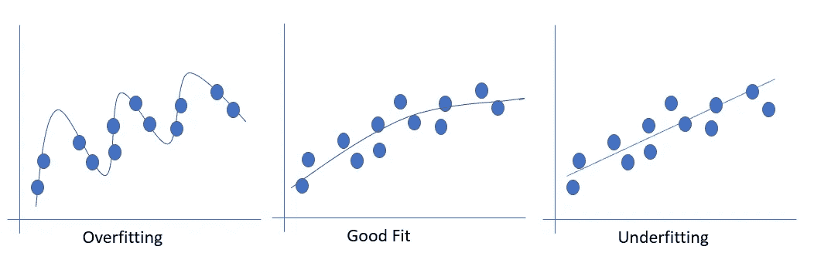
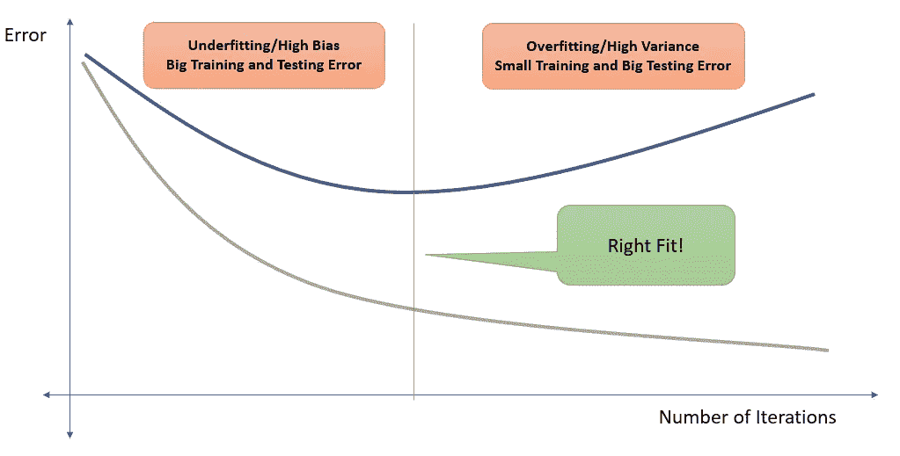
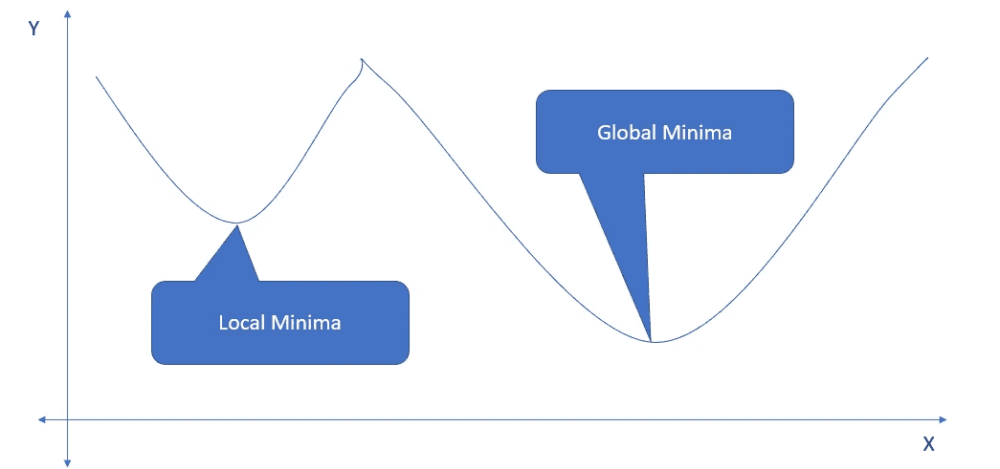

# 如何像专业人士一样训练神经网络！

> 原文：<https://towardsdatascience.com/how-to-train-neural-networks-like-a-pro-1d2362768c1?source=collection_archive---------13----------------------->

## 用于处理神经网络训练问题的完整包，如过拟合/欠拟合、消失梯度、局部最小值、学习率策略等。

梅根·霍尔姆斯在 [Unsplash](https://unsplash.com/) 上的照片

在步入深度学习的世界时，许多开发人员试图建立神经网络，但结果令人失望。他们可能最终发现训练过程不能更新网络的权重，或者模型不能找到成本函数的最小值。这些是我们在训练神经网络时面临的非常常见的问题，因此，需要有一个好的策略来解决它们。

本博客将帮助读者在训练神经网络时理解和解决以下问题:

1.  *过度拟合 vs 欠拟合*
2.  *消失渐变*
3.  *局部最小值*
4.  *设定正确的学习率策略*
5.  *挑选迷你批次大小*

我鼓励读者在继续下一步之前，查看以下博客，深入了解神经网络如何工作以及如何为不同的机器学习问题构建神经网络:

1.  [*【了解神经网络基础知识(适用于初学者)*](https://indraneeldb1993ds.medium.com/understanding-the-basics-of-neural-networks-for-beginners-9c26630d08)
2.  [*神经网络的激活函数和损失函数——如何选择合适的？*](https://indraneeldb1993ds.medium.com/activation-functions-and-loss-functions-for-neural-networks-how-to-pick-the-right-one-542e1dd523e0)

# 问题:过拟合与欠拟合

作者图片

当模型学习训练数据中的细节和噪声达到对新数据的模型性能产生负面影响的程度时，就会发生过度拟合。这意味着训练数据中的噪声或随机波动被模型拾取并学习为概念。问题是这些概念不适用于新数据，并对模型的概括能力产生负面影响。非参数和非线性模型在优化损失函数时更具灵活性，因此更有可能出现过度拟合。

另一方面，欠拟合指的是既不能对训练数据建模也不能推广到新数据的模型。

过拟合/欠拟合的概念与方差/偏差权衡问题密切相关。方差是如果使用不同的训练数据，损失函数的估计将改变的量。

*   **低方差**:建议随着训练数据集的改变，对目标函数的估计进行小的改变。
*   **高方差**:表示目标函数的估计值随着训练数据集的变化而发生较大变化。

另一方面，偏差是指模型做出的简化假设，以使损失函数更容易学习。

*   **低偏差**:暗示对损失函数形式的假设较少。
*   **高偏差**:暗示关于损失函数形式的更多假设

为了识别模型的正确拟合，我们可以查看机器学习算法在训练迭代/时期的数量上对训练和测试数据集的性能。

作者图片

随着算法的学习，模型在训练和测试数据上的误差下降。但是在某个点之后，训练数据集上的性能持续下降，但是模型也开始学习训练数据中的噪声。这可以从测试集中上升的误差看出来。最佳点是测试数据的误差开始上升之前的点(如上图所示)。

过拟合/欠拟合问题与历元数一起，是决定隐藏神经元数和隐藏层数的关键因素。它们决定了模型理解数据中复杂关系的能力。但是类似于纪元的数量，太多会导致过度拟合，太少会导致欠拟合。

## 解决办法

有三种流行的方法来克服这个问题:

1.  **提前停止:**提前停止(也称为“提前终止”)是一种方法，它允许我们指定大量的训练时期，一旦模型性能在测试数据集上停止改善，就停止训练。它监视训练的进度，但在满足某些条件时也会停止训练。TensorFlow 包中有两个预定义的停止监视器:a .*StopAtStepHook:训练在一定步数后停止*
    b. *NanTensorHook:监视丢失，如果遇到 NaN 丢失则停止训练*
2.  **正则化:**这是一种回归形式，它要么消除(L1 正则化)系数，要么将(L2 正则化)系数估计值缩小到零。因此，它不鼓励拟合复杂的模型以避免过度拟合的风险**。**
3.  **Dropout:** Dropout 基于在不同架构上并行训练多个神经网络的思想。基本思想是，在训练期间，某些层输出被随机丢弃。因此，在每次迭代之后，输出基于神经网络中神经元的不同组合。

除了这些选项，我们还可以尝试以下关于隐藏层数的启发式建议:

> “在实践中，通常情况是 3 层神经网络将优于 2 层网络，但是甚至更深(4、5、6 层)也很少有帮助。这与卷积网络形成鲜明对比，在卷积网络中，深度被认为是一个好的识别系统的极其重要的组成部分(例如，大约 10 个可学习层)。”~安德烈·卡帕西

最后，为了选择隐藏层中神经元的数量，我们可以遵循以下规则:

1.  隐藏神经元的数量应该介于输入层和输出层的大小之间。
2.  最常见的隐藏神经元数目是
    *sqrt(输入层节点*输出层节点)*
3.  在随后的层中，隐藏神经元的数量应该不断减少，以越来越接近输出层的结构。

值得注意的是，所有这些都是启发式规则，应该根据问题陈述进行调整。

# 问题:消失渐变

一些激活函数，如 sigmoid 函数，**具有非常小的导数**，尤其是当输入值远离函数中心时。这意味着神经网络权重的更新速率非常小。这个问题**随着我们添加更多的隐藏层**而变得更糟，因为来自不同层的导数相乘，因此，大量小数字相乘，导致最终变化接近于零。这意味着模型不能做出足够的反应来找到最优值。

## 解决方案:

处理消失渐变的最好方法是用 ReLU 或 Tanh 等其他函数替换隐藏层中的 sigmoid 激活函数。请参考我的[博客](https://indraneeldb1993ds.medium.com/activation-functions-and-loss-functions-for-neural-networks-how-to-pick-the-right-one-542e1dd523e0)中可用的激活功能列表以及在哪里使用它们。

# 问题:局部最小值

作者图片

损失函数有许多波峰和波谷是很常见的。局部极小值是指在其邻域内但不在损失函数上的最小值。如上图所示，一旦我们的模型遇到局部最小值，简单的梯度下降算法无法找到任何方向来进一步最小化邻域中的损失函数，并将卡在那里。因此，我们将无法找到神经网络的最佳权重。

## 解决方案:

我们有两种选择来处理局部最小值问题:

1.  **随机重启:**基本意思是我们可以从损失函数的不同点出发，从所有的点进行梯度下降。这种方法大大增加了我们找到全局最小值的机会。
2.  **动量:**这种方法的灵感来自于一个物体在不平坦的表面上快速移动的想法，这样它的动量就会推动它越过小驼峰。基本思想是，在局部最小值处的梯度是零，但是在先前时段中的梯度将具有非零值，并且取它们的平均值将帮助我们在局部最小值处走出驼峰。形式上，动量是过去梯度的加权平均值，并且较大的权重被应用于最近的梯度，导致梯度的指数衰减平均值。权重通常称为速度，在 0 和 1 之间变化。找到速度值的最好方法是使用交叉验证。

# 问题:迷你批次大小

小批量梯度下降是梯度下降算法的一种变体，该算法将训练数据集分成小批量，用于计算模型误差和更新模型系数。这是梯度下降算法最常见的形式(其他选项是批处理和随机梯度下降)。批量大小由最小批量大小参数决定，我们选择它的方式会影响资源需求以及神经网络的训练速度。太少会导致训练进度缓慢，但有助于收敛到全局最小值。

选择高的迷你批次大小将导致更快的训练，但是需要更多的存储器和计算资源。它也有陷入局部最小值的风险。

## 解决方案:

32 的小批量是一个很好的开始，如果不行，我们也可以尝试 64、128 和 256。大多数问题最常用的一组值是:1、2、4、16、32、64、128 和 256。

# 问题:如何设置学习率

学习率是指在机器学习模型的训练过程中权重更新的量(也称为步长)。它是用于训练神经网络的重要超参数之一，通常的可疑值是 0.1、0.01、0.001、0.0001、0.00001、0.000001 和 0.000001。设置一个非常低的学习率，会使我们的模型在识别成本函数上的最小点方面非常慢，而选择一个高值会使我们错过最佳点，因为模型将继续大步前进。看看这种情况的极端版本，高学习率会导致模型的性能在训练时期之间振荡，这表明权重偏离了最佳值。在另一个极端，一个非常小的值可能会阻止模型收敛或陷入局部最小值。我们通常会面临三种情况:

1.  *训练期间验证误差快速下降:表示学习率选择良好*
2.  *训练过程中验证误差下降非常缓慢:表示学习率需要提高*
3.  *训练过程中验证误差缓慢增加:表示学习率需要降低*

## 解决方案:

一些现代版本的随机梯度下降算法(如 Adam)允许自适应学习率，其中模型在训练数据集上的性能由算法监控，并且学习率作为响应进行调整。如果错误率开始下降，则学习率逐渐降低，如果错误率在多个时期内没有改善，则学习率增加。如果这不起作用，那么我们可以尝试其他优化器，如 AdaGrad 或 RMSProp(它们也有自适应学习速率机制)。在另一篇博客中，我将讨论可用于训练神经网络的各种优化器及其优缺点。

如果我们想要手动设置参数值，那么我们应该通过创建训练时期的损失线图来检查模型的学习动态，然后我们可以检查以下内容:

*   学习的速度是快还是慢？
*   指示低学习率值的错误率是否有非常小的变化？
*   我们是否看到损失的振荡表明高学习率值？

我们也可以手动设置学习率计划，其中学习率在一定数量的时期后从最大值线性/指数地降低到最小值。

# 结论

我要感谢读者阅读了我的神经网络系列博客的最后一部分。这个博客的目的是帮助读者有效地训练他们的神经网络。我们了解到以下情况:

1.  什么是欠拟合/过拟合和方差/偏差权衡，你如何处理它们？
2.  哪个激活函数面临消失梯度问题？
3.  随机重启和动量如何帮助我们避免局部极小问题？
4.  如何设置迷你批次大小？
5.  设定学习率的稳健策略是什么？

我将撰写一个单独的博客系列，介绍如何用 Python 实现这些解决方案(使用 Keras 和 Pytorch 库)。所以请保持关注！

你对这个博客有什么问题或建议吗？请随时留言。

# 感谢您的阅读！

如果你和我一样，对人工智能、数据科学或经济学充满热情，请随时添加/关注我的 [LinkedIn](http://www.linkedin.com/in/indraneel-dutta-baruah-ds) 、 [Github](https://github.com/IDB-FOR-DATASCIENCE) 和 [Medium](https://medium.com/@indraneeldb1993ds) 。

马特·博茨福德在 [Unsplash](https://unsplash.com/) 上拍摄的照片