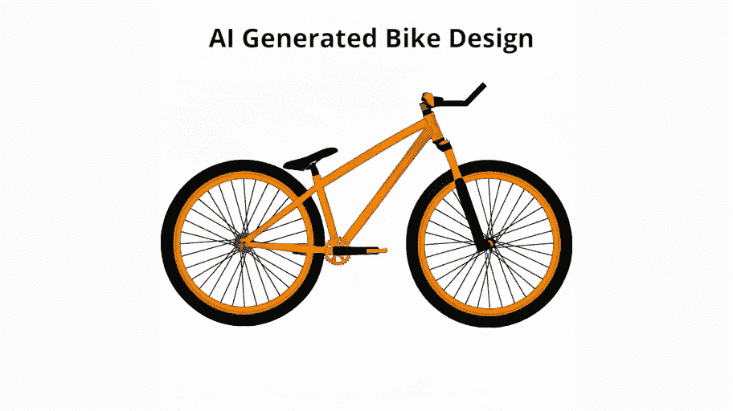
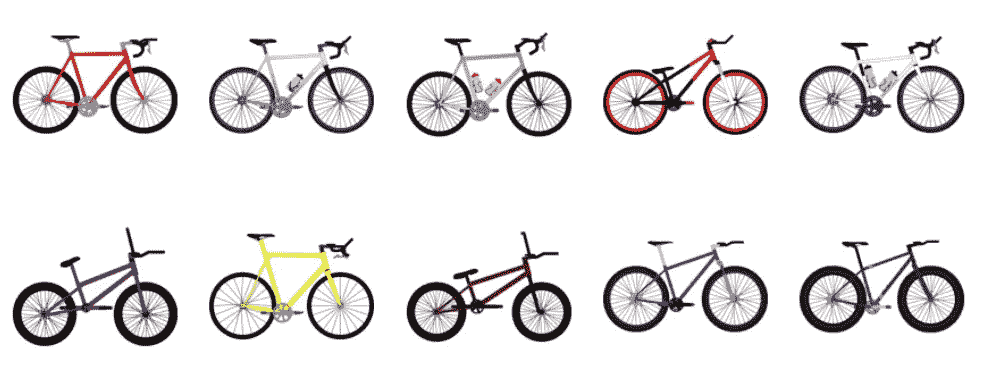
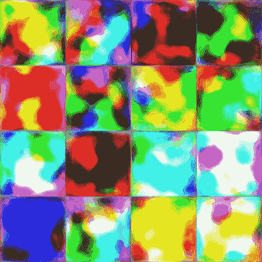

# 如何使用自定义数据集训练 StyleGAN2-ADA

> 原文：<https://towardsdatascience.com/how-to-train-stylegan2-ada-with-custom-dataset-dc268ff70544?source=collection_archive---------6----------------------->

## 了解如何训练人工智能生成任何你想要的图像



生成的自行车插值[图片由作者提供]

你一直想知道如何训练自己的生成模型吗？第一次发现像这个[人脸生成网站](https://thispersondoesnotexist.com/)这样的 GAN 应用，一直在想怎么在其他东西上训练 GAN。幸运的是，作为我研究的一部分，我最近有机会训练一个自行车发电模型。在本文中，我将记录我在如何根据自己的图像训练 StyleGAN2-ADA 方面的经验。

StyleGAN 是 NVIDIA 最受欢迎的生成模型之一。StlyeGAN 的多个版本已经发布，我们将使用最新版本 StyleGAN2-ADA。为了避免重复，我不会解释 StyleGAN，因为有很多文章已经很好地解释了它。

<https://jonathan-hui.medium.com/gan-stylegan-stylegan2-479bdf256299>  </generating-anime-characters-with-stylegan2-6f8ae59e237b>  

训练 StyleGAN 的计算量很大。因此，如果你没有一个像样的 GPU，你可能想在云上训练。如果你决定在 Google Colab 上训练(这是免费的)，有人为此制作了一个不错的[笔记本](https://colab.research.google.com/github/ArthurFDLR/GANightSky/blob/main/GANightSky.ipynb#scrollTo=qQqYjeRsfYD2)。

在教程中，我将使用自行车数据集 [BIKED](https://decode.mit.edu/projects/biked/) 。请随意使用您自己的数据集。只要确保所有的训练图像都是正方形的，并将它们放在同一个文件夹中。

在本文中，我将使用 StyleGAN2-ADA 的 Tensorflow 实现。确保使用 Tensorflow 版本 1，因为代码与 Tensorflow 版本 2 不兼容。或者，如果你喜欢 PyTorch，你可以使用最近发布的 PyTorch 版本。PyTorch 代码在性能上似乎稍快一些。如果您使用 PyTorch，您仍然可以遵循本教程，只是在数据集准备方面稍有不同。

# 要求

*   64 位 Python 3.6 或 3.7。建议使用带有 numpy 1.14.3 或更新版本的 Anaconda3。
*   建议使用 TensorFlow 1.14，但 Linux 上也支持 TensorFlow 1.15。不支持 TensorFlow 2.x。
*   在 Windows 上，您需要使用 TensorFlow 1.14，因为标准的 1.15 安装不包括必要的 C++头文件。
*   1-8 个高端 NVIDIA GPUs，至少 12 GB GPU 内存，NVIDIA 驱动程序，CUDA 10.0 工具包和 cuDNN 7.5

# 步伐

1.  克隆 StyleGAN2-ADA 存储库并进入目录

```
git clone [https://github.com/NVlabs/stylegan2-ada.git](https://github.com/NVlabs/stylegan2-ada.git)
cd styelgan2-ada
```

2.下载或创建自己的数据集。我将使用我已经预处理过的 [BIKED](https://decode.mit.edu/projects/biked/) 数据集。你可以从 [dropbox](https://www.dropbox.com/s/0ybsudabqscstf7/biked_dataset.tar.gz) 下载我的预处理版本。



[BIKED 数据集](https://decode.mit.edu/projects/biked/) [ [CreativeGAN](https://arxiv.org/abs/2103.06242) 的样本图像

```
# Dowload dataset
wget "https://www.dropbox.com/s/0ybsudabqscstf7/biked_dataset.tar.gz" -q -O biked_dataset.tar.gz# extract dataset
tar -zxvf biked_dataset.tar.gz# Delete the tar.gz file
rm biked_dataset.tar.gz
```

提取内容后，您将拥有一个名为 BIKED 的文件夹，其中包含 4510 个自行车设计的正方形图像。

***注意*** *:如果使用自己的数据集，创建一个文件夹，将所有训练图像放入文件夹中。确保所有的图像都是正方形的，大小相同。*

3.正在准备数据集

因为代码需要数据集。tfrecords 格式。我们首先需要将数据集转换成这种格式。StyleGAN2-ADA 已经编写了一个脚本来简化这种转换。

```
# first argument is output and second arg is path to dataset
python dataset_tool.py create_from_images ./datasets/biked biked
```

这将创建一个多分辨率。/datasets/biked/文件夹中的 tfrecord 文件。

4.培训风格 GAN2-ADA

```
# snap is how often you want to save the model and sample results
# res is what image resolution you want to train on
# augpipe is augmentation pipes, such as 'blit', 'geom', 'color', 'filter', 'noise', 'cutout' or combination of thesepython train.py --outdir ./results --snap=10 --data=./datasets/biked --augpipe=bgcfnc --res=512
```

您还可以修改许多其他参数，请随意查看 train.py 代码以了解关于这些参数的更多信息。

一旦您运行该命令，它将开始训练并定期保存结果和模型文件(。pkl)，基于您提供的快照参数(在本例中，每 10kimg)。一旦你认为结果足够好或者 FID 开始平台期，你可以停止训练，使用最后保存的。pkl 文件。

一旦你有了模型文件，你就可以使用这个命令生成图像。

```
python generate.py --outdir=out --trunc=0.5 --seeds=600-605 --network={path_to_pkl_model_file}
```

您可以为种子提供一个范围或逗号分隔值。trunc 是截断技巧的值。截断值越高，输出越多样化或极端，但可能会降低图像质量。该值越低，图像质量越高，但多样性可能会降低。最大值为 1。

但是，如果你想生成插值视频或图像网格。可以参考我之前的文章。

</generating-anime-characters-with-stylegan2-6f8ae59e237b>  

5.转移学习或恢复培训

如果你的训练因为某种原因停止或崩溃。您仍然可以从上次保存的进度继续训练。您只需要添加— resume 参数和模型的路径(。pkl)文件。

此外，你也可以把这个论点用于迁移学习。与其从头开始训练，通常最好从一个预先训练好的模型开始，即使数据集本身并不相似。只需更换。由 [StyleGAN-ADA](https://github.com/NVlabs/stylegan2-ada) 提供的预训练模型之一的 pkl 路径。

在这个例子中，我将在 biked 数据集上从我的[预训练模型](https://www.dropbox.com/s/p51bd1muw11c06m/full-bike-network-snapshot-004096.pkl)恢复训练。

```
python train.py --outdir ./results --snap=10 --data=./datasets/biked --augpipe=bgcfnc --res=512 --resume=full-bike-network-snapshot-004096.pkl
```

# 培训结果

这是一个经过一天的训练后，在特斯拉 P100 GPU 上 256x256 分辨率的训练结果的动画。



1 天的 StyleGAN2-ADA 训练进度。[图片由作者提供]

如果你喜欢我的作品，看看我的其他文章！

</animating-yourself-as-a-disney-character-with-ai-78af337d4081>  </generating-novel-content-without-dataset-544107da4cc8>  

# 参考

[1] Regenwetter，l .，Curry，b .，和 Ahmed，F. (2021 年)。BIKED:数据驱动自行车设计的数据集和机器学习基准。

[2]诺巴里，A. H .，拉沙德，M. F .，，艾哈迈德，F. (2021)。CreativeGAN:编辑用于创造性设计综合的生成性对抗网络

[3]t . Karras，m . Aittala，j . hells ten，Laine，s .，Lehtinen，j .，& Aila，T. (2020 年)。用有限数据训练生成性对抗网络