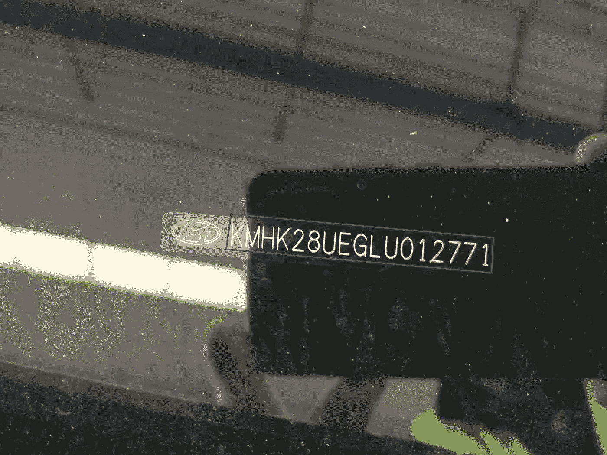
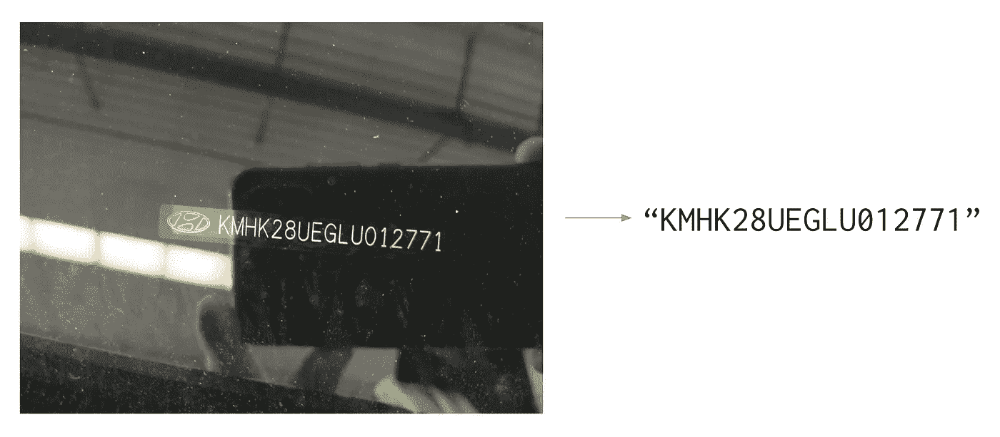
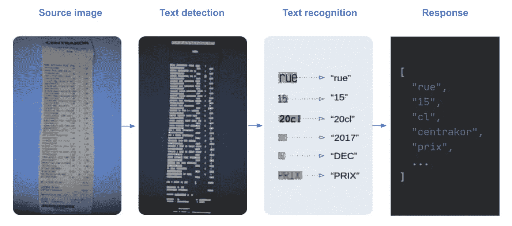
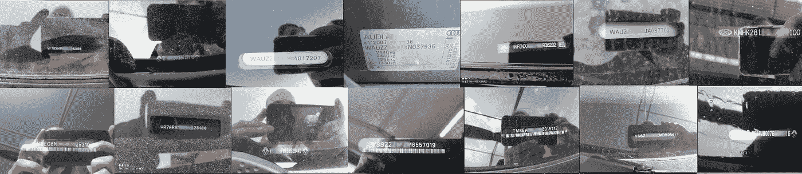
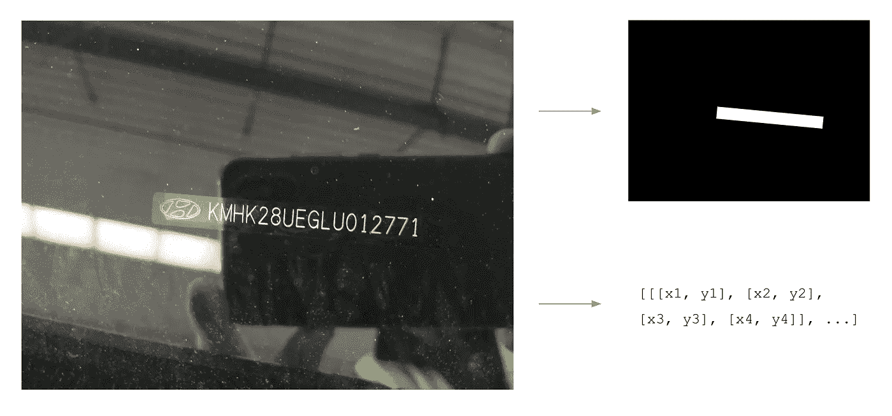
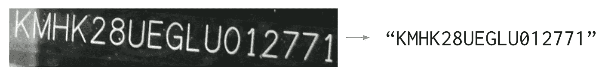
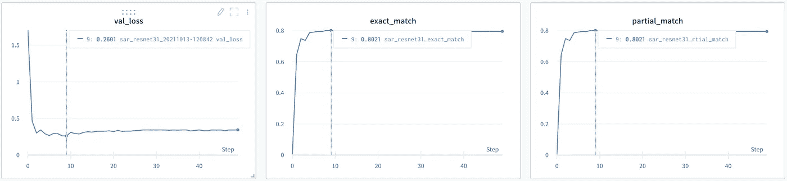
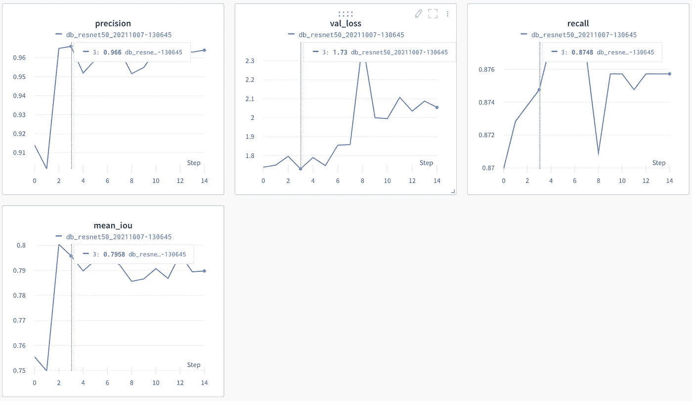

# 如何使用 Python 和 docTR 训练用于车辆识别号(VIN)提取的文本检测和识别模型

> 原文：<https://towardsdatascience.com/how-to-train-text-detection-recognition-models-for-vehicle-identification-number-vin-extraction-76857d1c2927?source=collection_archive---------19----------------------->



VIN(车辆识别号)是一个由数字和大写字母组成的 17 位字符串，作为汽车的指纹。它可以帮助识别任何汽车在其生命周期内，并获得有关它的具体信息。这个唯一的标识符在制造过程中被印在车辆的某个地方，以便人们在某些过程中需要时可以读取它，例如汽车租赁或销售。

几个月前，我们来自 [Monk](https://monk.ai/) 的朋友联系了我们:这是一家人工智能公司，为汽车、保险和移动市场提供最先进的计算机视觉解决方案。他们正在开发一种视觉智能技术，能够在汽车生命周期的每个阶段检查世界上的任何汽车。

他们唯一关注的是建立最好的技术来检测、分类和评估车辆的损坏。能够自动读取 vin 对他们来说很重要，但不是核心业务，这是 Mindee 的优势所在。

# VIN 使用案例

*请注意，本文中车辆识别号的任何照片要么是故意伪造的，要么是模糊的。*

问题的定义很简单:

*   输入是写在汽车上的 VIN 的照片
*   输出是一个 17 个字符长的字符串:VIN



端到端 VIN 提取

高精度地自动执行这项任务比看起来要难。主要困难是:

*   输入的照片大多是在户外拍摄的，有很多噪声(亮度、水渍、阴影……)，这使得检测和识别 VIN 变得困难
*   虽然 VIN 是以非常标准的格式书写的，但是使用的字体并不标准，也不总是一样的，字母间距也有很大不同。
*   校验和验证方法可以验证 vin，但并不适用于所有车辆。我们拒绝了这种后处理解决方案。
*   最后但同样重要的是，VIN 并不总是照片中唯一的文字，使用传统的 OCR 方法是不够的，因为我们需要添加一层后处理来过滤掉不想要的字符。

噪声图像的几个例子:


噪声车辆识别号图像

我们做的第一件事是从开源库和基于云的 API 运行现成的 ocr。由于问题的性质，在文本检测和识别上的结果不够好。vin 是写在汽车上的，而不是写在文档上的，这也不是字符识别技术的常见用例。我们必须找到另一种使用 Python 和 [docTR](https://github.com/mindee/doctr) 的方法。

# 为什么要用 docTR？

DocTR 是为数据科学家和开发人员提供的一个 Python**O**optical**C**character**R**ecognition 库。端到端 OCR 是使用两阶段方法实现的:文本检测(本地化单词)，然后是文本识别(识别单词中的所有字符)。



端到端 OCR 体系结构

DocTR 包括用于检测和识别任务的预训练模型。任何人都可以用它从图像或 pdf 中提取单词。您可以非常容易地测试它(更多信息见 docTR [文档](https://mindee.github.io/doctr/))

1.装置

```
pip install python-doctr
```

2.Python hello world

```
from doctr.io import DocumentFile
from doctr.models import ocr_predictormodel = ocr_predictor(pretrained=True)
# PDF
doc = DocumentFile.from_pdf("path/to/your/doc.pdf").as_images()
# Analyze
result = model(doc)
```

但是正如我们前面提到的，没有一个 OCR 能很好地解决我们的 VIN 问题。通用 ocr 不是此用例的好解决方案，因为:

*   ocr 应该是通用的，当涉及到像 vin 照片这样的“野生”数据时，文本检测和文本识别的问题非常困难。
*   通用 ocr 的输出列出了图像中书写的字符，即使它们都被准确地检测到，你如何从中重建 VIN 字符串？

为了摆脱这些限制，我们决定在检测和识别任务中对 VIN 数据的 docTR 模型进行微调，以获得更好的性能。这样，检测将只提取 VIN 字符(而不是周围的字符)，我们将有一个用于读取它们的微调模型。该库包括基于预训练模型的用于检测和识别阶段的那些训练能力。由于这些预训练的模型，可以非常容易地根据 VIN 数据微调我们的模型:我们应该获得高精度，因为它们是根据数百万种数据预训练的。

我们的贡献者经常将最先进的模型添加到库中。以下是截至今日的可用型号列表:

# 文本检测

*   [采用可微分二值化的实时场景文本检测](https://arxiv.org/pdf/1911.08947.pdf)。
*   [LinkNet:利用编码器表示进行有效的语义分割](https://arxiv.org/pdf/1707.03718.pdf)

# 文本识别

*   [用于基于图像的序列识别的端到端可训练神经网络及其在场景文本识别中的应用](https://arxiv.org/pdf/1507.05717.pdf)。
*   [显示、参加和阅读:不规则文本识别的简单而强大的基线](https://arxiv.org/pdf/1811.00751.pdf)。
*   [主:用于场景文本识别的多方位非局部网络](https://arxiv.org/pdf/1910.02562.pdf)。

这就是我们如何与尼古拉斯·舒尔(Nicolas Schuhl)一起解决车辆识别号提取案的。

# 我们的数据集

我们有 5000 张不同设备拍摄的车辆识别号照片，都来自不同的车辆。这是一个好的开始！Nicolas 告诉我们，他们的移动应用程序中有一个用于照片拍摄的布局模板，强制用户以正确的方向拍照。这使得问题变得简单，因为我们可以假设输入图像的方向是正确的。这也有助于我们确保 vin 不会过于偏斜:我们可以考虑大约 5°的最大绝对偏斜角度。



VIN 图像

我们的数据集包含方向错误的照片和角度超过 5°的倾斜 vin。我们从我们的数据集中删除了超过 5 加上一个小增量(不是 5，以保留训练集中的一些困难情况)的倾斜照片，并改变了方向，以使每张照片都是直的。

我们将 75%的数据用于训练，15%用于验证，10%用于测试集，我们小心地将它们放在一边。

# 注释文本检测数据集

DocTR 文本检测模型输出图像的分割热图，以及相对坐标中的插值多边形列表。



VIN 文本检测

为了训练这个模型，我们需要为每个图像提供对应于我们正在寻找的文本位置的多边形集。你可以在 [docTR 参考文献](https://github.com/mindee/doctr/tree/main/references/detection)上找到更多信息。

在我们的例子中，每个图像的标签是一个多边形，代表 VIN 在图像中的位置。

训练集和验证集必须以这种方式在文件夹中构建:

```
├── images
│   ├── sample_img_01.png
│   ├── sample_img_02.png
│   ├── sample_img_03.png
│   └── ...
└── labels.json
```

labels.json 文件将输入文件名映射到其多边形标签:

```
{
    "sample_img_01.png" = {
        'img_dimensions': (900, 600),
        'img_hash': "theimagedumpmyhash",
        'polygons': [[[x1, y1], [x2, y2], [x3, y3], [x4, y4]],...]
     },
     "sample_img_02.png" = {
        'img_dimensions': (900, 600),
        'img_hash': "thisisahash",
        'polygons': [[[x1, y1], [x2, y2], [x3, y3], [x4, y4]],...]
     }
     ...
}
```

我们使用我们的内部工具来注释这些数据，但是你可以找到许多很棒的商业软件(如 [V7](https://www.v7labs.com/) 或 [Kili](https://kili-technology.com/) )或开源软件(一个很好的基准[这里是](https://mosaicdatascience.com/2021/02/17/open-source-annotation-tools-for-computer-vision-review/))来做这件事。

# 注释文本识别数据集

在 docTR 端到端管道中，文本识别模型将在第一文本检测阶段检测到的输入图像的裁剪作为输入。然后，该算法将对这些作物执行“读取”任务，以获得机器编码的字符串。



VIN 文本识别

注释识别数据集比检测要繁琐一些。我们再次使用我们的内部工具，它包括一个使用通用文本识别算法的预注释功能，以使它更容易。纠正几个字符确实比从头开始手动键入所有字符容易。你可以在很多商业注释软件上找到这个特性。

对于文本识别任务，docTR 要求数据集文件夹的结构与文本检测相同，并且`labels.json`文件应该用唯一的关联字符串映射每个输入文件名:

```
├── images
    ├── img_1.jpg
    ├── img_2.jpg
    ├── img_3.jpg
    └── ...
├── labels.json
```

`labels.json`文件将输入文件名映射到它们的输出字符串:

```
{
    labels = {
    'img_1.jpg': 'I',
    'img_2.jpg': 'am',
    'img_3.jpg': 'a',
    'img_4.jpg': 'Jedi',
    'img_5.jpg': '!',
    ...
}
```

# 训练模型

现在让我们跳到有趣的东西！正如您可能想象的那样，真实的过程实际上是在训练实验和数据清理之间来回多次以提高性能。但是出于本文的考虑，让我们考虑数据集第一次被完美地注释了。

我们将使用 TensorFlow 2 (TF)后端来训练我们的模型:这也可以使用 PyTorch 后端来实现，因为步骤非常相似。您可以通过以下方式使用 TF 或 PyTorch 后端安装 docTR:

**张量流**

```
pip install python-doctr[tf]
```

**PyTorch**

```
pip install python-doctr[torch]
```

确保您有 4 个必需的带注释数据的文件夹，例如:

```
├── detection_train
    ├── images
	├── train_det_img_1.jpg
	└── ...
	└── labels.json
├── detection_val
    ├── images
	├── val_det_img_1.jpg
	└── ...
	└── labels.json
├── recognition_train
    ├── images
	├── train_rec_img_1.jpg
	└── ...
	└── labels.json
├── recognition_val
    ├── images
	├── val_rec_img_1.jpg
	└── ...
	└── labels.json
```

# 文本识别模型训练

先说文本识别算法。

1.安装 docTR

```
pip install python-doctr[tf]
```

2.在您的笔记本电脑上克隆存储库

```
git clone [https://github.com/mindee/doctr](https://github.com/mindee/doctr)
```

3.导航到您刚刚克隆的 docTR repo，并进入识别参考文件夹。references/recognition 文件夹包含 TensorFlow 和 PyTorch 的培训脚本。

```
cd /path/to/doctr/references/recognition
```

4.使用 sar_resnet31 启动培训([此型号](https://arxiv.org/pdf/1811.00751.pdf)使用 resnet31 主干)

```
python train_tensorflow.py model=sar_resnet31  train_path=/path/to/your/train/recognition/dataset val_path=/path/to/your/val/recognition/dataset --vocab legacy_french --pretrained --wb --epochs 50
```

**—预训练:**将使用 Resnet31 主干训练模型的检查点从 docTR — SAR 开始训练模型。
**— wb:** 将启动一项关于权重&偏差的实验。如果你想使用 TensorBoard，你也可以使用
**— tb:** 。

根据您的机器规格，如果您没有足够的内存，您可能会得到一个内存不足(OOM)错误。如果出现此错误，请使用-b 参数减小批处理大小:

```
python train_tensorflow.py model=sar_resnet31 train_path=/path/to/your/train/recognition/dataset
val_path=/path/to/your/val/recognition/dataset --vocab legacy_french --pretrained --wb --epochs 50 -b 16
```

**-b:** 批量

验证步骤发生在每个时期之后，如果验证损失是所有时期中最低的，则检查点将保存在 references 文件夹中。



VIN 文本识别培训

该模型收敛非常快，并且能够在验证集上实现 80%的精确匹配。这可能看起来没那么多，但这是因为我们决定将倾斜的数据放在训练集中。我们将很快计算端到端指标，因为这是最重要的一项指标，然后看看进展如何。

# 文本检测模型训练

对于文本检测模型，步骤如下:

1.  导航到/references/detection 文件夹

```
cd /path/to/doctr/references/detection
```

2.使用 db_resnet50 启动培训([此型号](https://arxiv.org/pdf/1911.08947.pdf)使用 resnet50 主干)

```
python train_tensorflow.py model=db_resnet50 train_path=/path/to/your/train/detection/dataset val_path=/path/to/your/val/detection/dataset --pretrained --wb
```

检测模型比识别模型更重要:在这个模型中，更有可能出现 OOM 错误。同样，如果发生这种情况，考虑减少批量大小。

使用预先训练好的模型来完成这项任务是非常重要的。docTR 模型被训练来检测图像中的任何单词，而我们只寻找 vin。通过只在 vin 上重新训练这个模型，我们对模型进行了微调，只检测 vin 并过滤掉任何周围的文本。



VIN 文本检测培训

检测指标比识别指标更难分析。虽然精度看起来非常高，但由于 IoU 不容易操作，我们将通过测试端到端管道来计算模型的性能。

# 测试训练好的模型

我们的模型保存在克隆的 docTR 存储库的 reference 文件夹中。

要查看模型的运行情况，代码非常简单:

```
from doctr.io import DocumentFile
from doctr.models import ocr_predictorDET_CKPT = "file:///path/to/detection/model/db_resnet50_XXXX/weights"
REC_CKPT = "file://path/to/recognition/model/sar_resnet31_XXXX/weights"model = ocr_predictor(det_arch='db_resnet50', reco_arch='sar_resnet31',pretrained=True)
model.det_predictor.model.load_weights(DET_CKPT)
model.det_predictor.model.postprocessor.unclip_ratio = 2
model.reco_predictor.model.load_weights(REC_CKPT)if __name__ == "__main__":
    # Image loading
    doc = DocumentFile.from_images("./path/to/image")
    # Models inference
    result = model(doc)
    # Max proba post processing rule for selecting the right VIN value among docTR results
    vin = ""
    for word in result.pages[0].blocks[0].lines[0].words:
        if word.confidence > confidence:
	     vin = word.value
	     confidence = word.confidence
    # Display the detection and recognition results on the image
    result.show(doc)
```

没有理由说文本检测算法完全适合优化文本识别算法的框的大小。为了找到最佳的参数，我们根据验证集微调了 invoke _ ratio 参数。这是用于扩展来自检测模型的输出多边形的因子，以便生成可以输入到文本识别模型中的方形框。由于这两个模型是分别训练的，因此默认参数没有理由是优化文本识别性能的最佳参数。

在我们的测试集上测试了经过训练的模型之后，我们实现了 90%的端到端精确匹配，考虑到数据数量少和用例的复杂性，这是非常好的。如果我们愿意，我们可以花更多的时间用一些想法来优化模型:

*   检测模型在方形盒子上训练。DocTR 将很快支持旋转框，这将使我们对倾斜的照片有更好的鲁棒性。
*   超参数微调:我们没有在这上面花太多时间。例如，我们注意到学习衰退对训练有很大的影响。我们手动测试了一些值，但是我们可以花更多的时间来运行这些参数的网格搜索。输入大小也很重要，我们使用了默认的 docTR 参数。
*   [仅用于算法主干部分的文本识别预训练模型](https://github.com/mindee/doctr/issues/591):虽然拥有预训练模型非常好，但我们在使用它们时不能随意使用我们想要的词汇。我们询问 docTR 团队是否可以只为文本识别算法的主干部分获得预训练的模型，这样我们就可以用我们特定的词汇表训练分类头。一个问题被打开，他们将很快解决这个问题。
*   当然，更多的数据…

# 结论

这个案例是端到端文本提取问题的一个很好的例子，它需要重新训练检测和识别层以获得更好的性能。使用通用 OCR 并试图提取您想要的关键信息可能会非常繁琐。您需要在原始 OCR 结果的基础上建立大量的后处理，它不太可能在简单的文本检测和识别任务中表现良好。

**如果你有类似的用例，可以随时加入** [**Mindee 的 slack 社区**](https://join.slack.com/t/mindee-community/shared_invite/zt-uzgmljfl-MotFVfH~IdEZxjp~0zldww) **，或者试用**[**docTR**](https://github.com/mindee/doctr)**并给我们你的反馈:)**