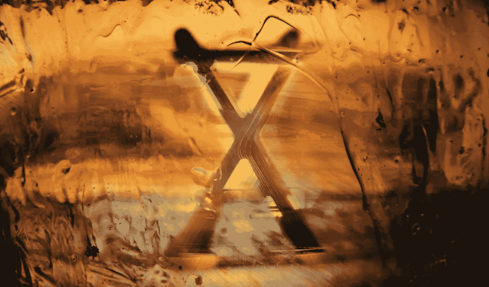
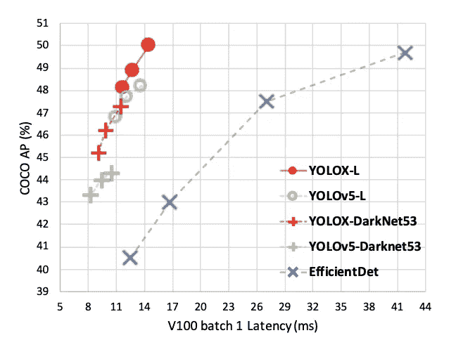
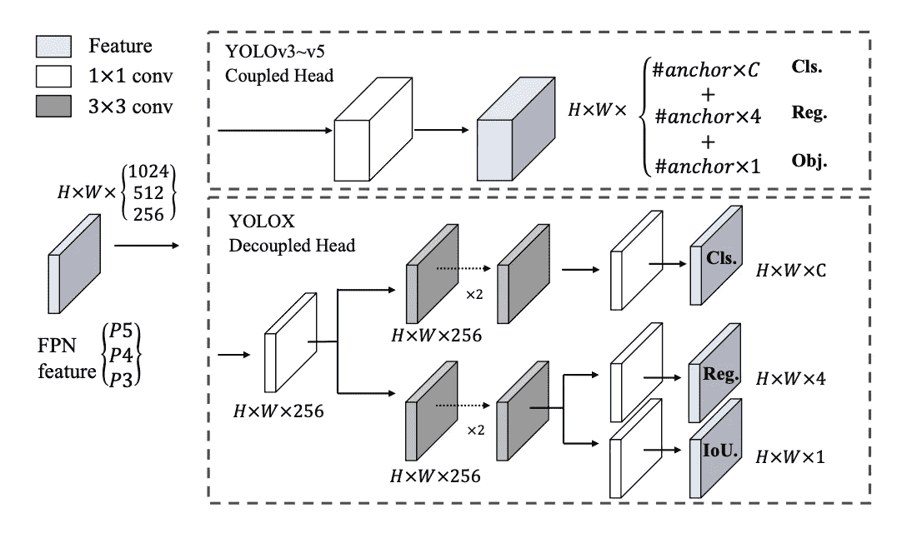
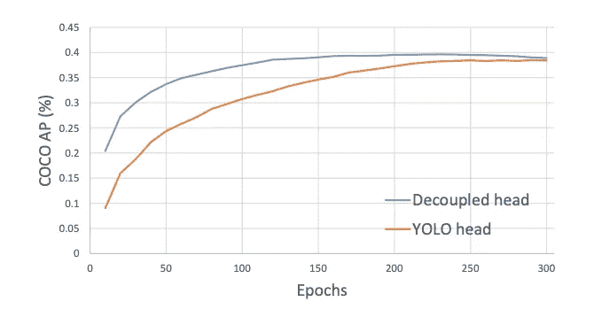
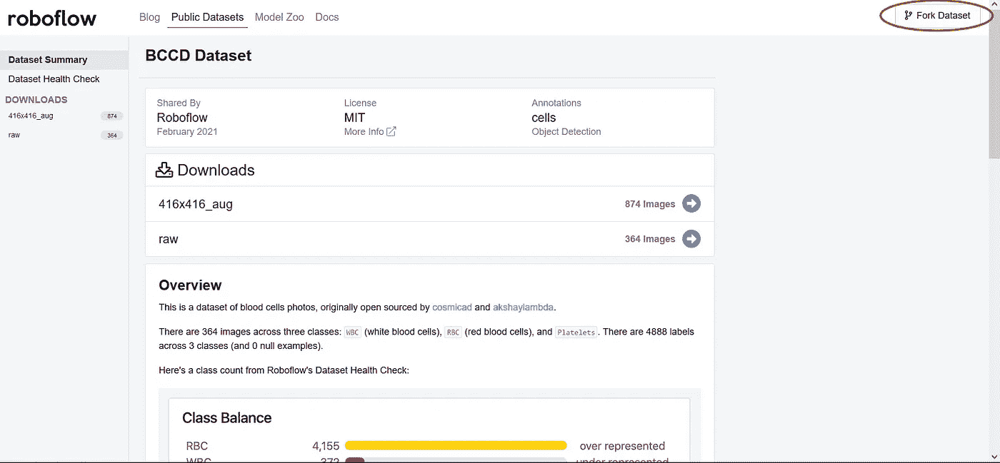
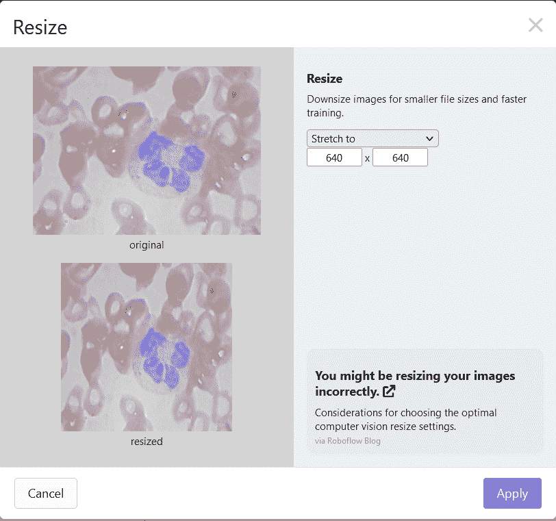
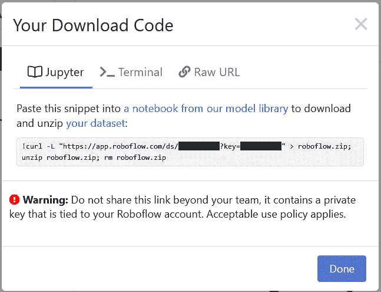
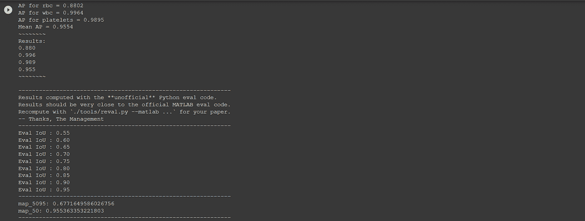
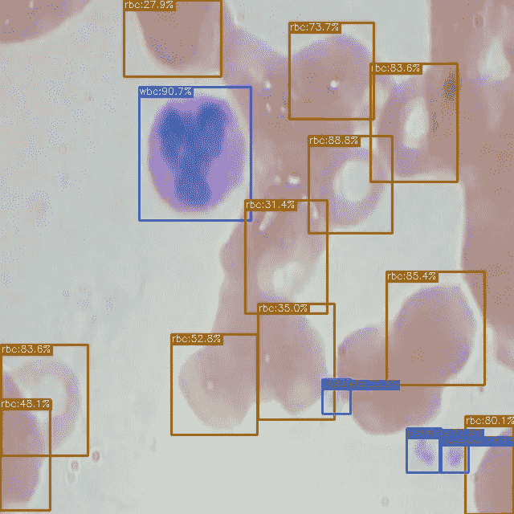

# 如何在自定义数据集上训练 YOLOX

> 原文：<https://towardsdatascience.com/how-to-train-yolox-on-a-custom-dataset-bb2f94cdb038?source=collection_archive---------7----------------------->



([引用](https://unsplash.com/photos/HynlII1AOkw))

YOLO 家族继续发展下一款产品:YOLOX。在本帖中，我们将介绍如何训练 YOLOX 识别**自定义用例**的对象检测数据。

出于本教程的目的，我们使用公共血细胞对象检测数据集。但是，您可以将自己的数据导入到 Roboflow 中，并将其导出以训练该模型来满足自己的需求。本教程使用的 [**YOLOX 笔记本**](https://colab.research.google.com/drive/1_xkARB35307P0-BTnqMy0flmYrfoYi5T#scrollTo=igwruhYxE_a7) **可以在** [**这里**](https://colab.research.google.com/drive/1_xkARB35307P0-BTnqMy0flmYrfoYi5T#scrollTo=igwruhYxE_a7) **下载。**

*感谢*旷视科技团队*发布了* [*底层知识库*](https://github.com/Megvii-BaseDetection/YOLOX) *，这构成了我们笔记本的基础。*

在本指南中，我们采取了以下步骤:

*   安装 YOLOX 依赖项
*   通过 Roboflow 下载自定义 YOLOX 对象检测数据
*   下载 YOLOX 的预训练重量
*   运行 YOLOX 训练
*   评估 YOLOX 性能
*   对测试图像运行 YOLOX 推理
*   导出保存的 YOLOX 重量以供将来推断

更喜欢 YouTube？

# YOLOX 有什么新功能？

YOLOX 是 YOLO 模型的最新版本，在速度和准确性方面都达到了极限。YOLOX 最近赢得了流媒体感知挑战(CVPR 2021 自动驾驶研讨会)。



相对于其他 YOLO 检测网络的 YOLOX 评估

最大的建模变化包括移除盒锚(提高模型到边缘设备的可移植性)和将 YOLO 检测头解耦到用于盒分类和盒回归的单独特征通道(提高训练收敛时间和模型准确性)。



[YOLOX](https://arxiv.org/pdf/2107.08430.pdf) 中的分离头



*通过*[*YOLOX*](https://arxiv.org/pdf/2107.08430.pdf)*中的历元加快训练时间。我们认为*[*yolov 5*](https://blog.roboflow.com/how-to-train-yolov5-on-a-custom-dataset/)*时代更快(我们还没有运行任何直接的面对面测试)*

许多其他令人兴奋的训练和推理考虑都包括在论文中。你可以在 YOLOX 论文或这个视频中更深入地探究。

# 安装 YOLOX 依赖项

为了设置我们的开发环境，我们将首先克隆基本的 YOLOX 库并下载必要的需求:

```
!git clone https://github.com/roboflow-ai/YOLOX.git %cd YOLOX !pip3 install -U pip && pip3 install -r requirements.txt !pip3 install -v -e . !pip uninstall -y torch torchvision torchaudio # May need to change in the future if Colab no longer uses CUDA 11.0 !pip install torch==1.7.1+cu110 torchvision==0.8.2+cu110 torchaudio==0.7.2 -f [https://download.pytorch.org/whl/torch_stable.html](https://download.pytorch.org/whl/torch_stable.html)
```

我们还将安装 NVIDIA Apex 和 PyCocoTools，以使该存储库按预期工作:

```
%cd /content/ !git clone https://github.com/NVIDIA/apex %cd apex !pip install -v --disable-pip-version-check --no-cache-dir --global-option="--cpp_ext" --global-option="--cuda_ext" ./ !pip3 install cython; pip3 install 'git+https://github.com/cocodataset/cocoapi.git#subdirectory=PythonAPI'
```

# 下载自定义 YOLOX 对象检测数据

在我们开始之前，您需要[创建一个 Roboflow 帐户](https://blog.roboflow.com/p/971d35a0-6b91-4ff9-b7f8-a668fab6624d/app.roboflow.com)。我们将使用[这个血细胞数据集](https://public.roboflow.com/object-detection/bccd/)，但是欢迎您使用任何数据集，无论是您自己加载到 Roboflow 的数据集还是其他公共数据集。

对于这个笔记本，我们将需要应用一些预处理步骤来确保数据能够与 YOLOX 一起工作。首先，[创建一个 Roboflow](https://app.roboflow.com/) 帐户(如果您还没有),然后派生数据集:



在分叉数据集之后，您将需要添加一个预处理步骤，将所有图像的大小调整为 640 x 640:



然后简单地生成数据集的新版本，用“ **Pascal VOC** ”导出。您将收到一个类似于以下内容的 Jupyter 笔记本命令:



复制该命令，并用 Roboflow 提供的命令替换笔记本中的下面一行:

```
!curl -L "[YOUR LINK HERE]" > roboflow.zip; unzip roboflow.zip; rm roboflow.zip
```

# 标注您的数据

如果你有自己的数据集，你可以在 Roboflow 中标注[你的图像。](https://docs.roboflow.com/annotate)

# 下载 YOLOX 的预训练重量

YOLOX 带有一些预训练的权重，以允许模型更快地训练并实现更高的精度。砝码有多种尺寸，但我们使用的砝码尺寸将基于小型 YOLOX 型号(YOLOX_S)。我们可以按如下方式下载:

```
%cd /content/ !wget https://github.com/Megvii-BaseDetection/storage/releases/download/0.0.1/yolox_s.pth %cd /content/YOLOX/
```

# 运行 YOLOX 训练

为了训练模型，我们可以运行`tools/train.py`文件:

```
!python tools/train.py -f exps/example/yolox_voc/yolox_voc_s.py -d 1 -b 16 --fp16 -o -c /content/yolox_s.pth
```

运行该命令的参数包括:

*   经验文件:该文件允许我们在培训时更改基础模型的某些方面
*   设备:我们的模型将训练的 GPU 数量— 1 是 Colab 提供的值 1
*   批量大小:每批图像的数量
*   预训练权重:指定您想要使用的权重的路径-这可以是我们下载的权重或您的模型的早期检查点

经过大约 90 个时代的训练，我们得到了以下 AP。


# 评估 YOLOX 性能

要评估 YOLOX 的性能，我们可以使用以下命令:

```
MODEL_PATH = "/content/YOLOX/YOLOX_outputs/yolox_voc_s/latest_ckpt.pth.tar" !python3 tools/eval.py -n yolox-s -c {MODEL_PATH} -b 64 -d 1 --conf 0.001 -f exps/example/yolox_voc/yolox_voc_s.py
```

运行评估后，我们得到以下结果:



YOLOX 模型的评估

性能看起来不错！

# 对测试图像运行 YOLOX 推理

我们现在可以在测试图像上运行 YOLOX 并可视化预测。要在测试映像上运行 YOLOX:

```
TEST_IMAGE_PATH = "/content/valid/BloodImage_00057_jpg.rf.1ee93e9ec4d76cfaddaa7df70456c376.jpg" !python tools/demo.py image -f /content/YOLOX/exps/example/yolox_voc/yolox_voc_s.py -c {MODEL_PATH} --path {TEST_IMAGE_PATH} --conf 0.25 --nms 0.45 --tsize 640 --save_result --device gpu
```

要在图像上可视化预测:

```
from PIL import Image OUTPUT_IMAGE_PATH = "/content/YOLOX/YOLOX_outputs/yolox_voc_s/vis_res/2021_07_31_00_31_01/BloodImage_00057_jpg.rf.1ee93e9ec4d76cfaddaa7df70456c376.jpg" Image.open(OUTPUT_IMAGE_PATH)
```



看起来模型像预期的那样工作！

# 导出保存的 YOLOX 重量以供将来推断

最后，我们可以将模型导出到我们的 Google Drive，如下所示:

```
from google.colab import drive drive.mount('/content/gdrive') %cp {MODEL_PATH} /content/gdrive/My\ Drive
```

# 结论

YOLOX 是一个令人难以置信的强大，最先进的对象检测模型。在本教程中，您可以学习如何:

*   准备 YOLOX 环境
*   使用 Roboflow 下载自定义对象检测数据
*   运行 YOLOX 培训流程
*   使用你训练过的 YOLOX 模型进行推理
*   将您的模型导出到 Google Drive

快乐训练！

*原载于 2021 年 8 月 2 日*[*【https://blog.roboflow.com】*](https://blog.roboflow.com/how-to-train-yolox-on-a-custom-dataset/)*。*