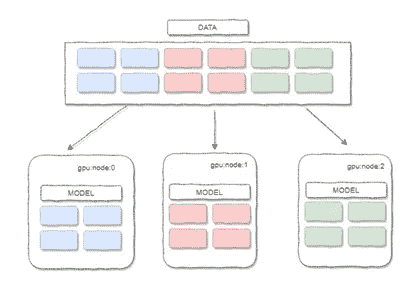
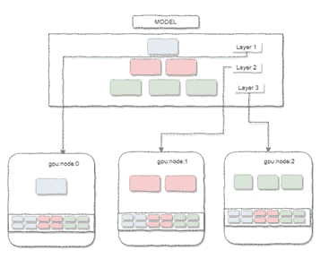
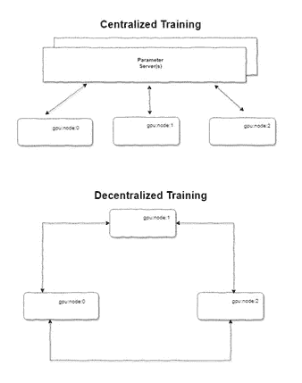
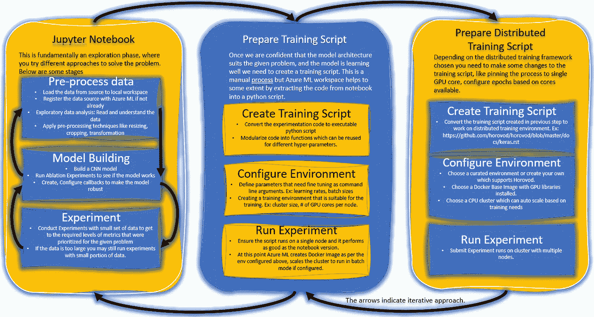
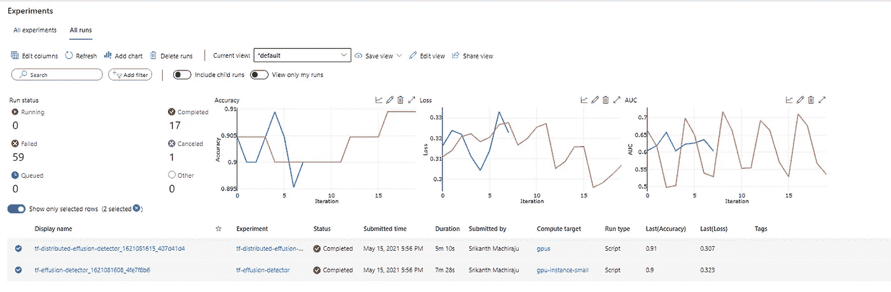
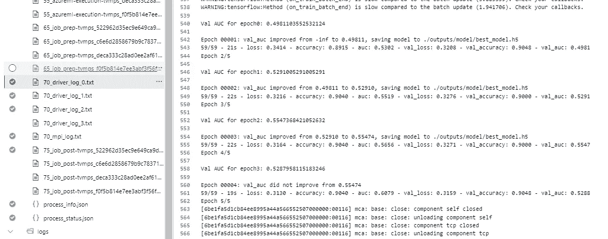
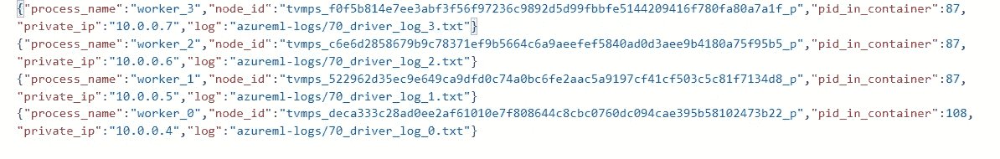
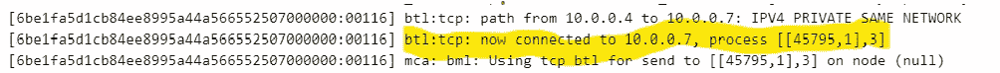

# 如何以分布式方式训练你的深度学习模型？

> 原文：<https://towardsdatascience.com/how-to-train-your-deep-learning-models-in-a-distributed-fashion-43a6f53f0484?source=collection_archive---------8----------------------->

## 基于 Horovod 的 Azure ML 分布式训练实用方法


凯文·Ku 在 [Unsplash](https://unsplash.com?utm_source=medium&utm_medium=referral) 上的照片

深度学习算法非常适合大数据集，并且训练深度学习网络需要大的计算能力。由于 GPU/TPU 很容易按使用付费或免费获得(如 Google collab)，今天有可能在类似云的 ImageNet 数据库上训练大型神经网络，例如 Resnet 152 (152 层)，ImageNet 数据库有大约 1400 万张图像。但是一台支持多核 GPU 的机器是否足以训练庞大的模型呢？从技术上来说是的，但是训练这个模型可能需要几个星期。那么我们如何减少训练时间呢？任何可扩展性问题都可以使用两种方法来解决—纵向扩展或横向扩展。我们都知道，如果我们选择纵向扩展，容量会在某个时候达到极限，因此更好的替代方案是横向扩展。但是，你如何进行分布式训练，如果我使用 Jupyter 笔记本进行模型训练，我从哪里开始，我可以对任何深度学习模型进行分布式训练吗？这个博客旨在用一种实用的方法来回答这些问题。

在这篇博客中，我们将学习如何在云上应用横向扩展或者说分布式机器学习技术。我们将了解如何从 Jupyter 笔记本阶段(构建 ML 模型的最敏捷方式)过渡到可以在使用 Azure ML 和 Horovod 的 GPU 集群上运行的生产就绪型培训脚本。

如果你是分布式机器学习的新手，这里有一些概念/术语是你在继续学习之前应该知道的。

# 数据并行和模型并行

在数据并行方法中，整个模型被部署到一个集群的多个节点上，数据被分片(水平分割)。模型的每个实例都处理一部分数据。



数据并行训练。

在模型并行方法中，模型的一个层(或一组层)被部署在集群的一个节点上，并且整个数据被复制到该节点，每个节点在完整的数据集上训练。



模型平行训练。

最常见也最容易实现的是数据并行，我们将在接下来的章节中看到一种实用的方法。直观理解数据并行如何工作的一种方式是，在每个 GPU 节点中为一小批数据(比如一次 30 个图像)计算梯度，并且在网络的一轮前后传递结束时，更新的权重被发送回发起节点。来自每个节点的权重的加权平均值被应用于模型参数。更新的模型参数被发送回节点用于下一轮迭代。

这几乎类似于你以非分布式方式分批训练时发生的情况。然而，这里的关键问题是如何在数据并行方法中存储和更新模型参数。这就把我们带到了下一个话题，集中和去中心化的培训。

# 集中和分散培训。

在模型并行或数据并行训练中，关键是节点之间的通信，定义参数如何初始化、权重/偏差如何更新很重要。

有两种类型的沟通方式。这适用于数据并行和模型并行方法。在集中式通信模式中，存在负责同步模型参数的节点或节点组，该节点被称为参数服务器。这种方法的优点是很容易同步模型参数，另一方面，参数服务器本身可能成为大型集群的瓶颈。这也是一个单点故障。当然，通过引入多个并行服务器并确保应用适当的存储冗余，可以在一定程度上减少瓶颈问题。

在去中心化的通信模式中，每个节点与每个其他节点通信以更新参数。这种方法的优点是对等更新更快，稀疏更新可以通过仅交换已更改的内容来进行，并且没有单点故障。



集中培训与分散培训。

# 同步和异步更新。

如果你熟悉深度学习并知道如何训练权重(如果不是，你可以在这里阅读我的文章)，一旦损失函数的梯度可用，就计算更新的权重。在使用数据并行方法的分布式训练中，可以用两种方式更新模型参数，即权重和偏差。

1.同步地:假设我们正在处理 10k 图像和 10 个节点，每个节点被给予 1k 图像的子集，一旦它们完成第一次迭代，更新的模型参数被发送到参数服务器。这种方法大大提高了模型的准确性，但这种方法的缺点当然是服务器必须等待所有节点完成迭代，如果有一个非常慢的服务器，它可能会降低整个训练的速度。

2.异步:在这种情况下，不是等待所有节点发送权重更新，而是一旦它们可用就发送，这增加了集群利用率并提高了训练速度，但是当然导致了陈旧梯度问题。大多数实现异步更新的框架都应用了一些策略来降低影响，以利于更高的集群利用率。

请记住，同步或异步更新适用于集中式和分散式培训方法。类似地，同步和异步更新可以应用于权重和对权重的更新，即，根据等式权重(新)=权重(旧)LR *梯度损失，在每次迭代之后，仅可以发送关于权重的梯度损失。为了更好地理解这一点，让我们想象一下，我们建立了一个具有同步更新和集中训练的集群，这意味着还有一个单独的参数服务，每个节点发送更新，一旦参数服务器上接收到所有更新，就计算新的权重，然后在所有节点上复制该权重，用于下一次迭代。

在讨论了如何存储和更新模型参数的优点和缺点之后，选择最佳参数总是取决于问题、数据集、聚类大小和各种因素。没有一个解决所有问题的正确方法。

# 实现分布式机器学习的框架

Map/Reduce、Apache Spark、百度 All Reduce、Horovod、Caffe2、微软认知工具包(CNTK)、dist faith、Tensorflow、DIANNE、MXNet、Petumm 是分布式机器学习可用的顶级框架。在这里[可以找到每一项的简要介绍。](https://analyticsindiamag.com/top-tools-distributed-machine-learning-tensorflow/)

其中，以下是 Azure today 在工作区(PaaS)模型中支持的——Apache Spark、Horovod(它在 Databricks 和 Azure ML 上都可用)、TensorFlow 分布式培训，当然还有 CNTK。

# Horovod 和天蓝色 ML。

分布式训练可以在 Azure ML 上使用 PyTorch、TensorFlow 这样的框架来完成。Tensorflow 的分布式训练支持集中式和分散式训练方法(更多信息[这里](https://www.tensorflow.org/guide/distributed_training))，如果你已经有一个使用分布式 TF 的笔记本，你可以很容易地将其导入 Azure ML。在这篇文章中，我们将了解霍洛佛德。

Horovod 是一个开源的分布式深度学习框架，适用于 TF、Keras、PyTorch 和 Apache MXNet，它通过减少对并行运行在多个 GPU 节点上的训练脚本所做的更改数量，简化了分布式训练。你可以在这里了解更多关于霍洛佛德[的信息。](https://horovod.readthedocs.io/en/latest/summary_include.html)

使用 Horovod 设置环境时，您不必担心太多，Azure ML 提供了精选的培训环境，可以使用各种框架轻松设置培训，其中一个框架预装了 TensorFlow 和 Horovod。如果需要，这些策划的框架还允许定制。

**注意**:你也可以在 Azure ML 上使用上面解释的集中式或分散式训练方法运行原生分布式 TensorFlow。

# 从笔记本阶段到分布式 ML 的训练过程。

在这个例子中，我试图使用 CNN 对两类图像进行分类。这些图像属于胸部 X 射线，一类图像包含检测到积液的图像，另一类不包含。有关学习过程、预处理、消融实验等的更多信息。我推荐你参观这里的代码。

下图解释了从笔记本阶段到以分布式方式在集群上运行训练实验的过程。



下面是我在一个支持 Horovod 的 4 节点分布式训练集群上运行单个 GPU 训练脚本的代码片段。

```
import osfrom azureml.core import ScriptRunConfigimport shutilfrom azureml.core import Experimentfrom azureml.core import Environmentfrom azureml.core.conda_dependencies import CondaDependenciesfrom azureml.widgets import RunDetailsfrom azureml.core.runconfig import MpiConfiguration## The training script capable of running in distributed environment is extracted to effusion_detector_distributed.pyproject_folder = './effusion_detector-distributed'os.makedirs(project_folder, exist_ok=True)shutil.copy('effusion_detector_distributed.py', project_folder)## choosing an experiment nameexperiment_name = 'tf-distributed-effusion-detector'experiment = Experiment(ws, name=experiment_name)# loading the env dependencies from conda configurationos.makedirs('./envs', exist_ok=True)tf_env = Environment.from_conda_specification(name="imageclassification", file_path="envs/distributed-tensorflow-with-horovod/conda_dependencies.yml")# Specify a GPU base imagetf_env.docker.enabled = Truetf_env.docker.base_image = 'mcr.microsoft.com/azureml/openmpi3.1.2-cuda10.1-cudnn7-ubuntu18.04'# using a cluster which can autoscale uptp 4 nodes.cluster_name = "gpus"compute_target = ComputeTarget(workspace=ws, name=cluster_name)# running the scriptargs = ['--data-folder', dataset.as_mount(), '--epochs', 20]src = ScriptRunConfig(source_directory=project_folder,script='effusion_detector_distributed.py',arguments=args,compute_target=compute_target,environment=tf_env, distributed_job_config=MpiConfiguration(node_count=4))run = experiment.submit(src)print(run)run.get_details()
```

这里有一个图像显示了培训的结果，第一个实验是使用分布式培训(4 个节点，每个节点 6 个 GPU 核心)完成的，第二个实验是使用一台具有 6 个 GPU 核心的机器完成的。用于单机和集群的处理单元 [GPU — 1 个 NVIDIA Tesla K80](https://www.nvidia.com/en-gb/data-center/tesla-k80)



分布式训练和单机训练的实验结果。

我在分布式培训中没有发现什么明显的不同。

1.  训练时间从 7.5 分钟减少到 5 分钟。
2.  为运行配置了 20 个时期，每个节点运行 5 个时期。(注意:这也意味着不能应用最小容差设置为 5 个时期的提前停止，在单机训练中，由于提前停止规则，训练最终停止)



该图显示了运行 5 个时期的工作进程 0。

3.每个工作进程都有一个私有 IP，日志显示它们都是相互连接的。



该图显示了给定私有 IP 的每个进程。



显示工作进程 0 连接到工作进程 3 的图像。

<https://github.com/sriksmachi/octopus>  

# 附加阅读

-[https://stack overflow . com/questions/53498952/tensor flow-horo VOD-nccl-and-MPI #:~:text = MPI % 20 is % 20 used % 20 for % 20 CPU，used % 20 for % 20g pu % 2d GPU % 20 communication](https://stackoverflow.com/questions/53498952/tensorflow-horovod-nccl-and-mpi#:~:text=MPI%20is%20used%20for%20CPU,used%20for%20GPU%2DGPU%20communication)。

*   [https://lei Mao . github . io/blog/Data-Parallelism-vs-Model-parale lism/](https://leimao.github.io/blog/Data-Parallelism-vs-Model-Paralelism/)
*   [https://docs . Microsoft . com/en-us/azure/machine-learning/how-to-training-tensor flow #分布式培训](https://docs.microsoft.com/en-us/azure/machine-learning/how-to-train-tensorflow#distributed-training)