# 如何训练自己的张量流模型，并在任何平台上运行它们

> 原文：<https://towardsdatascience.com/how-to-train-your-own-tensorflow-models-and-run-them-on-any-platform-6a1303d4c2d6?source=collection_archive---------20----------------------->

## 探索全球芯片短缺危机的解决方案。

训练自己的 TensorFlow Lite 模型为您提供了一个创建自己的定制 AI 应用程序的机会。此外，使用像 [WasmEdge](https://wasmedge.org/) 这样的运行时，您就有机会在许多不同的平台上运行您的定制 TensorFlow 应用程序。包括共享硬件。稍后将详细介绍共享硬件…

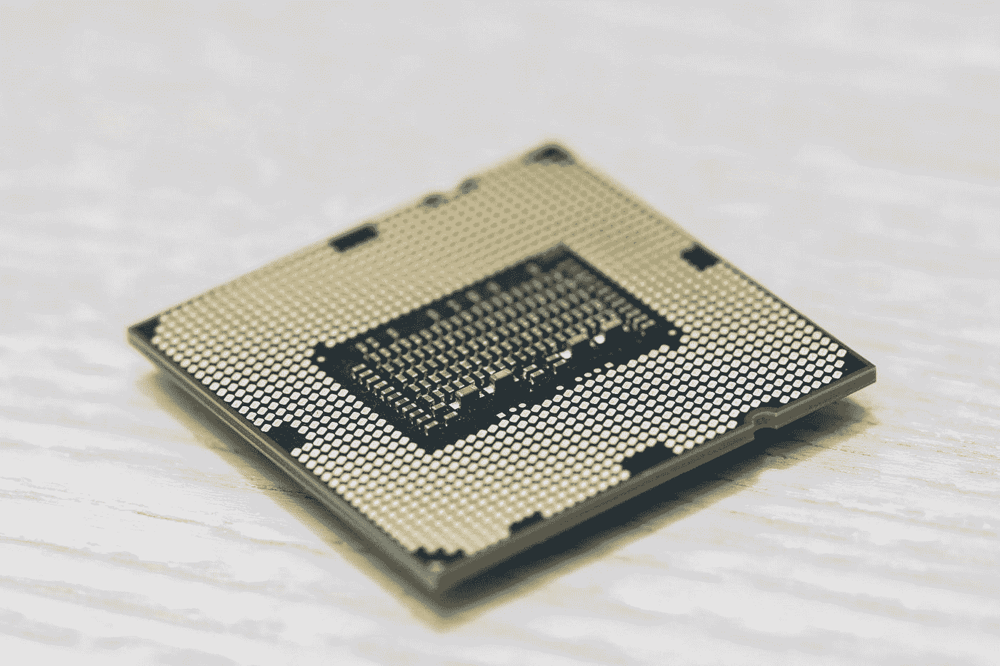

照片由[杰瑞米·零](https://unsplash.com/@jeremy0?utm_source=medium&utm_medium=referral)在 [Unsplash](https://unsplash.com?utm_source=medium&utm_medium=referral) 上拍摄

## 什么是 WasmEdge？

WasmEdge 是一个轻量级和高性能的 WebAssembly (WASM)虚拟机(VM ),针对边缘计算进行了优化。它广泛用于云无服务器功能(FaaS)、软件即服务(SaaS)、区块链智能合约和物联网以及实时汽车应用等场景。

由 [CNCF](https://www.cncf.io/) 主办，WasmEdge 旨在成为 Wasm 及其 Edge 相关扩展的开源“参考实现”。

本文主要关注 WasmEdge 的 TensorFlow 扩展。可以通过 [GitHub](https://github.com/WasmEdge/WasmEdge) 了解更多 WasmEdge 如果您想为 WasmEdge 投稿，请参见[该投稿人文档](https://github.com/WasmEdge/WasmEdge/blob/master/docs/CONTRIBUTING.md)。

## **我们为什么要使用 Wasm？**

Wasm 生态系统仍处于早期阶段。然而，Wasm 相对于传统的执行环境有一些非常重要和独特的优势。

除了它的性能…

> "在其超前(AOT)编译模式下，WasmEdge 是目前市场上速度最快的 Wasm 虚拟机."[1]

…一个独特的主张是 Wasm 可执行文件在独立的、基于堆栈的 Wasm 虚拟机中运行。这意味着任何不受信任的 Wasm 程序都可以在共享硬件上与其他 Wasm 程序一起运行；没有副作用。

## **您为什么想要共享硬件？**

就制造业的未来而言，这是一件大事。例如，丰田最近宣布，他们将“因全球芯片短缺而削减 40%的汽车产量”[2]。

所有领域的消费电子产品，不管是什么类型，都有不断满足消费者需求的动力。这些需求包括不同种类的娱乐、信息娱乐、安全、反垃圾邮件、语音识别、物体检测等等。

能够在共享硬件上训练和运行复杂的人工智能应用程序(可以帮助满足这些消费者需求)对生产来说至关重要。以下是全球制造商的一些报价，它们证明了这一点。

**大众**

> “德国大众汽车表示，它可能还需要进一步减产，并预计第三季度的芯片供应将‘非常不稳定和紧张’。”

**福特**

> “福特汽车表示，由于半导体相关零件短缺，将暂时关闭其制造最畅销的 F-150 皮卡的堪萨斯城组装厂”

# 学习人工智能模型和数据

开始学习如何训练 TensorFlow 的最好方法是查看一些现成的 TensorFlow 训练数据。

我们的**第一个例子**是专门针对自然语言情感分析的。我们要检查一些训练数据。一旦您理解了这个特定的数据集，您就可以继续创建自己的训练数据，然后为特定的用例(无论是什么)训练和运行自然语言模型。

在我们的**第二个例子**中，我们也将从查看一些现成的数据开始；深入到关于边界框坐标等等的细节。

一旦我们了解了单发探测器(SSD)边界框的工作原理，我们就可以创建自己的训练数据，然后针对特定用例训练和运行 SSD 模型。

让我们从一些动手演示开始；请继续阅读，即使你不是编码。有许多图表和解释将使这容易理解。

# 第一个例子—自然语言、情感分析


亚历山大·辛恩在 [Unsplash](https://unsplash.com?utm_source=medium&utm_medium=referral) 上拍摄的照片

在开始之前，让我们运行几个命令来准备好我们的系统。我们安装了 TensorFlow、TensorFlow 模型制作工具、Numpy 和熊猫。

```
pip3 install tensorflow
pip3 install tflite-model-maker
pip3 install numpy~=1.19.2
pip3 install pandas
```

然后我们打开一个`python3`解释器，运行下面的代码。

```
import os
import numpy as np
import pandas as pd
import tensorflow as tf
from tflite_model_maker import model_spec
from tflite_model_maker import text_classifier
from tflite_model_maker.config import ExportFormat
from tflite_model_maker.text_classifier import AverageWordVecSpec
from tflite_model_maker.text_classifier import DataLoader
# Get the data
data_dir = tf.keras.utils.get_file(
      fname='SST-2.zip',
      origin='[https://dl.fbaipublicfiles.com/glue/data/SST-2.zip'](https://dl.fbaipublicfiles.com/glue/data/SST-2.zip'),
      extract=True)
data_dir = os.path.join(os.path.dirname(data_dir), 'SST-2')
```

您可以在这里看到，作为该设置的一部分，我们正在从*fbaipublicfiles.com*下载一个公共数据集。我们需要去看看那些公共数据，因为它是我们理解如何创建我们自己的数据的关键。

如果我们打印`data_dir`，我们可以看到数据已经保存到我们的主目录中(在一个隐藏的`.keras`文件夹中)。

```
print(data_dir)
/Users/tpmccallum/.keras/datasets/SST-2
```

如果我们查看这些数据，我们可以看到数据集的格式不适合 TensorFlow Lite …还不适合！

我们可以解决这个问题:)

为了使该数据与 TensorFlow Lite 兼容，我们执行以下任务。

首先，我们将制表符分隔的数据文件`dev.tsv`转换为逗号分隔的文件，并替换标签(将`0`转换为单词`negative`，将`1`转换为单词`positive`，如下图所示)。

```
df = pd.read_csv('/Users/tpmccallum/.keras/datasets/SST-2/dev.tsv', sep='\t')
label_map = {0: 'negative', 1: 'positive'}
df.replace({'label': label_map}, inplace=True)
df.to_csv('/Users/tpmccallum/.keras/datasets/SST-2/dev.csv')
replace_label(os.path.join(os.path.join(data_dir, 'dev.tsv')), 'dev.csv')
```

我们也对`train.tsv`文件这样做

```
df = pd.read_csv('/Users/tpmccallum/.keras/datasets/SST-2/train.tsv', sep='\t')
label_map = {0: 'negative', 1: 'positive'}
df.replace({'label': label_map}, inplace=True)
df.to_csv('/Users/tpmccallum/.keras/datasets/SST-2/train.csv')
replace_label(os.path.join(os.path.join(data_dir, 'train.tsv')), 'train.csv')
```

最后，我们再次对`test.tsv`文件执行此操作。

```
df = pd.read_csv('/Users/tpmccallum/.keras/datasets/SST-2/test.tsv', sep='\t')
label_map = {0: 'negative', 1: 'positive'}
df.replace({'label': label_map}, inplace=True)
df.to_csv('/Users/tpmccallum/.keras/datasets/SST-2/test.csv')
replace_label(os.path.join(os.path.join(data_dir, 'test.tsv')), 'test.csv')
```

好的，太好了！现在我们有了一些有意义的 TensorFlow Lite 兼容数据，可以使用和复制(使用我们自己的句子和标签)。

3 个电子表格(`dev.csv`、`train.csv`和`test.csv`)各有两列(句子和标签)。

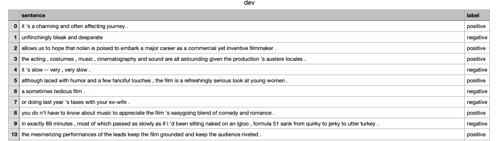

这个句子不是肯定的就是否定的。例如，句子“坚定地黯淡和绝望”被正确地标注为否定的。

理解了这个大纲，你就可以开始创建你自己的训练和测试数据。你只需简单地添加句子，然后正确/准确地标记它们(然后存储**你的**定制文件来代替这些原始文件)。

## 培养

我们现在可以加载这些`csv`文件，然后执行训练。

```
spec = model_spec.get('average_word_vec')
train_data = DataLoader.from_csv(filename='train.csv', text_column='sentence', label_column='label', model_spec=spec, is_training=True)
test_data = DataLoader.from_csv(filename='dev.csv', text_column='sentence', label_column='label', model_spec=spec, is_training=False)
# Train
model = text_classifier.create(train_data, model_spec=spec, epochs=10)
```

培训过程将生成如下所示的输出。

```
Epoch 1/101/2104 [..............................]
2104/2104 [==============================] - 3s 1ms/step - loss: 0.6841 - accuracy: 0.5570// snip //Epoch 10/10
2104/2104 [==============================] - 2s 1ms/step - loss: 0.3340 - accuracy: 0.8647
```

我们现在可以对训练好的模型进行测试

```
# Test
loss, acc = model.evaluate(test_data)
```

培训的结果如下

```
28/28 [==============================] - 0s 1ms/step - loss: 0.5160 - accuracy: 0.8303
```

如果我们对这些结果满意，那么我们可以将训练好的模型导出为一个`.tflite`文件；然后我们可以在我们的应用程序中使用它(稍后将详细介绍如何创建应用程序)。

```
model.export(export_dir='average_word_vec')
```

如果我们在 [netron app](https://netron.app/) 中打开新创建的 TensorFlow Lite 兼容文件(`model.tflite`，可以看到**输入**和**输出**规范。这些规范将帮助我们编写应用程序。

## 模型设定

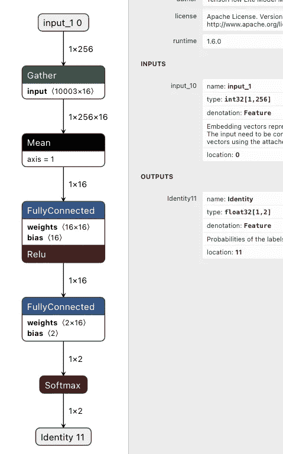

正如我们所见，输入称为`input_1`，输出称为`Identity`。

## 输入(称为 input_1)

模型属性中的描述描述了输入的数据格式。具体来说…

> 嵌入表示要分类的输入文本的向量。输入需要从原始文本转换为嵌入向量使用附加的字典文件。

本质上，这个输入希望文本(用户提供的)被转换成一个单独的 i32 整数数组，即`[5043, 201023, ... , 29361, 3499]`。因此，我们需要了解模型的创建者希望我们如何将单词映射到数字。

通过调查数据，我们了解到该模型的创建者使用了一个字典文件，该文件将单词/短语映射到数字。字典文件每行有一个唯一的整数(对应于文本)。

例如，在第 85，155 行，我们有单词“awesome”和整数 29361(如下所示)。

```
awesome|29361
```

因此，在我们的应用程序中，如果用户键入单词“awesome ”,我们需要将整数`29361`发送给模型(作为模型期望的`i32`数组中的许多元素之一)。

这取决于您是在客户端还是在服务器端这样做。编程语言是你自己的个人喜好；我在下面创建了一些 Rust 代码，展示了如何从本地文件系统中读取字典，然后从数据中创建一个 HashMap。**然而，我们也可以通过网络阅读这个文件，而不是**；请允许我在下一节解释。

## 从本地磁盘读取并解析字典文件

```
 // Create HashMap which stores String and Integer pairs
    let mut map_name: HashMap<String, i32> = HashMap::new();
    // Read the dictionary file 
    let filename = "src/dictionary.txt";
    let file = File::open(filename).unwrap();
    let reader = BufReader::new(file);
    // Process each line
    for (index, line) in reader.lines().enumerate() {
        let line = line.unwrap();
        // Create vector to store each line as split data
        let v: Vec<&str> = line.split(|c| c == '|').collect();
        // Place the split data into the HashMap
        map_name.insert(v[0].to_string(), v[1].parse::<i32>().unwrap());
    }
    // Create another vector to hold the input data
    let size = 256;
    let mut vecForModel: Vec<i32> = Vec::with_capacity(size);
    // Split this functions input by space
    let vInputString: Vec<&str> = input_string.split(|c| c == ' ').collect();
    // See if any words are in the HashMap
    for word in vInputString {
        if map_name.contains_key(word){
            // If so, add the appropriate integer
            vecForModel.push(*map_name.get(word).unwrap());
        }
```

## 通过网络读取和解析字典文件

为了向您展示如何为 web 创建 AI 应用**，让我们远程解析这个字典文件。**

WasmEdge 的 RESTful API 其实可以远程为我们取这个字典文件；类似于使用内容交付网络(CDN ),而不是在本地存储文件。这有几个好处。

首先，应用程序开发人员可以更新字典文件(在其远程位置),而用户无需做任何事情。

其次，文件的获取和读取现在 100%在服务器端完成(客户机不需要做任何这种高带宽的工作)。我们的 AI 应用程序的用户(在客户端)只上传他们的句子和指向字典文件的 URL 指针。我们必须记住，这个字典文件超过 20 万行(239，232)，并且可能随着新单词/语言的添加而增长。

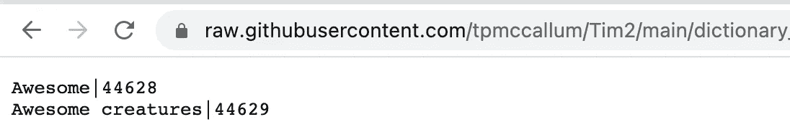

上面屏幕截图显示这只是一个文本文件。

远程获取这种大型文本文件要快得多，繁重的工作更适合服务器端。下图说明了远程获取是如何工作的。


## Web 表单

让这个 AI 应用程序可用的最好方法是使用表单数据(即 web 表单)。让我们看看 web 表单会是什么样子。

除了几个输入框(在 HTML 中)，我们将有一个 Javascript 函数，它接受输入，然后调用 WasmEdge 的 RESTful API。

这是 Javascript。本质上只是一个 AJAX 请求。

```
function callService() {
          setTimeout(function() {
            $('#process').prop('disabled', true);
          }, 0); var formData = new FormData();
          formData.append('input_1', $('#input_1').val());
          formData.append('fetch_input_2', $('#input_2').val());
          console.log("Running ...");
          $.ajax({
            url: "[https://rpc.ssvm.secondstate.io:8081/api/multipart/run/392/classify](https://rpc.ssvm.secondstate.io:8081/api/multipart/run/392/classify)",
            type: "post",
            cache: false,
            data: formData,
            contentType: false,
            processData: false,
            xhrFields: {
              responseType: "" // defaults to text
            },
            success: function(r_data) {
              console.log("Successfully ran the ajax");
              document.getElementById("result_box").innerHTML = r_data;
              $('#process').prop('disabled', false);
            },
            error: function(r_error) {
              console.log("Error running the ajax: " + r_error);
              alert("Rate limit exceeded");
              $('#process').prop('disabled', false);
            }
          });
          console.log("END");
          return false;
        }
```

只是提醒一下，WasmEdge 几乎可以在任何设备上运行。为了这篇文章，我们将使用网络，以便您可以看到它的行动。

从上面的 Javascript 代码可以看出，WasmEdge 有一个 API 端点，任何能够发出安全 HTTP 请求的设备都可以调用它。显然，对于汽车应用来说，这些程序将在本地硬件上运行，而不是通过网络。

然而，仅仅为了演示 WasmEdge 的多功能性，让我们仔细看看 WasmEdge 的 API 端点结构。


您会注意到这个 URL 以一个函数名结尾，在本例中是`classify`。这实际上是执行所有逻辑(执行张量流模型)的 Rust 函数的名称。出于演示的目的，Rust 函数已经被编写、编译成 Wasm 并部署在 wasm_id `392`(如上面的 URL 所示)。不要担心，我们很快就会深入研究 Rust/Wasm。现在，让我们只关注应用程序的前端(客户端)。

以下简单的 curl 命令可用于执行我们预先编写的 Wasm 二进制文件。注意我们如何添加两个`--form`参数(让 curl 模拟一个填充的表单)。注意，第二个输入实际上是我们前面提到的大字典文件的远程获取。

**提示**:执行远程获取时，使用不经过重定向的 URL，即如果在 GitHub 中存储数据，则使用如下所示的`raw.githubusercontent`风格的 URL。

```
curl --location --request POST 'https://rpc.ssvm.secondstate.io:8081/api/multipart/run/392/classify' --form 'input_1="Awesome movie"' --form 'fetch_input_2="[https://**raw.githubusercontent**.com/tpmccallum/Tim2/main/dictionary_testing.txt](https://raw.githubusercontent.com/tpmccallum/Tim2/main/dictionary_testing.txt)"'
```

一旦 curl 工作了，我们就可以为我们的应用程序创建一个 HTML 表单了。我们之前准备的那个看起来像下图，你可以在这里访问 HTML 源代码[。](https://github.com/second-state/wasm-learning/blob/master/faas/tf_lite_natural_language/html/index.html)

同样的页面也可以通过 GitHub pages 进行现场演示。

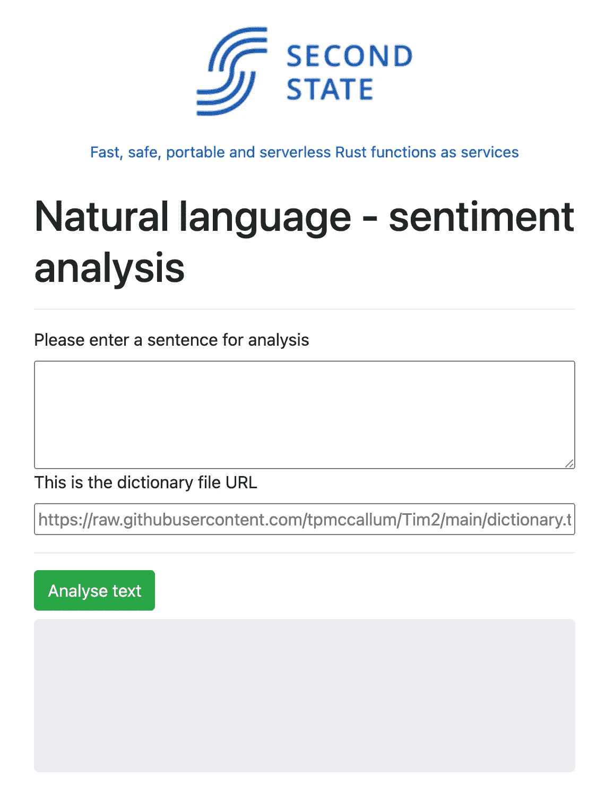

现在我们已经介绍了 HTML 和 Javascript，让我们看看我们实际上通过 WasmEdge API 调用的可执行代码。

这整个应用程序是由 Rust 函数驱动的，[这里是我们之前准备的 Rust 源代码](https://github.com/second-state/wasm-learning/blob/master/faas/tf_lite_natural_language/src/lib.rs)的链接。注意，这个函数叫做`classify`，它与上面的 API URL 相匹配。

我们使用一个命令将 Rust 源代码编译成 WebAssembly (Wasm)。

```
rustwasmc build
```

如上所述，WasmEdge 能够在多种模式下运行，即通过 NodeJS、在嵌入式设备上等等。然而，我们将继续使用 WasmEdge 的 API 进行演示，以便您可以试用。

让我们看看如何解释输出。

## 输出——“身份”

正如我们在模型的属性中看到的，输出**被称为“身份”。Identity 是一个包含两个元素的数组(数据类型都是 float 32)。第一个是与负面情绪相关的指数`0-1`。例如，0.25 意味着它有 1/4 的负面含义，1 意味着它是一个完全负面的评论。**

第二个因素代表积极的情绪。

数组中的 2 个元素的总和总是 1。例如，中性将是 0.5 负和 0.5 正。

让我们尝试一些句子，看看我们得到了什么。

…的句子

***“绝顶的平淡，痛苦的缓慢。”***

导致了:

*   高负指数`1`
*   `0`的低正指数

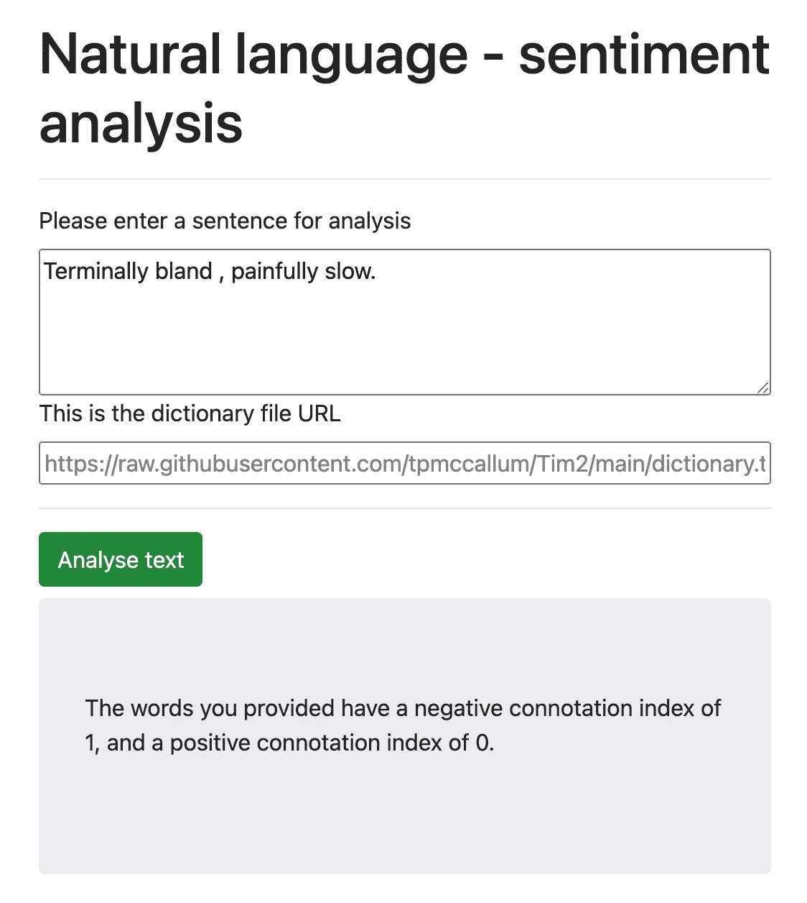

相比之下……的句子

这部电影棒极了。伟大的演员，好的情节和娱乐性。

导致了:

*   `0.09839419`的低负指数
*   `0.9016058`的积极指数较高


为了更深入一点，在我们结束自然语言示例之前，我冒昧地粘贴了 WasmEdge 服务器端日志的输出。下面的输出显示了 Rust 源代码中所有的`println!`语句；本质上展示了我们如何远程获取字典，获取用户的输入，然后为模型创建一个 256 元素的数组，该数组包含任何单词/整数匹配的数字表示(在输入与字典文件的交叉引用期间)。

```
Input string: "This film was excellent. Great actors, good plot and entertaining"Processing word: "this"Processing word: "film"Processing word: "was"Processing word: "excellent."Processing word: "great"Processing word: "actors,"Processing word: "good"Processing word: "plot"Processing word: "and"Processing word: "entertaining"Processing loading the modelFinal Vec For Model: [2838, 976, 3070, 6874, 1092, 9754, 408, 6224, 0, 0, 0, 0, 0, 0, 0, 0, 0, 0, 0, 0, 0, 0, 0, 0, 0, 0, 0, 0, 0, 0, 0, 0, 0, 0, 0, 0, 0, 0, 0, 0, 0, 0, 0, 0, 0, 0, 0, 0, 0, 0, 0, 0, 0, 0, 0, 0, 0, 0, 0, 0, 0, 0, 0, 0, 0, 0, 0, 0, 0, 0, 0, 0, 0, 0, 0, 0, 0, 0, 0, 0, 0, 0, 0, 0, 0, 0, 0, 0, 0, 0, 0, 0, 0, 0, 0, 0, 0, 0, 0, 0, 0, 0, 0, 0, 0, 0, 0, 0, 0, 0, 0, 0, 0, 0, 0, 0, 0, 0, 0, 0, 0, 0, 0, 0, 0, 0, 0, 0, 0, 0, 0, 0, 0, 0, 0, 0, 0, 0, 0, 0, 0, 0, 0, 0, 0, 0, 0, 0, 0, 0, 0, 0, 0, 0, 0, 0, 0, 0, 0, 0, 0, 0, 0, 0, 0, 0, 0, 0, 0, 0, 0, 0, 0, 0, 0, 0, 0, 0, 0, 0, 0, 0, 0, 0, 0, 0, 0, 0, 0, 0, 0, 0, 0, 0, 0, 0, 0, 0, 0, 0, 0, 0, 0, 0, 0, 0, 0, 0, 0, 0, 0, 0, 0, 0, 0, 0, 0, 0, 0, 0, 0, 0, 0, 0, 0, 0, 0, 0, 0, 0, 0, 0, 0, 0, 0, 0, 0, 0, 0, 0, 0, 0, 0, 0, 0, 0, 0, 0, 0, 0, 0, 0, 0, 0, 0, 0]Adding outputRunning sessionThe words you provided have a negative connotation index of 0.09839419, and a positive connotation index of 0.9016058.
```

第一个例子到此结束，现在我们来看另一个例子。物体检测。你可能在无人驾驶汽车演示中见过这种人工智能。物体检测有着广泛的用途，尤其是在工程和制造业。

# 目标检测


[科学高清照片](https://unsplash.com/@scienceinhd?utm_source=medium&utm_medium=referral)上 [Unsplash](https://unsplash.com?utm_source=medium&utm_medium=referral)

## 单发探测器(SSD)示例

和上面的自然语言例子一样，我们将首先安装一些依赖项

```
pip3 install testresources
pip3 install pycocotools
pip install grpcio==1.32
pip3 install tflite-model-maker
```

然后输入`python3`进入 Python 解释器。

```
import numpy as np
import os

from tflite_model_maker.config import ExportFormat
from tflite_model_maker import model_spec
from tflite_model_maker import object_detector

import tensorflow as tf
assert tf.__version__.startswith('2')

tf.get_logger().setLevel('ERROR')
from absl import logging
logging.set_verbosity(logging.ERROR)
```

对于这个特定的对象检测，我们将使用 GS://cloud-ml-data/img/open image/CSV/Salads _ ml _ use . CSV 中的*沙拉*数据集

前述的`salads_ml_use.csv`遵循[特定的约定](https://cloud.google.com/vision/automl/object-detection/docs/csv-format)。以下是为培训目的创建自己的`csv`文件的条件。

目标是理解这个模型，这样你就可以在你喜欢的任何图像/物体上训练它；不仅仅是沙拉😊

## 数据格式

`csv`文件:

*   必须是 UTF 8 编码的
*   必须以`.csv`扩展名结尾
*   集合中的每个边界框都有一行
*   **每行包含**一幅图像**；具有多个边界框的图像将在与边界框一样多的行上重复**

## ****标签****

**每个标签必须以字母开头，并且只能包含字母、数字和下划线。**

## **边界框**

**图像中特定对象的每个边界框(在`csv`文件的那一行)可以用两种方式之一来表示。**

1.  **只有两个顶点(由一组 x，y 坐标组成),如果它们是矩形的对角点。**

**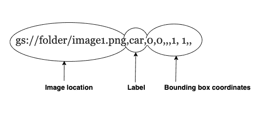**

**例如:**

```
(x_relative_min,
    y_relative_min,
    ,
    ,
    x_relative_max,
    y_relative_max,
    ,
)
```

**2.所有 4 个顶点**

**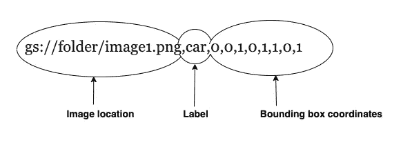**

**例如**

```
(x_relative_min,
    y_relative_min,
    x_relative_max,
    y_relative_min,
    x_relative_max,
    y_relative_max,
    x_relative_min,
y_relative_max)
```

**从示例中可以看出，这些坐标必须是 0 到 1 范围内的浮点数，其中 0 表示最小的 x 或 y 值，1 表示最大的 x 或 y 值。**

**正如我们在本文开头提到的，理解数据非常重要，这样我们才能创建自己的训练数据。这些坐标可能会有点混乱，所以让我们来看一张图，这将使这一点更清楚。首先，正如你所看到的，最小值和最大值是从左上到右下排序的。因此，不要感到困惑，或者尝试将这与传统的数据绘图练习联系起来(这是不同的)。**

**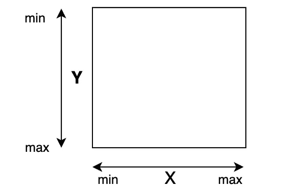**

**下图增加了一些细节；演示边界框的坐标位置。**

**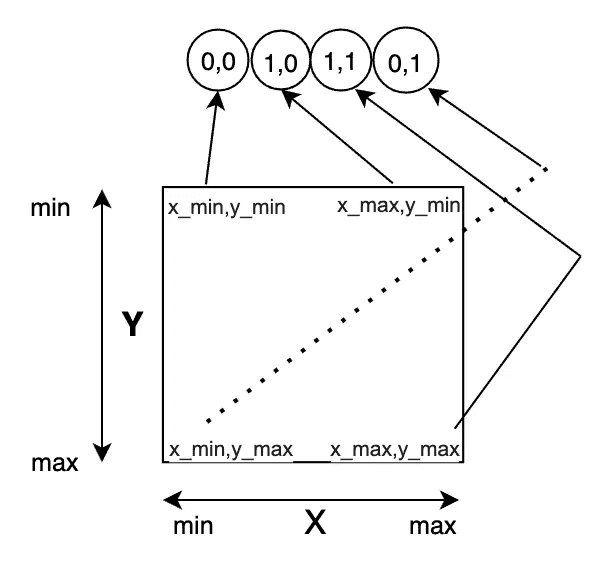**

**例如，x_min = 0，x_max = 1，y_min = 0，y_max = 1**

## **创建您自己的数据集**

**我们马上就要使用一个现成的数据集，但是现在我们已经了解了这个数据是如何工作的，让我们来看看如何从头开始创建我们自己的数据集。**

**有许多应用程序允许你在自己的图像上手动创建带标签的边界框。其中一个应用叫做 [labelImg](https://github.com/tzutalin/labelImg) 。**

**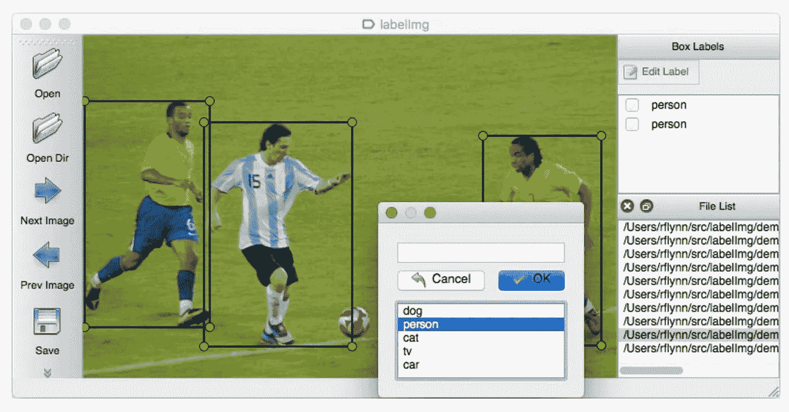**

**我们在本文中使用的另一个应用程序叫做 [MakeML](https://makeml.app/) 。**

**下图显示了我们如何拍摄桌子的照片，然后识别笔记本电脑(通过绘制黄色边框并创建名为“laptop”的标签)。**

**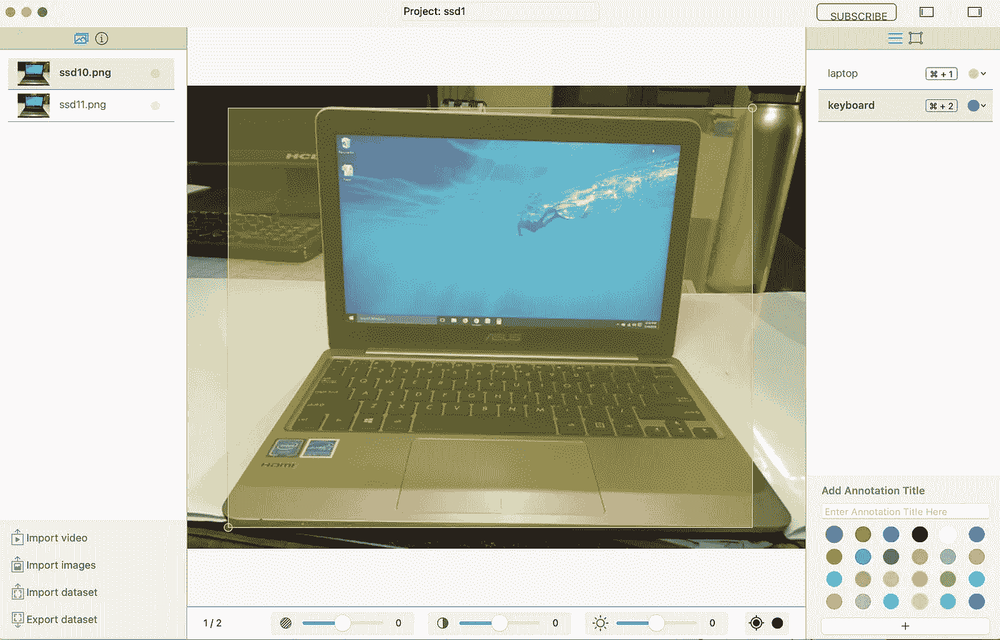**

**然后我们识别笔记本电脑的键盘(通过画一个紫色的方框并创建一个名为“keyboard”的标签)。**

**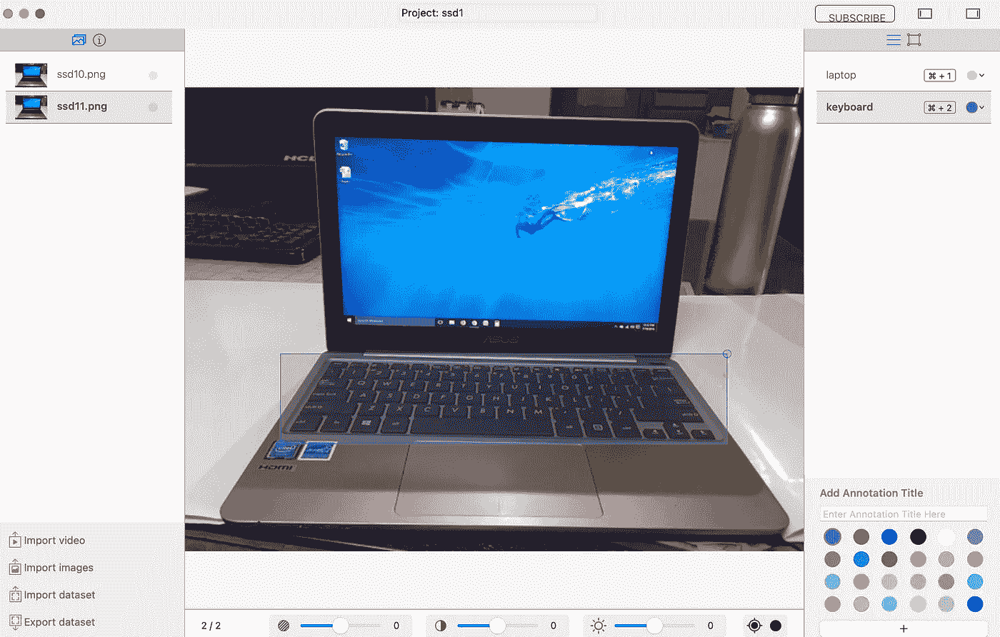**

**在每张图片上画出一个边界框(越多越好)，然后点击左下角的“导出数据集”链接。**

**有几种不同的数据格式可供选择。我们来对比一下。**

## **Turicreate**

**Turicreate 兼容数据如下。**

```
[{'label':'keyboard','type':'rectangle','coordinates':{'x':298,'y':301,'width':397,'height':69}},{'label':'laptop','type':'rectangle','coordinates':{'x':294,'y':225,'width':508,'height':407}}]
```

## **椰子树**

**这个通用对象上下文(COCO)兼容数据集是一个 JSON 文件(如下所示)。**

```
{
  "categories" : [
    {
      "id" : 1629415338,
      "name" : "laptop"
    },
    {
      "name" : "keyboard",
      "id" : 1629415413
    }
  ],
  "images" : [
    {
      "file_name" : "ssd10.png",
      "height" : 450,
      "id" : 0,
      "width" : 600
    }
  ],
  "annotations" : [
    {
      "id" : 0,
      "category_id" : 1629415413,
      "iscrowd" : 0,
      "bbox" : [
        101,
        268,
        498,
        114
      ],
      "segmentation" : [],
      "image_id" : 0,
      "area" : 27456
    },
    {
      "iscrowd" : 0,
      "id" : 1,
      "bbox" : [
        40,
        22,
        549,
        21
      ],
      "segmentation" : [],
      "area" : 207401,
      "image_id" : 0,
      "category_id" : 1629415338
    }
  ]
}
```

## **帕斯卡 VOC**

**Pascal VOC 数据集格式是一个 XML 文件(如下所示)**

```
<annotation>
    <folder>images</folder>
    <filename>ssd10.png</filename>
    <size>
        <width>600</width>
        <height>450</height>
        <depth>3</depth>
    </size>
    <segmented>0</segmented>
    <object>
        <name>keyboard</name>
        <pose>Unspecified</pose>
        <truncated>0</truncated>
        <occluded>0</occluded>
        <difficult>0</difficult>
        <bndbox>
            <xmin>101</xmin>
            <ymin>268</ymin>
            <xmax>498</xmax>
            <ymax>337</ymax>
        </bndbox>
    </object>
    <object>
        <name>laptop</name>
        <pose>Unspecified</pose>
        <truncated>0</truncated>
        <occluded>0</occluded>
        <difficult>0</difficult>
        <bndbox>
            <xmin>40</xmin>
            <ymin>22</ymin>
            <xmax>549</xmax>
            <ymax>430</ymax>
        </bndbox>
    </object>
</annotation>
```

**您可能还记得上面的内容，我们需要以特定的方式格式化数据，即电子表格的每一行都需要如下所示:**

**链接到图像、标签、边界框坐标，即**

**gs://folder/ssd10.png，**笔记本电脑**，x_min，y_min，x_max，y_min，x_max，y_max，x_min，y_max**

**gs://folder/ssd10.png，**键盘**，x_min，y_min，x_max，y_min，x_max，y_max，x_min，y_max**

**为了符合上面讨论的格式，我们需要将图像形状和框坐标转换为 0–1 值(作为 600 px x450 px 格式中的并列像素坐标)。**

**如果宽度(x 轴)是 600 像素，高度(y 轴)是 450 像素，那么我们将对笔记本电脑的边界框坐标执行以下转换。**

**40px(最小)/ 600px(宽度)= 0.06**

**549 像素(最大值)/600 像素(宽度)= 0.91**

**22px(最小)/ 450px(高度)= 0.04**

**430(最大)/450 像素(高度)= 0.95**

**因此，膝上型电脑边界框的单行条目如下**

**gs://folder/ssd10.png，笔记本电脑，0.06，0.04，0.91，0.04，0.91，0.95，0.06，0.95**

## **用数据训练**

**准备好电子表格行和图像后，您可以继续运行以下命令。**

```
spec = model_spec.get('efficientdet_lite0')train_data, validation_data, test_data = object_detector.DataLoader.from_csv('gs://cloud-ml-data/img/openimage/csv/salads_ml_use.csv')model = object_detector.create(train_data, model_spec=spec, batch_size=8, train_whole_model=**True**, validation_data=validation_data)model.evaluate(test_data)model.export(export_dir='.')
```

## **编写应用程序来执行对象检测**

**使用经过训练的模型来执行对象检测的应用程序需要提供正确的输入(数据类型)，并且还知道如何解释模型的输出。**

**如果我们检查`model.tflite`文件(使用 netron 这样的应用程序。app)，我们看到以下内容**

**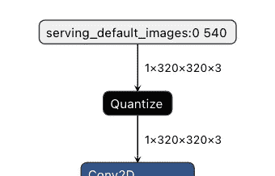**

## **投入**

**这个模型很好地描述了输入和输出(我们可以看到输入在 RGB 中是 320 x 320 像素)**

**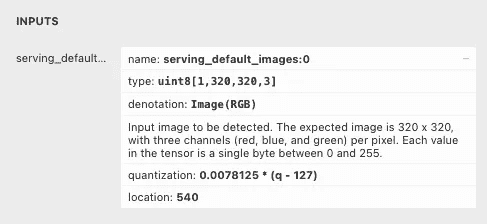**

**我们确保 Rust 源代码以 320x320 数组格式提供图像；平面阵列。**

```
let mut resized = image::imageops::thumbnail(&img, 320, 320);
let mut flat_img: Vec<u8> = Vec::new();
for rgb in resized.pixels() {
    flat_img.push(rgb[0]);
    flat_img.push(rgb[1]);
    flat_img.push(rgb[2]);
}
```

## **输出**

**输出在模型规格中有详细说明，如下图所示。**

**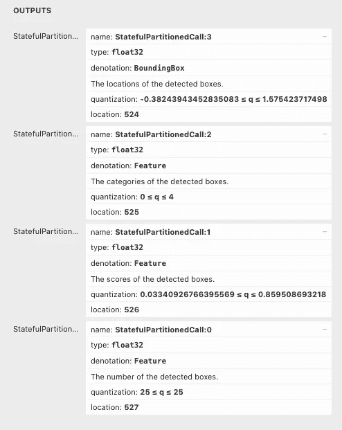**

**让我们看一个使用前面提到的沙拉数据集的例子。**

**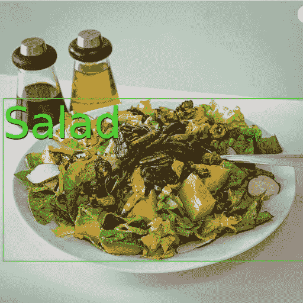**

**弗兰霍根，CC BY-SA 4.0<[https://creativecommons.org/licenses/by-sa/4.0](https://creativecommons.org/licenses/by-sa/4.0)>，通过维基共享**

**该模型本质上是采用它以前从未见过的新图像，然后以与我们在生成训练数据时手动创建边界框坐标几乎相同的方式返回边界框坐标。**

**有趣的是，这个模型以相同的`0–1`格式返回给我们边界框，并且与缩小的 320x320 图像尺寸相关。**

**当我们将原始图像返回给用户时，我们需要确保根据原始图像的大小来转换对象边界框。**

**这里有一个包围盒坐标的例子，我们称这个数据为`res0`。**

```
[0.8125, 0.72265625, 0.5859375, 0.45703125, 
...
0.4296875, 0.36328125, 0.36328125, 0.3203125]
```

**处理盒子的逻辑如下(基于我们在每个盒子 4 个坐标的集合中工作的事实)**

```
let mut iter = 0;
while (iter * 4) < res0.len() {
    // bounding box logic
    iter += 1;
}
```

**边界框逻辑的具体实现(假定原始图像是 512 像素乘 512 像素)如下。**

```
let image_height: f32 = img.height() as f32; //512
let image_width: f32 = img.width() as f32; //512
let x1 = res0[4 * iter + 1] * image_width;
let y1 = res0[4 * iter] * image_height;
let x2 = res0[4 * iter + 3] * image_width;
let y2 = res0[4 * iter + 2]  * image_height;
```

## **为训练和测试创建自己的数据集**

**我想用一个额外的工具来结束这篇文章，它可能有助于使这个数据训练过程更快和更健壮。**

**我们在上面提到了[标签](https://github.com/tzutalin/labelImg)图像标签应用程序。这是一个开源产品，以 PASCAL VOC 格式的 XML 文件构建训练集。这是 ImageNet 使用的格式。**

**ImageNet 是一项正在进行的研究工作，旨在为世界各地的研究人员提供用于训练大规模对象识别模型的图像数据。**

**令人欣慰的是，labelImg 似乎有一个免费的转换工具，可以在[GitHub 仓库](https://github.com/tzutalin/labelImg/tree/master/tools)获得，它可以将你的 XML 文件从 PASCAL VOC 格式转换成 TensorFlow 兼容格式，我们在本文中已经解包了这种格式；正式描述在[谷歌的官方文档](https://cloud.google.com/vision/automl/object-detection/docs/csv-format)中。labelImg 还支持 YOLO 和 CreateML 格式。**

**使用 labelImg 将允许您创建自己的自定义图像和自定义标签。额外的转换工具将使您不必编写自己的转换工具。**

**一旦你的数据集被训练并导出为`tflite`文件，你就可以使用 WasmEdge 创建你自己的 AI 应用程序。**

**你会创造什么？**

**如果你有任何问题，请在下面留下评论。**

****

**此外，如果您想为 WasmEdge 做贡献，请访问[官方 WasmEdge GitHub](https://github.com/WasmEdge/WasmEdge) 页面。**

****

**[https://www.secondstate.io/](https://www.secondstate.io/)**

**SecondState 团队是 WasmEdge 的最初创建者和当前维护者，所以请随时查看 SecondState 的网站、[博客](https://blog.secondstate.io/categories/en/)和 [GitHub](https://github.com/second-state/) 库。**

**感谢阅读！**

# **参考**

**[1][https://github.com/WasmEdge/WasmEdge#introduction](https://github.com/WasmEdge/WasmEdge#introduction)**

**[2][https://www . ABC . net . au/news/2021-08-20/Toyota-slash-car-production-over-chip-short/100392630](https://www.abc.net.au/news/2021-08-20/toyota-slash-car-production-over-chip-shortage/100392630)**