# 如何训练你的连体神经网络

> 原文：<https://towardsdatascience.com/how-to-train-your-siamese-neural-network-4c6da3259463?source=collection_archive---------2----------------------->

## [实践教程](https://towardsdatascience.com/tagged/hands-on-tutorials)

## 训练时看不到的类的简单工作方式

由 [Sereja Ris](https://unsplash.com/@serejaris?utm_source=medium&utm_medium=referral) 在 [Unsplash](https://unsplash.com?utm_source=medium&utm_medium=referral) 上拍摄的照片

当你第一次开始机器学习时，从偏移中可以清楚地看到，精确而稳健的模型训练需要大量的数据。虽然这是事实，但当为了需要自定义数据集的目的而训练模型时，您通常需要在模型看到的数据级别上做出妥协。

这是我自己的情况；在 conservation tech 工作时，我们部署到一个区域的任何模型都是使用前几年调查中收集的数据构建的，这些数据在某些情况下可能是稀疏的(当然远不及 ImageNet [1]等基准数据集的水平)。更糟糕的是，在保护技术领域工作意味着使用开放的数据集。因为我们处理的动物是自由漫游的，所以不能保证我们用于模型训练的数据集将包含模型将在野外看到的所有事物的示例。

当试图使用传统的机器学习方法部署模型时，这导致了一场艰难的战斗。如果每门课都需要成千上万个例子，并且每年随着课程的变化都需要重新训练模型，那么建立一个守恒模型是没有用的。但是这个问题不仅限于保护，基准测试之外的许多领域都有类似的数据量和变化率问题。

在这篇文章中，我将讨论一种被称为连体神经网络的模型。希望在阅读之后，您将更好地理解这种架构不仅可以在保护方面有所帮助，而且可以在数据量有限且类别变化速度快的任何领域中有所帮助。

# 先决条件

在开始之前，你可能应该对机器学习有所了解，特别是卷积神经网络。如果你不知道，我发现 [Sumit Saha](https://medium.com/u/631ee5e6343e?source=post_page-----4c6da3259463--------------------------------) 的帖子 [*是卷积神经网络的综合指南 ELI5 方式*](/a-comprehensive-guide-to-convolutional-neural-networks-the-eli5-way-3bd2b1164a53) 是代替该领域正规教育的一个很好的起点。你应该先看看这个。

您还应该熟悉 Python、Keras 和 TensorFlow。在本文中，我们将学习代码示例，因为我发现这样做比自由格式文本本身更容易理解。本指南中的所有代码都是在 TensorFlow 1.14 中编写的，但没有理由认为这些代码不能在新版本中工作(可能需要一些修改)，或者移植到其他深度学习框架，如 PyTorch。

# 什么是连体神经网络？

简而言之，连体神经网络是包含至少两个平行的、相同的卷积神经网络的任何模型结构。从现在开始我们称这些为 SNNs 和 CNN。这种并行 CNN 架构允许模型学习*相似度*，可以用来代替直接分类。snn 主要用于图像数据，如面部识别，尽管它们在这个领域之外也有用途。例如，赛仑·乌古罗格鲁在 NeurIPS 2020 上做了一个关于[网飞如何利用社交网络根据电影元数据生成用户推荐](https://slideslive.com/38943514/similarity-at-netflix)的精彩演讲。在本指南中，我们将重点介绍图像数据。

构成 SNN 一部分的每个并行 CNN 被设计成产生输入的嵌入或缩减维度的表示。例如，如果我们指定嵌入大小为 10，我们可以输入大小为*宽度* * *高度* * *通道*的高维图像，并接收大小为 10 的浮点值向量作为输出，该向量直接表示图像。

然后，这些嵌入可用于优化排名损失，并在测试时用于生成相似性得分。理论上，并行 CNN 可以采取任何形式。然而，重要的一点是它们必须完全相同；它们必须共享相同的架构，共享相同的初始和更新权重，并具有相同的超参数。这种一致性允许模型比较它接收的输入，通常每个 CNN 分支一个。来自 Dey *等人*【2】的图章纸对此提供了一个极好的可视化，可以在下面看到。

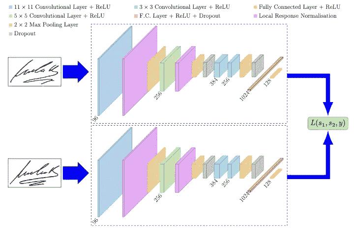

图章建筑。图片来自 Dey 等人。

SigNet 的目标是确定给定的签名是真实的还是伪造的。这可以通过使用两个平行的 CNN 来实现，这两个 CNN 在真实和伪造的签名对上进行训练。每个签名通过 SNN 的一个分支输入，该分支为图像生成一个 *d-* 维嵌入。正是这些嵌入被用来优化损失函数，而不是图像本身。更近版本的 SNNs 将很可能利用三分支甚至四分支，分别包含三个或四个平行的 CNN。

# SNNs 有什么意义？

既然我们了解了 SNN 的构成，我们就可以强调它们的价值了。使用生成的 *d-* 维嵌入，我们可以创建一些 *d-* 维多维空间，允许绘制嵌入来创建集群。然后，可以使用主成分分析(PCA)将这个多维空间投影到二维空间进行绘图。

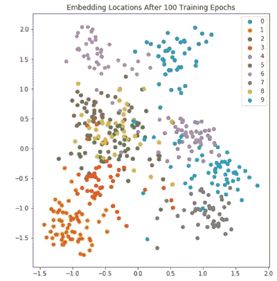

100 个训练时期后嵌入超空间的图，使用 PCA 投影到 2 维。使用基于[笔记本](https://github.com/AdrianUng/keras-triplet-loss-mnist/blob/master/Triplet_loss_KERAS_semi_hard_from_TF.ipynb)的代码生成的图像。

该图显示了 MNIST 测试数据子集的嵌入位置[3]。这里，已经训练了一个模型来生成 10 个独特类别的图像嵌入(0 到 9 之间的手写数字的图像)。请注意，即使只经过 100 个训练时期，该模型也开始为同一类别的图像生成类似的嵌入。这可以从上图中相同颜色的点的聚类中看出——图中的一些聚类相互叠加，这是由于通过 PCA 降低到二维。在这种情况下，其他的观想，比如 t-SNE 图，或者降低到更高的维度，会有所帮助。

正是这种嵌入聚类使得 SNNs 成为如此强大的工具。如果我们突然决定要向数据中添加另一个类，那么就没有必要重新训练模型。新的类嵌入应该以这样一种方式生成，即当绘制到多维空间中时，它们远离现有的聚类，但是当它们被添加时，与新类的其他示例聚集在一起。通过使用这种嵌入的相似性，我们可以开始使用很少的数据为可见和不可见的类产生可能的分类。

# 模特培训

之前，我提到过 SNNs 由*至少两个*并行 CNN 分支组成，但现代实现往往依赖于更多分支。SNN 分店的数量对你的模特训练有很大的影响。您不仅需要确保您的数据以这样一种方式输入到 SNN，即每个分支都接收到训练样本，而且您选择的损失函数还必须考虑分支的数量。不管选择了多少个分支，损失函数的*类型*将可能保持一致。

排序损失，也称为对比损失，旨在预测投影到超空间时模型输入之间的相对距离。这与旨在预测一些类别标签集的更传统的损失相比。排序损失在 SNNs 中起着重要的作用，尽管它们对于诸如自然语言处理的其他任务也是有用的。有许多不同类型的排名损失，但它们都以相同的方式工作。

假设我们有两个输入，我们想知道它们有多相似。使用排名损失，我们将执行以下步骤:

1.  从输入中提取特征。
2.  将提取的特征嵌入到一个 *d-* 维的多维空间中。
3.  计算嵌入之间的距离(例如使用欧几里德距离)以用作相似性的度量。

这里需要注意的是，我们通常并不特别关心嵌入的值，只关心它们之间的距离。以前面显示的嵌入图为例，注意所有点都位于 x 轴上大约-1.5，2.0 和 y 轴上大约-2.0，2.0 之间。嵌入在这个范围内的模型本身没有好坏之分，重要的是这些点在它们各自的类中聚集。

## 三重排序损失

用于 SNNs 的更常见的排序损失类型之一是三元组排序损失。你会经常看到 snn 使用这种称为三联体网络的损失函数，就好像它们是自己的东西一样(事实上这就是霍夫尔 *e* t *al 对它们的定义。在最初构思它们的论文中，但实际上它们只是一个有三个分支的 SNN。因为三重态损失现在是如此普遍，这是我们将在本文后面使用的损失函数，所以理解它的工作原理很重要。*

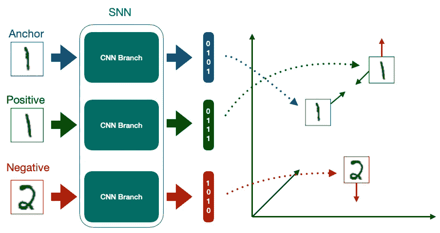

这个例子展示了三元组排序损失是如何将相同类别的嵌入图像拉近，而将不同类别的嵌入图像拉远的。图片作者。

顾名思义，三元组排序损失需要三个输入，我们称之为三元组。三元组中的每个数据点都有自己的工作。**锚**是某个 C 类的数据，它定义了三元组将在哪个类上训练模型。**正**是 c 类的另一个例子。**负**是某个类的数据点，它不是*c。在训练时间，我们的每个三元组组件都被馈送到它自己的 CNN 分支进行嵌入。这些嵌入被传递给三元组损失函数，其定义为:*

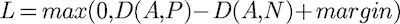

其中 *D(A，P)* 为锚点与正片的嵌入距离， *D(A，N)* 为锚点与负片的嵌入距离。我们还定义了一些边距——一个常用的初始值是 0.2，这是 FaceNet [5]中使用的边距。

该函数的目的是最小化锚和正片之间的距离，同时最大化锚和负片之间的距离。要更深入地了解三胞胎排名的损失，我建议[这篇来自劳尔·戈麦斯的精彩文章](https://gombru.github.io/2019/04/03/ranking_loss/)。

## 半坚硬三重开采

由于三胞胎成分的重要性，当务之急是我们的 SNN 只提供三胞胎，这将使它能够学习。更具体地说，我们希望提供否定，以便我们的三元组允许模型学习，但不要太难以至于学习需要太长时间。

一个简单的方法是通过一个被称为半硬三重开采的过程。为此，我们首先定义三个三元组类别:

*   **易三元组**是那些其中 *D(A，P) + margin < D(A，N)* ，从而 *L = 0 的。*
*   **硬三元组**是那些 *D(A，N) < D(A，P)的。*
*   **半硬三联体**是那些 *D(A，P) < D(A，N) < D(A，P) + margin 的。*

目标是找到尽可能多的半硬三胞胎。这些三元组具有正损失，但是正嵌入距离比负嵌入距离更接近锚嵌入。这允许快速训练，但是对于模型来说，在训练期间实际学习某些东西仍然是足够困难的。

有两种方法可以找到这些半硬的三元组。在**离线**挖掘中，整个数据集在训练前被转换成三元组。在**在线**挖掘中，成批的数据被输入，随机生成三个一组。

作为一般的经验法则，在线挖掘应该尽可能地执行，因为它允许更快的训练，因为它能够随着训练的进行不断地更新我们的半硬三元组的阈值定义。这可以用数据扩充来补充，数据扩充也可以以在线方式进行。

# 推理时使用 SNNs

既然我们已经了解了 snn 是如何被训练的，我们接下来需要了解如何在推理时使用它们。在训练期间，我们使用 SNN 的所有分支，而推理可以使用单个 CNN 分支来执行。

在推理时，未知类别的输入图像由 CNN 分支处理并嵌入其特征。这种嵌入然后被绘制到超空间上，并与其他集群进行比较。这为我们提供了相似性分数的列表，或者未知类别的图像和所有现有聚类之间的相对距离。我们用来比较输入图像的聚类被称为**支持集**。让我们看一个例子来帮助理解这一点。

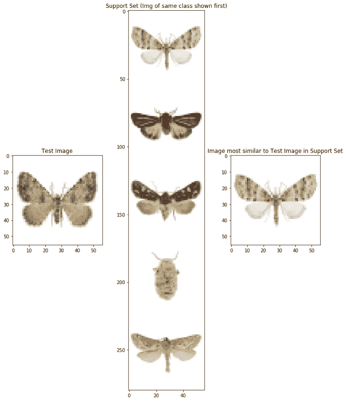

根据 Vetrova 等人[6]的数据，为测试图像蛾寻找最可能的家族类别。图像使用基于[本笔记本](https://github.com/asagar60/One-Shot-Learning/blob/master/Omniglot_data/One_shot_implementation.ipynb)的代码生成。

上面的图是我为了确定蛾的科学家族而创建的 SNN 的输出。数据集中的每张图片改编自 Vetrova *等人的*【6】，被贴上了四个科学家族名称中的一个，或者被贴上了“幼虫”的标签，总共给出了五个类别。为了易于可视化(尽管事后看来不一定易于理解)，每个已知标记的类别都显示在支持集中，如上面图的中间所示，使用来自每个类别的随机示例图像。在图的左边是一个测试图像；这是一张 SNN 没有看到的蛾的照片，它现在的任务是确定科学家族。

首先，SNN 使用在训练期间学习的嵌入函数嵌入测试图像。接下来，将该嵌入与支持集嵌入进行比较，支持集嵌入为测试图像提供了最可能的蛾类。在图的右边，我们可以看到支持集中的第一个图像已经被再次打印。

上面用于生成绘图的代码被告知首先显示测试图像族的相应示例(绘图代码知道正确的类，但 SNN 不知道)。因为第一个支持集图像再次显示在图的右侧，这告诉我们，SNN 在确定测试图像蛾的科学家族方面是正确的！如果这个图对您来说有点混乱，不要担心，因为我们稍后将在不同的、更简单的数据上创建相同的图。

如果嵌入被放置在超空间的一个新的区域中，并且超过了某个预定义的类距离阈值，则该代码可以被进一步扩展以警告用户。这可能表明 SNN 第一次看到了一个新的蛾类家族。

# 我们从哪里开始测量？

为了确定测试图像和支持集中的类之间的距离，我们需要每个类的测量位置。乍一看，从每个支持集类中随机选择一个嵌入似乎没问题；毕竟，如果所有的嵌入都完美地聚集在一起，那么我们使用哪一个并不重要？

虽然这个假设肯定成立*如果*我们的类嵌入是完美的集群，在一个真实的世界系统中不会是这种情况。让我们看看下面的玩具例子。

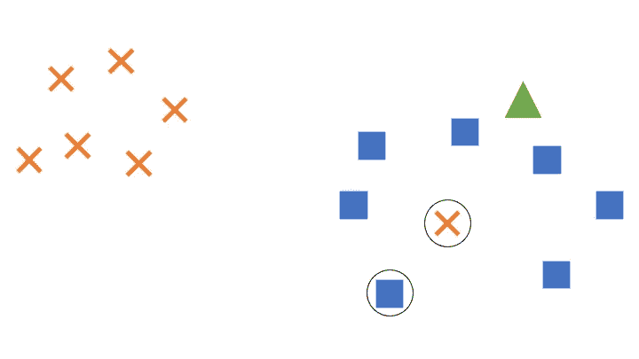

一个嵌入空间的例子，有两个类，十字和正方形，还有一个未定类的嵌入用三角形表示。图片作者。

在这个例子中，我们有两个类嵌入空间，一个用于十字，一个用于正方形。所有的方形类嵌入都聚集在图的右侧，但是交叉类有一个嵌入没有与左上方的其他嵌入聚集在一起。这个错误的十字被嵌入到方块通常聚集的空间中。在右上角还绘制了一个三角形，这是当前的测试图像，嵌入到空间中，但尚未根据其与其他聚类的距离分配到某个类别。

为了确定三角形实际上应该是十字形还是正方形，我们为每个类随机选择一个要测量的嵌入；错误的十字和左下角的方块被选中(都被圈起来)。如果我们比较这些嵌入的距离，选择的十字是最接近的，因此三角形将被标记为十字。

然而，从整体上来看，很明显，三角形可能应该被标记为正方形，而十字是一个异常值。通过选择随机嵌入来度量，我们冒着离群值扭曲距离度量的风险，从而扭曲最终结果。

这可以通过使用**原型**来解决，这是一个优雅且易于理解的问题解决方案。原型本质上是每个类的一般化嵌入，减少了离群值对距离测量的影响。这些可以用多种方法计算，但是简单的技术，比如取中间值，效果很好。让我们更新玩具的例子…

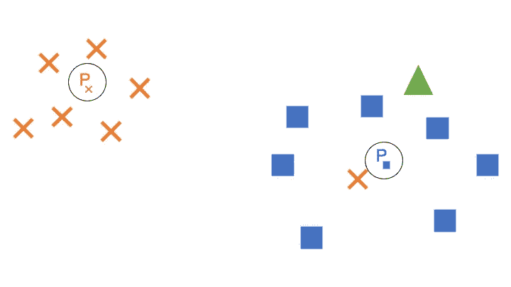

与之前相同的嵌入空间，但是包含了原型。图片作者。

现在，每个类都被赋予了一个靠近其类中心的原型(例如，Pₓ是交叉类的原型)。如果我们在测量相似性时选择了原型，我们的三角形就被正确地标记为正方形。这个简单的解决方案可以大大减少计算相似性时离群值的影响。

确定如何计算原型是很困难的，使用中位数等解决方案可能会在某些数据集上失效。例如，如果我们的所有交叉类示例围绕原点形成半径为 1 的圆，而方形类示例形成半径为 2 的圆，则原型现在都将在原点形成，从而产生相等的距离测量值。我们需要找到另一种方法来计算数据集的原型。

# 建立一个连体神经网络

既然我们已经掌握了 SNNs 的基本理论，以及为什么它们是一个重要的工具，那么让我们来看看如何构建一个 SNNs。如前所述，我们将为此使用 Python、Keras 和 TensorFlow 1.14，尽管实际上没有什么可以阻止这些代码被转换用于另一个框架，如 PyTorch 我使用 TensorFlow 是出于个人偏好，而不是因为它更适合制作 snn。为了一致性和便于训练，我们还将坚持使用 MNIST 作为我们的数据集。

这里的代码是基于各种来源的，我会在我们进行的过程中进行链接，但底层的构造是基于 Amit Yadav 的 [Coursera，](https://www.coursera.org/projects/siamese-network-triplet-loss-keras)中描述的方法，它本身是基于 FaceNet [5]。

如果你喜欢完整的代码而不是片段，这可以从我的 Github 获得。

## 步骤 1:导入包

首先，我们需要导入所需的包。如需在虚拟机上运行该代码所使用的软件包版本的完整列表，请参见此处的。我用 Python 3.6.7 测试了这段代码。

## 步骤 2:导入数据

接下来，我们需要为 SNN 导入一个数据集。如前所述，我们将使用 MNIST，它可以通过 TensorFlow 的`mnist.load_data()`加载。

数据加载后，将被重新整形和展平。这使得将数据读入 SNN 更加容易。

注意，我们这里只有高度和宽度，因为 MNIST 是灰度的，所以只有一个颜色通道。如果我们有一个包含多个颜色通道的数据集，我们需要修改我们的代码，例如使用`x_train_w_h_c`来代替。

## 第三步:创建三胞胎

现在我们需要创造我们的 MNIST 三胞胎。为此需要两种方法。

第一个是`create_batch()`，通过随机选择两个类标签生成三元组，一个用于锚/正，一个用于负，然后为每个随机选择一个类示例。

第二个，`create_hard_batch()`，使用`create_batch()`创建一批随机的三元组，并使用当前的 SNN 嵌入它们。这允许我们确定该批中的哪些三胞胎是半硬的；如果是，我们保留其中的`num_hard`，用其他随机的三元组填充其余的批次。通过填充随机三元组，我们允许开始训练，并确保我们的批次大小一致。

## 步骤 4:定义 SNN

SNN 由两部分定义。首先，我们必须创建嵌入模型。该模型接收一个输入图像并生成一个*维*维嵌入。我们在这里创建一个非常浅的嵌入模型，但是可以创建更复杂的模型。

接下来，我们创建一个模型，该模型接收一个三元组，将其顺序传递给嵌入模型进行嵌入，然后将结果嵌入传递给三元组损失函数。

## 步骤 5:定义三重损失函数

为了让 SNN 使用三元组进行训练，我们需要定义三元组损失函数。这反映了前面所示的三重态损失函数方程。

## 步骤 6:定义数据生成器

为了将我们的三元组传递到网络，我们需要创建一个数据生成器函数。TensorFlow 需要一个`x`和`y`，但是我们不需要一个`y`值，所以我们传递一个填充符。

## 步骤 7:为培训和评估做准备

现在，我们已经定义了 SNN 的基础知识，我们可以设置培训模型了。首先，我们定义超参数。接下来，我们创建并编译模型。我指定这是使用 CPU 执行的，但是根据您的设置，这可能不是必需的。

一旦模型被编译，我们存储测试图像嵌入的子集。这个模型还没有被训练，所以这给了我们一个很好的基线来显示嵌入是如何在训练过程中变化的。通过 PCA 嵌入可视化是基于阿德里安农的[这本笔记本](https://github.com/AdrianUng/keras-triplet-loss-mnist/blob/master/Triplet_loss_KERAS_semi_hard_from_TF.ipynb)。

可以在我们的 SNN 上进行进一步的评估。这一步中使用的代码受 Eric Craeymeersch 的 One Shot Learning、Siamese Networks 以及 Keras 的 Triplet Loss 的影响很大。

我们来看看未经过训练的模特的评价。从图中，我们可以看到我们的模型无法区分相似和不相似的图像。这在第三个图中最为明显，突出显示了测试图像及其最可能的类别，它们的分数之间几乎没有差异。

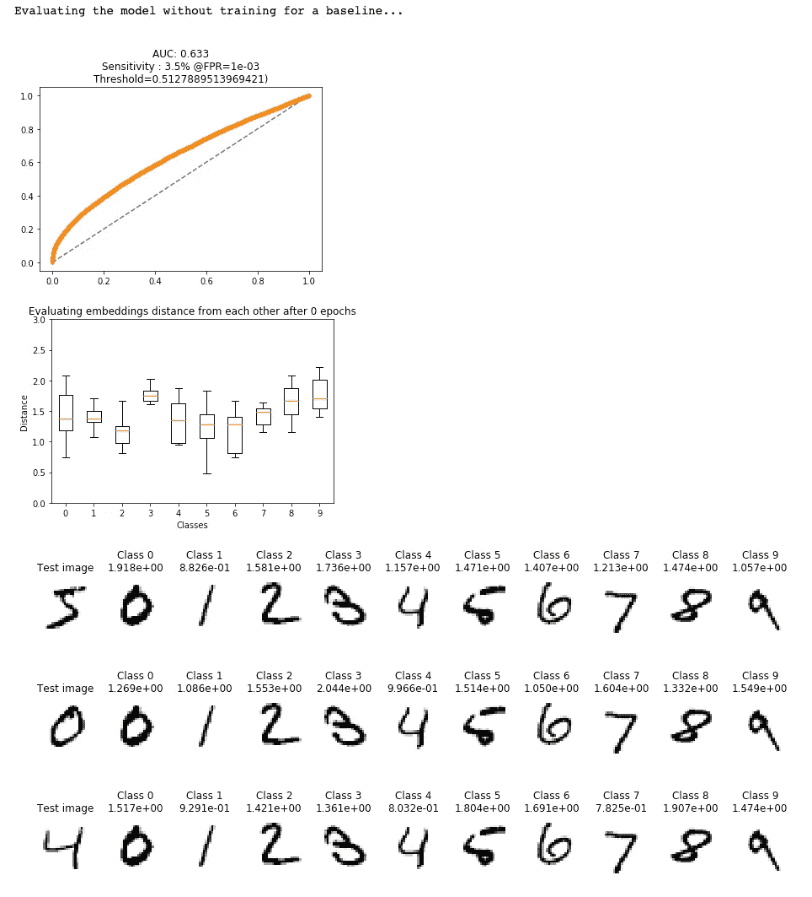

使用基于本笔记本的[代码生成的图像。](https://medium.com/@crimy/one-shot-learning-siamese-networks-and-triplet-loss-with-keras-2885ed022352)

现在我们已经编译了模型，我们也可以生成示例随机和半硬三元组。这段代码基于 Ruochi Zang 的博客文章。

这会产生以下结果:

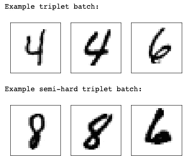

使用基于[这篇博文](https://zhangruochi.com/Create-a-Siamese-Network-with-Triplet-Loss-in-Keras/2020/08/11/)的代码生成的图像。

我们的示例随机三元组包含锚和类别 4 的正，以及类别 6 的负。我们的半硬三联体包含一个锚和一个 8 类的阳离子，和一个 6 类的阴离子，但是请注意它们在组成上是多么的相似。

## 步骤 8:记录我们模型训练的输出

在训练我们的模型之前，让我们设置一些日志记录和自定义回调，如果我们需要在以后的某个日期再回来的话，可以帮助我们。Tensorboard logging callback 改编自 erenon 的[有用的堆栈溢出答案](https://stackoverflow.com/questions/44861149/keras-use-tensorboard-with-train-on-batch/52581175#52581175)，而基于验证损失的最佳模型的保存改编自[另一个 OverLordGoldDragon 的堆栈溢出答案](https://stackoverflow.com/questions/58103035/how-can-we-perform-early-stopping-with-train-on-batch/58103272#58103272)。

## 第九步:训练 SNN

现在我们所有的设置已经完成，是时候开始训练了！我首先从选择可用的 GPU 总数开始，并对它们进行并行模型训练。如果您没有访问多个 GPU 的权限，您可能需要对此进行修改。

注意，在运行`model.fit()`时，我们提供训练和测试数据生成器，而不是直接提供训练和测试数据。这允许在线三元组挖掘发生。

## 步骤 10:评估训练好的模型

一旦模型训练完毕，我们就可以评估它并比较它的嵌入。首先，我们加载训练好的模型。我通过重新加载保存的日志文件来实现这一点，但是如果您只是在一个笔记本中作为一个封闭的系统运行这一切，那么一旦模型被训练，就没有必要重新加载。

一旦加载了模型，我们执行与未训练模型相同的 PCA 分解，以可视化嵌入是如何变化的。

在上述代码块的末尾，我们再次运行`evaluate()`,这产生了下图:

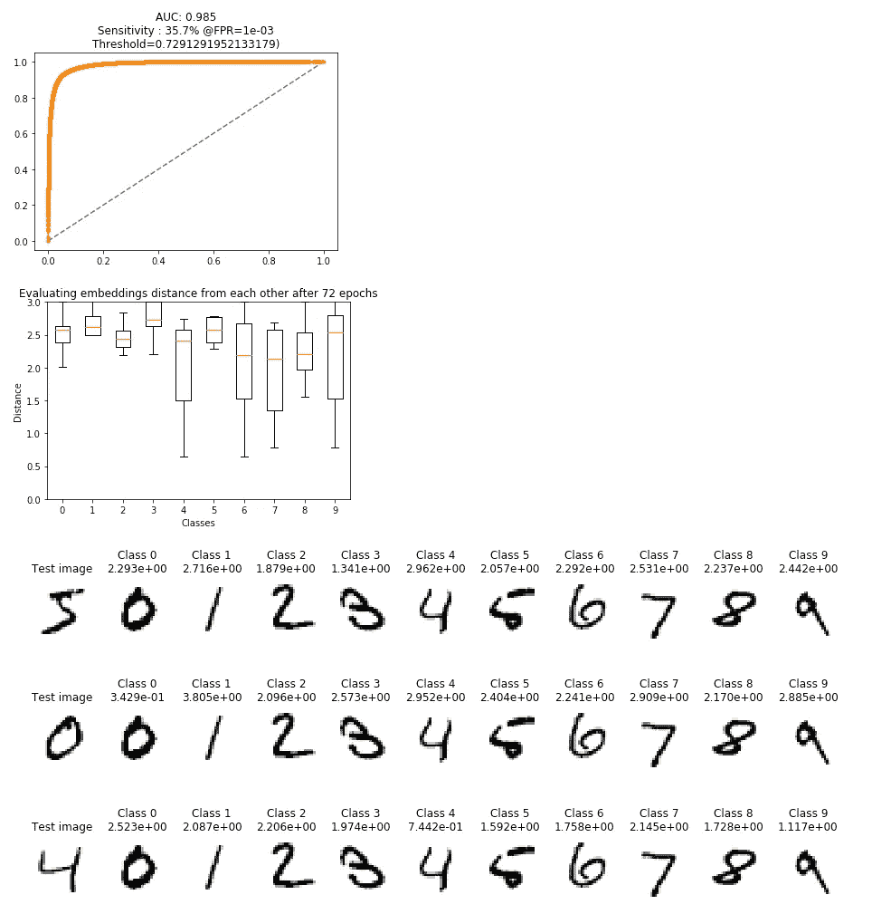

使用基于[本笔记本](https://medium.com/@crimy/one-shot-learning-siamese-networks-and-triplet-loss-with-keras-2885ed022352)的代码生成的图像。

请注意第一个图现在如何显示 AUC 为 0.985，以及我们类别之间的距离增加。有趣的是，当查看测试图像及其最可能的类别时，我们可以看到，对于第二和第三测试图像，已经正确地实现了相应的类别(例如，以类别 0 的第二测试图像为例，我们可以看到所有支持集类别的最低分数也在类别 0)，然而，查看第一测试图像，支持集类别的所有分数都非常接近，这表明训练的模型难以对该图像进行分类。

为了确认我们的模型已经正确训练，并且现在正在形成类簇，让我们绘制我们先前存储的 PCA 分解嵌入。

该代码产生以下输出:

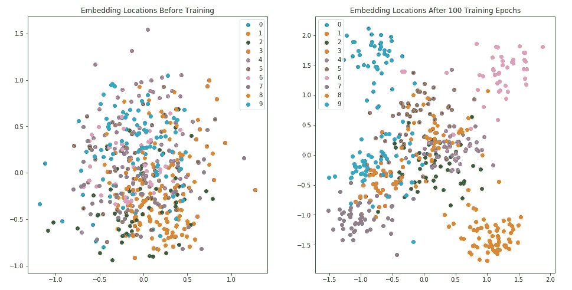

使用基于[本本](https://github.com/AdrianUng/keras-triplet-loss-mnist/blob/master/Triplet_loss_KERAS_semi_hard_from_TF.ipynb)的代码生成的图像。

左图显示了训练前的嵌入位置，使用 PCA 将其分解为二维以进行可视化，每种颜色代表一个不同的类别，如图例所示。请注意嵌入是如何混在一起的，没有清晰的聚类结构，这是有意义的，因为模型还没有学会将类分离出来。这与右图形成对比，右图显示了由经过训练的 SNN 嵌入的相同数据点。我们可以在地块的外围看到清晰的集群，但是中间看起来还是有点乱。我们的图表明，该模型已经很好地学习了对例如类别 1 的嵌入图像进行聚类(左下方的聚类)，但是仍然与类别 5 的嵌入图像进行斗争，类别 5 的嵌入图像仍然主要位于中心。这一点得到了我们之前的图的支持，图中显示了模型在努力确定 5 类测试图像的最可能匹配。

量化我们的模型表现有多好将是一件好事。这可以通过利用我们之前讨论过的原型，使用 n 向准确度得分来实现。在 n 向精度中，`val_steps`个随机选择的测试图像与大小为 *n.* 的支持集进行比较。当 *n* 与下面代码中的类总数`num_classes`相同时，这提供了模型精度的指示。MNIST 有 10 个等级，给出 10 个方向的精确度。

当我们运行上面的代码时，**SNN 实现了 97.4%** 的 10 向准确率，这是一个值得称赞的分数。由于测试图像选择的随机性，如果您愿意，可以在这里进行交叉验证。

最后，让我们看看如何生成一个支持集图像，类似于上一个 moths 示例中显示的图像，只是这次是使用 MNIST 生成的。同样，我们将使用 10 类支持集。

这会产生以下情节:

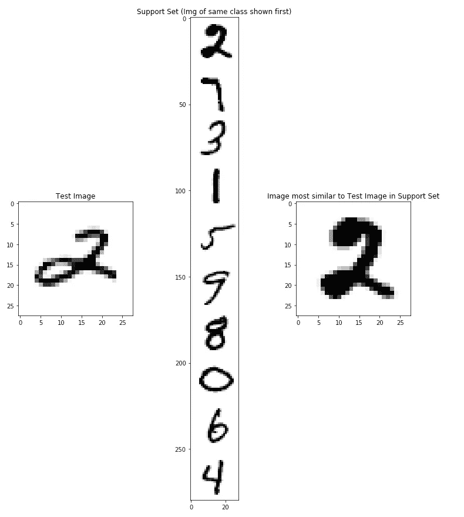

使用基于本笔记本的[代码生成的图像。](https://github.com/asagar60/One-Shot-Learning/blob/master/Omniglot_data/One_shot_implementation.ipynb)

如果本文前面讨论的蛾的例子令人困惑，希望使用 MNIST 的相同情节更加清晰。代码随机选择了一个 2 类测试图像进行分类，并将其与支持集中所有其他类的原型进行比较。同样，绘图代码知道测试图像属于类别 2，因此首先显示支持集 2。在右侧，再次显示了相同的支持集 2，表明 SNN 已经正确地为测试图像确定了最可能的类别 2，这应该在大约 97.4%的时间内为其他测试图像完成！

# 结论

在本文中，我们已经了解了什么是连体神经网络，如何训练它们，以及如何在推理时利用它们。尽管我们通过使用 MNIST 使用了一个玩具示例，但我希望能够清楚地看到，当处理开放式数据集时，SNNs 的功能有多强大，在数据集创建时，您可能没有所有可用的类，以及模型将如何处理新的训练时未看到的类。

我希望我已经为您提供了理论知识和实际应用的良好平衡，我要感谢我自始至终提到的所有人提供了开源代码和堆栈溢出答案。没有这篇文章，事实上我自己在保护技术方面的工作也不可能完成。

当我刚开始写作时，我担心没有足够的内容值得去写。现在一切都结束了，我意识到我错了！希望如果你已经做到这一步(而不是跳到最后)，这篇文章已经教会了你一些东西，如果是这样，请让我在 [Twitter](https://twitter.com/camtrotts) 或 [LinkedIn](https://www.linkedin.com/in/cameron-trotter-0b6594109/) 上知道。

# 参考

[1]邓军，董，魏，苏，李，李，李，，李，2009 年 6 月.Imagenet:一个大规模分层图像数据库。在 *2009 年 IEEE 计算机视觉和模式识别会议*(第 248–255 页)。IEEE。

[2] Dey，s .，Dutta，a .，Toledo，J.I .，Ghosh，S.K .，Lladós，j .和 Pal，u .，2017 年。Signet:用于独立于书写者的离线签名验证的卷积暹罗网络。 *arXiv 预印本 arXiv:1707.02131* 。

[3] LeCun，y .，Bottou，l .，Bengio，y .和 Haffner，p .，1998 年。基于梯度的学习在文档识别中的应用。*IEEE 会议录*， *86* (11)，第 2278–2324 页。

[4]霍弗，e .和艾伦，n .，2015 年 10 月。使用三元组网络的深度度量学习。在*基于相似性的模式识别国际研讨会*(第 84–92 页)。斯普林格，查姆。

[5]施罗夫、弗洛里安、德米特里·卡列尼琴科和詹姆斯·菲尔宾。Facenet:人脸识别和聚类的统一嵌入。在*IEEE 计算机视觉和模式识别会议记录*中，第 815–823 页。2015.

[6]维特罗娃，v .，政变，s .，弗兰克，e .和克里，M.J .，2018，11 月。隐藏特征:细粒度多类和单类图像分类的特征转移实验。在 *2018 新西兰图像与视觉计算国际会议(IVCNZ)* (第 1–6 页)。IEEE。