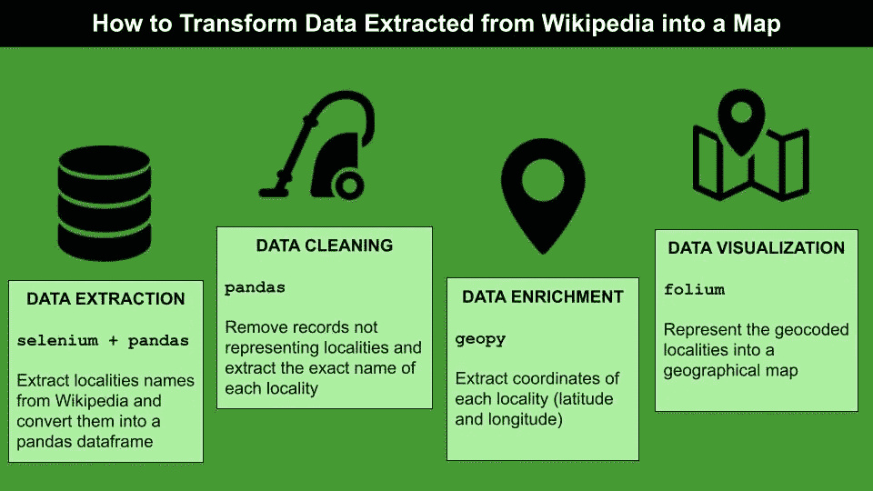
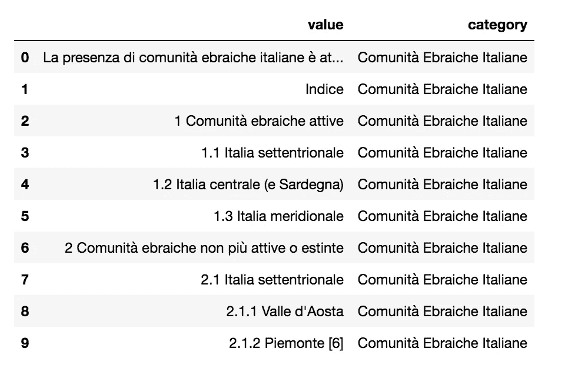
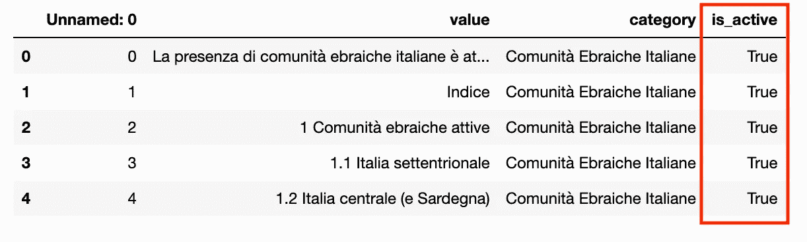
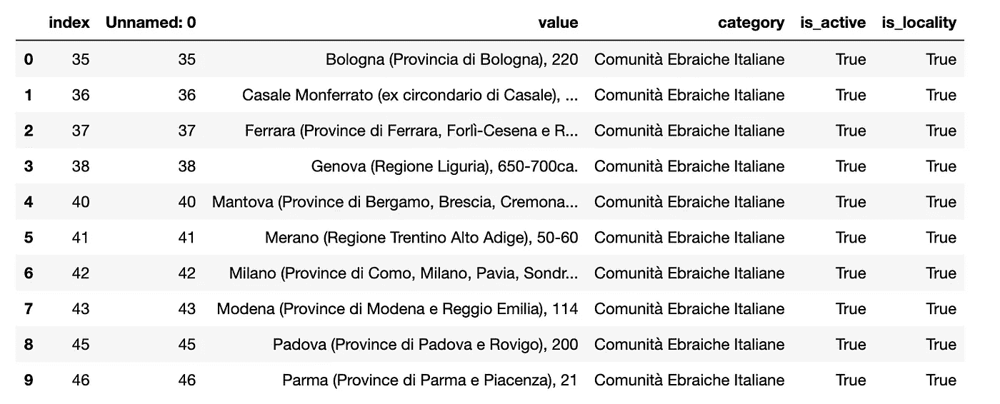
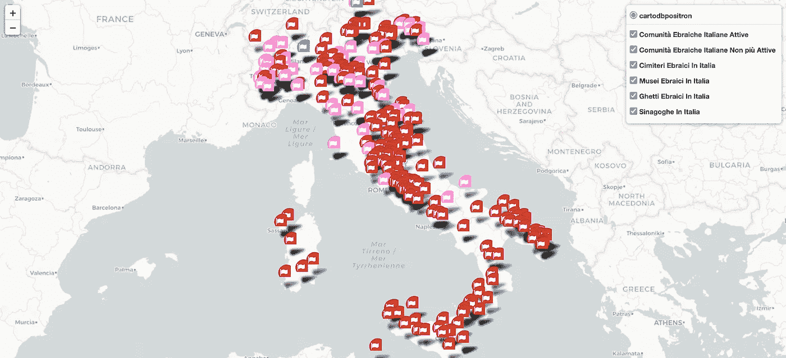

# 如何将从维基百科提取的数据转换成 Python 中的地图

> 原文：<https://towardsdatascience.com/how-to-transform-data-extracted-from-wikipedia-into-a-map-in-python-8325dce0710b?source=collection_archive---------12----------------------->

## 数据可视化

## 一个现成的代码，可以通过 Selenium、GeoPy 和 leav 在从维基百科提取的条目列表上创建一个地图



作者图片

在本教程中，我描述了一个从维基百科中提取地理条目的策略，这些条目被组织成列表，然后显示在地理地图上。我利用了以下 Python 库:

*   `selenium`，这是一个 Python 库，用于从任何网站提取**数据**。关于如何使用`selenium`的更多细节，你可以阅读我以前的文章，标题是[用 Python Selenium 从嵌套的 HTML 页面抓取数据](/scraping-data-from-nested-html-pages-with-python-selenium-c5f23065841f)
*   `geopy`，这是一个 Python 库，作为最著名的**地理编码服务**的客户端。更多细节可以在 [Eunjoo Byeon](https://medium.com/u/96add1ec6388?source=post_page-----8325dce0710b--------------------------------) 的这篇有趣的文章中找到，标题为[geo py 简介:在 Python 中使用您的纬度&经度数据](/things-to-do-with-latitude-longitude-data-using-geopy-python-1d356ed1ae30)。
*   `folium`，这是一个用于**地理数据可视化**的 Python 库。更多详情，可以阅读[Dario rade CII](https://medium.com/u/689ba04bb8be?source=post_page-----8325dce0710b--------------------------------)的这篇有趣的文章，题为[如何在几分钟内用 Python 和 Folium 制作出惊艳的互动地图](/how-to-make-stunning-interactive-maps-with-python-and-folium-in-minutes-e3aff3b0ed43)。

例如，我利用了 5 个维基百科页面，与意大利犹太人社区相关:

*   [社区](https://it.wikipedia.org/wiki/Comunit%C3%A0_ebraiche_italiane)
*   [博物馆](https://it.wikipedia.org/wiki/Musei_ebraici_in_Italia)
*   [墓地](https://it.wikipedia.org/wiki/Cimiteri_ebraici_in_Italia)
*   [贫民窟](https://it.wikipedia.org/wiki/Ghetti_ebraici_in_Italia)
*   [犹太教堂](https://it.wikipedia.org/wiki/Sinagoghe_in_Italia)

所有被考虑的维基百科页面都包含一个条目列表，每个条目代表一个地理实体，即一个意大利城市。因此，我们的想法是用从维基百科中提取的所有地点构建一个地理地图。该过程分为三个步骤:

*   数据析取
*   数据清理
*   数据丰富
*   数据可视化

# 1 数据提取

所有被考虑的维基百科页面中的所有位置都被表示为无序列表的项目符号。因此，它们可以很容易地通过一个公共过程提取出来，通过`selenium`库来实现。为了让你的代码工作，你应该为你的浏览器安装正确的`selenium`驱动程序，如本视频中的[所述。](https://www.youtube.com/watch?v=mHtlBq5cP2Y&t=10s)

现在，我已经准备好编写代码了。

首先，我导入驱动程序:

```
from selenium import webdriver
from selenium.webdriver.chrome.options import Options
```

然后，我定义了一个名为`extract_list`的函数，它接收维基百科页面的 URL 作为输入，还接收用于从该页面提取数据的 XPath 表达式。该函数提取与该 XPath 关联的所有文本，按行拆分提取的文本，并返回项目列表作为结果:

```
def **extract_list**(url, xpath):
    options = Options()  
    options.add_argument("--headless") 
    options.add_argument("--lang=it");
    driver = webdriver.Chrome(options=options) driver.get(url)
    table = [] # get the list of terms
    words = driver.find_element_by_xpath(xpath).text
    table.extend(words.split('\n'))
    driver.close()
    return table
```

现在，我可以为每个被考虑的维基百科页面调用该函数，为此我定义了一个列表:

```
pages = ['Comunit%C3%A0_ebraiche_italiane', 'Cimiteri_ebraici_in_Italia', 'Musei_ebraici_in_Italia','Ghetti_ebraici_in_Italia','Sinagoghe_in_Italia']
```

然后，我在创建的页面列表上构建一个循环，并调用`extract_list`函数。我还将提取的表格转换成一个`pandas`数据帧，并将每个提取的条目与一个类别相关联，对应于所考虑的页面(有一些风格上的变化):

```
import pandas as pddf_dict = {}
xpath = '//*[[@id](http://twitter.com/id)="mw-content-text"]'
table = {}
base_url = '[https://it.wikipedia.org/wiki/'](https://it.wikipedia.org/wiki/')**for page in pages**:
    name = page.replace('_', ' ').title().replace('%C3%A0', 'à')
    print(name)
    url = base_url + page table[page] = extract_list(url,xpath)
    df_dict[page] = pd.DataFrame(table[page], columns=['value'])
    df_dict[page]['category'] = name
```

最后，我通过连接前面构建的数据帧来构建数据帧:

```
df = pd.DataFrame(df_dict[pages[0]])
for i in range(1,len(pages)):
    df = pd.concat([df, df_dict[pages[i]]])
```



作者图片

提取的数据包含许多错误，需要纠正。但是，我可以将第一个原始数据集存储为 CSV 文件:

```
df.to_csv('data/raw_data.csv')
```


费尔南多·雷耶斯在 [Unsplash](https://unsplash.com?utm_source=medium&utm_medium=referral) 上拍摄的照片

# 2 数据清理

从*电子社区*页面中提取的地点可以进一步分为两类:活跃社区和不再活跃社区。查看保存的 CSV 文件，可以轻松提取这些信息。指数低于 83 的地区是指活跃社区，其他地区是指不再活跃的社区。

我定义了一个函数来提取这些信息。请注意，仅当考虑的类别为 C*omunitàebra ICA Italiana*(意大利犹太社区)时，此信息才有用:

```
df = pd.read_csv('data/raw_data.csv')
index_na = 83def **is_active**(x, index_na):
    if x < index_na:
        return True
    return False
```

我在数据帧中创建了一个新字段，指定一个社区是否活动:

```
df['is_active'] = df['Unnamed: 0'].apply(**lambda x**: is_active(x, index_na))
```



作者图片

现在我需要清理`value`字段，以便提取位置。该操作分两步完成:

*   删除不包含地点的记录
*   确定文本中的分隔符以提取准确的位置。

## 2.1 删除不包含地点的记录

看数据，对应于地点的记录很容易识别，因为它们包含一些*特殊的*关键字。因此，我定义了一个单词包，它只能用于选择地点:

```
bag_words = ['Comunità ebraica di', '(Provinc', '(Region', ' Provinc', 'ex circondario', 'Cimitero ebraico di', 'Museo ebraico di', 'Ghetto di', 'Sinagoga di', 'Cimitero israelitico di', 'Cimitero monumentale ebraico di']
```

现在，我定义一个函数来检查记录是否是一个位置:

```
def **is_locality**(x):
    for bag in bag_words:
        if bag in x:
            return True
    return False
```

我利用已定义的函数来构建数据帧的新列:

```
df['is_locality'] = df['value'].**apply**(lambda x : is_locality(x))
```

最后，我只选择具有`is_locality`属性`True`的记录:

```
df = **df[df['is_locality'] == True]**
df.reset_index(inplace = True)
```



作者图片

## 2.2 识别文本中的分隔符以提取准确的位置

查看记录，特别是在`value`列，每个地点的名称在两个偏移量之间标识:(start，end)。起始偏移量可以是 0，也可以等于以下单词包的长度:

```
**start_bag** = ['Comunità ebraica di','Sinagoga di', 'Cimitero ebraico di','Sinagoghe del Ghetto di','. Getto di','Ghetto di','Cimitero monumentale ebraico di','Cimitero israelitico di', 'Museo ebraico di']
```

然后我定义一个函数，它提取起始偏移量:

```
def **get_start_index**(x):
    start_index = 0
    for bag in start_bag:
        if bag in x:
            return len(bag)
    return start_index
```

关于结束偏移量，我定义了一个停止字符包，可以用来标识停止偏移量:

```
**stop_bag** = ['oratorio', '[', ',', 'aperta', 'viale', 'presso', '-', 'di rito','(']
```

然后，我定义一个函数，来确定止损点偏移量的最小指数:

```
def **get_min_index**(x):
    min_index = len(x)
    for stop in stop_bag:
        try:
            curr_index = x.index(stop)
            if curr_index < min_index:
                min_index = curr_index
        except ValueError:
            continue
    return min_index
```

以及提取位置的函数:

```
def **get_locality**(x):
    if 'Fiuggi' in x:
        return 'Anticoli'
    if x == 'Cimitero ebraico di viale Ippolito Nievo a Livorno (dismesso)':
        return 'Livorno'
    if x == 'Sinagoga di via dei Ramaglianti (Firenze), scomparsa':
        return 'Firenze'
    start_index = get_start_index(x)
    stop_index = get_stop_index(x)  
    return x[start_index:stop_index].strip()
```

前一项职能还考虑了三种特殊情况(Fiuggi、Cimitero ebraico di viale Ippolito Nievo a Livorno(dismesso)和 Sinagoga di via Ramaglianti(费伦泽)、scomparsa)，这些情况不属于一般情况。

现在，我在数据帧中创建了一个新列，其中包含每个地区的名称:

```
df['locality'] = df['value'].**apply**(lambda x: get_locality(x))
```

最后，我将结果导出为 CSV 文件:

```
df.**to_csv**('data/data_locality.csv')
```


安妮·斯普拉特在 [Unsplash](https://unsplash.com?utm_source=medium&utm_medium=referral) 上的照片

# 3 数据丰富

为了将提取的地点表示到地图中，我必须提取它们的地理坐标。这可以通过`geopy`库来完成，它不是一个地理编码服务，而是一个面向外部地理编码服务的接口。

在本教程中，我利用了`Nominatim`服务，并定义了一个提取坐标的函数:

```
from geopy.geocoders import Nominatimdef **get_coordinates**(city_list):
    geolocator = Nominatim(user_agent="location script")
    dicto = {}

    for city in city_list:
        try:
            location = geolocator.geocode(city, country_codes='it')
        except:
            raise Exception("There was a problem with the getCoordinates function")
        coordinate_values = (location.longitude, location.latitude)  
        dicto[city] = coordinate_values 
    return dicto
```

为了使地理编码服务更加精确，我将 country_code 设置为 Italy，因此该服务只在意大利境内。该函数返回一个字典，其中包含每个地区的经度和纬度。

```
city_coords_dict = **get_coordinates**(df['locality'].values)
```

我定义了一个中间函数，它只返回纬度或经度，给定一个位置:

```
def **get_coords**(x, city_coords_dict, coord = 0):
    coords = city_coords_dict[x]
    return coords[coord]
```

我利用它向我的数据帧添加了两个新列:

```
df['longitude'] = df['locality'].**apply**(lambda x : get_coords(x, city_coords_dict))
df['latitude'] = df['locality'].**apply**(lambda x : get_coords(x, city_coords_dict, coord = 1))
```

我将结果导出为 CSV 文件，以避免多次执行地理编码:

```
df.to_csv('data/geo_data.csv')
```

# 4 地图上的数据可视化

提取的地点可以显示在地图上。我利用`folium`库来构建地图。

首先，我将维基百科的页面名称转换成人类可读的类别:

```
categories = []
for page in pages:
    category = page.replace('_', ' ').title().replace('%C3%A0', 'à')
    categories.append(category)
categories
```

然后，我构建基本地图，聚焦于意大利，从缩放级别等于 6 开始:

```
import foliummy_map = folium.Map(tiles='cartodb positron',location=[41.8719, 12.5674],zoom_start=6)
```

至于地图布局，我选择的是`cartodb positron`地图。其他地图布局可以在官方`folium` [文档](https://python-visualization.github.io/folium/modules.html#module-folium.map)中找到。

然后，我定义一个函数，为数据帧中的每个位置添加一个标记:

```
def **add_markers_to_the_map**(the_map, df, icon, category, color):      group = folium.FeatureGroup(name=category).add_to(the_map) for i in range(0, df.shape[0]):    
            popup_text = df.iloc[i]['value']
            city = df.iloc[i]['locality']
            long = df.iloc[i]['longitude']
            lat = df.iloc[i]['latitude']

            popup = folium.Popup(popup_text, autopan='False', parse_html=True)

            marker = folium.Marker(location=[lat, long], 
                                   popup=popup, 
                                   icon = folium.Icon(icon_size=(25, 25), color=color, icon=icon, prefix='fa'))

            group.add_child(marker)

    return the_map
```

对于每个类别，我通过前面函数中的`FeatureGroup()`类定义了一个新层，一个图标和一种颜色。然后，我为每个类别调用函数:

```
colors = ['green', 'blue', 'orange', 'brown', 'pink']
color = 0for category in categories:
    df_selected = df[df['category'] == category] if category == 'Comunità Ebraiche Italiane':
        add_markers_to_the_map(my_map, df_selected[df['is_active'] == True], 'flag', category + ' Attive', 'green')        add_markers_to_the_map(my_map, df_selected[df['is_active'] == False], 'flag', category + ' Non più Attive', 'red') else:
        add_markers_to_the_map(my_map, df_selected, 'flag', category, colors[color]) color = color + 1
```

在前面的函数中，以意大利电子社区为例，我创建了两个层，分别用于活跃社区和不再活跃社区。

为了使图层可选，我在地图上添加了一个`LayerControl()`:

```
folium.LayerControl().add_to(my_map)
```

最后，我将地图导出为 html 格式:

```
my_map.save('mappa.html')
```



作者图片

# 摘要

在本教程中，我描述了一种从维基百科页面中提取地点的策略，通过地理编码服务丰富这些地点，最后将它们表示到地理地图中。

对于这篇文章，我要感谢 [Alberta Odamea Anim-Ayeko](https://medium.com/u/ca056dc2a18?source=post_page-----8325dce0710b--------------------------------) ，他写了一篇精彩的文章，题为[用 Geopy 和 leavy](/making-simple-maps-with-folium-and-geopy-4b9e8ab98c00)制作酷炫的地图，这启发了我做这篇教程:)

> 还有你，你用哪些库来实现 Python 中的地图？给我留言吧！我很乐意听听你的意见！

如果你已经走了这么远来阅读，对我来说今天已经很多了。谢谢！你可以在[这篇文章](https://alod83.medium.com/which-topics-would-you-like-to-read-c68314dc6813)中读到更多关于我的信息。

# 你愿意支持我的研究吗？

你可以每月订阅几美元，并解锁无限的文章。

对于那些选择支持我的人(不仅仅是他们)来说，额外的奖励是一个在 leav 中实现鼠标悬停/鼠标释放工具提示的提示。

由于 leav 不支持 mouseover/mouseout，我可以直接修改 HTML 文件来支持它:

```
import re
import fileinputwith open("mappa.html") as inf:
    txt = inf.read()#Find all the markers names given by folium
markers = re.findall(r'\bmarker_\w+', txt)
markers = list(set(markers))for marker in markers:
    for linenum,line in enumerate( fileinput.FileInput("mappa.html",inplace=1) ):
        pattern = marker + ".bindPopup"
        pattern2 = marker + ".on('mouseover', function (e) {this.openPopup();});"
        pattern3 = marker + ".on('mouseout', function (e) {this.closePopup();});"if pattern in line:
            print(line.rstrip())
            print(pattern2)
            print(pattern3)
        else:
            print(line.rstrip())
```

离开前最后说一句:**你可以从[我的 Github 库](https://github.com/alod83/data-science/tree/master/DataVisualization/Folium):)下载本教程的完整代码**

# 相关文章

</some-interesting-articles-and-resources-on-data-visualisation-that-i-discovered-in-june-c00b58d15946>  </data-visualisation-principles-part-2-layout-and-emphasis-d682bbc38217>  </data-visualisation-principles-part-1-a-practical-example-in-altair-b6e16f665fc6>  

# 参考

<https://fontawesome.com/v5.15/icons/flag?style=regular>  <https://stackoverflow.com/questions/41095716/hover-in-popup-in-folium>  <https://stackoverflow.com/questions/55344513/add-menu-bar-on-folium-map-to-select-or-deselect-particular-object-marker>  <https://stackoverflow.com/questions/51486454/convert-geopandas-shapely-polygon-to-geojson>  </making-simple-maps-with-folium-and-geopy-4b9e8ab98c00> 