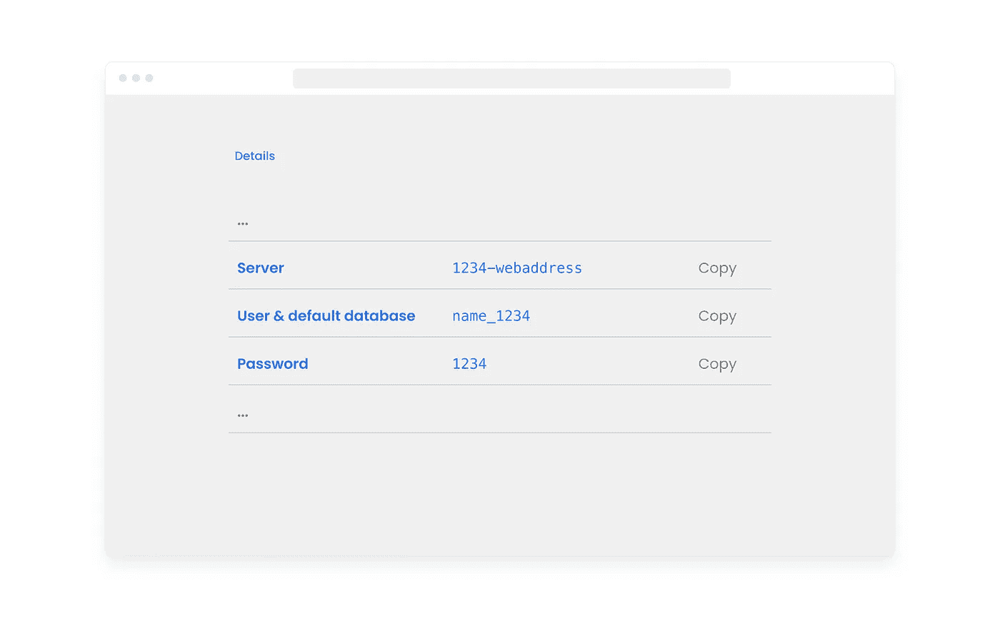
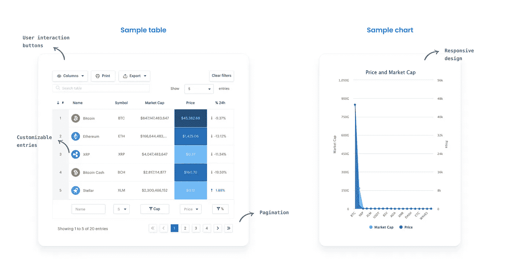

# 在没有任何 Web 开发经验的情况下，如何将您的数据见解转化为网站

> 原文：<https://towardsdatascience.com/how-to-transform-your-data-insights-into-websites-without-any-web-development-experience-44fde2d72648?source=collection_archive---------19----------------------->

## 使用 WordPress 和 SQL 以视觉上引人注目的方式展示您的 Python 见解


通过使用 WordPress 和 SQL 让您的数据见解变得可访问——作者插图(官方示例图表/表格由 [wpDataTables](https://wpdatatables.com/) 提供)

当用 Python 完成一个漂亮的分析时，有没有感觉被切断了？我也是——我没有提交另一个 Jupyter 笔记本，里面有一些沉重的机器学习材料，充满了 seaborn 主题的情节，而是花了一整夜的时间研究如何让公众更容易获得这种分析，并以更专业的方式呈现见解。

**结果呢？**在 WordPress 上运行的网站以清晰的方式展示见解，并允许最终用户与数据交互。该网站通过使用简化的 Python 文件填充的数据库来访问分析数据。**棘手？绝对不是，使用 WordPress 不需要大量的网页编码，并且允许通过拖拽来建立一个网站。**


使用 WordPress 和 SQL 将您的数据见解发送到一个简单的 web 应用程序中——作者插图

因此，让我们把它分成小块，用一个简单的例子一步一步地完成整个过程。

# **#0 获取一些数据**

***重要提示:*** *下面讨论的所有代码片段也可以在 GitHub 上我的* [*资源库*](https://github.com/christopherkindl/python-data-to-sql-database) *中的一个完整的 Jupyter 笔记本文件中找到。*

第一步从 python 文件(或 Jupyter 笔记本)开始，我们在其中执行分析任务，并加入额外的代码来与数据库交互:


通过 Python 与数据库交互的元素—作者插图

为了简化，我们将使用通过雅虎的金融 API 获得的一些股票数据，并创建一个简单的数据框架。

安装 Yahoo API 连接器库以下载历史市场数据:

```
$ pip install yfinance
```

获取特斯拉股票信息:


特斯拉上市前 100 天的股票信息——作者配图

# #1 创建一个数据库

对于数据库系统，我们的目标是 PostgreSQL。这是最成熟的方法之一，可以完美地与 WordPress 网站配合使用。其他流行的 SQL 数据库有 MySQL 和 MS SQL。

有各种各样的提供商为在云中运行数据库提供负担得起的托管计划。除了现有的平台，如亚马逊 AWS 或微软 Azure，我建议你注册一个平台，免费为你提供(1)个基本计划，或者如果你只是想为自己复制展示，提供(2)个试用版本。

*注意:你也可以在本地运行数据库设置和 WordPress 网站，这不需要任何托管。然而，由于我们对制作一个公共网站感兴趣，我们将致力于在云中部署。*

在我的例子中，我使用的是[elephantsql.com](https://www.elephantsql.com/)，它提供了一个免费版本，但没有提供任何支付细节。数据库的启动和设置都在短时间内完成:

1.  去 elephantsql.com
2.  创建一个帐户
3.  选择免费计划(“小乌龟”)并完成配置过程(托管区域无关紧要)
4.  转到控制台(customer.elephantsql.com ),单击刚刚创建的数据库
5.  参见*详细信息*部分中的数据库凭证



连接到数据库所需的凭据详细信息–作者插图

注意:如果数据的持久性至关重要，我建议使用具有额外安全保护(SSL、IP 范围等)的方案。)和用于快速恢复的高可用性，这也是行业标准。

# #2 连接到数据库

我们使用`pg8000`作为 PostgreSQL Python 连接器，这需要 pip 安装。

注意:这个库是专门为 PostgreSQL 数据库设计的。对于 MySQL 或其他数据库，可能需要不同的连接器。

```
$ pip install pg8000
```

# #3 创建模式和表

接下来，我们创建一个模式和表，将数据正确地存储在数据库中。PostgreSQL 中支持的常见数据类型有:

*   `boolean`
*   `date`
*   `timestamp`
*   `decimal`
*   `float`
*   `varchar(n)`
*   `numeric`

*注意:数据类型因数据库系统而异。*

为了简化，我们只检索`Date`和`Close`列，以便稍后创建一个简单的折线图。当我们想要发送查询来与数据库交互时，我们使用 SQL 语言(参见代码片段中的字符串)。

*注意:[IF NOT EXISTS]是可选的，它检查具有该名称的表/模式是否已经存在。这有助于避免在常规测试中覆盖数据。*

# #4 向数据库发送数据

我们通过使用一个`list of lists`(“obj”)将数据发送到数据库，其中每个列表代表数据帧中的一行。变量`s`用 SQL 语法表示查询。我们引用希望填充到数据库中的列，并为它们的值提供“占位符”`%s`。确保`obj`的顺序必须符合查询中定义的顺序。

注意:游标方法允许遍历整个列表，这将只需要一个查询。

快速完整性检查，查看数据是否发送到数据库:


PostgreSQL 数据库中的前 5 行数据—作者插图

# **#5 WordPress 基础**

*背景* WordPress 是最强大的开源内容管理系统之一。最初是作为一个博客系统创建的，它已经发展到支持其他相关领域，如电子商务、报纸或企业网站。你使用模板来构建网站，这意味着你可以通过拖放来添加内容，而不必关心后端本身。您可以访问一个第三方插件池来构建非标准特性，在我们的案例中我们也会这样做。根据 w3techs.com，大约。排名前 1000 万的网站中有 41%运行在 WordPress 上，这充分说明了这个网站建设者的便利性和安全性。


WordPress 内容管理系统的技术架构——作者举例说明

这篇文章不包括 WordPress 网站的设置。已经有大量的文章对此进行了解释。如果你是一个完全的初学者，我建议你遵循下面列出的资源:

*   [https://www.youtube.com/watch?v=digtdXBkGWo](https://www.youtube.com/watch?v=digtdXBkGWo)
*   WordPress 官方安装指南

由于我们的目标是部署一个在线网站，我们需要一个网站托管计划(包括一个域)。下面是一些提供特殊 WordPress 托管计划的提供商，在这些计划中，WordPress 可以立即配置(通常只需几次点击) :


托管计划(2021 年 5 月)-作者插图(维基媒体图片用于公司标志)

*注意:WordPress 也需要一个数据库(与 MySQL 或 MariaDB 数据库配对)。理论上，也可以使用集成的。在某些提供商处，默认情况下并不总是提供对它的访问，这就是我们使用独立数据库的原因。*

*新手的动力*
不要一开始就被 WordPress 冲昏了头脑，把下面的插图看做一点动力:


到达临界点——作者插图

开始的时候，这看起来像是一个失望的山谷，但是一旦你理解了基本原理，由于 WordPress 的低代码模板方法，你就能够在很短的时间内构建几乎所有的东西(例如，仅在一天内建立一个电子商务商店)。代码密集型 web 框架，如 Bootstrap 或 Python Django，对于初学者来说实际上是一场真正的斗争，并且对于每一个新的案例都需要额外的上下文知识。

# #6 通过 WordPress 插件连接到数据库并创建可视化

一旦你有了一个运行在 WordPress 上的网站，我们就会寻找一个允许连接到 PostgreSQL 数据库的插件。

到目前为止，我用过的最好的与 SQL 数据库接口的 WordPress 插件叫做 [wpDataTables](https://de.wordpress.org/plugins/wpdatatables/) 。它有一个免费的限量版和一个收费版，起价为 42 美元/年。它自动将 SQL 查询转换成可用于网站的表格，这些表格可以使用 JavaScript 或其他流行的图表呈现引擎进一步转换成图表。除了 PostgreSQL 连接，您还可以访问 MySQL 和 MS SQL 数据库，以及加载平面文件。



由 [wpDataTables](https://wpdatatables.com/) 官方提供的样表和图表

我建议使用付费版本(15 天退款保证)，因为数据库连接只涵盖在付费版本。

关于如何安装这个插件的详细指南可以在他们的官方[网站](https://wpdatatables.com/documentation/general/installation/)上找到。

一旦安装了插件，我们只需要建立一个连接并编写一个 SQL 查询来创建我们选择的可视化:


通过插件访问数据库的步骤——作者举例说明

**连接数据库**

在 WordPress 控制台中:

1.  转到 WP 数据表一节
2.  点击*设置*
3.  选择*独立数据库连接*
4.  插入您的数据库凭证(对于字段*端口*和*驱动程序，*分别填写 5432 和 ODBC。端口信息最初不会显示在 elephantsql.com 的控制台上)
5.  点击*保存更改*创建连接

**创建图表或表格**

为了简化，我们选择股票表，并创建一个简单的图表。

注意:使用图表时，我们总是要先创建一个表格。

在 WordPress 控制台中:

1.  转到第*节 WP 数据表*
2.  点击*创建表格*
3.  选择您的连接，然后选择*创建一个链接到现有数据源的数据表*
4.  选择 *SQL 查询*作为输入数据源类型，并分配一个*名称*
5.  编写 SQL 查询:

6.点击*保存更改*运行查询(如果查询成功，现在已经创建了表格)

7.转到*创建图表*

8.分配一个*名称*并选择一个*图表渲染引擎*(我推荐使用 *chart.js* )

在这一步之后，您将转到*格式化和预览*部分:


格式部分—作者插图

9.点击*保存更改*创建图表并获取短代码


快速实施的简码—作者举例说明

WordPress 中的 shortcode 是一小段代码，用方括号表示，指的是一个功能(这个图表，一个图库，等等)。) .现在，您只需要将这个短代码实现到您想要的页面中。不需要转换，在编辑页面时，只需将收到的短代码粘贴到文本元素中。

这是最后一步。您已经构建了第一个准备发布的小数据产品！

现在，您拥有了从 python 文件到网站的无缝连接，这意味着您可以更新 Python 文件，并且可视化效果将由于 SQL 查询而自动更新。

# 进一步的例子

我最近在一个大学项目中也使用了 WordPress。你可以在这里查看，或许还能获得一些设计网站的灵感。注意，这个项目的焦点不是分析本身，而是它的数据管道。


subway.christopherkindl.com 快照-作者插图

# GitHub 知识库

<https://github.com/christopherkindl/python-data-to-sql-database>  

*参考文献:*

[1]W3techs.com。(2021).内容管理系统使用统计[https://w3techs . com/technologies/overview/content _ management](https://w3techs.com/technologies/overview/content_management)。检索于 2021 年 5 月 29 日。

[2]Websitebuilderexpert.com。(2021).7 最便宜的 WordPress 托管[https://www . websitebuilderexpert . com/we B- Hosting/Cheap-WordPress/](https://www.websitebuilderexpert.com/web-hosting/cheap-wordpress/)。检索于 2021 年 5 月 29 日。

[3]Themeisle.com。(2021).WordPress 中的短码是什么？https://theme isle . com/blog/what-are-short codes-in-WordPress/。检索于 2021 年 5 月 29 日。