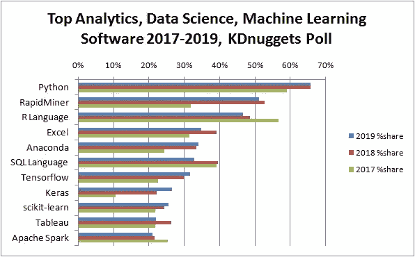

# 从学术界到数据科学

> 原文：<https://towardsdatascience.com/how-to-transition-from-academia-to-data-science-5821ebe598a?source=collection_archive---------30----------------------->

## 实用指南

图片来源: [Unspash](https://images.unsplash.com/1/work-station-straight-on-view.jpg?ixid=MXwxMjA3fDB8MHxwaG90by1wYWdlfHx8fGVufDB8fHw%3D&ixlib=rb-1.2.1&auto=format&fit=crop&w=1950&q=80)

哦，天啊，又一篇关于从学术界过渡到数据科学的博文。好吧，在这篇文章中，我会试着在一些更传统的建议之外，加入一些对通常建议的稍微不同的看法。这不是一步一步的指导，因为我不认为在这种情况下有这样的事情存在。相反，这篇文章将是我对如何从学术界平稳过渡到数据科学的个人观点。此外，这篇文章不是关于“如何获得数据科学工作”。我不会谈论你的简历，或者为面试做准备之类的事情。这篇文章是关于如何成为一名数据科学家的。

首先，我应该注意到，虽然我在这篇文章*中涉及的许多事情*可能是通用的，并适用于许多不同的情况，但我将首先提出一些假设。

1.  你已经进入了一个技术领域(数学、统计、物理、化学、生物等)。
2.  你有一定的编程知识(任何语言都可以)。
3.  你打算从事的数据科学职业是*应用型*，而不是研究型的。
4.  如果你正在攻读博士学位，所有这些可能会更适用，但对学士学位仍然适用。

好了，让我们开始吧。

# 数据科学到底是什么？

如果你偶然看到这个博客，你可能对数据科学有所了解，或者你认为你知道它是什么。数据科学可能意味着你整天管理数据库和编写 SQL 代码。这可能意味着您使用“大数据”工作，并使用 Hadoop(这可能还是一件事吗……)、Spark 和其他大数据工具做事。但愿不会，这可能意味着你在 Excel 中做的大部分工作都是制作线性回归模型。

但根据我的经验，当大多数人说数据科学时，他们真正的意思是“机器学习工程师”，即开发和应用 ML 模型到真实数据并部署它们以用于真实世界场景的人。当然，还有更多的内容，但这是要点，也是我在这篇文章的剩余部分中想到的那种数据科学家。

# 学术界是如何让我为这个角色做好准备的？

我知道当我还是研究生的时候，我以为我这辈子只准备做一件事——成为一名(天文)物理学教授/研究员(在一段漫长的博士后生涯之后)。在我读物理研究生的时候(2009 年至 2014 年)，几乎没有人提到过任何其他职业轨迹。假设这是每个人都会走的路，这基本上意味着只有一种操作模式:**写论文**。

但是，在你的学术生涯中(无论是本科还是研究生)仍然会学到很多对你的数据科学(咳咳…机器学习工程师)生涯非常有用的东西。

## 学习斗争

有些技巧是教不来的。他们只能通过斗争来学习。如果你在你的学术领域做过任何种类的原创性研究，那么你就会知道其中的艰难。你必须学会自己解决问题，因为没有“正确的答案”可以在书的后面找到。如果你曾经编写过任何重要的代码库，那么你也知道其中的挣扎。你必须弄清楚如何将所有的东西放在一起，并调试不可避免会出现的错误。

在数据科学中，你的大部分时间都在挣扎，你需要能够对在特定时刻不知道该做什么感到舒服。你需要能够尝试，并且有可能失败。在许多情况下，利益相关者(想要某种 ML 产品/功能的个人/实体的花哨语言)并不太了解 ML，他们所知道的只是他们想要的最终产品是什么样子。事实上，在某些情况下，他们甚至不知道自己想要的最终产品是什么样子。更常见的情况是，他们拥有大量数据(当然是非常干净的)，并且他们希望从这些数据中获得“洞察力”。作为机器学习工程师，你需要做好准备，努力找到他们问题的解决方案。

即使你将在基于 ML 的问题中经历的斗争可能与你在学术界经历的不同，但对不确定性感到舒适将为你作为机器学习工程师的职业生涯做好准备。

在下一节中，我将提供一些建议来更好地熟悉基于 ML 的斗争。

## 学习如何学习

与“奋斗”密切相关的是学会如何学习。每个人都以不同的方式学习，在你的学术生涯中，很有可能你已经发现了自己的方法。在很多情况下，尤其是在我的课堂上，你会意识到你并没有从课堂上学到很多东西。当然，你可能在考试中表现很好，但你会在一周内忘记一切。你通过做来学习。没有实践，所有的理论都是毫无价值的。你会相信一个花了几年时间研究最新外科技术，但从未真正实施过外科手术的医生吗？你会招募一个了解所有音乐理论但从未真正弹过吉他的“吉他手”吗？

稍后我将在这方面提供一些建议，但知道如何自主学习是数据科学或生活中最重要的技能之一。

## “软技能”

总的来说，软技能是人际技能和沟通技能的结合。这一点很大程度上取决于你是否必须向技术和非技术观众展示你的作品。这也取决于你是否参与了一个大型合作项目。

也就是说，能够以清晰简洁的方式向非技术受众展示技术信息是一项技能，它将帮助你获得一份好的数据科学工作。正如我上面提到的，我专注于应用数据科学的工作，而不是研究数据科学家的职位。这意味着你需要能够与利益相关者以及你的队友沟通。

如果你有幸参与了一个大型协作项目，并与许多需要合作的不同团队合作，那么你将获得宝贵的技能，这些技能将真正在数据科学领域对你有所帮助。能够在不同群体之间进行翻译是一项非常有用的技能。例如，当我还是研究生时，我是数据分析小组的一员，我们主要使用贝叶斯技术。还有另一组人主要使用 T2 常客技术。从表面上看，这些事情可能非常不同，但两者之间有一些有用的翻译，我会说两种语言，这使得事情进展得更顺利。

同样，在下一节，我会给出一些关于如何练习沟通技巧的建议。

# 实用(而且非常固执己见)的建议

如题，这个建议很固执，但是这些方法对我来说效果很好。在给出实际建议之前，让我解释一下我对数据科学家候选人的要求:

1.  一个容易相处并有良好的个人/沟通技巧的人。对于一个技术角色来说，这可能看起来不太重要，但对我来说却至关重要。大多数数据科学家在团队中工作，因此能够相处和沟通至关重要。
2.  一个在过去表现出主动性并且相当自我激励的人。这不需要与 ML/数据科学相关，它可以应用于你的学术研究领域，但也可以应用于你向数据科学过渡的准备。
3.  对“真实”数据有经验的人。我说的真实数据是指杂乱的数据。我想看到你已经学会了奋斗并接受了它。同样，这也适用于你的学术经历或数据科学准备。
4.  能够谈论许多不同的 ML 技术的人。这并不意味着您需要非常深入地了解任何细节，但是您应该对现有的技术及其应用有所了解。

就这样，让我们得到建议

## 1.学习 Python

Python 是机器学习的语言。它非常容易使用，并且它主要包装了用更高性能的语言编写的库，比如 c。

python 的成长(来源: [KDnuggets](https://www.kdnuggets.com/2019/05/poll-top-data-science-machine-learning-platforms.html) )

它在所有领域都在增长，不仅仅是 ML，但在这篇文章中，我将重点关注 ML。Python 在 ML 中非常强大，因为有几个专门构建的 ML 库，比如[熊猫](https://pandas.pydata.org/)、 [tensorflow](https://www.tensorflow.org/) 、 [pytorch](https://pytorch.org/) 、 [scikit-learn](https://scikit-learn.org/stable/) 、 [spacy](https://spacy.io/) 和[变形金刚](https://huggingface.co/transformers/index.html)等等。

如果你已经知道 Python，那太好了。如果你没有，还有很多资源可以学习。我不建议用一本书来学习 Python，因为已经有这么多好的资源了。从 Matlab 转到 Python 之后，我学习了 Python，这些年来，我通过查看如上所述的设计良好的代码库，以及观看各种 YouTube 教程和其他在线资源，磨练了自己的技能。事实上，我从来没有读过关于 Python 编程的书(关于机器学习或深度学习或统计学，但我稍后会深入讨论)。

## 2.学习软件设计原则

好，那么你已经学了 Python。准备好了吗？不完全是，在我真正学会如何设计软件之前，我已经知道如何使用 Python 很长时间了。我总是用盖房子来比喻。你可能真的很擅长使用所有的工具，但是如果你没有蓝图，不知道各种各样的代码和标准，或者不知道从哪里以及如何获得所有的材料，那么你就不走运了。虽然了解 Python 语言非常重要，但实际上了解软件设计原则(主要是语言不可知的)将真正让你脱颖而出。

这一部分本身可以作为几篇博客文章，但我在这里只提到主要的亮点:

1.  [面向对象编程(OOP)](https://realpython.com/inheritance-composition-python/) :虽然函数式编程没有任何问题，但你确实会在日常生活中混合使用 OOP 和函数式编程。ML 生态系统(也就是上面提到的包，尤其是 PyTorch 和 scikit-learn)大部分在 OOP 阵营。能够理解基于 OOP 的包并能够编写自己的基于 OOP 的代码是非常重要的。
2.  [单元测试](https://realpython.com/python-testing/)和[持续集成(CI)](https://realpython.com/python-continuous-integration/) :这两者通常是并行的。单元测试是指对你的代码“单元”进行特定的测试。这是为了检查您的代码是否正确，也是为了在您进行更改时防止代码被破坏。CI 基本上包括自动化这个测试过程，也可以包括单元测试之外的其他类型的测试。掌握这一点将会给你带来巨大的优势。
3.  [设计模式](https://python-patterns.guide/):这些是解决特定问题的可重复使用的模式。这些模式大多与语言无关。现在，您不需要知道所有不同的模式，也不需要总是使用它们；然而，对他们的所作所为有一个基本的了解(以及他们的存在)会让你处于一个很好的位置。
4.  [文档](https://realpython.com/documenting-python-code/):在你的学术生涯中，你可能编写了适合你的代码。你知道如何使用它，而且它有效。作为数据科学团队的一员，其他人需要能够使用和理解您的代码。代码文档至关重要，了解最佳实践也非常重要。

上面的列表只是从细节上触及了表面。我为每一个提供了一个基本的教程链接，但是还有很多其他非常好的资源来学习正确的编码实践和工具。这里有几个:

*   [生成 Pythonic 代码](https://www.youtube.com/playlist?list=PLRVdut2KPAguz3xcd22i_o_onnmDKj3MA):关于代码分解和生成漂亮代码的精彩对话。
*   [从头开始的深度学习库](https://www.youtube.com/watch?v=o64FV-ez6Gw&ab_channel=JoelGrus):包设计的良好入门，学习如何考虑构建包。
*   [cal code . io](https://calmcode.io/):大量关于各种工具和技术的有用视频
*   [Traversy Media](https://www.youtube.com/playlist?list=PLillGF-RfqbbJYRaNqeUzAb7QY-IqBKRx):Python 网络开发方面的良好介绍。

在结束这一部分时，我要指出，根据我的经验，大多数数据科学家(尤其是机器学习工程师)对这些东西的了解非常有限。所以，这不是你在竞争中所缺少的东西。然而，如果你确实知道这些事情，并花时间去学习它们，那么它会让你在竞争中脱颖而出。更重要的是，它会让你成为更好的数据科学家。

## 3.做一些项目(并分享)

好了，这就是标准建议的来源，但它是标准的是有原因的。如果你来自学术背景，而不是数据科学背景，你必须做一些项目来填补你缺乏的在职经验。从某些方面来说，这是一个额外的收获，尤其是如果你的竞争对手是那些上过数据科学或类似领域的学校的人。记住我说过的自我激励。对于那些从事数据科学或分析项目的人来说，他们的大部分经历都是通过他们“不得不”做的课程获得的。对于你这个自学成才的数据科学家来说，你通过展示你已经完成的数据科学项目来表明你是自我激励的。

现在你可以做很多不同种类的项目。我将按照重要性的大致顺序列出三个:

1.  [数据讲故事项目](https://www.import.io/post/8-fantastic-examples-of-data-storytelling/):在我看来，这种项目是你能做的最有用的。基本上就是选择一个你感兴趣的领域，找数据，分析，讲故事。你甚至不需要做任何 ML。这些项目展示了你使用未经过滤的原始数据的技能，(尽量不要使用经过筛选的数据集)，还可以让你在数据科学的斗争中获得一些经验。在我的案例中，我查看了[警察枪杀平民](https://jellis18.github.io/files/ellis_police_shooting.pdf)，并从一些数据库中提取数据，包括人口普查数据、联邦调查局犯罪统计数据和当地警察局数据。在这个过程中，我花了很大的力气将所有这些资源整合在一起，并了解了大量关于熊猫和各种 python 地图包的知识。
2.  [完整的端到端 ML 应用](https://medium.com/swlh/end-to-end-machine-learning-from-data-collection-to-deployment-ce74f51ca203):这种项目会给人留下非常深刻的印象，并显示出你有实际 ML 部署的经验，这是许多候选人和实际数据科学家(包括我自己)所缺乏的。
3.  你可以通过做一些 Kaggle 比赛和查看公共笔记本来了解很多关于 ML 的事情。这些都在列表中，因为它们对你获得一些将 ML 应用于数据的经验很重要，但它们是最后的，因为这种工作现在无处不在，所以它不会让你与众不同。

一旦你做了一些项目，并通过大量的努力获得了一些 ML 和数据辩论技巧，现在你可以提高你的沟通技巧了。

首先，一定要把你做的任何事情放到 [GitHub](https://github.com/) 上，这将公开你的工作，如果你还不知道的话，还会教你版本控制。请确保用项目自述文件记录您的项目。这只是最低级的分享你的作品。

接下来，你可能想在个人博客或[媒体](/questions-96667b06af5)上分享这个作品。这是另一个磨练你的沟通技巧和确保你真正理解你的项目的好方法。测试你的知识的最好方法是试着向别人解释你的项目。然而，写博客仍然有些被动，这些技能不是成为一名成功的数据科学家所需的主要沟通技能。

最后，你可以通过演讲来展示你的作品。这种事情大概有很多论坛。就我而言，我在 [Meetup](https://www.meetup.com/) 上寻找任何本地数据科学相关的团体。先参加一些聚会，并向组织者介绍自己，这可能是个好主意。他们通常在寻找任何想演讲的人。如果有机会，主动提出就你的一个项目做一个演示。

因此，这听起来很多，你未来的公司可能甚至不会看你做的所有工作，但即使他们不会看，你做了所有这些并发展和磨练了所有这些技能的事实将极大地帮助你作为数据科学家的整体职业生涯。

## 4.学习行话(假装直到你成功)

当我还是大学生的时候，我的一位物理学教授给了我一些很好的建议。他告诉我们，就你的职业生涯而言，最重要的事情之一是你“学习行话”，也就是说，你学习你正在从事或想要从事的领域的语言。例如，如果有人对你说他们“使用了一个变压器模型进行情感分析”，你需要从这句话中得到什么？你肯定不需要知道变压器模型是什么或如何实现它的任何细节，但你应该知道情感分析是指测量一段文本的“积极”或“消极”程度，而“变压器”模型是一种深度学习模型，现在在自然语言处理中非常流行。

换句话说，对许多概念有广泛但浅薄的理解要比对几个概念有非常深刻的理解好得多。这在很多情况下几乎与学术研究背道而驰。在学术界，一个人非常需要对自己的领域有非常深刻的理解，代价是对该领域以外的知识了解不多。作为一名数据科学家，情况正好相反，对许多概念及其用途有一个基本的了解要比知道精确的算法细节好得多。

这又回到了我早先提出的关于学会如何学习的观点。如果你对许多事情有肤浅的理解，那么这将允许你快速评估一个给定的问题，并提出一个潜在的解决方案；然而，要真正实现这个解决方案，你可能需要学习更多你目前所知道的东西。因此，你需要能够脚踏实地地学习。作为一名学者，似乎你总是需要提出新的东西，但在数据科学中，没有人真正关心你是否提出了新的东西，他们只关心你是否解决了问题。这意味着，在互联网上搜索与你类似的问题的解决方案，并对其进行调整以解决你的问题，这并不可耻。

所有这些似乎都是错误的，但这是我收到的最好的建议，我认为它对我帮助很大。现在，这一切听起来不错，但你怎么做呢？这是最难的部分。我认为发展这种技能的最好方法是允许自己探索许多领域，但也要控制自己不要挖得太深，至少在你还在学习的开始阶段。参加介绍性的在线课程，跟随教程，做一些简单的项目，但是不要认为你需要知道所有的细节。

## 5.在线学习

好了，现在来谈谈另一个有争议的建议。不要看书来学习你的数据科学/ML 技能。至少，不要把书作为主要的信息来源。我唯一会推荐的书籍是学习基本的编程语言基础知识，(尽管在线学习可能更好)。

我从未读过关于编程、机器学习、深度学习、统计学或通信的书籍，但在我的学术生涯中，我发表过几篇论文，并领导过大型工作组。在学术界之外，我进步相当快，并领导了几个人工智能领域的项目，所有这些都是严格通过在线学习实现的。

现在，在线学习并不意味着你被动地坐下来看一些 YouTube 视频。这意味着你看一些 YouTube 视频或在线课程或阅读博客帖子或 arXiv 论文，然后自己尝试这些东西。你挣扎。你多看多读。再奋斗一些。在你的工作或项目中应用这些技术。再奋斗一些。在这个阶段结束的时候，你会意识到你已经学会了很多，不是通过一些基础的方法，而是通过一个更随机的试错过程，最终导致对材料更深刻的理解。

这听起来可能很疯狂，可能对你无效，但对我有效，对许多其他伟大的数据科学家和机器学习工程师也有效。我有一个非常简单的学习方法，我涉猎了许多不同的东西，但是除了我已经在这篇文章中提供的资源之外，我还可以在这里提供一些好的资源。

1.  [Coursera](https://www.coursera.org/) :这里有很多很棒的课程，可以给你很好的介绍很多话题，尤其是[机器学习](https://www.coursera.org/learn/machine-learning)和[深度学习](https://www.coursera.org/specializations/deep-learning)。参加 Coursera 课程后，不要期望成为任何方面的专家，但他们可以给你一个良好的基础。
2.  [fast.ai](https://www.fast.ai/) :我会说这是学习前沿深度学习技术的最佳资源。不幸的是，它是由一个软件库支持的，在我看来，这个库结合了所有最糟糕的编码实践，并把它们都放在一个地方。即便如此，还有两个很棒的深度学习课程和一个更不为人知的[机器学习](https://www.youtube.com/watch?v=CzdWqFTmn0Y&list=PLfYUBJiXbdtSyktd8A_x0JNd6lxDcZE96&ab_channel=JeremyHoward) ( [github 此处](https://github.com/fastai/fastai1/tree/master/courses/ml1))和[线性代数](https://github.com/fastai/numerical-linear-algebra/blob/master/README.md)课程。
3.  YouTube:你几乎可以在 YouTube 上找到任何你想要的关于数据科学/ML/编程的东西。问题是质量参差不齐。我不会推荐特定的频道或视频，(其中一些我已经在上面提到过了)我只会说，对我来说，在许多情况下最有用的视频是实时演练，他们在实时编码(这是 fast.ai 很棒的原因之一)。然而，有时你只是对一个概念感兴趣，所以编码并不重要。不管怎样，YouTube 是一个每个人都可以使用的神奇资源。
4.  博客帖子:[走向数据科学](https://towardsdatascience.com/)可能有一些非常好的帖子，但里程数各不相同。这主要是说，看看随机的博客帖子来学习东西可能不是一个坏主意。即使帖子本身不是很好，通常也有其他参考资料可以引导你找到你想要的东西。
5.  代码文档和源代码:许多大型代码库都有大量的文档和教程。浏览这些教程是一次很好的学习经历。在其他一些情况下，查看源代码本身可以向您展示一些良好的编程实践，(在某些情况下，您会惊讶于各种项目的源代码有多糟糕)。对于组织良好且文档记录良好的代码，我推荐初学者使用 [PyTorch](https://pytorch.org/) 和 [scikit-learn](https://scikit-learn.org/stable/) 。
6.  Twitter:可以是垃圾箱，但也可以是学习新事物和建立新联系的好工具。我实际上是通过一个 twitter 朋友找到我现在的工作的。这里不胜枚举，但搜索数据科学或机器学习，关注一些更受欢迎的帐户。最终，你会发展这个网络，并把它作为一种信息过滤器。

# 包裹

如果你能走到这一步，恭喜你！这篇文章比我最初计划的要长得多。我已经在这里介绍了很多东西，这可能看起来令人望而生畏。当我第一次开始这个旅程时，我一直在想，我不可能学会所有这些东西，也许留在学术界会更好。如果你对你的学术领域充满热情，那么无论如何不要放弃，但是如果你只是因为你认为没有其他选择而呆在那里，那么这是一个完全错误的假设。

我在这篇文章中提到的所有事情都是我在过去 3.5 年的数据科学家生涯中学到的。一开始我并没有做所有这些事情，从那以后我学到了很多。

最后，如果你正处于这种转变中，并且感到有压力，请记住，一旦你获得了这些技能，你将成为抢手货，几乎可以在任何地方找到一份令人满意的工作。

*原载于 2021 年 1 月 3 日*[*https://jellis 18 . github . io*](https://jellis18.github.io/post/2021-01-03-from-academia-to-data-science/)*。*