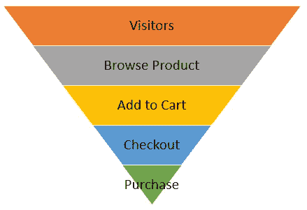

# 如何将数据转化为可操作的见解

> 原文：<https://towardsdatascience.com/how-to-translate-data-into-actionable-insights-83982eba7675?source=collection_archive---------14----------------------->

## 使用这个过程来发展一个无价的分析技能

照片由 [**迈克尔·布隆维斯特**](https://www.pexels.com/@mikael-blomkvist?utm_content=attributionCopyText&utm_medium=referral&utm_source=pexels) 发自 [**派克斯**](https://www.pexels.com/photo/people-in-the-office-having-a-meeting-6476189/?utm_content=attributionCopyText&utm_medium=referral&utm_source=pexels)

在最近的一次数据演示中，我的利益相关者对我说“*我不知道如何处理这些信息*”。这句话萦绕在我的脑海中，因为我意识到我们不能总是假设我们的利益相关者能够将数据和可操作的见解联系起来。作为数据分析师，我们的工作就是帮助弥补这一缺失环节。今天，我将讨论我用来将数据转化为见解的流程，以及如何在您的工作中应用这一流程。

## 学习公司的商业模式

我首先回答关于公司业务的三个基本问题。

1.  **公司如何获得潜在客户？** —根据[商业模式](https://www.bigcommerce.com/articles/ecommerce/types-of-business-models/)，潜在客户可以是网站的访问者、销售团队的负责人或产品或服务的用户。营销通常负责通过各种数字渠道带来潜在客户，如有机搜索、付费营销、电子邮件等。了解公司如何获得客户非常重要，因为这有助于您了解业务影响，以及当与客户获得相关的 KPI 发生变化时，在哪里进行调查。
2.  **是什么影响了潜在客户的购买行为？** —同样，根据业务模式，不同的因素会影响潜在客户的购买可能性。销售服务或产品的公司可以在购买前提供免费试用，或者电子商务公司可以在客户首次购买时提供折扣。关键是要知道影响你的公司的因素，以了解变化将如何影响业务。比如产品公司把他们的免费试用去掉了怎么办？这可能意味着更少的人会购买，因为他们不能免费试用，公司将赚更少的钱。
3.  **公司如何留住客户？** —留住客户是保持收入的关键。电子商务公司有忠诚度计划，给顾客购买奖励积分，积分可以兑换成折扣。产品公司发布新功能，并不断改善产品体验，以吸引用户。了解影响客户保留率的因素对于查明与保留率 KPI 相关的问题非常重要。

## 使用漏斗分析绘制 KPI

在我了解公司的商业模式后，我使用[漏斗分析](https://chartio.com/learn/product-analytics/what-is-a-funnel-analysis/)将相关 KPI 映射到客户获取漏斗的每个部分。这有助于我识别 KPI 变化的业务影响。

让我们使用下面的电子商务收购漏斗示例来绘制一些电子商务[KPI](https://inbound.human.marketing/ecommerce-kpis-for-every-stage-of-the-funnel)并讨论 KPI 的变化如何影响业务。

作者创建的电子商务收购漏斗图

1.  访问者来到网站。 —总访客和营销渠道访客。访客越少，意味着购买量越少，收入越低。
2.  **参观者浏览商品。** —平均产品页面浏览量。*产品页面浏览量减少可能意味着营销没有为网站带来合适的访客。*
3.  **游客将感兴趣的产品添加到购物车**。—添加到购物车的平均商品数。*添加到购物车的平均商品数量的增加可以转化为更高的平均订单价值和更高的收入。*
4.  **访客开始结账流程。** —弃车率。更低的购物车放弃率意味着更多的购买和更高的收入。
5.  访客完成购买。 —采购总额、平均订单价值和转换率。更高的转换率意味着更多的访问者购买和更高的收入。

请注意，有些 KPI 跨越了漏斗的多个部分，因为数字本身可能没有意义。例如，[购物车放弃率](https://www.adroll.com/blog/how-to-calculate-your-cart-abandonment-rate)和[转换率](https://www.privy.com/blog/conversion-rate-formula)是使用漏斗不同部分的数据计算的重要 KPI。找出贵公司的关键 KPI，并将它们映射到客户获取漏斗的相关区域。

## 将数据转化为见解

现在，我们将回顾一些假设的 KPI 变化、业务影响，以及它们如何转化为可操作的见解。

1.  与历史日平均水平相比，日购买量开始下降。—由于购买是客户获取漏斗的最后一个阶段，我们需要观察漏斗的不同部分，以找到下降的原因。购买是由游客推动的。从每日总访问量来看，我们发现网站的访问量没有变化。我们检查了产品页面浏览量和添加到购物车的商品的平均值，没有变化，但我们确实看到购物车放弃率有所增加。在与 product 交谈后，您发现有一个针对结帐流程的 A/B 测试正在运行，并且测试变体的表现比控制差。影响是测试运行时收入暂时减少。可操作的见解是，如果 A/B 测试达到了统计显著性，则关闭该测试；如果没有达到，则与产品部门讨论是否值得继续运行该测试，如果它影响了收入的话。
2.  **与历史平均水平相比，转换率下降。** —转化率通过购买量除以访客来计算。这意味着要么游客增加了，但他们的购买率不如以前，要么购买数量下降了。按渠道细分转化率，我们看到下降来自付费搜索。在与营销人员交谈后，我们发现他们推出了新的付费活动，与现有活动相比，转换率较低。业务影响是降低收入，可操作的见解是现在关闭新的活动，并找出为什么访客转换率比现有活动低。

## 最后的想法

了解贵公司的商业模式和客户获取渠道是学习如何将数据转化为可操作的见解的关键。我希望学习我的过程有助于你尽快发展这种无价的分析技能。感谢阅读和快乐的数据翻译！

## 你可能也会喜欢…

 [## 如何用数据讲故事

### 有效展示数据结果的技巧

towardsdatascience.com](/how-to-a-tell-story-with-data-3200bfadce6d)  [## 如何创建成功的数据演示

### 针对不同受众的演示技巧

towardsdatascience.com](/how-to-create-a-successful-data-presentation-7eae7a9a41f)  [## 数据科学家如何培养商业头脑

### 掌握这一必备的软技能，才能脱颖而出

medium.datadriveninvestor.com](https://medium.datadriveninvestor.com/how-data-scientists-can-develop-business-acumen-870eb55866e6)