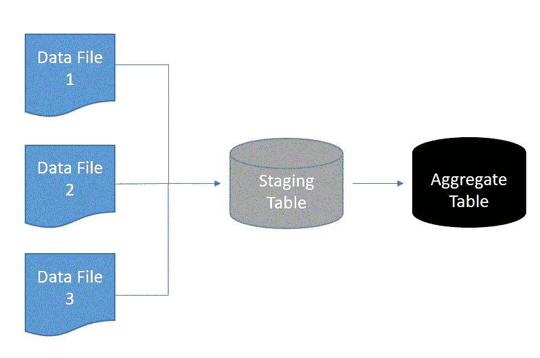

# 数据科学家如何像数据工程师一样解决 ETL 问题

> 原文：<https://towardsdatascience.com/how-to-troubleshoot-etl-issues-like-a-data-engineer-d761f7d361d4?source=collection_archive---------21----------------------->

## 常见原因及其处理方法

图片来自 [Pixabay](https://pixabay.com/?utm_source=link-attribution&utm_medium=referral&utm_campaign=image&utm_content=534103) 的[erikawittleb](https://pixabay.com/users/erikawittlieb-427626/?utm_source=link-attribution&utm_medium=referral&utm_campaign=image&utm_content=534103)

如果你是一名数据科学家，在你职业生涯的某个阶段，你必须解决 ETL 问题。如果您是 ETL 故障排除的新手，并且不清楚从哪里开始，这些是我作为数据工程师遇到的问题的常见原因以及如何处理它们。

## 1.所有的源数据都可用吗？

典型的 ETL 作业要么从原始文件加载源数据，要么从另一个系统将数据提取到临时表中。在下面的 ETL 管道示例中，三个数据文件被转换、加载到一个临时表中，并最终聚合到一个最终表中。ETL 失败的一个常见问题是缺少最近一天运行的数据文件。

**如何处理:**

如果数据来自外部来源，请与提供商核实并确认文件是否运行延迟。如果数据是内部数据，如应用程序事件或公司网站活动，请与负责团队确认是否存在可能导致数据延迟或丢失的问题。一旦您获得了丢失的数据，您的 ETL 问题就解决了。如果数据被延迟，一旦数据可用，您可能需要手动重新运行 ETL。

作者创建的示例 ETL 管道

## 2.上游 ETL 依赖项运行完毕了吗？

当数据库表缺少最近一天的数据时，您可能会收到 ETL 问题的警告。如果这是一个聚合表，则在更新该表之前，您很可能需要完成多个作业。

**如何处理:**

找到负责更新表的 ETL 管道。使用上面显示的示例 ETL 管道，从聚集表向后工作到暂存表，并确认每个步骤都成功完成。如果在第一步中没有验证，请检查最近一天的数据文件是否可用。一旦您确定了失败的阶段，从该点重新运行以确认表在下游被更新。

## 3.数据文件是否完全加载到数据库中？

有时候，由于我无法理解的原因，数据没有完全加载到数据库中😫。

**如何处理:**

在这些情况下，将原始文件的记录计数与暂存表进行比较，以验证数据是否不完整。当昨天和今天的数据之间的行数变化超过历史平均百分比时，我通常运行这个检查。从头重新运行 ETL 管道来重新加载原始文件应该可以解决这个问题。

## 4.数据文件是否包含意外值？

如果 ETL 的重新运行继续失败，就应该检查日志，以验证它是与最初的失败相同的错误消息还是新的错误消息。如果幸运的话，日志文件可能会指出文件中的哪个行号或字段导致了数据库加载错误。

**如何处理:**

我遇到的最常见的意外值是数值字段中的字符、[非 ASCII](https://www.dynadot.com/community/help/question/what-is-ascii) 字符以及超出表模式中定义的字段长度的字段值。如何处理坏数据取决于您的数据库和可用的工具，但这只是几个选项。

对于非 ASCII 字符，您可以删除原始文件中的坏行，或者使用终端命令将它们从文件中删除[，然后重新运行 ETL 作业。](https://newbedev.com/remove-unicode-characters-from-textfiles-sed-other-bash-shell-methods)

对于超过字段长度的数据，如果您有数据库管理员权限，可以改变表模式来增加字段长度。

对于数值字段中的字符，您可以增加因错误数据而跳过的最大行数，或者创建一个新的临时表，使用字符而不是数值字段在加载前清除或过滤错误数据。

## 5.数据文件不完整吗？

检查数据文件的行数是否与过去的文件相似。如果低于预期，当天的数据可能不完整。这可能是由于事件停止发送到后端或计划的系统维护造成的。

**如何处理:**

请与数据提供商联系，确认数据是否确实丢失，或者是否需要发送包含所有数据的新文件。如果需要发送新文件，请在数据更新后重新运行 ETL。

## 6.数据文件包含预期的格式吗？

数据格式可能会发生意外变化，尤其是外部数据。将 ETL 代码期望的分隔符和字段顺序与最新的文件格式进行比较。

**如何处理:**

如果格式已更改，请向数据提供商确认。如果没有，等待更新的文件并重新运行现有的 ETL。如果是，请自己修改生产代码或创建一个数据工程票证来处理新的格式更改。

## 7.有重复的吗？

这种情况并不经常发生，但是重复数据可能会进入您的数据中，并引起很大的麻烦。

**如何处理:**

使用上面的同一个 ETL 管道示例，向后工作，检查聚合表、临时表和数据文件中的重复项。删除重复项，并从该点重新运行 ETL。

## 最后的想法

当我第一次成为数据工程师时，我不知道如何解决 ETL 问题。经过反复试验，我想出了一个常见原因的清单，以便在进入更不寻常的原因之前进行检查。这个列表解释了我过去的大部分问题，现在你知道该找什么了，我希望你的许多问题也能得到解决。

## 你可能也会喜欢…

 [## 我作为数据工程师学到的 6 个最佳实践

### 以及作为数据科学家如何应用它们

towardsdatascience.com](/6-best-practices-i-learned-as-a-data-engineer-9d3ad512f5aa)  [## 作为数据科学家，你不应该应用的 6 个糟糕的数据工程实践

### 你应该做什么

towardsdatascience.com](/6-bad-data-engineering-practices-you-shouldnt-apply-as-a-data-scientist-58de5eca14c3)  [## 我如何使用机器学习模型来生成可操作的见解

### 将数据科学与数据分析相结合

medium.com](https://medium.com/swlh/how-i-used-a-machine-learning-model-to-generate-actionable-insights-3aa1dfe2ddfd)