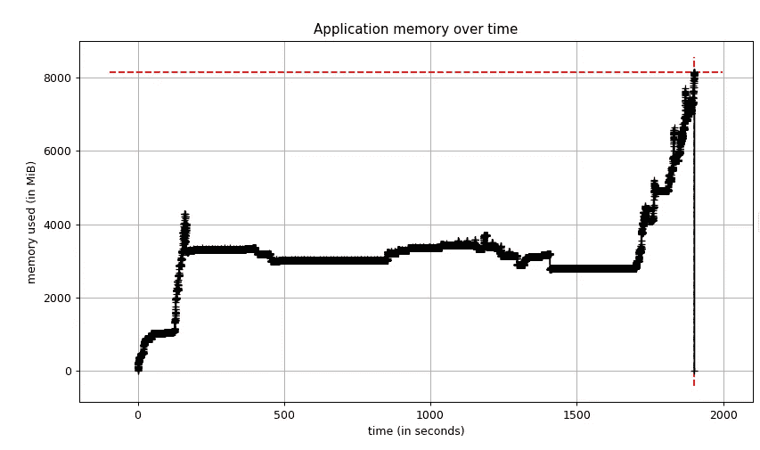
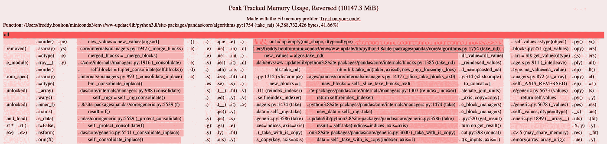

# 如何解决 Python 中的内存问题

> 原文：<https://towardsdatascience.com/how-to-troubleshoot-memory-problems-in-python-93ea0f62296d?source=collection_archive---------27----------------------->

## [行业笔记](https://towardsdatascience.com/tagged/notes-from-industry)

## 一个在生产环境中使用开源工具修复泄漏程序的真实例子。

致谢:[哈里森·布罗德本特](https://unsplash.com/@harrisonbroadbent)在 [Unsplash](https://unsplash.com/photos/ING1Uf1Fc30)

发现应用程序内存不足是开发人员可能遇到的最糟糕的情况之一。一般来说，内存问题很难诊断和修复，但我认为在 Python 中更难。Python 的自动垃圾收集功能使得使用这种语言变得很容易，但是它太擅长于置身事外了，以至于当它不像预期的那样工作时，开发人员会不知如何识别和修复问题。

在这篇文章中，我将展示我们如何诊断和修复由 Alteryx 创新实验室开发的开源 AutoML 库 [EvalML](https://github.com/alteryx/evalml) 中的内存问题。没有解决内存问题的神奇秘方，但是我希望开发人员，尤其是 Python 开发人员，能够了解在将来遇到这类问题时可以利用的工具和最佳实践。

读完这篇博文后，你应该会有如下收获:

1.  为什么发现并修复程序中的内存问题很重要，
2.  什么是循环引用，为什么它们会导致 Python 中的内存泄漏，以及
3.  Python 内存分析工具的知识，以及您可以用来识别内存问题原因的一些步骤。

# **设置舞台**

在发布新版本的包之前，EvalML 团队运行了一套性能测试，以捕捉任何性能退化。这些性能测试包括在各种数据集上运行我们的 AutoML 算法，测量我们的算法获得的分数以及运行时间，并将这些指标与我们之前发布的版本进行比较。

一天，我正在运行测试，突然应用程序崩溃了。发生了什么事？

# **步骤 0 —什么是内存，什么是泄漏？**

任何编程语言最重要的功能之一是它在计算机内存中存储信息的能力。每次你的程序创建一个新的变量，它会分配一些内存来存储变量的内容。

内核为程序定义了一个接口来访问计算机的 CPU、内存、磁盘存储等等。每种编程语言都提供了要求内核分配和释放内存块的方法，以供正在运行的程序使用。

当一个程序要求内核留出一块内存来使用时，就会发生内存泄漏，但由于一个错误或崩溃，程序永远不会告诉内核它何时用完了那块内存。在这种情况下，内核将继续认为正在运行的程序仍在使用被遗忘的内存块，其他程序将无法访问这些内存块。

如果在运行程序时重复出现相同的泄漏，被遗忘内存的总大小会变得很大，以至于它会消耗计算机内存的很大一部分！在这种情况下，如果一个程序试图请求更多的内存，内核将引发“内存不足”错误，程序将停止运行，或者换句话说，“崩溃”

因此，在您编写的程序中找到并修复内存泄漏是非常重要的，因为如果您不这样做，您的程序最终可能会耗尽内存并崩溃，或者会导致其他程序崩溃。

# **步骤 1:确定是内存问题**

应用程序崩溃的原因有很多——可能是运行代码的服务器崩溃了，也可能是代码本身有逻辑错误——所以确定眼前的问题是内存问题非常重要。

EvalML 性能测试以一种异常安静的方式崩溃了。突然，服务器停止记录进度，作业悄悄地完成了。服务器日志会显示由编码错误引起的任何堆栈跟踪，所以我有预感这个无声的崩溃是由使用所有可用内存的作业引起的。

我再次运行了性能测试，但是这次启用了 Python 的[内存分析器](https://pypi.org/project/memory-profiler/)来获得一段时间内的内存使用情况。测试再次崩溃，当我查看内存图时，我看到了这个:

EvalML 性能测试的内存配置文件。作者创建的图像。

随着时间的推移，我们的内存使用量保持稳定，但后来达到了 8gb！我知道我们的应用服务器有 8g 的 RAM，所以这个配置文件证实了我们的内存不足。此外，当内存稳定时，我们使用大约 4 GB 的内存，但我们以前版本的 EvalML 使用大约 2 GB 的内存。因此，出于某种原因，当前版本使用的内存是正常情况下的两倍。

现在我需要找出原因。

# **第二步:用一个最小的例子在本地重现内存问题**

查明内存问题的原因需要大量的实验和反复，因为答案通常不是显而易见的。如果是，你可能就不会把它写进代码了！出于这个原因，我认为用尽可能少的代码行重现问题是很重要的。这个最小的例子使您可以在修改代码时，在一个分析器下快速运行它，以查看您是否取得了进展。

在我的例子中，我从经验中得知，我们的应用程序在我看到峰值的时候运行了一个有 150 万行的出租车数据集。我把我们的应用程序精简到只有运行这个数据集的[部分](https://gist.github.com/freddyaboulton/66159137063d01f3ee9cfb84b0ac2aaa)。我看到了一个类似于我上面描述的尖峰，但这一次，内存使用量达到了 10gb！

看到这个之后，我知道有一个足够好的最小的例子来深入研究。

出租车数据集中本地再现器的内存占用。作者创建的图像。

# **第三步:找到分配最多内存的代码行**

一旦我们将问题隔离到尽可能小的代码块中，我们就可以看到程序在哪里分配了最多的内存。这可能是你需要重构代码和修复问题的确凿证据。

我认为 [filprofiler](https://pypi.org/project/filprofiler/) 是一个很好的 Python 工具。它显示应用程序中每行代码在内存使用峰值点的内存分配。这是我的本地示例的输出:

fil-profile 输出。作者创建的图像。

filprofiler 根据内存分配对应用程序中的代码行(以及依赖项的代码)进行排序。线越长越红，分配的内存就越多。

分配最多内存的行正在创建 pandas 数据帧(pandas/core/algorithms.py 和 pandas/core/internal/managers . py ),数据量达到 4gb！我在这里截断了 filprofiler 的输出，但是它能够在创建 pandas 数据帧的 EvalML 中跟踪 pandas 代码。

看到这个有点令人费解。是的，EvalML 创建了 pandas 数据帧，但是这些数据帧在整个 AutoML 算法中是短暂的，一旦不再使用就应该被释放。因为事实并非如此，而且这些数据帧仍然在内存中存在足够长的时间，所以我认为最新版本引入了[内存泄漏](https://en.wikipedia.org/wiki/Memory_leak)。

# **步骤 4:识别泄漏物体**

在 Python 的上下文中，泄漏对象是指在使用完之后不会被 Python 的垃圾收集器释放的对象。由于 Python 使用[引用计数](https://en.wikipedia.org/wiki/Reference_counting)作为其主要的垃圾收集算法之一，这些泄漏的对象通常是由于对象持有对它们的引用的时间超过了它们应该持有的时间。

这些类型的对象很难找到，但是有一些 Python 工具可以让搜索变得容易处理。第一个工具是 [gc。垃圾收集器的 DEBUG_SAVEALL](https://docs.python.org/3/library/gc.html#gc.DEBUG_SAVEALL) 标志。通过设置这个标志，垃圾收集器将在 gc.garbage 列表中存储不可到达的对象。这将让您进一步研究这些对象。

第二个工具是 [objgraph](https://pypi.org/project/objgraph/) 库。一旦对象出现在 gc.garbage 列表中，我们就可以将这个列表过滤为 pandas 数据帧，并使用 objgraph 查看还有哪些对象正在引用这些数据帧并将它们保存在内存中。通过阅读这篇奥赖利[的博客文章](https://www.oreilly.com/library/view/python-cookbook/0596001673/ch14s10.html)，我得到了这个方法的灵感。

这是我在可视化其中一个数据帧时看到的对象图的子集:

pandas 数据帧使用的内存图，显示了导致内存泄漏的循环引用。作者创建的图像。

这就是我一直在寻找的确凿证据！dataframe 通过一个叫 PandasTableAccessor 的东西对自己进行引用，这就创建了一个[循环引用](https://en.wikipedia.org/wiki/Circular_reference)，所以这将把对象保存在内存中，直到 Python 的垃圾收集器运行并能够释放它。(可以通过 dict、PandasTableAccessor、dict、_dataframe 来追踪循环。)这对 EvalML 来说是个问题，因为垃圾收集器将这些数据帧保存在内存中的时间太长了，以至于我们耗尽了内存！

我能够追踪 PandasTableAccessor 到[木工](https://woodwork.alteryx.com/en/stable/)库，并把这个[问题](https://github.com/alteryx/woodwork/issues/880)提交给维护人员。他们能够在新版本中修复它，并向 pandas 知识库提交相关的[问题](https://github.com/pandas-dev/pandas/issues/41357)——这是开源生态系统中可能的合作的一个很好的例子。

木工更新发布后，我可视化了同一个数据帧的对象图，循环消失了！

木制品升级后的熊猫数据框对象图。不再有周期！作者创建的图像。

# 步骤 5 —验证修复是否有效

当我在 EvalML 中升级了木制品版本后，我测量了我们的应用程序的内存占用，我很高兴地报告说，现在的内存使用不到以前的一半！

修复后性能测试的记忆。作者创建的图像。

# **结束语**

正如我在本文开头所说的，没有解决内存问题的神奇方法，但是这个案例研究提供了一个通用的框架和一套工具，如果您将来遇到这种情况，您可以利用这些工具。我发现 memory-profiler 和 filprofiler 是调试 Python 中内存泄漏的有用工具。

我还想强调的是，Python 中的循环引用会增加应用程序的内存占用。垃圾收集器最终会释放内存，但是，正如我们在本例中所看到的，也许直到为时已晚！

在 Python 中，循环引用非常容易被无意引入。我能够在 EvalML 中找到一个[无意的一个](https://github.com/alteryx/evalml/issues/2226)、 [scikit-optimize](https://github.com/scikit-optimize/scikit-optimize/issues/1028) 和 [scipy](https://github.com/scipy/scipy/issues/13986) 。我鼓励你擦亮你的眼睛，如果你在野外看到一个循环引用，开始一个对话，看看它是否真的需要！

*原贴于 Alteryx 创新实验室* [*博客*](https://innovation.alteryx.com/how-to-troubleshoot-memory-problems-in-python/)