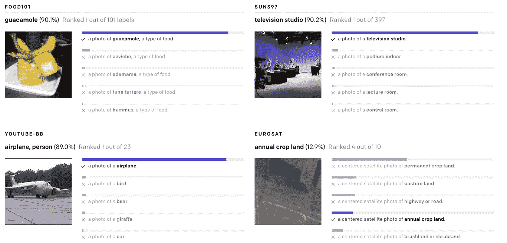
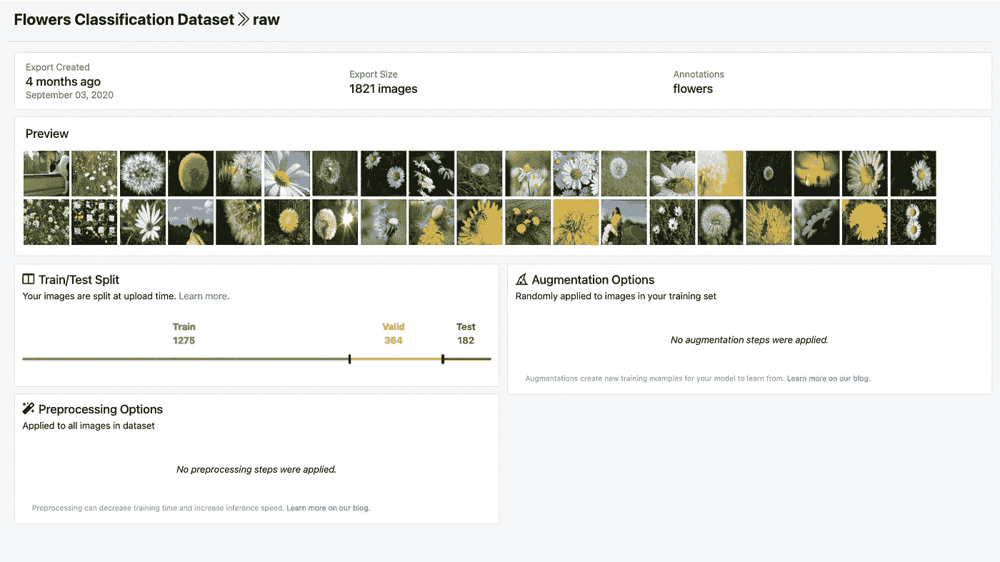
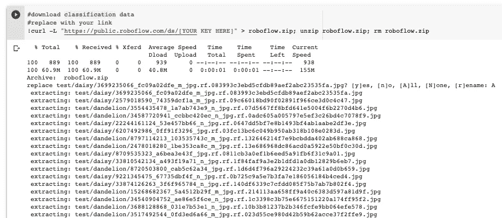

# 如何尝试 CLIP: OpenAI 的零拍图像分类器

> 原文：<https://towardsdatascience.com/how-to-try-clip-openais-zero-shot-image-classifier-439d75a34d6b?source=collection_archive---------29----------------------->

## 本周早些时候，OpenAI 向计算机视觉世界投下了一颗炸弹——你现在可以在不需要培训的情况下进行图像分类。

([引用](https://unsplash.com/photos/ZiQkhI7417A))

本周早些时候，OpenAI 向计算机视觉世界投下了一颗炸弹:两个新的突破性模型暗示了大规模 GPT3 式变形金刚模型侵占视觉领域的未来。虽然 [DALL-E](https://openai.com/blog/dall-e/) (一种可以从文本提示中生成图像的模型)在本周获得了很多关注，但这篇文章主要关注的是[剪辑](https://openai.com/blog/clip/):一种可以说更加重要的零镜头分类器。

到目前为止，[对图像进行分类](https://blog.roboflow.com/custom-resnet34-classification-model/)涉及收集数百、数千甚至数百万张标记图像的自定义数据集，这些图像适当地代表了您的目标类别，并使用它来训练监督分类模型(通常是卷积神经网络)。这种方法(以及像[物体检测](https://blog.roboflow.com/object-detection/)这样的扩展)导致了计算机视觉在过去十年中的快速发展(为从[无人驾驶汽车](https://blog.roboflow.com/self-driving-car-dataset-missing-pedestrians/)到[增强现实](https://blog.roboflow.com/designing-augmented-reality-computer-vision-apps/)的一切提供动力)。

监督训练的缺点是，结果模型不能很好地概括。如果你给他们看一张不同领域的图片，他们通常不会比随机猜测做得更好。这意味着您需要收集各种各样的数据，这些数据足以代表您的模型将在野外执行的确切任务。

# 输入 OpenAI 剪辑

最近推出的[剪辑](https://openai.com/blog/clip/)(对比语言-图像预训练)打破了这一范式。这是一个零射击模型，这意味着它可以识别前所未见的大量事物。

*剪辑就像最好的 AI 字幕写手。它能够从 32，768 个样本字幕中说出图像中的内容。图片来源:* [*OpenAI*](https://openai.com/blog/clip/)

在传统的分类器中，标签的意义被忽略了(事实上，它们经常被简单地丢弃，并在内部用整数替换)。相比之下，CLIP 创建其类的编码，并在超过 4 亿个文本到图像对上进行预训练。这使得它能够利用 transformer 模型从文本中提取语义的能力，在不根据自定义数据进行微调的情况下，对图像进行开箱即用的分类。

你所需要做的就是定义一个可能的类别列表，或者描述，CLIP 会根据它的先验知识来预测一个给定的图像最有可能属于哪个类别。把它想象成问模型“这些标题中哪一个最匹配这张图片？”

在本帖中，我们将演示如何在您自己的图像上测试 CLIP 的性能，这样您就可以获得一些硬数字，并直观地了解 CLIP 在各种用例中的实际表现。**我们发现 CLIP 在一个** [**花分类**](https://public.roboflow.com/classification/flowers_classification) **任务上比** [**我们定制训练的 ResNet 分类模型**](https://blog.roboflow.com/custom-resnet34-classification-model/) **。**它在一系列更模糊和更具挑战性的任务中也表现得令人惊讶(包括从我们的相机胶卷中识别蘑菇品种，以及[识别狗和猫的品种](https://public.roboflow.com/object-detection/oxford-pets/2))。

本教程中的资源:

[公共花卉分类数据集](https://public.roboflow.com/classification/flowers_classification)

*   [夹标杆 Colab 笔记本](https://colab.research.google.com/drive/1LXla2q9MCRRI_kTjpvag2Vz-7EGLnki5#scrollTo=lOF3Feb7jrnu)
*   [夹回购](https://github.com/openai/CLIP)
*   相应的 YouTube

# 组装数据集

要试用 CLIP，您需要带一组您想要分类的图像，并将其划分到您想要查看的类别中。

如果你还没有数据集，想尝试一下新技术，看看 Roboflow 的[公共计算机视觉数据集](https://public.roboflow.com/)。

在本帖中，我们将对公开的[花卉分类数据集](https://public.roboflow.com/classification/flowers_classification)进行基准测试。如果使用你自己的数据，[将你的数据上传到 Roboflow](https://docs.roboflow.com/adding-data/classification) 很容易，而且是免费的(最多 1000 张图片)，然后你可以在这个博客中遵循同样的流程。

一旦你组装好你的数据集，它就会被放到 [CLIP benchmarking Colab 笔记本](https://colab.research.google.com/drive/1LXla2q9MCRRI_kTjpvag2Vz-7EGLnki5#scrollTo=lOF3Feb7jrnu)上。

*本文中使用的示例花卉分类数据集*

# 安装剪辑依赖关系

要尝试裁剪自己的数据，请在驱动器中复制一份笔记本，并确保在运行时下选择了 GPU(Google Colab 会给你一个免费的 GPU 供你使用)。然后，我们在克隆 CLIP Repo 的同时进行一些安装。

# 将数据集下载到 Colab

下一步是将分类数据集下载到 Colab 中。

*下载分类数据到本帖笔记本*

如果你在 Roboflow 中创建了一个数据集，这可以通过点击`Generate`，然后点击`OpenAI CLIP Classification`格式的`Download`来实现。这将把所有的测试图像放在一个名为`test`的文件夹中，并为数据集中的每个类提供单独的图像子目录，并为您提供一个`_tokenization.txt`文件，让您尝试“快速工程”,这可以极大地提高或降低模型的性能。

我们还为对象检测数据集创建了一个转换器，它将从现有的边界框创建文本描述。我们得到了不同的结果，但是玩起来肯定很有趣。

此外，我们已经将所有的开源数据集以剪辑格式免费下载。

# 用剪辑推断类别标签

最后一步是通过预测步骤传递您的测试图像。

CLIP 接受一个图像和一个可能的类标题列表作为输入。您可以在`_tokenization.txt`文件中定义您认为合适的类别标题。请确保它们与按字母顺序排序的`class_names`(由文件夹结构定义)保持相同的顺序。

[notebook](https://colab.research.google.com/drive/1LXla2q9MCRRI_kTjpvag2Vz-7EGLnki5#scrollTo=lOF3Feb7jrnu)包含迭代测试集中每个类文件夹的代码，并通过预测步骤传递相关图像。

# 实验本体和结果

当您使用 CLIP 执行分类任务时，为您的分类本体尝试不同的类标题是很有用的，请记住，CLIP 被训练来区分图像标题。

在 flowers 数据集上，我们尝试了以下本体并看到了这些结果:

*   `"daisy" vs "dandelion"]` - > 46%的准确率(比猜测差)
*   `"daisy flower" vs "dandelion flower"` - > 64%的准确率
*   `"picture of a daisy flower" vs "picture of a dandelion flower"` - >准确率 97%

**97%的准确率高于我们在这个数据集上训练的任何** [**其他分类模型**](https://blog.roboflow.com/custom-resnet34-classification-model/) **。**

这些结果显示了提供正确的类描述来剪辑和表达预处理过程的丰富性的重要性，这是在传统的二进制分类中完全丢失的特征。OpenAI 将这一过程称为“提示工程”。

# 翻转脚本

CLIP 可能有许多额外的用例，包括根据目标查询字符串对图像进行排序，或者根据图像的独特性对图像进行排序。

在笔记本中，你会看到定义两个变量`image_features`和`text_features`的代码。任何一对特征之间的余弦相似性代表了它们的语义距离——从我们目前的经验来看，这是非常准确的。这只是早期...

# 结论

如果您发现 CLIP 的性能没有您希望的那么高，您可能仍然希望考虑[在监督下训练一个自定义图像分类模型](https://blog.roboflow.com/custom-resnet34-classification-model/)。

关于剪辑研究的更多信息，可以考虑阅读[论文](https://cdn.openai.com/papers/Learning_Transferable_Visual_Models_From_Natural_Language_Supervision.pdf)和查看 [OpenAI 的博客文章](https://openai.com/blog/clip/)。如果你在玩模型的时候发现了什么有趣的东西，我们很乐意听到！请务必[在推特](https://twitter.com/roboflowai)上给我们留言。

一如既往，推理快乐！

雅各布·索拉维茨

*原载于 2021 年 1 月 8 日 https://blog.roboflow.com**的* [*。*](https://blog.roboflow.com/how-to-use-openai-clip/)