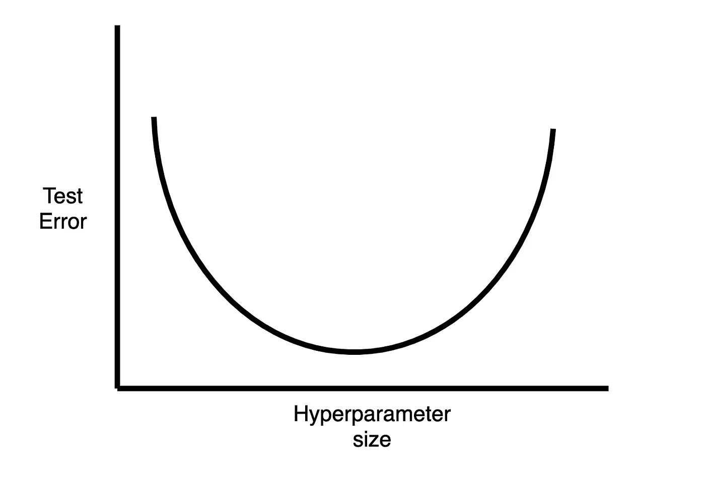

# 如何调整机器学习的超参数

> 原文：<https://towardsdatascience.com/how-to-tune-hyperparameters-for-machine-learning-aa23c25a662f?source=collection_archive---------30----------------------->

## 调整超参数是机器学习过程中的关键部分。继续读下去，学习一些有效而直观的方法。

尼克·希利尔在 [Unsplash](https://unsplash.com?utm_source=medium&utm_medium=referral) 上的照片

在机器学习算法中，有两种参数——模型参数和超参数。通过训练过程学习模型参数，例如神经网络的权重。超参数用于控制训练过程；因此，必须在训练开始前进行设置。深度学习中超参数的一些例子是学习速率和批量大小。许多机器学习实践者忽略的一个问题就是如何设置这些超参数。未能进行良好的超参数调整可能会抵消您构建模型的所有努力。幸运的是，有一种通用的启发式方法来挑选超参数。对于更复杂的情况，也有自动超参数选择方法。在本文中，我们将讨论这两个问题。

# **挑选超参数的一般方法**

考虑超参数选择的一个好方法是在模型容量的背景下考虑。从广义上讲，我们所说的模型容量指的是我们的模型能够表现的功能的数量。理想情况下，我们希望选择超参数，以便我们的模型的容量正好适合手头的问题。换句话说，我们想要避免欠拟合或过拟合的超参数。从视觉上很容易看出这一点。如果您要绘制一个图，y 轴为测试误差，x 轴为一个超参数值，大多数情况下您会得到如下结果:

作者图片

太小或太大的超参数对应于太大或太小的模型容量，导致高测试误差。**因此，为了最佳地设置超参数，我们需要推理该超参数的特定值对模型容量有什么影响。**

让我们看一个这种推理的例子。一个常见的超参数是神经网络中的节点数。节点数量和模型容量之间的关系非常明显——更多的节点意味着更多的模型容量，反之亦然。如果我们怀疑我们的模型过度拟合，例如，如果我们注意到一个非常低的训练误差，但一个相当大的测试误差，我们知道模型容量可能太大了。因此，我们需要减少神经网络中的节点数量。如果我们看到拟合不足(可能是如果训练集和测试集都有很高的错误)，我们知道模型容量太小，我们应该增加节点的数量。

现在让我们考虑另一个常见的超参数——重量衰减系数。权重衰减是神经网络的一种正则化形式，顾名思义，它使权重变小。权重衰减系数的影响也非常明显——衰减系数越高，权重越小，模型容量也就越小。因此，如果我们怀疑过度拟合，我们应该增加衰减系数，如果我们怀疑不足拟合，我们应该减少它。

然而，在某些情况下，超参数如何影响模型容量尚不清楚。深度学习中的学习率就是这样一个例子。在这些情况下，我们可以使用自动超参数调整方法。

# **两种自动方法:网格搜索和随机搜索**

这些自动方法背后的基本原理很简单。让我们从一个简单的例子开始，我们的模型只有一个超参数。让我们假设我们知道这个参数的合理值在 0 和 1 之间(例如，强化学习问题中的ε)。我们想尝试一些值，看看哪个是最好的。最明显的做法是尝试类似[0，0.2，0.4，0.6，0.8，1]或[0，0.33，0.66，1]的东西。这种以均匀间隔尝试数值的想法被称为**网格搜索**。如果我们有多个超参数，我们会尝试每个均匀分布的单个参数的组合。例如，我们可能有两个参数，并想尝试每个参数的值[0，1，2]。那么我们的网格搜索将需要尝试(0，0)、(0，1)、(0，2)、(1，0)、(1，1)、(1，2)、(2，0)、(2，1)、(2，2)。网格搜索也可以在对数而不是线性标度上运行，例如[0，10^(-3)，10^(-2)，10^(-1)，1]。

网格搜索的一个问题是，我们需要尝试的组合数量是超参数数量的指数级。因此，如果我们有多个超参数，网格搜索将需要很长时间来运行。也有可能不是所有的超参数都会影响模型。如果是这样的话，那么网格搜索不仅要花很长时间，而且还要浪费大量时间去寻找不影响性能的超参数的变化。

随机搜索解决了这两个问题。随机搜索分两步进行。首先，我们为每个超参数定义一个边际分布。然后，我们从组合分布中抽取随机值，并选择最佳值。随机搜索避免了指数运行时间问题——它凭借其随机性探索相同的空间。它还避免了时间浪费问题——由于其随机性，随机搜索不会在特定超参数的相同值上花费时间(这可能根本不会影响模型)。

从经验上看，这些改进似乎使 [**随机搜索比**](https://www.jmlr.org/papers/volume13/bergstra12a/bergstra12a) **网格搜索更有优势。**因此，如果你想用一种自动的方法来选择你的超参数，我建议用随机搜索代替网格搜索。

我希望这篇文章让您对如何调优超参数有了更多的了解。许多超参数可以通过思考超参数如何影响模型容量来进行调整。对模型容量(例如学习率)有复杂影响的超参数，或者超参数的大量组合，可以用上述自动方法进行调整。对于这些情况，我的建议是随机搜索。

请随时留下任何问题/评论。感谢阅读！