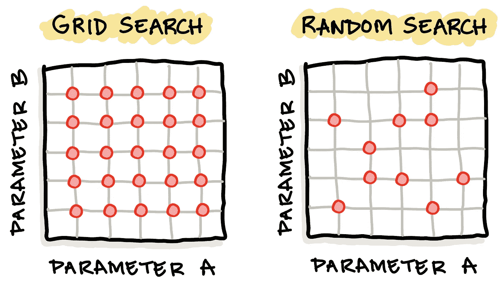

# 如何调整机器学习模型的超参数

> 原文：<https://towardsdatascience.com/how-to-tune-hyperparameters-of-machine-learning-models-a82589d48fc8?source=collection_archive---------17----------------------->


使用来自 [envato 元素](https://1.envato.market/c/2346717/628379/4662)的 [BoykoPictures](https://elements.envato.com/user/BoykoPictures) 的图像创建(经许可)。

## [数据科学](https://medium.com/tag/data-science) | [机器学习](https://medium.com/tag/machine-learning)

## 使用 Scikit-learn 的分步教程

通常情况下，您会使用默认参数来构建机器学习模型。只需几段代码，您就可以为您的机器学习模型搜索最佳超参数。为什么？因为最佳的超参数集可以大大提高模型的性能。

在本文中，您将学习如何使用 scikit-learn 库在 Python 中执行随机森林模型的超参数调优。

***注:*** 本文灵感来源于我前段时间做的一个 YouTube 视频([***Python 中机器学习模型的超参数调优***](https://youtu.be/jUxhUgkKAjE) )。

# 1.超参数

在应用机器学习中，调整机器学习模型的超参数代表了尽可能实现最佳性能的有利可图的机会。

## 1.1.参数与超参数

现在让我们定义什么是超参数，但在此之前，让我们考虑一下*参数*和*超参数*之间的区别。

参数可以被认为是模型固有的或内部的，并且可以在模型从数据中学习之后获得。参数的例子是线性回归中的回归系数、支持向量机中的支持向量和神经网络中的权重。

超参数可以被认为是模型的外在或外部参数，可以由从业者任意设置。超参数的例子包括 k-最近邻中的 k、随机森林中的树的数量和特征的最大数量、神经网络中的学习速率和动量、支持向量机中的 C 和 gamma 参数。

## 1.2.超参数调谐

由于没有通用的最佳超参数可用于任何给定的问题，超参数通常被设置为默认值。然而，超参数的最佳集合可以从手动经验(试错法)超参数搜索中获得，或者通过使用优化算法来最大化适应度函数以自动方式获得。

两种常见的超参数调谐方法包括*网格搜索*和*随机搜索*。顾名思义， ***网格搜索*** 需要创建可能的超参数值的网格，从而以强力方式为所有这些超参数组合迭代构建模型。在 ***随机搜索*** 中，不是所有的超参数组合都被使用，而是每次迭代使用一个随机超参数组合。



比较两种常用超参数调整方法的示意图:(1)网格搜索与(2)随机搜索。作者绘制的图像。

此外，随机优化方法也可用于超参数调整，其将以算法方式自动导航超参数空间，作为*损失函数*(即性能度量)的函数，以便监控模型性能。

在本教程中，我们将使用网格搜索方法。

# 2.资料组

今天，我们既不使用虹膜数据集，也不使用企鹅数据集，而是要生成我们自己的合成数据集。但是，如果您想继续使用您自己的数据集进行替换，那就太好了！

## 2.1.生成合成数据集

## 2.2.检查数据集维度

现在让我们检查数据集的维度

这将给出以下输出:

```
((200, 10), (200,))
```

其中`(200, 10)`是 X 变量的维度，这里我们可以看到有 200 行和 10 列。至于`(200,)`，这是 Y 变量的维度，表示有 200 行和 1 列(没有显示数值)。

# 3.数据分割

## 3.1.检验训练集的维数

现在让我们检查一下**训练集**(80%子集)的维度。

这将给出以下输出:

```
((160, 10), (160,))
```

其中`(160, 10)`是 X 变量的维数，这里我们可以看到有 160 行和 10 列。至于`(160,)`，这是 Y 变量的维度，表示有 200 行 1 列(没有显示数值)。

## 3.2.检验训练集的维数

现在让我们检查一下**测试集**的维度(20%子集)。

这将给出以下输出:

```
((40, 10), (40,))
```

其中`(40, 10)`是 X 变量的维数，这里我们可以看到有 40 行 10 列。至于`(40,)`，这是 Y 变量的维度，表示有 40 行 1 列(没有显示数值)。

# 4.构建基线随机森林模型

这里，我们将首先构建一个基线随机森林模型，该模型将用作基线，以便与使用最佳超参数集的模型进行比较。

对于基线模型，我们将为 2 个超参数(例如`n_estimators`和`max_features`)设置一个任意数字，我们也将在下一节中使用该数字进行超参数调整。

## 4.1.实例化随机森林模型

我们首先导入必要的库，并将随机森林分类器分配给 **rf** 变量。

## 4.2.训练随机森林模型

现在，我们将应用随机森林分类器，使用训练数据上的`rf.fit()`函数(例如`X_train`和`Y_train`)来构建分类模型。

模型定型后，会出现以下输出:


之后，我们可以应用训练好的模型(`rf`)进行预测。在上面的示例代码中，我们应用模型来预测训练集(`X_test`)，并将预测的 Y 值赋给`Y_pred`变量。

## 4.3.评估模型性能

现在让我们来评估模型性能。这里，我们计算 3 个性能指标，包括准确性、马修斯相关系数(MCC)和受试者工作特征曲线下面积(ROC AUC)。

# 5.超参数调谐

现在，我们将对随机森林模型的超参数进行调整。我们将调整的两个超参数包括`max_features`和`n_estimators`。

## 5.1.代码

应该注意的是，下面显示的一些代码改编自 [scikit-learn](http://scikit-learn.org/stable/auto_examples/svm/plot_rbf_parameters.html) 。

## 5.2.代码解释

首先，我们将导入必要的库。

scikit-learn 的`GridSearchCV()`功能将用于执行超参数调谐。特别需要注意的是，`GridSearchCV()`功能可以执行分类器的典型功能，如`fit`、`score`、`predict`以及`predict_proba`、`decision_function`、`transform`和`inverse_transform`。

其次，我们定义了作为`GridSearchCV()`函数必要输入的变量，这包括 2 个超参数(`max_features_range`和`n_estimators_range`)的范围值，然后将其作为字典分配给`param_grid`变量。

最后，打印出最佳参数(`grid.best_params_`)及其对应的度量(`grid.best_score_`)。

## 5.3.性能指标

`GridSearchCV()`的默认性能指标是准确性，在本例中，我们将使用 ROC AUC。

为了以防万一，您想知道可以使用哪些其他性能指标，运行以下命令来找出答案:

这将打印以下受支持的性能指标:

因此，在本例中，我们将使用 ROC AUC，并在`GridSearchCV()`函数中设置输入参数`scoring = 'roc_auc'`。

## 5.4.超参数调整的结果

第 5.1 节代码的第 14–15 行打印了性能指标，如下所示:


其表明最优或最佳超参数集具有 3 的`max_features`和 60 的`n_estimators`，ROC AUC 分数为 0.93。

# 6.调谐超参数的数据可视化

让我们首先来看看底层数据，稍后我们将使用它进行数据可视化。超参数调整的结果已被写出到`grid.cv_results_`，其内容显示为如下所示的字典数据类型。


`***grid.cv_results_***.`内容截图

## 6.1.准备数据帧

现在，我们将有选择地从`grid.cv_results_`中提取一些数据，以创建一个包含 2 个超参数组合及其相应性能指标的数据框架，在本例中是 ROC AUC。特别地，下面的代码块允许组合 2 个超参数(`params`)和性能度量(`mean_test_score`)。

输出为以下数据帧，其中 3 列由`max_features`、`n_estimators`和`ROC_AUC`组成。


包含超参数组合及其相应性能度量值的串联数据帧的输出屏幕截图。

## 6.2.重塑数据框架

**6 . 2 . 1*。*分组列**

为了将上述数据框可视化为等高线图(即 2D 或 3D 版本)，我们首先需要重塑数据结构。

在上面的代码中，我们使用来自`pandas`库的`groupby()`函数根据两列(`max_features`和`n_estimators`)对数据帧进行分组，从而合并第一列(`max_features`)的内容。


**6 . 2 . 2*。旋转数据***

通过将数据旋转到 m ⨯ n 矩阵中，数据被重新整形，其中行和列分别对应于`max_features`和`n_estimators`。

上面的代码块产生了下面的整形数据帧。


已准备好绘制等值线图的整形数据框的屏幕截图。

最后，我们将整形后的数据分配给各自的`x`、 `y`和`z`变量，这些变量将用于绘制等高线图。

## 6.3.制作 2D 等高线图

现在，有趣的部分来了，我们将通过使用 Plotly 绘制 2D 等高线图，可视化我们正在调整的 2 个超参数的景观及其对 ROC AUC 分数的影响。前述`x`、 `y`和`z`变量用作输入数据。

上述代码块生成以下 2D 等高线图。


## 6.4.制作 3D 等高线图

这里，我们将使用 Plotly 创建一个交互式 3D 等高线图，使用`x`、`y`和`z`变量作为输入数据。

上述代码块生成以下 3D 等高线图。


2 个超参数相对于性能指标 ROC AUC 的 3D 等高线图的屏幕截图。

# 结论

恭喜你！您刚刚执行了超参数调优，并创建了数据可视化。希望您能够提高您的模型性能，与默认值相比。

下一步是什么？在本教程中，您已经研究了两个超参数的调优，但这还不是全部。对于随机森林模型，您还可以调整其他几个超参数。您可以查看来自`scikit-learn`的 API，获得一个可以尝试的超参数列表。

<https://scikit-learn.org/stable/modules/generated/sklearn.ensemble.RandomForestClassifier.html>  

或者，您可以使用本文中描述的代码作为起始模板，尝试为其他机器学习算法调整超参数。

在评论里让我知道，你在做什么好玩的项目！

## 订阅我的邮件列表，获取我在数据科学方面的最佳更新(偶尔还有免费赠品)!

# 关于我

我是泰国一所研究型大学的生物信息学副教授和数据挖掘和生物医学信息学负责人。在我下班后的时间里，我是一名 YouTuber(又名[数据教授](http://bit.ly/dataprofessor/))制作关于数据科学的在线视频。在我制作的所有教程视频中，我也在 GitHub 上分享 Jupyter 笔记本([数据教授 GitHub page](https://github.com/dataprofessor/) )。

<https://www.youtube.com/dataprofessor>  

# 在社交网络上与我联系

✅YouTube:[http://youtube.com/dataprofessor/](http://youtube.com/dataprofessor/)
♇网站:[http://dataprofessor.org/](https://www.youtube.com/redirect?redir_token=w4MajL6v6Oi_kOAZNbMprRRJrvJ8MTU5MjI5NjQzN0AxNTkyMjEwMDM3&q=http%3A%2F%2Fdataprofessor.org%2F&event=video_description&v=ZZ4B0QUHuNc)(在建)
♇LinkedIn:[https://www.linkedin.com/company/dataprofessor/](https://www.linkedin.com/company/dataprofessor/)
♇Twitter:[https://twitter.com/thedataprof](https://twitter.com/thedataprof)/
♇Facebook:[http://facebook.com/dataprofessor/](https://www.youtube.com/redirect?redir_token=w4MajL6v6Oi_kOAZNbMprRRJrvJ8MTU5MjI5NjQzN0AxNTkyMjEwMDM3&q=http%3A%2F%2Ffacebook.com%2Fdataprofessor%2F&event=video_description&v=ZZ4B0QUHuNc)
♇github:[https://github.com/dataprofessor/](https://github.com/dataprofessor/)
♇Instagram:)