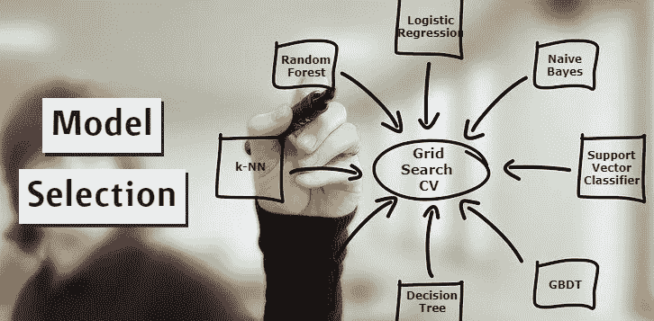

# 如何用 GridSearchCV 一次调优多个 ML 模型？

> 原文：<https://towardsdatascience.com/how-to-tune-multiple-ml-models-with-gridsearchcv-at-once-9fcebfcc6c23?source=collection_archive---------4----------------------->

## 加快您的型号选择工作流程

图片由 [LTD EHU](https://pixabay.com/users/ltdatehu-9079918/?utm_source=link-attribution&amp;utm_medium=referral&amp;utm_campaign=image&amp;utm_content=1095751) 发自 [Pixabay](https://pixabay.com/?utm_source=link-attribution&amp;utm_medium=referral&amp;utm_campaign=image&amp;utm_content=1095751)

模型选择是数据科学模型开发流程的重要组成部分。在执行特征工程之后，数据科学家需要选择具有最佳超参数集的模型，该模型对于训练数据集表现最佳。有各种自动化模型选择组件的 Auto-ML 库。

网格搜索是一种交叉验证技术，可用于调整机器学习模型的超参数。为了从 ML 模型列表中选择稳健模型，需要对每个模型进行多次交叉验证。在本文中，我们将讨论使用网格搜索和随机搜索交叉验证同时调优多个模型的技巧。

## 什么是网格搜索和随机搜索交叉验证？

GridSearchCV 或 RandomizedSearchCV 是交叉验证技术，用于执行超参数调整，以确定机器学习模型的最佳值。理想情况下，GridSearchCV 会尝试所有可能的参数值，而 RandomizedSearchCV 会随机选取参数并加速交叉验证工作流。

(作者代码)，GridSearchCV 实现

上述代码片段可用于为随机森林分类器模型选择最佳超参数集。

理想情况下，GridSearchCV 或 RandomizedSearchCV 需要为多个机器学习模型运行多个管道，以挑选具有最佳超参数值集的最佳模型。数据科学家可能会花很多时间来开发代码并研究它。

通过创建多个参数字典并为每个字典指定模型，可以使用 GridSearchCV 或 RandomizedSearchCV 同时调整多个机器学习模型。一次调优多个模型的逐步方法是:

1.  初始化多分类器估计器
2.  准备第一个分类器的管道。
3.  准备每个估计量的超参数字典，每个估计量都有一个作为“分类器”的关键字和作为估计量对象的值。超参数键应该以分类器的单词开始，用“__”分隔(双下划线)。
4.  列出超参数字典。
5.  使用管道和参数字典列表训练 GridSearchCV 模型。

## 实施:

(作者代码)

我使用了一个包含大约 5000 个实例和 29 个独立特征的样本二元分类数据集。为了训练一个健壮的机器学习模型，我已经初始化了 7 个机器学习估计器，包括:

*   随机森林
*   支持向量分类器
*   逻辑回归
*   决策图表
*   k-最近邻
*   朴素贝叶斯
*   梯度推进

并进一步用变量名`**param_i**`准备了它们对应的超参数字典。

Scikit-learn 包附带了 GridSearchCV 实现。我已经将带有管道和参数字典列表的第一个估计器传递给 GridSearchCV 模型。

GridSearchCV 需要 120 秒来训练 7 个估计器的 176 个模型。具有`**C=10**`、`**class_weight=None**`、**、**的支持向量分类器表现最好，交叉验证 ROC AUC 得分为 0.984，测试 ROC AUC 得分为 0.979。

RandomizedSearchCV 模型需要 9 秒来训练同一组模型。相同的支持向量分类器产生执行最好的结果。

# 结论:

在本文中，我们讨论了 GridSearchCV 和 RandomizedSearchCV 如何用于同时调优多个机器学习模型。这是一种非常方便的技术，可以加快模型选择工作流程。

# 参考资料:

[1] Scikit-learn 文档:[https://sci kit-learn . org/stable/modules/generated/sk learn . model _ selection。GridSearchCV.html](https://scikit-learn.org/stable/modules/generated/sklearn.model_selection.GridSearchCV.html)

喜欢这篇文章吗？成为 [*中等会员*](https://satyam-kumar.medium.com/membership) *继续无限制学习。如果你使用下面的链接，我会收到你的一小部分会员费，不需要你额外付费。*

 [## 加入我的推荐链接-萨蒂扬库马尔媒体

### 作为一个媒体会员，你的会员费的一部分会给你阅读的作家，你可以完全接触到每一个故事…

satyam-kumar.medium.com](https://satyam-kumar.medium.com/membership) 

> 感谢您的阅读