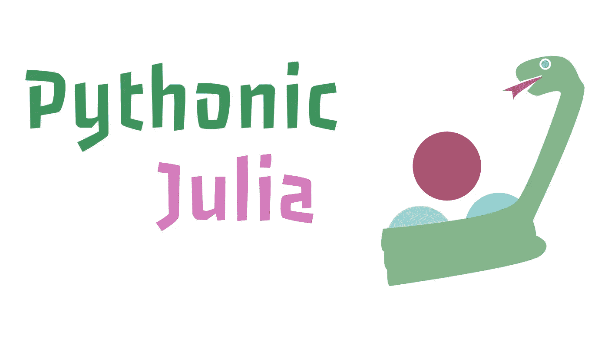

# 如何把茱莉亚变成 Python！

> 原文：<https://towardsdatascience.com/how-to-turn-julia-into-python-6ab13dafb84?source=collection_archive---------33----------------------->

## 如何在 Julia 编程语言中使用面向对象编程范式？



# 介绍

Julia 是一门相当新的编程语言，科学界的大多数人可能都很熟悉，或者想要熟悉它。Julia 编程语言有许多优点，这使它成为一门非常好的语言。虽然 Julia 传统上被认为是一种更函数式的编程语言，但使用一些 Julia 的酷技巧——如外部构造函数和令人难以置信的动态类型语法，我们实际上可以使编程语言非常快速和非常有效地成为面向对象的语言！

为什么要让 Julia 成为面向对象的编程语言？鉴于面向对象编程语言的流行，很容易理解为什么程序员可能最终想要使用支持这种范式的语言。子类型输入是很棒的，而且课程让很多事情变得轻而易举。虽然我们可能需要改变 Julia 中的一些东西，因为我们只是简单地使用内部和外部构造函数，并将我们的方法类型传递到一个结构中，但高级语法最终将保持不变。这意味着除了使用 Julia 之外，您还可以使用这种方法用这种语言重新创建您喜欢的 Python 包！

# 构造器

当然，为了让内部和外部构造函数更有意义，我们还需要看看我们通常认为的 Julia 语言中的构造函数。这当然是一种被构造成包含其他数据类型的类型。您可以将任何构造的类型视为保存数据类型的容器。在 Julia 中，我们为此使用 struct:

```
struct exampleend
```

正如人们可能想象的那样，数据被定义为带有回车的变量名:

```
struct example
    x
    y
end
```

我们刚刚创建的是一个外部构造函数。这是一种很好的方法，可以使构造的类型只需要保存将来可能通过方法传递的数据。然而，通常当我们想要一个类型返回时，我们不希望该类型只包含我们提供的数据，而是为我们获取它。考虑下面的例子，它是一个正态分布:

```
struct NormalDistribution
    mu
    sigmaend
```

当然，最终用户总是可以在其他地方计算他们的均值和标准差，然后输入:

```
using Lathe.stats: mean, stdstruct NormalDistribution
    mu
    sigmaendnorm = NormalDistribution(mean(x), std(x))
```

但是我们也可以通过简单地添加一个内部构造函数来更好地完成这项工作。为了添加内部构造函数，我们需要在这个结构中定义一个新函数。我们将使用 new()方法从这个内部构造函数返回新构造的类型。我们的构造函数将获取一个数组并从中返回一个正态分布:

```
struct NormalDistribution
    mu::Float64
    sigma::Float64
    function NormalDistribution(x::Array)
        return new(mean(x), std(x))
    endend
```

现在，如果我们调用我们的正态分布，并为它提供一个位置参数，这个位置参数恰好是一个数组，我们将得到一个正态分布的返回，其中包含该数组的平均值和标准差。这可能开始看起来像一个类，因为我们有一个下面有函数的构造函数，但是这不是我们将要调用的函数。

# 面向对象的程序设计(Object Oriented Programming)

我们将使用一种新的方法来应用这个分布的概率函数，简称 pdf。正态分布的 pdf 非常简单，只需要我们减去平均值，然后除以数组中每个值的标准差。我们可以在 Julia 中用一行 for 循环来实现，就像这样:

```
**pdf(xt) = [i = (i-μ) / σ for i in xt]**
```

现在我们可以将它添加到之前的内部构造函数中:

```
struct NormalDistribution
    mu::Float64
    sigma::Float64
    function NormalDistribution(x::Array)
        **pdf(xt) = [i = (i-μ) / σ for i in xt]**
        return new(mean(x), std(x))
    endend
```

这将在这个函数的私有范围内定义 pdf()方法(将来，这个类型。)然而，问题是该类型现在对这个新的 pdf()方法一无所知，我们希望它成为它的子方法。第一步是设置变量类型。我们可以使用{}语法做到这一点。然后，我们将把一个新的数据类型 pdf 转换为该变量类型:

```
struct NormalDistribution{P}
    mu::Float64
    sigma::Float64
    pdf::P
```

现在，我们需要做的就是在内部构造函数的返回中更改 new()方法调用，以包含 pdf()方法的类型，并向外部构造函数提供 pdf()方法:

```
function NormalDistribution(x::Array)
        pdf(xt::Array) = [i = (i-μ) / σ for i in xt]
        return new**{typeof(pdf)}**(mean(x), std(x), **pdf**)
end
```

现在，我们可以使用正态分布获得正态分布数据，就像我们在 Python 之类的东西中处理类似的对象一样！

```
x = [5, 10, 15, 20]
dist = NormalDistribution(x)
scaled_data = dist.pdf(x)
```

# 结论

我真的希望您喜欢这篇关于如何使用内部和外部构造函数使 Julia 编程像 Python 一样面向对象的概述！Julia 语言的伟大之处在于，这仅仅是一种选择，就方法论而言，它是选项海洋中的一条鱼。这不仅完全改变了范式，而且实际上非常有效！感谢您的阅读，祝您有美好的一天！