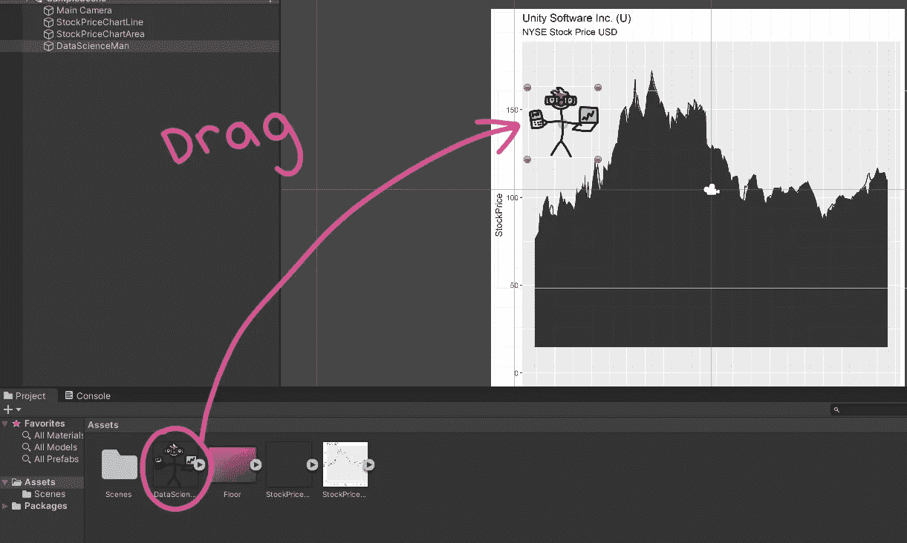

# 如何将你无聊的图表变成电子游戏

> 原文：<https://towardsdatascience.com/how-to-turn-your-boring-graphs-into-a-video-game-e02810bf3ec2?source=collection_archive---------38----------------------->

## 轻松将 R 图转换成游戏关卡的教程。高管们再也不会在你演讲的时候睡觉了。我保证。

图片作者。这是数据科学人，我们即将打造的游戏的主角。

有些英雄穿斗篷。其他英雄可能有活塞，剑，火箭发射器，或重力枪。

但不是我们的英雄。

不，我们的英雄 dual 挥舞着他传奇的笔记本电脑和 TI-83 计算器。我们的英雄用事实、数字和机器学习模型武装起来，将在 4 年内将利润率提高 1.2%。

这是数据科学人。

数据科学人在这里拯救你的图表，使其免于在你的观众心目中被归档为“无聊且易被遗忘”的可怕命运。

在本教程中，我们将使用 R 的 ggplot2 库绘制一家公司的股票价格，然后在 Unity 中将它轻松转换为实际的视频游戏。你将控制数据科学的人，因为他跌倒，跌跌撞撞的山下降的利润。

只是想玩游戏？滚动到文章底部的游戏网页链接，玩得开心！

是时候提升您的数据科学技能了！我们开始吧！

## 游戏计划

数据科学人总是有计划的，你也应该有！这是我们将要做的，按照我们将要做的顺序。

*   获取 Unity Systems Inc (U)去年的股价数据。这也恰好是制作 Unity 3D 的公司，我们将使用该软件制作游戏。
*   创建该股票价格数据的 ggplot2 折线图。这将有标签，日期，轴等。这将是游戏的‘水平’。
*   创建该股票价格的 ggplot2 面积图。这将是一个没有标签的透明背景上的黑色图表。它将成为数据科学人行走的无形地面。
*   将两个图表和上面的数据科学人绘图添加到一个新的 Unity 项目中。我们将添加一些代码使他移动。这看起来就像一个小人在你的星盘上奔跑。会很棒的。
*   你将说服你的老板，这是仪表板的未来，并获得制作视频游戏的报酬。

**在 R 中建立关卡**

获取一家公司的股价数据很容易，所以我们不要在这上面花太多时间。我们想要 Unity 系统公司去年的股票价格。我喜欢使用 Pythons 的 yfinance 库，因为它易于使用并且有很好的文档记录。[这里有一个链接](https://github.com/KendonDarlington/Data-Science-Man/blob/main/Python/Unity%20Stock%20Price.py) 到提取数据的 python 代码。你也可以从数百个免费提供股票数据的网站中下载。这里有一个[链接到我们将要使用的数据](https://github.com/KendonDarlington/Data-Science-Man/blob/main/R%20Project/UnityStockData.csv) 。

首先创建一个新的 R 项目和 R 脚本，并将[股票数据 csv](https://github.com/KendonDarlington/Data-Science-Man/blob/main/R%20Project/UnityStockData.csv) 放入同一个文件夹。r 项目允许我们使用相对路径，这对于教程来说非常好。顺便说一下，我的整个 R 项目可以在 GitHub 上找到，以防你觉得懒。

让我们从数据的主图表开始。这将是我们游戏的“水平”:

图片作者。

我们的第一个图表有标题、标签和日期。我们使用 tidyverse 库来选择我们想要的数据(时间和价格)，然后使用 ggplot2 来制作线图。我们手动将 y 轴限制设置为 0–180。我们为两个图形手动执行此操作，因此它们的大小大致相同。

不幸的是，我们不能把这个图表导入到像 Unity 这样的游戏引擎中，让它作为一个关卡来使用。对 Unity 来说，这只是另一个图像，引擎不知道图表的线应该是地板，或者这个图像应该以任何特殊的方式进行交互。

在 Unity 中，游戏的边界被称为碰撞器。数据科学人的脚上会有一个对撞机，这个会和地板上的对撞机相互作用，给人一种在地上行走的感觉。

Unity 可能无法区分我们的图形中的线条和图像中的任何其他特征，但它确实有能力轻松地用仅由一个特征组成的整个图像制作碰撞器！我们所需要的是我们的图形在透明背景上的完全黑色版本，然后 Unity 将能够检测我们的图形的边界，并通过单击 1 个按钮创建一个地板！

幸运的是，ggplot2 非常棒，允许我们对任何图形做任何我们想做的事情。数据科学家对您的 n00b 友好开箱即用的仪表板解决方案嗤之以鼻！

这与之前的折线图相同，但使用了面积。我们还使用一些主题参数来删除图表中的所有内容(标签、刻度、背景颜色等)。).我们剩下的只是透明背景上的面积图，这意味着背景可能看起来是白色的，但实际上什么都没有。酷毙了。

图片作者。现在这是一个楼团结可以承认！

请注意，该形状与我们的折线图的形状相同。我们需要做的就是把面积图变成 Unity 中的碰撞器，把它和我们原来的折线图对齐，然后让它隐形！烟雾和镜子。

最后，我们将这两个图形保存到 images 文件夹中。

## 从静止到统一。把我们的图表变成一个水平。

首先，您需要在电脑上安装 Unity 3D。Unity 是免费的，你可以在这里下载[。完成后，启动 Unity 并点击“新建”，然后创建一个名为“数据科学人”的项目。选择“2D”作为模板。](https://unity.com/)

图片作者。

一旦你点击“创建”，你应该在统一编辑器内。如果这是你第一次使用 Unity，不要感到害怕。如果你按照我的步骤，你会得到游戏的工作。如果你觉得你需要学习更多，也有数百个针对初学者的 Unity 教程！

在主窗口的右下角，你会看到一个名为“资产”的文件夹。让我们把所有需要的图片都拖到这个文件夹里。您可以一次将多个文件从电脑直接拖到“资源”文件夹。

图片作者。

我们将使用的所有图片都位于[GitHub 文件夹](https://github.com/KendonDarlington/Data-Science-Man/tree/main/R%20Project/Images)中。只需将它们全部下载到您的计算机上，然后放入 Unity。它们包括:

*   我们在 R 中做的折线图
*   我们在 R 中制作的面积图
*   数据科学人
*   一个叫做“地板”的红色方块
*   一个玩家动作脚本。这是让数据科学人心动的代码！

图片作者。将文件从电脑上的“图像”文件夹拖到 Unity 中的“资产”文件夹。

将白色“股价线”图拖到场景窗口。

图片作者。将白色折线图拖到场景中。

将黑色的“StockPriceArea”图像拖到场景窗口中。

图片作者。将黑色区域图拖到场景视图中。

现在，如果黑色面积图在白色折线图的上面，就像上面的截图一样，那就很好。如果黑色图表位于白色图表下方，只需点击场景视图中的黑色区域图表，并查看 Unity 右侧的检查器选项卡。找到“位置”并将 Z 值更改为-1。

图片作者。只有当黑色图表位于白色图表下方时，您才需要修改此设置。

接下来，您需要将面积图与折线图对齐。为此，您可以结合使用屏幕左上角的“缩放”和“移动”工具。不一定要精确，但你希望波峰和波谷尽可能排成一行。

图片作者。首先单击您的面积图，然后使用这两个工具来对齐它们。

图片作者。这些是要拖动的手柄。不一定要完美，足够接近就好。

现在是魔法酱的时候了。这是我们在 R 中所做的一切的目的，也是让我们能够将你们自己公司的数据转化为视频游戏水平的原因。点击场景视图中的黑色区域图，回到右边的检查器窗口。在底部，点击“添加组件”并输入“多边形”。选择“多边形碰撞 2D”。

图片作者。选择多边形碰撞器 2D。

嘣！！看看吧！

图片作者。

因为 ggplot2 允许我们自定义图表，我们认为合适，并把清晰的黑色形状放在透明的背景上，Unity 能够检测图表的边界，以创建多边形！这意味着这现在是我们视频游戏中的工作层。

这和你以前玩过的任何 2D 平台游戏中的山没有什么不同。但是你想一想……在二维空间里，一座山除了一系列间隔不一、坡度上下不一的数据点还能是什么？归根结底都是数学，伙计。自然界的一切都只是信息，从山坡到你细胞中的原子。我是不是陷入了二维空间？悖论！

哲学够了！

## 将数据科学人带入生活

现在我们有了一个关卡，是时候把数据科学家放进去，让他动起来了！

图片作者。把数据科学家拖到图表上！

现在数据科学家已经到了我们的水平，让我们在他的脚下添加一个物体，这样他就可以在地上行走了。在左侧的层次视图中右键单击“DataScienceMan ”,然后单击“创建空”。这就创建了一个空的游戏对象，它附属于我们的主角。

图片作者。右键单击数据科学人，然后单击创建空

将此对象重命名为“Origin”。然后使用移动工具，并调整它，使我们的新对象在我们的英雄的脚下。这将与我们的 R 图发生冲突，并使他看起来像是在我们的数据上行走(和跌倒)!

图片作者。

为了让我们的英雄移动，我们需要给他添加一个移动脚本。这个脚本在我们的 images 文件夹中，所以您应该已经把它拖到项目中了。我们需要做的就是将这个脚本从我们的 assets 文件夹拖到层次视图中的 DataScienceMan:

图片作者。将 Move.cs 拖动到“DataScienceMan”中。

现在是时候给数据科学人添加一些组件了。我们快完成了！点击层次视图中的 DataScienceMan，查看检查器。单击“添加组件”并键入“刚性”。从下拉菜单中选择“刚体 2D ”:

图片作者。添加刚体 2D 组件。

在 unity 中，给像 Data Science Man 这样的游戏对象添加新的组件会赋予它新的属性。刚体 2D 组件允许我们的角色受物理影响！不相信我？点击顶部的 play，看着他直接从地板上摔下来。

图片作者。这是播放按钮，它播放游戏。谁能想到呢？

地心引力正在把他往下拉！但是为了让他击中我们的图表并坚持下去，我们需要添加最后一个组件。点击“添加组件”并键入“box”，然后选择 BoxCollider2D:

图片作者。向 DataScienceMan 添加一个箱式碰撞器 2D 组件。

现在，如果你点击 play，我们的角色就会移动并站在我们的图上。只有一个问题，数据科学家是巨大的！让我们把他缩小一点，让他看起来像站在一座山上，而不是一个小山丘。

图片作者。数据科学人太大了。

再次点击“数据科学人”并返回到检查员。将他的 x 和 y 比例值设置为 0.5。现在他只有以前的一半了！

图片作者。缩放 x 和 y 改变他的尺寸。如果 DataScienceMan 出现在游戏中的物体后面，降低他的 z 位置会让他出现在前面。

数据科学家还有最后一件事要做。将我们创建的“原点”对象拖动到他的移动脚本的“光线原点”参数上。这是告诉我们的脚本，我们想用它作为他的脚！

图片作者。像这样拖动原点到移动脚本上。

你现在有一个工作的视频游戏！单击顶部的播放按钮查看。“A”键左移，“D”键右移，空格键跳跃！如果他掉下关卡,“R”键会重置游戏。

现在，当你跳跃的时候，数据科学人就像是发射到了外太空。我们可以做一些清理工作，让我们的游戏更有趣一点。

## 清理美学

首先，让我们摆脱面积图。这意味着是他的看不见的地面，我们希望他看起来像是在有标签的线图上走来走去。只需点击场景或层次视图中的黑色区域图，进入检查器并取消选中“精灵渲染器”。

图片作者。取消选中面积图的 sprite 渲染器。

这意味着图像不再被绘制，但是物体(以及碰撞器)仍然在那里。

好了，还有最后两件事要做。抓住红色的“地板”图像，并将其拖动到图表上方。使用缩放和移动工具将其拉伸到图表上方。在该对象的检查器中，单击“添加组件”,然后像我们处理数据科学人对象一样，在它上面放置一个 2D 碰撞器。

图片作者。将地板图像添加到游戏中，并在上面设置一个 2D 碰撞器。

这个对撞机将阻止数据科学人跳跃到达轨道。最后一步是调整相机，使其恰到好处。你可以点击“游戏”视图(它就在我们一直使用的“场景”视图旁边)来查看相机视窗。点击层次视图中的“主摄像机”并查看其检查器。

图片作者。游戏视图将向您展示摄像机看到的内容。使用此视图调整摄像机。

图片作者。点击“主摄像头”并调整它的“大小”来移动摄像头。位置 x 和 y 将上下左右移动它。滴管会将背景设置为与您的图表相同(先点按滴管，然后点按您的图表)。

选择了“游戏”视图(不是“场景”！)调整“大小”字段，直到图表刚好在视图中。确保我们的红色天花板不可见。最后，单击“背景”右边的滴管，并单击图表中的某个位置，使背景与我们的图表相匹配。

就是这样！你现在可以在我们的 R ggplot2 图表上行走、跳跃和翻滚了。当他从屏幕上掉下来时，只要按“R”就可以让他复活！

## 可能性是无限的

这是游戏能做到的最简单的事情了。但是停下来想象一下所有的可能性。我们每天使用的许多图表将会成为可爱的视频游戏。

旋转甜甜圈图作为刀片，条形图作为跳转的壁架，在树状图中滑行，在气泡图中浮动，甚至不要让我开始使用径向条形图和重力！

我保证我们会在以后的文章中做到这些。数据科学人的冒险才刚刚开始！

如果你时间紧迫，只想玩这个游戏，我已经在这里上传了它的网页版[。尽情享受吧！](https://cpld.itch.io/data-science-man)

这个项目的所有代码包括 R 项目，制作游戏所需的图像，以及 Unity 项目都可以在 [**GitHub**](https://github.com/KendonDarlington/Data-Science-Man) **上获得。**

数据科学人永远遵循规律。这就是大数定律。你知道吗，在一篇文章中，你最多可以点击鼓掌按钮 50 次！