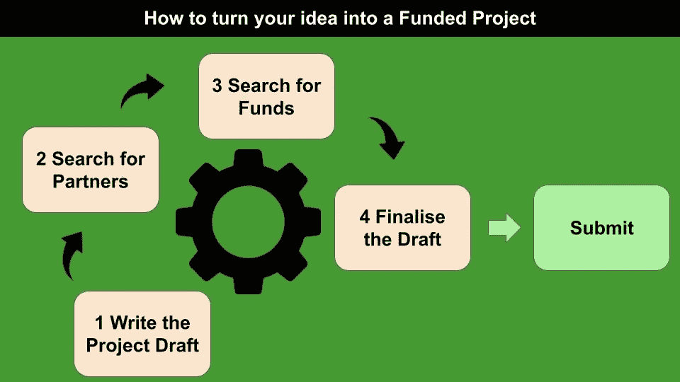

# 如何将您的数据科学想法转化为受资助的项目

> 原文：<https://towardsdatascience.com/how-to-turn-your-data-science-idea-into-a-funded-project-f919dbaff104?source=collection_archive---------30----------------------->

## 技术、数据科学、学习

## 为你的数据科学想法和项目寻找资金的一些建议。

作者图片

所有的数据科学家心里至少隐藏着一点数据科学的想法。然而，由于时间限制或缺乏资金，他们不会将想法转化为项目。

在这篇文章中，我提出了一个将你的想法转化为数据科学项目的策略。所采用的方法基于以下步骤:

*   写一份项目建议书的草稿
*   搜索合作伙伴和协作者(可选)
*   寻找资金
*   根据出资方模板修改项目草案并提交

# 1 .撰写项目建议书草稿

资助项目的第一步包括撰写项目初稿。在写完整的草稿时，尝试回答以下问题:

*   我的项目涵盖哪个主题？
*   我的项目解决了哪个问题？

通常，一个项目建议书，由以下几项组成:

*   摘要
*   项目目标
*   类似项目
*   项目架构
*   工作计划
*   对社会的影响
*   项目参与者的描述
*   甘特图

## 1.1 摘要

摘要是对项目的概述。如果你的项目涉及数据科学，总结应该包含与数据科学相关的最重要的关键词，比如**机器学习**、**数据分析**、**数据可视化**、**人工智能**等等。

为了构建一个成功的提案，该项目还应该处理至少一个与数据科学相关的热门话题，例如由 [ODSC -开放数据科学](https://medium.com/u/2b9d62538208?source=post_page-----f919dbaff104--------------------------------)撰写的[有趣文章](https://medium.com/@ODSC/trending-data-science-topics-tools-for-2020-9b269e6a00b3)中描述的那些话题。

总结应恢复项目的所有部分，包括背景描述、目标、对社会的影响等。

## 1.2 项目目标

你的项目至少要解决一个问题，否则不会资助。例如，作为一名数据科学家，你可以提出一种新的机器学习算法，实现一个新的有趣的仪表板来讲故事，或者建立一个[数据新闻故事](https://alod83.medium.com/how-to-design-a-data-journalism-story-b2e421673b6e)。无论如何，你的项目目标应该非常明确。

一般来说，在撰写本节时，您应该关注两种目标:

*   **总体目标**，例如提供一个用于讲故事的仪表板
*   **具体目标**，比如利用拟议中的仪表板来了解蚂蚁随时间推移的行为。

这一部分应该非常清楚，不应该出现歧义。

## 1.3 类似项目

到目前为止，你已经描述了你的想法。但是，你应该看看你的周围，看看你的想法是否已经被其他人实施了。如果你的答案是肯定的，那就不要浪费时间去写你的提议，相反，要努力为你的想法增加附加值。

您可以通过在搜索引擎上搜索您的总体/具体目标来搜索类似的项目。如果你没有找到任何东西，这并不意味着没有类似的项目，你的想法。很有可能你在以错误的方式寻找。搜索，再搜索，直到你找到至少 2-3 个类似的项目。

为了执行你的搜索，你也可以看看社交网络。例如，你可以[利用 Twitter 作为扩展你知识的地方](https://betterhumans.pub/6-tips-for-extending-your-knowledge-with-twitter-af2bc8c16bdb)。此外，你可以在谷歌学术搜索，正如我在之前关于[如何从数据科学项目](/how-to-write-a-scientific-paper-from-a-data-science-project-62d7101c9057)撰写科学论文的文章中所描述的。

一旦建立了类似的项目，你可以阅读它们，以获得一些额外的想法，这些想法可以用来丰富你的提案。无论如何，你应该写一段话，描述相关的项目。

## 1.4 项目架构

现在你可以详细描述你的想法了。尝试建立一个图表，描述它。例如，您可以将项目的每个元素表示为一个组件。在机器学习管道的情况下，您可以为管道的每个元素添加一个组件(数据清理、数据分析、数据测试、数据生产等等)。

这一部分不应该描述用来实现你的项目所采用的技术，比如 Python 或者 R 软件，而是描述一般的概念，元素是如何连接的。

## 1.5 工作计划

工作计划部分应该描述项目将如何组织。通常项目被组织在工作包中，如下所示:

*   项目管理——与项目管理相关的所有方面，包括如何管理资金的分析
*   建筑设计
*   架构的每个元素一个工作包
*   传播和利用——如何推广项目

## 1.6 对社会的影响

对社会的影响常常被低估，这是项目建议书最重要的部分之一。事实上，如果一个项目不能为社区带来任何好处，它就是无用的。

在这一部分，你应该描述为什么一般的社会或特定的社区可能会利用你的项目。

例如，在新的在线新闻分类系统的情况下，对社会的影响可能是根据每个用户的兴趣为他们提供更好的新闻建议。

## 1.7 行为者的描述

一个好的项目建议书应该描述谁来实施它。在这里，你应该包括一份 10 行的简历摘要，重点是实施项目所需的技能。

此外，该部分应包括项目所有其他合作伙伴(参与者)的简短简历(如果有)。你可以在这篇文章中进一步了解如何为你的项目寻找合作伙伴。

## 1.8 甘特图

甘特图代表您的项目时间表，包括期限。换句话说，它描述了在项目生命周期中如何实施工作计划。

有许多工具可以实现甘特图，比如本文中描述的那些工具。

[丹尼尔·麦卡洛](https://unsplash.com/@d_mccullough?utm_source=medium&utm_medium=referral)在 [Unsplash](https://unsplash.com?utm_source=medium&utm_medium=referral) 上拍照

# 2 搜索合作伙伴和协作者

到目前为止，你已经写了一份项目草稿，可能有 5-10 页。现在是时候寻找合作伙伴了。首先，你应该确定你要找的伴侣的类型。例如，你可以搜索具有文本分析或数据可视化技能的人。无论如何，试着为每个期望的个人资料和他们在项目中的相关角色写 3-4 个句子。

下一步是在你的同事中或通过你喜欢的社交网络传播这种声音。例如，你可以探索 Twitter 话题，找到一些符合你要求的人，采用我在之前的文章[中描述的策略，用 Twitter](https://betterhumans.pub/6-tips-for-extending-your-knowledge-with-twitter-af2bc8c16bdb) 扩展你的知识。

或者，您可以利用特定的网站进行合作伙伴搜索，例如欧盟委员会提供的[合作伙伴搜索网站](https://ec.europa.eu/info/funding-tenders/opportunities/portal/screen/how-to-participate/partner-search)，以及本文[中描述的网站](https://www.mariecuriealumni.eu/newsletters/3rd-mcaa-newsletter/10-websites-you-need-know-if-youre-looking-research-partners)。

一旦确定了一些潜在的合作伙伴，你可以通过解释你的想法来联系他们。你不必分享项目的完整草稿，只需分享摘要即可。然后，如果合作伙伴同意加入您的项目，您可以与他们分享完整的草案。

*您可以决定不向您的项目添加合作伙伴。*提醒一些项目电话需要至少三个合作伙伴，来自三个不同的国家，因此我强烈建议寻找合作伙伴。

# 3 寻找资金

寻找资金是最困难的部分，因为它需要不同参与者之间的激烈竞争。无论如何，你可以通过很多渠道获得资助:

*   **国家或国际层面的呼吁:**几乎所有国家都会定期发布项目呼吁。例如，欧盟委员会有一个名为[融资&招标机会](https://ec.europa.eu/info/funding-tenders/opportunities/portal/screen/home)的门户网站，专门用于项目融资。一般来说，在这种类型的招标中很难找到资金，因为竞争非常激烈，而且拟议的项目应该对社会产生很大影响。所以，我建议甚至不要尝试这条路，除非你有一个非常好的想法和一个强大的合作伙伴。
*   基金会的呼吁:基金会也定期发出项目呼吁。通常这类电话是指满足基础要求的小型项目。基金会的例子有[大众基金会](https://www.volkswagenstiftung.de/unsere-foerderung)和与银行有关联的基金会。
*   **筹款:**最后，但同样重要的是，你可以尝试筹款选项，通过普通人的自愿捐款来筹集资金。有很多平台是为了筹款而存在的，比如 [GoFundme](https://www.gofundme.com/) 。

你可以尝试所有建议的渠道，注意为每个选择的渠道修改项目建议书的标题。

# 4 根据出资方模板修改项目草案并提交

一旦选择了适合您的合适渠道，您应该下载与通话相关的所有文档。你应该仔细阅读它。阅读时，尽量突出最重要的关键词和句子，比如人工智能、机器学习等的新视角。

至少读两遍电话，试着理解电话需要什么。现在你可以修改你的提议草案了，**为了包含所有高亮句子的释义。**

让你的合作者参与撰写项目建议书的最终版本。

再次阅读您的建议，并最终在截止日期前提交给电话！

米妮·迪法在 [Unsplash](https://unsplash.com?utm_source=medium&utm_medium=referral) 上的照片

# 摘要

在本文中，我描述了一个简单的策略，将您的数据科学想法转化为一个受资助的项目。

最困难的部分是寻找正确的渠道来获得资助，但有了一点经验，你会找到适合你的方式！

感谢您的阅读！你可以在[这篇文章](https://alod83.medium.com/which-topics-would-you-like-to-read-c68314dc6813)中读到更多关于我的信息。

# 相关文章

 [## 如何根据数据科学项目撰写科学论文

### 关于如何将数据科学项目转化为精彩的科学论文的一些提示。

towardsdatascience.com](/how-to-write-a-scientific-paper-from-a-data-science-project-62d7101c9057)  [## 用 Twitter 扩展你的知识的 6 个技巧

### 将 Twitter 作为一个免费、有趣和互动的学习场所的初学者指南

betterhumans.pub](https://betterhumans.pub/6-tips-for-extending-your-knowledge-with-twitter-af2bc8c16bdb)  [## 语义网的死亡？还是新的挑战？

### 语义网好像已经快没了。这是真的吗？在这篇文章中，我们试图追溯语义学的历史…

alod83.medium.com](https://alod83.medium.com/the-death-of-semantic-web-or-new-challenges-e7e8860d9b06)  [## 使用 Open Refine 操作数据集

### Open Refine 是一个用于清理、转换和丰富数据集的 web 应用程序。它可以在下载…

towardsdatascience.com](/dataset-manipulation-with-open-refine-a5043b7294a7) 

# 离开前再说一句…

你可能有兴趣阅读我在第集的**新故事，名为[小女孩和小丑](https://medium.com/illumination/the-little-girl-and-the-clown-chapter-1-c5a046919190):**

***卡特琳娜·奥尔米*** *第一次被带到马戏团的时候才七岁。她有两只蓝眼睛，大如天空，深如大海。金色卷发披在她的肩上。她看起来几乎像一个公主。卡特琳娜·奥尔米是个非常漂亮的小女孩。很好，很好。可能有点太敏感了。* ***但她有一颗宽大的心*** *。*每个母亲都喜欢的女儿。

那天晚上，她和父母一起去看马戏，继续阅读

# 新到中？您可以每月订阅几美元，并解锁无限的文章— [单击此处](https://alod83.medium.com/membership)。